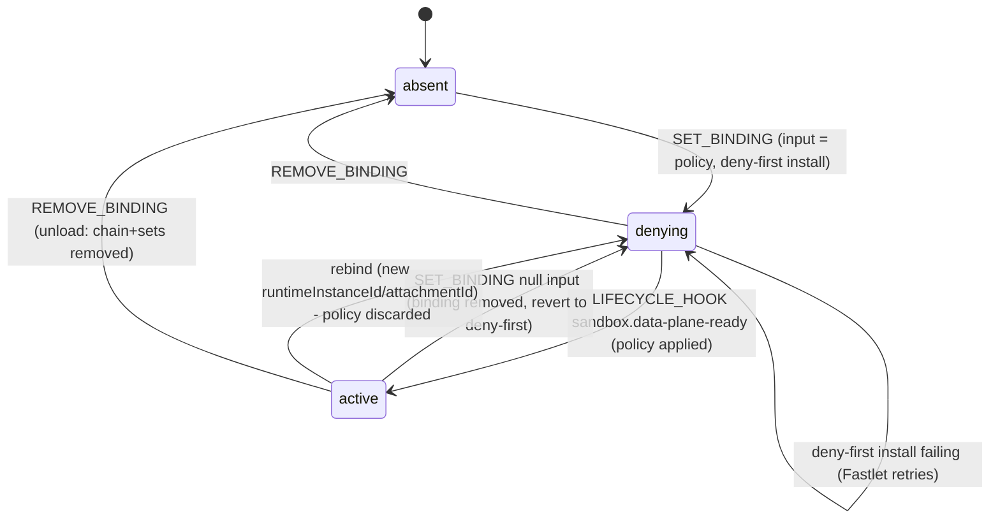
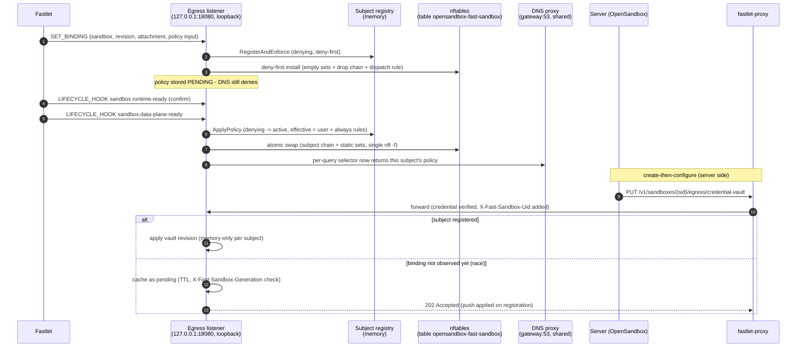
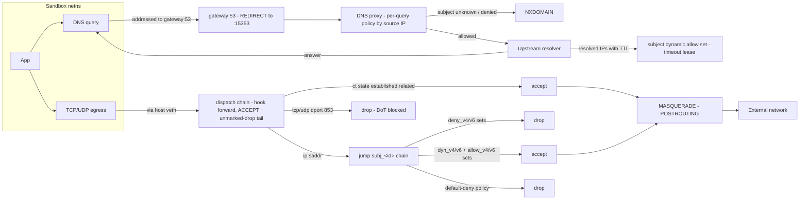
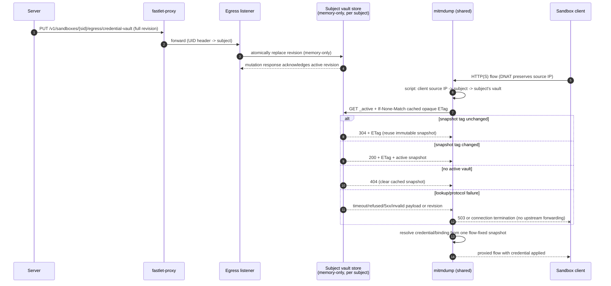

# Egress Policy, Traffic Flow, and Credential Vault (Fast Sandbox Profile)

This document shows how a sandbox's outbound network policy, its traffic flow,
and the credential vault work in the **fast-sandbox profile**: one egress
control plane serving N sandboxes that share one host/network domain
(fast-sandbox Fastlet Pod). Each sandbox is a **subject** with its own policy,
kernel rules, and credentials.

The sidecar profile differs (single policy, `hook output`, iptables DNS
REDIRECT on 15353); only the fast-sandbox model is drawn here.

## 1. Subject lifecycle: fastlet action protocol → deny-first → active

The Fastlet is the sole lifecycle dispatcher (Sandbox Actions Handler
protocol, `sandbox.fast.io/actions/v1`). The egress Handler implements
`GET /_fastlet/v1/actions/status` (process incarnation probe) and
`POST /_fastlet/v1/actions` (`SET_BINDING` / `LIFECYCLE_HOOK` /
`REMOVE_BINDING`). The binding input **is the policy** (declarative, carried
by the Sandbox CRD `actionBindings`); the attachment block carries the
network identity (source IP, gateway, veth, private CIDR). There is no
file-driven observation source.

A subject is fail-closed from the moment `SET_BINDING` registers it until its
`sandbox.data-plane-ready` Hook succeeds: registration installs deny-first
rules immediately, the policy is held pending, and DNS keeps denying.

Recovery after egress restart: `ApplyReset` wipes the table, the Handler
serves a new `instanceId`, the Fastlet detects it and replays the latest
`SET_BINDING` followed by the already-reached Hooks (every live subject
re-enters `denying` through the same registration path), and the server's
reconciliation re-pushes credential revisions.

## 2. Control plane: policy and credential push

The egress listener binds the Pod netns loopback only. It serves the action
endpoints (Fastlet) and the proxy-route policy/credential surfaces
(fastlet-proxy is the only peer and injects `X-Fast-Sandbox-Uid` to route a
push to a subject). There is no sandbox-reachable policy surface.

Policy itself rides `SET_BINDING` (the CRD binding is the complete desired
value; updates arrive as new bindings). The proxy route carries credential
vault revisions (memory-only, OSEP-0012 — the binding input is NOT a secret
transport) and runtime policy operations.

## 3. Data plane: outbound traffic flow

The authoritative enforcement layer is the Pod netns `forward` hook
(`table opensandbox-fast-sandbox`, master chain policy **accept** with an
unmarked-drop tail — the forward path never issues an explicit accept,
because on the fast-sandbox Firecracker bridge topology
(`bridge-nf-call-iptables=1`) an accept verdict returns the frame to the
bridge L2 path and drops it before postrouting). Allowed destinations are
marked in per-subject `hook prerouting` chains (`meta mark set 0x2` for
allow/dyn set members, unconditional for default-allow policies); per-subject
dispatch by `ip saddr` (the source IP is the only dispatch key — an iifname
match would never fire on the bridge topology, where the IP hooks see
skb->dev = the bridge) leads to subject chains whose deny sets drop explicitly,
and the unmarked-drop tail denies everything else (unregistered sources,
deny-first subjects). Intercepted MITM traffic is delivered locally (DNAT)
and enforced by the dedicated INPUT chain on the conntrack original
destination. DNS-learned leases are kept alive by the per-subject connection
refresh loop (Pod netns conntrack, bucketed by source IP, one batched
transaction per tick); only TCP sessions are renewed — UDP/QUIC (HTTP/3)
relies on DNS lease TTLs.

## 4. Credential vault

Vault revisions are pushed over the proxy route and held **memory-only** per
subject (OSEP-0012 model — no Secret volume, nothing written to egress disk).
The shared mitmdump instance selects the subject's vault by the client's
source IP (transparent REDIRECT/DNAT preserves it). It keeps an immutable
snapshot per subject and conditionally checks the private Unix-socket endpoint
for every new flow with its opaque `ETag`. An unchanged tag returns `304`
without rendering or transferring credential material; a changed tag returns
`200`, the full snapshot, its public revision, and a replacement `ETag`. The
tag changes even when delete-then-create resets the public revision to `1`, so
recreation cannot accidentally validate a pre-delete snapshot. Consequently, the
first flow after a successful create, patch, or delete acknowledgement observes
that mutation without a timer or cache-expiry sleep. See
[fast-sandbox-mitm-data-plane](../../../docs/components/egress-fast-sandbox-mitm-data-plane.md).

`404` has one explicit meaning for the addon: there is no active vault for the
selected subject, so any older cached snapshot is removed and the flow remains
ordinary non-credentialed egress. Transport timeout/refusal, `5xx`, malformed
JSON/schema, an invalid `ETag`, or a non-advancing tag after a conditional
request are lookup failures, not "no vault". Those failures discard the
unconfirmed cached plaintext snapshot and fail closed for **all intercepted
traffic**, including hosts that would not match any credential binding. The
addon returns a local `503` when the request body is safely buffered, or kills
a streamed/unknown-length flow before it can reach upstream. Operators should
therefore treat the private credential-proxy socket as a hard availability
dependency whenever transparent interception is enabled.

## 5. Fail-closed invariants

| Transition / event | Guarantee |
|---|---|
| SET_BINDING, no data-plane-ready yet | deny-first: empty nft sets + drop chain, gateway DNS REDIRECT, DNS NXDOMAIN |
| Vault push before SET_BINDING | cached pending (TTL); applied on registration; generation mismatch discards it |
| data-plane-ready lands | one atomic `nft -f` transaction (chain + static sets); DNS selector switches per subject |
| Rebind (new runtimeInstanceId/attachmentId) | policy discarded in registry AND nft chain/sets/DNS leases force-reset |
| Unload (REMOVE_BINDING) | chain + all sets removed in one transaction; stale fence ignored |
| Egress restart | stale rules wiped (ApplyReset); new instanceId triggers Fastlet replay of SET_BINDING + reached Hooks |
| Unregistered source | unmarked -> master-chain tail drop — denied before the binding is ever observed |
| Vault snapshot unchanged | per-flow conditional UDS check returns `304`; cached immutable snapshot is reused without retransmitting secrets |
| Vault snapshot changed | opaque-tag compare and snapshot render occur under one store read lock; `200` + replacement `ETag` atomically replaces the subject cache |
| Vault deleted / no active vault | `404` clears any cached snapshot; the flow proceeds without credential injection |
| Vault lookup or protocol failure | fail-closed before upstream: buffered request receives `503`; streamed, chunked, or HTTP/2 unknown-length request is killed |
| Malformed action envelope | rejected (never silently ignored); the subject is never activated |
| data-plane-ready without pending policy | failed (protocol violation) — the subject stays denying |

## Component map

| Concern | Implementation |
|---|---|
| Actions wire model + validation | `pkg/actionhandler` (envelope, operations, Hooks) |
| Subject state machine | `pkg/subject` (`MemoryRegistry`, lifecycle hooks) |
| Per-subject nft rules | `pkg/fastsandboxnft` (dispatch rules, atomic swap, reset) |
| Actions endpoints + lifecycle mapping | `fastsandbox_actions.go` (SET_BINDING / LIFECYCLE_HOOK / REMOVE_BINDING) |
| Policy/vault HTTP surface | `fastsandbox_server.go` (UID routing, pending cache, per-subject vault) |
| DNS per-query dispatch | `pkg/dnsproxy` `SetQueryPolicySelector` |
