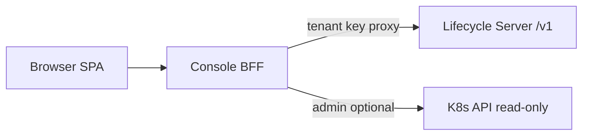

# Architecture

## Components

- **SPA**: static assets (nginx or same-origin reverse proxy). No Lifecycle API key in the bundle.
- **BFF**: sessions, tenant resolution, admin multi-tenant list aggregation, `runtimeSummary`.
- **Server**: unchanged Lifecycle behavior; multi-tenant isolation via `[tenants]` and API keys.

## Dual login

| Role | Login | BFF session | Data scope |
|------|-------|-------------|------------|
| Developer | `POST /api/auth/tenant` + tenant API key | tenant session (tenant name only) | single tenant / namespace |
| Admin | `POST /api/auth/admin` + `BFF_ADMIN_TOKEN` | admin session | all tenants via server-side key rotation |

Admin mutations proxy to the owning tenant key where implemented.

## Shared `tenants.toml`

Server and BFF should mount the **same** `tenants.toml` (ConfigMap or Secret):

- Server validates keys and injects tenant context.
- BFF validates keys for login; admin aggregation uses keys **only on the server**, never returned to the browser.

## Platform constraints (do not mislead in UI)

- **Pool API (`/v1/pools`)** is not tenant-isolated.
- With `[tenants]` enabled, there is no global `server.api_key`.
- Proxy routes still require an API key (BFF can proxy on behalf of the tenant).

## Lifecycle proxy

`LifecycleClient` calls the Lifecycle HTTP API with `httpx` and forwards the upstream status code and JSON body. The BFF then adds `runtimeSummary`. It does not use `opensandbox.SandboxManager`.

That is a deliberate boundary:

- The session picks the tenant API key per request. `ConnectionConfig.api_key` is fixed when a manager is constructed. A per-tenant manager cache would cover static tenant keys, but `/health` and `/version` are unauthenticated and sit outside `/v1`.
- The SPA depends on the Lifecycle error body (`code` / `message`) and status code. The SDK returns typed models and raises `SandboxException`, which drops unknown fields and replaces the upstream error.
- A short-lived `httpx` client does not reuse the SDK connection pool or retry policy. Pooling can be added on this client later without taking a dependency on SDK models.
