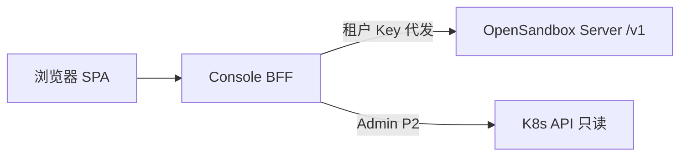

# 架构

## 组件

- **SPA**：静态资源，可 nginx 或 BFF 同域反代；不配置 Lifecycle API Key。
- **BFF**：会话、租户解析、Admin 多租户 list 聚合、`runtimeSummary` 计算。
- **Server**：现有行为不变；多租户由 `[tenants]` + `OPEN-SANDBOX-API-KEY` 隔离。

## 双轨登录

| 角色 | 登录 | BFF 会话 | 数据范围 |
|------|------|----------|----------|
| 研发 | `POST /api/auth/tenant` + 租户 API Key | `tenant_session`（含 tenant 名，**不含 Key**） | 单 tenant → 单 namespace |
| Admin | `POST /api/auth/admin` + `BFF_ADMIN_TOKEN` | `admin_session` | 读 tenants 表，循环调 Lifecycle list |

写操作（删沙箱等）Admin 默认 **代理到对应 tenant Key**（P0 可只读 Admin，写操作二次确认后按 sandbox 归属选 Key）。

## 与多租户 ConfigMap 的关系

Server 与 BFF **共用同一份 `tenants.toml` 内容**（建议 BFF 挂载 Secret 或同一 ConfigMap 子路径）：

- Server：校验 Key → 注入 tenant context。
- BFF：校验 Key → 建立 session；Admin 聚合时 **在服务端** 用各 tenant 的 Key 调 API，Key 不返回浏览器。

## 已知平台约束（勿在 UI 误导）

来自 `tenants-configmap.yaml` 注释：

- **Pool API（`/v1/pools`）不按租户隔离**，指向 server 默认 namespace。
- 启用 `[tenants]` 后无全局 `server.api_key`。
- Proxy 路由在多租户下 **也必须带 API Key**（BFF 代发即可）。
