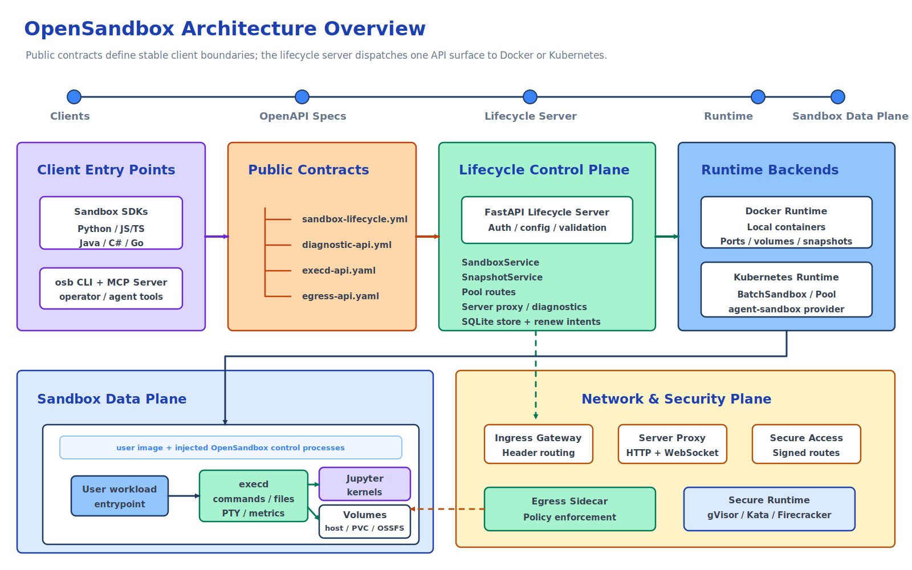

# OpenSandbox Architecture

OpenSandbox is a general-purpose sandbox platform for AI applications. It provides client SDKs and tools, protocol definitions, a lifecycle control plane, Docker and Kubernetes runtime backends, and in-sandbox execution components for commands, files, code interpreters, browser automation, desktop environments, and training workloads.

This document describes the current repository architecture and the main boundaries between public contracts, server implementation, runtime providers, and sandbox data-plane components.

## Architecture Overview



OpenSandbox is organized around six practical surfaces:

1. **Client surface** - SDKs, the `osb` CLI, and the MCP server used by applications, agents, and operators.
2. **Protocol surface** - OpenAPI contracts under `specs/` for lifecycle, diagnostics, in-sandbox execution, and egress policy.
3. **Lifecycle control plane** - the FastAPI server under `server/` that authenticates requests, validates config, persists server-managed records, and delegates lifecycle work to a configured runtime service.
4. **Runtime backends** - Docker for local and single-host deployments, and Kubernetes through workload providers such as BatchSandbox and `kubernetes-sigs/agent-sandbox`.
5. **Sandbox data plane** - the user workload container plus the injected `execd` daemon, optional Jupyter/code-interpreter runtime, volumes, and optional egress sidecar.
6. **Network and security plane** - endpoint resolution, server proxying, Kubernetes ingress gateway routing, secure endpoint access, egress policy enforcement, resource limits, and secure container runtimes.

The split is intentional: SDKs and tools should depend on the public contracts, the server should own lifecycle orchestration, runtime providers should own platform-specific resource creation, and `execd`/egress should own operations that happen from inside the sandbox network and filesystem namespace.

## 1. Client Surface

The client surface is the developer-facing entry point for OpenSandbox.

### 1.1 Sandbox SDKs

The sandbox SDKs wrap lifecycle operations and in-sandbox operations behind language-native APIs:

- Python: `sdks/sandbox/python`
- JavaScript/TypeScript: `sdks/sandbox/javascript`
- Java/Kotlin: `sdks/sandbox/kotlin`
- C#/.NET: `sdks/sandbox/csharp`
- Go: `sdks/sandbox/go`

Common capabilities include:

- Create, list, inspect, pause, resume, renew, and delete sandboxes.
- Resolve service endpoints for sandbox ports.
- Execute commands with streamed output and background status/log polling.
- Manage files and directories.
- Read resource metrics from `execd`.
- Inspect or patch runtime egress policy when an egress sidecar is attached.

Generated OpenAPI clients live beside handwritten adapters. Generated code handles ordinary request/response APIs; handwritten layers cover SDK ergonomics, streaming, transport lifecycle, error mapping, and high-level models.

### 1.2 Code Interpreter SDKs

The code-interpreter SDKs build on the sandbox SDKs and `execd` code execution APIs. They manage code execution contexts and expose language-oriented code execution helpers.

The official code-interpreter image is under `sandboxes/code-interpreter/`. It provides Python, Java, Node.js, and Go runtimes, and Jupyter kernels for Python, Java, TypeScript/JavaScript, Go, and Bash. Exact language versions are image-controlled and selected through environment variables such as `PYTHON_VERSION`, `JAVA_VERSION`, `NODE_VERSION`, and `GO_VERSION`.

### 1.3 CLI and MCP

The `osb` CLI under `cli/` is a terminal interface for day-to-day sandbox operations:

- `osb sandbox`: lifecycle and endpoint management
- `osb command`: command execution, background logs, and shell sessions
- `osb file`: file and directory operations
- `osb egress`: runtime egress policy inspection and mutation
- `osb devops`: low-level diagnostics
- `osb skills`: OpenSandbox-specific agent skill installation

The MCP server under `sdks/mcp/sandbox/python` exposes focused sandbox lifecycle, command, and text-file tools to MCP-capable clients such as Claude Code and Cursor.

## 2. Protocol Surface

OpenSandbox treats `specs/` as the public contract source of truth.

### 2.1 Lifecycle API

`specs/sandbox-lifecycle.yml` defines the lifecycle API, served by the server with the base path `/v1`.

Main resource groups:

- **Sandboxes**: create from an image or snapshot, list, get, delete, pause, resume, renew expiration, and resolve port endpoints.
- **Snapshots**: create a persistent snapshot from a sandbox, list snapshots, get snapshot state, and delete snapshots.

Important request features:

- `image` or `snapshotId` startup source.
- `entrypoint`, environment variables, metadata, and opaque `extensions`.
- `resourceLimits` for CPU, memory, GPU, and future resource keys.
- `platform` constraints.
- `volumes` for host paths, platform-managed named volumes/PVCs, and OSSFS.
- `networkPolicy` for egress sidecar configuration.
- `secureAccess` for Kubernetes ingress gateway deployments that require endpoint credentials.

### 2.2 Diagnostics API

`specs/diagnostic-api.yml` defines best-effort diagnostic descriptors for sandbox logs and events. The server also exposes practical DevOps diagnostics routes that return plain text for operators and AI troubleshooting workflows.

### 2.3 Execd API

`specs/execd-api.yaml` defines the in-sandbox execution API exposed by `components/execd/`.

Main capabilities:

- Health check: `GET /ping`
- Code contexts and execution: `/code/contexts`, `/code/context`, `/code`
- Bash sessions: `/session`
- Commands: `/command`, command status, and background command logs
- Files and directories: `/files/*`, `/directories`
- Metrics: `/metrics`, `/metrics/watch`

Command and code execution use Server-Sent Events for streaming output. The current `execd` implementation also includes interactive PTY WebSocket endpoints under `/pty` for long-lived shell sessions.

### 2.4 Egress API

`specs/egress-api.yaml` defines the runtime policy API exposed directly by the egress sidecar:

- `GET /policy`
- `PATCH /policy`

The API is reached by resolving the sandbox endpoint for the egress sidecar port. When sidecar authentication is enabled, callers must include the endpoint headers returned by the lifecycle endpoint resolution API.

## 3. Lifecycle Control Plane

The lifecycle server under `server/` is a FastAPI application. It owns request validation, API-key authentication, server configuration, lifecycle orchestration, endpoint formatting, diagnostics, and server-managed persistence.

### 3.1 Server Structure

Key packages:

- `opensandbox_server/main.py`: app startup, middleware, router registration, runtime validation, and renew-intent startup.
- `opensandbox_server/api/`: lifecycle routes, proxy routes, pool routes, diagnostics routes, and request/response schemas.
- `opensandbox_server/services/`: lifecycle service interfaces and Docker/Kubernetes implementations.
- `opensandbox_server/services/k8s/`: Kubernetes workload providers, endpoint resolution, volume/egress helpers, informer support, and provider-specific mapping.
- `opensandbox_server/repositories/`: persistence adapters, currently used for server-managed snapshot records.
- `opensandbox_server/integrations/renew_intent/`: optional auto-renew-on-access integration.
- `opensandbox_server/middleware/`: API-key authentication and request ID middleware.

### 3.2 Runtime Service Selection

The server selects exactly one lifecycle implementation from `[runtime].type`:

- `docker` -> `DockerSandboxService`
- `kubernetes` -> `KubernetesSandboxService`

Both implementations satisfy the same `SandboxService` interface, so API routes stay thin and delegate behavior to services. Runtime-specific details stay behind the service boundary.

### 3.3 Server Persistence

The `[store]` configuration selects the server-managed metadata store. The default is SQLite at `~/.opensandbox/opensandbox.db`. Snapshot metadata is the first persisted server resource; future persistent records should reuse the same repository boundary.

### 3.4 Server Proxy and Endpoint Resolution

The lifecycle endpoint API returns the reachable address for a service port inside a sandbox. Depending on runtime and configuration, the endpoint may be:

- A Docker host/bridge mapped endpoint.
- A Kubernetes ingress gateway endpoint.
- A server-proxied URL under `/sandboxes/{sandboxId}/proxy/{port}` when `use_server_proxy=true`.

The server proxy supports HTTP and WebSocket traffic and is also integrated with optional renew-on-access behavior.

## 4. Runtime Backends

### 4.1 Docker Runtime

The Docker runtime is the local and single-host backend. It talks directly to the Docker daemon and manages containers, timers, labels, volumes, ports, optional sidecars, and snapshots.

Core responsibilities:

- Pull public or private images, including per-request registry authentication.
- Create containers with CPU, memory, GPU, platform, capability, AppArmor, seccomp, PID, and secure-runtime settings.
- Stage the `execd` binary from `[runtime].execd_image` into the sandbox and install a bootstrap launcher before starting the user entrypoint.
- Support network modes `host`, `bridge`, and custom user-defined networks.
- Allocate host ports for `execd` and user service endpoints in non-host network modes.
- Restore expiration timers for existing managed containers after server restart.
- Support host bind mounts, Docker named volumes via the `pvc` volume model, and OSSFS-backed mounts.
- Attach an egress sidecar when `networkPolicy` is requested and Docker networking is compatible.
- Create Docker-backed persistent snapshots as local images and restore sandboxes from those snapshot images.

Docker pause/resume uses container-level pause/resume. Docker snapshots are exposed through the public snapshot API.

### 4.2 Kubernetes Runtime

The Kubernetes runtime delegates actual workload creation to a workload provider selected by `kubernetes.workload_provider`.

Supported providers:

- `batchsandbox` - the default provider backed by OpenSandbox's Kubernetes controller and `BatchSandbox` CRD.
- `agent-sandbox` - a provider for `kubernetes-sigs/agent-sandbox`.

The Kubernetes server path handles:

- Kubernetes client initialization and optional informer-backed reads.
- Workload creation from image requests; `snapshotId` startup resolves to a stored restorable image when the snapshot record supports restore.
- Template merging for BatchSandbox and agent-sandbox manifests.
- Per-request image pull secrets where the provider supports them.
- Resource limits and GPU translation to Kubernetes extended resources.
- Platform constraints and RuntimeClass integration for secure runtimes.
- Volumes, egress sidecars, and secure endpoint access annotations.
- Endpoint resolution through direct workload data or ingress gateway configuration.
- Pause/resume delegation to providers.
- Plain-text diagnostics from Kubernetes resources.

### 4.3 BatchSandbox Controller

The Kubernetes controller under `kubernetes/` implements OpenSandbox-specific CRDs for high-throughput and pooled sandbox delivery:

- `BatchSandbox`: create one or many sandbox replicas from a pod template.
- `Pool`: maintain pre-warmed resources for fast allocation.
- `SandboxSnapshot`: internal rootfs snapshot records used by Kubernetes pause/resume.

BatchSandbox supports both template-based creation and pool-based creation via `extensions.poolRef`. It also supports optional task orchestration for batch and RL-style workloads.

Kubernetes pause/resume is implemented through rootfs snapshots for `BatchSandbox.spec.replicas=1`: pause commits the sandbox root filesystem to an OCI image and releases runtime resources; resume rewrites the workload template to use the snapshot image and recreates the runtime while preserving the sandbox ID.

The public snapshot API currently has a Docker-backed runtime implementation. Kubernetes pause/resume uses the controller's internal `SandboxSnapshot` flow; a general Kubernetes implementation of the public snapshot API is a separate runtime concern.

## 5. Sandbox Data Plane

Each sandbox runs the user's image and entrypoint, with OpenSandbox control processes injected around it.

### 5.1 Execd

`components/execd/` is a Go daemon built with Gin. It runs inside the sandbox and exposes the execution API.

Responsibilities:

- Shell command execution with SSE streaming.
- Background command status and incremental log retrieval.
- Persistent bash sessions.
- Interactive PTY sessions over WebSocket.
- File and directory operations.
- Jupyter-backed code contexts and code execution.
- Local CPU/memory metrics and optional OpenTelemetry metrics export.
- Optional shared access token enforcement through `X-EXECD-ACCESS-TOKEN`.

In Docker, the server stages `execd` into the container and installs a bootstrap script. In Kubernetes BatchSandbox template mode, an init container copies `execd` and `bootstrap.sh` from the configured `execd_image` into an `emptyDir` volume mounted by the main sandbox container.

### 5.2 Code Interpreter Runtime

The code-interpreter sandbox image starts Jupyter inside the sandbox. `execd` talks to Jupyter over HTTP/WebSocket and translates Jupyter kernel messages into OpenSandbox streaming events.

The Code Interpreter SDKs are optional high-level clients. The lower-level execution API remains available through the sandbox SDKs and direct `execd` clients.

### 5.3 Volumes

The lifecycle API exposes runtime-neutral volume models:

- `host`: bind a permitted host path.
- `pvc`: platform-managed named storage. Docker maps this to a Docker named volume; Kubernetes maps it to a PersistentVolumeClaim.
- `ossfs`: mount Alibaba Cloud OSS through the server/runtime integration.

Runtime providers validate and materialize these volume definitions differently, but the API shape stays shared.

### 5.4 Egress Sidecar

`components/egress/` enforces outbound network policy from the sandbox network namespace.

Capabilities:

- FQDN and wildcard-domain allow/deny rules.
- `dns` mode for DNS filtering.
- `dns+nft` mode for DNS plus nftables enforcement of resolved IPs and CIDR/IP rules where supported.
- Runtime policy inspection and patching through `/policy`.
- Optional sidecar authentication.
- Optional platform-enforced always-allow and always-deny overlays.
- Experimental transparent HTTPS MITM mode.

Docker starts the egress sidecar as a separate container and runs the main sandbox container in the sidecar network namespace. Kubernetes appends the egress sidecar to the pod spec and drops `NET_ADMIN` from the main sandbox container so only the sidecar mutates network rules.

## 6. Networking and Access

### 6.1 Ingress

`components/ingress/` is a Kubernetes-oriented HTTP/WebSocket reverse proxy. It watches sandbox resources and routes traffic to sandbox ports.

Supported routing modes:

- Header mode: `OpenSandbox-Ingress-To: <sandbox-id>-<port>` or host parsing.
- URI mode: `/<sandbox-id>/<port>/<path>`.
- Wildcard host mode through server endpoint formatting.

For `BatchSandbox`, ingress reads endpoint data from the `sandbox.opensandbox.io/endpoints` annotation. For `agent-sandbox`, it reads `status.serviceFQDN`.

### 6.2 Secure Access

`secureAccess` is currently supported for Kubernetes sandboxes exposed through ingress gateway mode. When enabled, the server provisions endpoint credentials and returns required headers with endpoint responses. Signed route tokens are also supported when gateway secure-access signing keys are configured.

### 6.3 Auto-Renew on Access

The optional renew-intent integration extends sandbox TTL when access is observed. It can be triggered by server proxy requests or by ingress gateway events delivered through Redis. Per-sandbox opt-in is controlled by the `extensions["access.renew.extend.seconds"]` create parameter.

## 7. Core Flows

### 7.1 Sandbox Creation

```text
Client / SDK / CLI / MCP
  -> POST /v1/sandboxes
  -> FastAPI lifecycle server validates request and config
  -> selected runtime service creates Docker container or Kubernetes workload
  -> runtime stages execd and optional egress/volume/network configuration
  -> sandbox reaches Running or reports Failed with status reason/message
```

Creation is asynchronous from the API perspective. Clients should poll `GET /v1/sandboxes/{sandboxId}` or use SDK readiness helpers.

### 7.2 Command, File, and Code Execution

```text
Client
  -> resolve execd endpoint from sandbox metadata or server proxy
  -> call execd API with X-EXECD-ACCESS-TOKEN when required
  -> execd runs command, file operation, session, PTY, or Jupyter code execution
  -> execd streams SSE/WebSocket output or returns structured responses
```

### 7.3 Service Exposure

```text
Client
  -> GET /v1/sandboxes/{sandboxId}/endpoints/{port}
  -> server returns Docker-mapped, ingress-gateway, or server-proxy endpoint
  -> client includes returned headers when secure access or sidecar auth requires them
  -> HTTP/WebSocket traffic reaches the target sandbox port
```

### 7.4 Egress Policy

```text
Create request with networkPolicy
  -> server validates [egress] config
  -> runtime attaches egress sidecar with initial policy
  -> sandbox outbound DNS/network traffic is filtered by sidecar
  -> clients may resolve the egress endpoint and PATCH /policy at runtime
```

### 7.5 Pause, Resume, and Snapshots

```text
Pause / resume
  -> lifecycle server delegates to runtime provider
  -> Docker pauses/resumes the container
  -> BatchSandbox uses rootfs snapshot commit/recreate for supported single-replica sandboxes

Public snapshot API
  -> server persists snapshot metadata
  -> Docker runtime commits the sandbox to a restorable image
  -> create-from-snapshot resolves that image and starts a new sandbox
```

## 8. Design Principles

### Protocol First

Public behavior starts from OpenAPI contracts in `specs/`. SDKs and clients should align to those contracts, and generated outputs should be regenerated from source specs rather than patched as the only fix.

### Control Plane vs Data Plane

The lifecycle server should orchestrate and validate. Platform-specific provisioning belongs in runtime services/providers. In-sandbox operations belong in `execd` and egress sidecars.

### Runtime Neutral API, Runtime Specific Execution

The lifecycle API uses shared concepts such as resource limits, volumes, endpoints, network policy, and metadata. Docker and Kubernetes can materialize those concepts differently while preserving the API contract.

### Secure Defaults with Explicit Escape Hatches

The server supports API-key authentication, startup guardrails for unauthenticated mode, resource limits, capability drops, optional secure runtimes, egress controls, endpoint headers, and platform-specific network isolation. Less restrictive modes are intended for local development or explicit operator choice.

### Observable Failures

Sandbox state includes `state`, `reason`, `message`, and transition time. `execd` exposes metrics, the server exposes diagnostics, ingress/egress/execd support logs and OpenTelemetry metrics where implemented, and request IDs are propagated for debugging.

## 9. Common Use Cases

- **Coding agents**: run Claude Code, Gemini CLI, Codex CLI, Qwen Code, Kimi CLI, or other agent tools in isolated sandboxes.
- **AI code execution**: execute model-generated code with command/file/code-interpreter APIs and streamed feedback.
- **Browser automation**: run Chrome or Playwright with controlled filesystem and network behavior.
- **Remote development**: expose VS Code Web, desktops, VNC, or development servers through sandbox endpoints.
- **RL and evaluation workloads**: use Kubernetes BatchSandbox, Pool, and task orchestration for high-throughput sandbox delivery.
- **Enterprise isolation**: combine secure runtimes, ingress, egress, endpoint access headers, and Kubernetes deployment controls.

## 10. References

- [Root README](../README.md)
- [Sandbox Lifecycle Spec](../specs/sandbox-lifecycle.yml)
- [Diagnostics Spec](../specs/diagnostic-api.yml)
- [Sandbox Execution Spec](../specs/execd-api.yaml)
- [Egress Spec](../specs/egress-api.yaml)
- [Server Documentation](../server/README.md)
- [Server Configuration](https://github.com/alibaba/OpenSandbox/blob/main/server/configuration.md)
- [execd Documentation](../components/execd/README.md)
- [Ingress Documentation](../components/ingress/README.md)
- [Egress Documentation](../components/egress/README.md)
- [Kubernetes Controller](../kubernetes/README.md)
- [Pause and Resume](pause-resume.md)
- [Secure Container Runtime Guide](secure-container.md)
- [Network Isolation for Kubernetes](network-isolation-for-kubernetes.md)
- [CLI README](../cli/README.md)
- [MCP README](../sdks/mcp/sandbox/python/README.md)
- [Examples](../examples/README.md)
