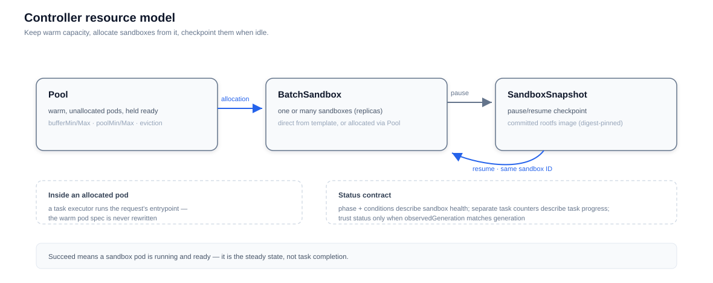

# Kubernetes Controller

The controller is the Kubernetes operator behind container-backed sandboxes. It watches three custom resources and turns them into running sandboxes with pod-level scheduling, pre-warmed pools for constant-time delivery, optional task orchestration, and snapshot-based pause/resume. The lifecycle server creates and manages these resources on behalf of API clients, but the resources are ordinary Kubernetes objects — visible, auditable, and directly usable.

## BatchSandbox

`BatchSandbox` is the workhorse: one or many identical sandboxes described declaratively.

| Spec field | Meaning |
|---|---|
| `replicas` | Number of sandboxes (default 1) |
| `template` | The pod template every replica starts from |
| `shardPatches` | Per-replica patches applied on top of `template` — one replica can differ in image, env, or resources |
| `poolRef` | Allocate from a named `Pool` instead of scheduling fresh pods; mutually exclusive with `template` |
| `taskTemplate` | Optional process each replica runs after allocation, executed by an in-pod task executor |
| `shardTaskPatches` | Per-replica variants of `taskTemplate` — heterogeneous tasks across one batch |
| `expireTime` | Absolute deletion deadline, enforced by the controller |
| `pause` | Set `true` to pause, `false` to resume — the controller drives the snapshot workflow |

Status separates sandbox health from task progress: `phase` and `conditions` describe the runtime; `taskRunning` / `taskSucceed` / `taskFailed` / `taskUnknown` counters describe tasks.

## Pool

`Pool` holds pre-warmed pods so that allocation becomes a claim on existing capacity instead of a scheduling round-trip.

| Spec field | Meaning |
|---|---|
| `template` | The pod template warm pods start from |
| `capacitySpec` | `bufferMin`/`bufferMax` govern the ready band; `poolMin`/`poolMax` bound the whole pool |
| `scaleStrategy` | `maxUnavailable` caps how fast the pool scales (absolute or percentage, default 25%) |
| `updateStrategy` | Same cap for rolling out template changes across existing pods |
| `recycleStrategy` | What happens when an allocated pod is released back: `Delete` (default), `Restart`, or `Noop` |

Status reports `total` / `allocated` / `available` / `updated` plus a `revision` identifying the current template version.

### Pool design

The pool maintains a **two-level capacity model**:

- **Buffer** — warm, unallocated pods that are Running and Ready. This is what allocations draw from, kept between `bufferMin` and `bufferMax`. The controller continuously reconciles toward this band: an allocation that drains the buffer triggers a scale-up; released capacity above `bufferMax` triggers a scale-down.
- **Total pool** — everything the pool owns, allocated or not, bounded by `poolMin` and `poolMax`. Pods that are still starting count toward the total but are never advertised as available buffer, so the pool never promises capacity it cannot hand out.

Scaling is deliberately paced: each scale step is bounded by `maxUnavailable`, and the controller waits for an in-flight batch to finish before starting the next — a burst of allocations produces a measured ramp of new pods, not a thundering herd.

**Allocation and return.** Allocating is a constant-time claim on a warm pod. When the sandbox using it goes away, the pod returns to the pool and the `recycleStrategy` decides its fate:

- `Delete` (default) — the returned pod is replaced with a fresh one, so every allocation starts from the template's clean state.
- `Restart` — containers restart in place: cheaper than a full pod churn, still scrubbing process state.
- `Noop` — returned as-is: fastest, but filesystem and process state leak into the next allocation.

**Template updates.** Editing the pool template creates a new revision; existing pods roll to it under `updateStrategy` caps, and `status.updated` tracks progress. Warm pods are never rewritten per request — see the constraints below.

**Eviction.** Labeling an idle pool pod requests its removal. The controller protects pods already allocated to a `BatchSandbox`, deletes idle ones, and lets replenishment restore the buffer.

**Exhaustion.** When the pool is at `poolMax`, the controller records `PoolCapacityExhausted` on the waiting `BatchSandbox`; the server waits up to a bounded window and surfaces a retryable `429` if capacity never frees up. A slot released during that window can still satisfy the request.

### Lifecycle-API constraints on pools

Because pool pods exist before any request, the lifecycle API cannot inject per-request state into them:

- `entrypoint` / `env` are delivered as a post-allocation task, not by rewriting the pod — seeing the original template in the pod spec is expected.
- `volumes` and `networkPolicy` cannot be combined with a pool reference; configure them in the pool template up front.
- Pool pods must satisfy the task contract (in-pod task executor, bootstrap entrypoint, execd installed) for lifecycle-API use.

## Task orchestration

Tasks are optional: a `BatchSandbox` without a `taskTemplate` is pure allocation. With one, each replica runs a defined process — uniform across the batch, or customized per sandbox through shard patches. Process tasks support `preStart` and `postStop` lifecycle hooks: a failed or timed-out `preStart` prevents the main process from starting, and `postStop` runs on every terminal outcome, including cleanup after deletion — suitable for staging inputs and persisting outputs to mounted volumes.

## SandboxSnapshot

`SandboxSnapshot` is the checkpoint record behind pause/resume. Its spec names the target `BatchSandbox` (same namespace); its status carries the outcome: a `Pending → Committing → Succeed / Failed` phase, per-container committed image URIs (immutable digest references), the source pod and node, and — for the QEMU contract — a separate VM-state image. See [QEMU VMState Snapshots](/guides/qemu-vmstate-snapshots).

Pausing persists the rootfs, pushes it to the configured registry, and releases pods and pool slots; resuming recreates the workload from the snapshot image with the same sandbox ID. The commit runs as a job on the source node and is limited to single-replica sandboxes. Registry credentials, retention, and capacity planning are operator concerns — deleting a snapshot record does not delete the pushed images.

## Reading status

The phase reports sandbox runtime health; the conditions explain it. Both are Kubernetes-native and inspectable with plain `kubectl`.

| Phase | Meaning |
|---|---|
| `Pending` | No running, ready sandbox pod observed yet |
| `Succeed` | At least one sandbox pod is running and ready — the steady state, **not** task completion |
| `Pausing` / `Paused` / `Resuming` | Pause/resume transitions |
| `Failed` | Terminal runtime failure — inspect conditions and pod events |

Conditions (`Ready`, `Progressing`, `Paused`, `PauseFailed`, `ResumeFailed`, `PodFailed`) carry reasons and messages; count a condition only when it exists with status `True`, and check `status.observedGeneration` against `metadata.generation` before trusting post-update status.

## Performance

With pooling enabled, measured delivery of 100 sandboxes:

| Scenario | Total time |
|---|---|
| SIG Agent-Sandbox (concurrency 1 / 10 / 50) | 76.4 s / 23.2 s / 33.9 s |
| BatchSandbox | 0.92 s |

## Installing

Install the CRDs and controller through the base and controller Helm charts (or Kustomize for development); the [Kubernetes Deployment](/deployment/) page walks through the full stack, and the [controller source](https://github.com/opensandbox-group/OpenSandbox/tree/main/kubernetes) documents chart values and local builds.
