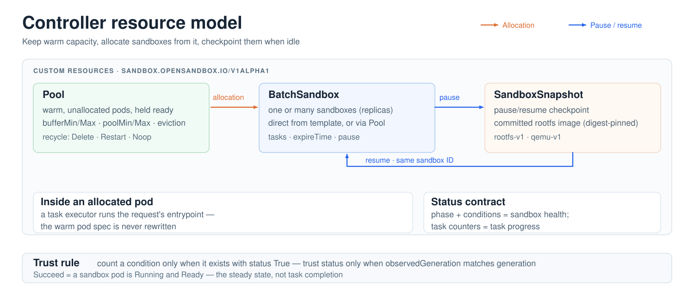
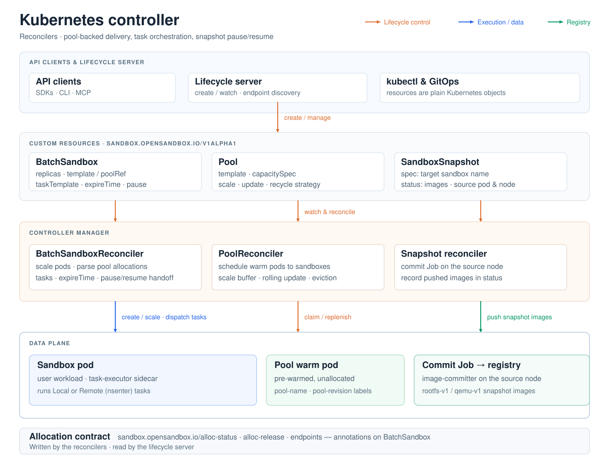
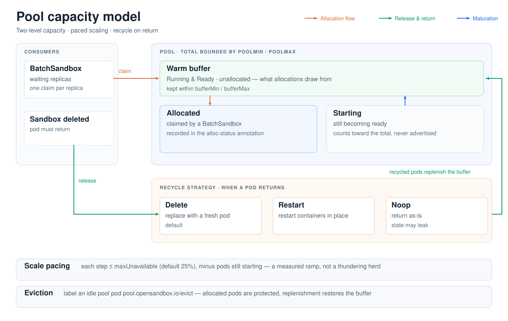
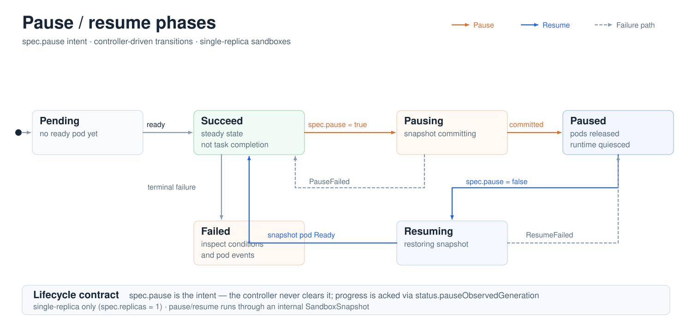

# Kubernetes Controller

The controller is the Kubernetes operator behind container-backed sandboxes. It watches three custom resources and turns them into running sandboxes with pod-level scheduling, pre-warmed pools for constant-time delivery, optional task orchestration, and snapshot-based pause/resume. The lifecycle server creates and manages these resources on behalf of API clients, but the resources are ordinary Kubernetes objects — visible, auditable, and directly usable.

## High-level design

The controller manager runs three reconcilers, one per custom resource. Each follows the standard Kubernetes pattern: watch the desired state, diff it against observed pods, and converge with idempotent operations.

- **BatchSandboxReconciler** — owns sandbox pods: scales them in direct (non-pooled) mode, parses pool allocations, schedules tasks, enforces `expireTime`, and drives the pause/resume handoff (`internal/controller/batchsandbox_controller.go`).
- **PoolReconciler** — owns pool pods and watches `BatchSandbox` objects: schedules warm pods to waiting sandboxes, scales the buffer, rolls out template updates, and processes evictions (`internal/controller/pool_controller.go`).
- **SandboxSnapshot reconciler** — turns a `SandboxSnapshot` into a commit `Job` on the source node and records the pushed image results (`internal/controller/sandboxsnapshot_controller.go`).

Two contracts connect the reconcilers without coupling them:

- **Allocation annotations.** The pool reconciler writes `sandbox.opensandbox.io/alloc-status` (allocated pods, `poolRef`, generation) and `alloc-release` on the `BatchSandbox`; the `endpoints` annotation carries resolved endpoints consumed server-side. Pods carry the `sandbox.opensandbox.io/pool-name` and `pool-revision` labels.
- **Task dispatch.** The batch reconciler runs an in-process `TaskScheduler` that assigns tasks to pods and calls the task-executor HTTP server running inside each sandbox pod.

## BatchSandbox

`BatchSandbox` is the workhorse: one or many identical sandboxes described declaratively.

| Spec field | Meaning |
|---|---|
| `replicas` | Number of sandboxes (default 1) |
| `template` | The pod template every replica starts from |
| `poolRef` | Allocate from a named `Pool` instead of scheduling fresh pods; mutually exclusive with `template` |
| `shardPatches` | Per-replica patches applied on top of `template` — one replica can differ in image, env, or resources |
| `taskTemplate` | Optional process each replica runs after allocation, executed by an in-pod task executor |
| `shardTaskPatches` | Per-replica variants of `taskTemplate` — heterogeneous tasks across one batch |
| `taskResourcePolicyWhenCompleted` | What happens to sandbox resources when its task reaches Succeeded/Failed: `Retain` (default) keeps them until deletion, `Release` frees them immediately |
| `expireTime` | Absolute deletion deadline, enforced by the controller |
| `pause` | Pause/resume intent: `true` pauses, `false` resumes. The controller never clears the field; it acks progress via `status.pauseObservedGeneration`, which also gates re-entry |

If `poolRef` is empty, the controller can still auto-select a pool using configurable profiles: predicate plugins (capacity, image, resource, node selector) filter candidates, then a scoring plugin (least-allocated by default) picks one (`internal/controller/poolassign/`).

Status separates sandbox health from task progress: `replicas` / `allocated` / `ready` and `phase` / `conditions` describe the runtime; `taskRunning` / `taskSucceed` / `taskFailed` / `taskPending` / `taskUnknown` counters plus `taskLastErrorMessage` describe tasks.

## Pool

`Pool` holds pre-warmed pods so that allocation becomes a claim on existing capacity instead of a scheduling round-trip.

| Spec field | Meaning |
|---|---|
| `template` | The pod template warm pods start from |
| `capacitySpec` | `bufferMin`/`bufferMax` govern the ready band; `poolMin`/`poolMax` bound the whole pool |
| `scaleStrategy` | `maxUnavailable` caps how fast the pool scales (absolute or percentage, default 25%) |
| `updateStrategy` | Same cap for rolling out template changes across existing pods |
| `recycleStrategy` | What happens when an allocated pod is released back: `Delete` (default), `Restart`, or `Noop` |

Status reports `total` / `allocated` / `available` / `updated` plus a `revision` identifying the current template version — a SHA-256 hash (first 8 bytes) of the template.

### Pool design

The pool maintains a **two-level capacity model**:

- **Buffer** — warm, unallocated pods that are Running and Ready. This is what allocations draw from, kept between `bufferMin` and `bufferMax`. The controller continuously reconciles toward this band: an allocation that drains the buffer triggers a scale-up; released capacity above `bufferMax` triggers a scale-down.
- **Total pool** — everything the pool owns, allocated or not, bounded by `poolMin` and `poolMax`. Pods that are still starting count toward the total but are never advertised as available buffer, so the pool never promises capacity it cannot hand out.

Scaling is deliberately paced: each reconcile creates or deletes at most `maxUnavailable` pods (minus the ones already not-ready), so a burst of allocations produces a measured ramp of new pods, not a thundering herd.

**Allocation and return.** Allocating is a constant-time claim on a warm pod: the pool reconciler schedules pods to waiting sandboxes, then persists the assignment via the allocation annotations. When the sandbox using a pod goes away, the pod returns to the pool and the `recycleStrategy` decides its fate:

- `Delete` (default) — the returned pod is replaced with a fresh one, so every allocation starts from the template's clean state.
- `Restart` — containers restart in place: cheaper than a full pod churn, still scrubbing process state.
- `Noop` — returned as-is: fastest, but filesystem and process state leak into the next allocation.

**Template updates.** Editing the pool template changes the revision; the controller deletes idle pods still on the old revision (never pods allocated to a sandbox) and replenishes at the new revision under `updateStrategy` caps, with `status.updated` tracking progress.

**Eviction.** Labeling an idle pool pod with `pool.opensandbox.io/evict` requests its removal. The controller protects pods already allocated to a `BatchSandbox`, deletes idle ones, and lets replenishment restore the buffer.

**Exhaustion.** When no eligible pool has a free slot, the controller sets the `PoolAllocationPending` condition (reason `PoolCapacityExhausted`) on the waiting `BatchSandbox` and rechecks every 5 seconds; the server waits up to a bounded window and surfaces a retryable `429` if capacity never frees up. A slot released during that window can still satisfy the request.

### Lifecycle-API constraints on pools

Because pool pods exist before any request, the lifecycle API cannot inject per-request state into them:

- `entrypoint` / `env` are delivered as a post-allocation task, not by rewriting the pod — seeing the original template in the pod spec is expected.
- `volumes` and `networkPolicy` cannot be combined with a pool reference; configure them in the pool template up front.
- Pool pods must satisfy the task contract (in-pod task executor, bootstrap entrypoint, execd installed) for lifecycle-API use.

## Task orchestration

Tasks are optional: a `BatchSandbox` without a `taskTemplate` is pure allocation. With one, each replica runs a defined process — uniform across the batch, or customized per sandbox through shard patches.

A process task can run **Local** (inside the task-executor container, the default) or **Remote** (inside the main container via `nsenter`), selected per task with `execMode`. Process tasks also support `preStart` and `postStop` lifecycle hooks: a failed or timed-out `preStart` prevents the main process from starting, and `postStop` runs on every terminal outcome, including cleanup after deletion — suitable for staging inputs and persisting outputs to mounted volumes.

## SandboxSnapshot

`SandboxSnapshot` is the checkpoint record behind pause/resume. Its spec is a single field — the target `BatchSandbox` name (same namespace); the controller resolves the pod and node. Registry, push credentials, and snapshot type come from controller startup flags, not the spec. Status carries the outcome: a `Pending → Committing → Succeed / Failed` phase, a `format` of `rootfs-v1` (default) or `qemu-v1`, per-container committed image URIs with immutable config digests, the source pod and node, and — for the QEMU contract — a separate VM-state image with payload digests and a restore-compatibility summary. See [QEMU VMState Snapshots](/guides/qemu-vmstate-snapshots).

Pausing persists the rootfs, pushes it to the configured registry, and releases pods and pool slots; resuming recreates the workload from the snapshot image with the same sandbox ID. Pause/resume is limited to single-replica sandboxes (`spec.replicas=1`). During pause the controller manages an internal snapshot named after the sandbox; the commit runs as a job on the source node. Registry credentials, retention, and capacity planning are operator concerns — deleting a snapshot record does not delete the pushed images.

## Reading status

The phase reports sandbox runtime health; the conditions explain it. Both are Kubernetes-native and inspectable with plain `kubectl`.

| Phase | Meaning |
|---|---|
| `Pending` | No running, ready sandbox pod observed yet |
| `Succeed` | At least one sandbox pod is running and ready — the steady state, **not** task completion |
| `Pausing` / `Paused` / `Resuming` | Pause/resume transitions |
| `Failed` | Terminal runtime failure — inspect conditions and pod events |

Conditions (`Ready`, `Progressing`, `Paused`, `PauseFailed`, `ResumeFailed`, `PodFailed`, `PoolAllocationPending`) carry reasons and messages; count a condition only when it exists with status `True`, and check `status.observedGeneration` against `metadata.generation` before trusting post-update status.

## Performance

With pooling enabled, measured delivery of 100 sandboxes:

| Scenario | Total time |
|---|---|
| SIG Agent-Sandbox (concurrency 1 / 10 / 50) | 76.4 s / 23.2 s / 33.9 s |
| BatchSandbox | 0.92 s |

## Installing

Install the CRDs and controller through the base and controller Helm charts (or Kustomize for development); the [Kubernetes Deployment](/deployment/) page walks through the full stack, and the [controller source](https://github.com/opensandbox-group/OpenSandbox/tree/main/kubernetes) documents chart values and local builds.
