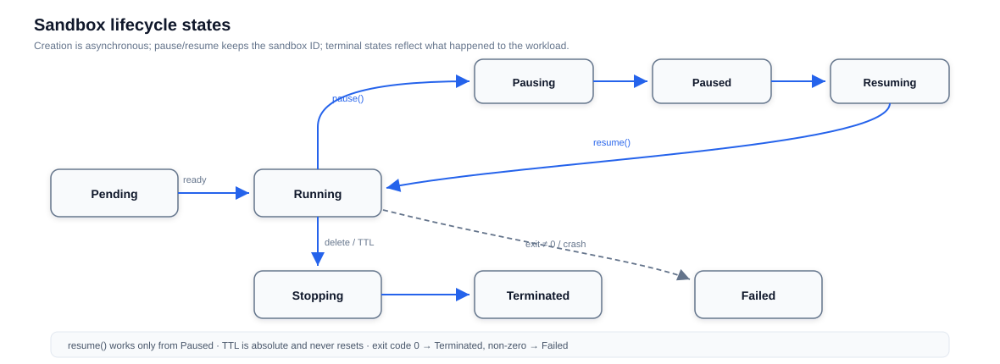

# Lifecycle Server

The server is the control plane of an OpenSandbox deployment: one authenticated HTTP API that every SDK, CLI, and MCP client talks to, regardless of what runs the sandboxes. It validates requests, enforces access control, persists server-managed records, and delegates the actual sandbox work to a configured runtime backend — Docker, Kubernetes, or the Fast Sandbox integration.



## Capabilities at a glance

| Capability | What you get |
|---|---|
| One lifecycle API | Create (from image, snapshot, or template), pause, resume, delete, renew expiration — identical across backends |
| Asynchronous creation | Requests return immediately with `Pending`; clients poll status or use SDK readiness helpers |
| Endpoint resolution | A resolved address for any sandbox port — direct, via ingress gateway, or through the server proxy |
| Access control | API-key authentication with startup guardrails against insecure misconfiguration |
| Persistence | Server-managed records in SQLite (default) or PostgreSQL |
| Observability | Status with state / reason / message, plain-text diagnostics, OpenTelemetry metrics |

## Lifecycle semantics

Creation is asynchronous: the API returns before the sandbox is running. Expiration is an absolute TTL — server or runtime restarts do not reset it.

`resume()` is a pause-state operation, never a general restart: a workload that already exited is `Terminated` (exit code 0) or `Failed` (non-zero), and the honest answer to that is a replacement sandbox. Pausing on Kubernetes keeps the sandbox ID and restores the root filesystem — with the opt-in QEMU mode, even guest memory. See [Pause & Resume](/guides/pause-resume).

## Architecture

The server is a FastAPI application organized in layers, each replaceable behind an interface:

- **API layer** (`api/`) — thin HTTP routers: lifecycle, proxy, pool, templates, network policy, diagnostics, metrics. Request and response schemas live beside them, and all validation happens here.
- **Middleware** (`middleware/`) — cross-cutting concerns: API-key authentication, request IDs, date headers, HTTP metrics.
- **Service layer** (`services/`) — the lifecycle state machines. One `SandboxService` interface with per-runtime implementations; under Kubernetes, `CompositeSandboxService` composes the container workload provider with `FastSandboxService` (a `templateId` create or an `fsb-` ID routes to Fast Sandbox). Backend specifics never leak past the interface, which is why the API layer stays thin.
- **Repositories** (`repositories/`) — persistence for server-managed records only: snapshot metadata and the template catalog, each with SQLite and PostgreSQL adapters plus a migration path between them.
- **Integrations** (`integrations/`) — optional add-ons, such as the renew-on-access consumers (server proxy events, ingress events via Redis).

Two rules follow from the layering. The API never talks to a runtime directly — everything goes through a service. And sandboxes themselves are never stored in the server's database: the Docker container, the Kubernetes resources, or the fast-sandbox CRs are the source of truth. The server persists only what it owns, which is what makes the storage backend swappable and failover tractable at all.

## Endpoints and proxying

`GET /sandboxes/{id}/endpoints/{port}` returns a reachable address for a sandbox service. Depending on runtime and configuration it is:

- a **direct address** (Docker host mapping or pod IP),
- an **ingress gateway route** (header, URI, or wildcard form, with secure-access headers when enabled), or
- a **server-proxied URL** — the server forwards HTTP and WebSocket to the sandbox itself.

The proxy preserves the backend's status codes, bodies, and repeated headers (including each `Set-Cookie`), strips hop-by-hop headers, and reports a failed backend as `502` with error code `BACKEND_CONNECTION_FAILED` — use the code, not the message, to classify failures. `secureAccess` is currently a Kubernetes ingress-gateway feature only.

## Runtimes

One `SandboxService` interface, three implementations:

| Runtime | Selection | Notes |
|---|---|---|
| Docker | `runtime.type = "docker"` | Local and single-host deployments |
| Kubernetes | `runtime.type = "kubernetes"` | Container workloads via the controller or agent-sandbox |
| Fast Sandbox | Part of the Kubernetes composition | Template-backed sandboxes (`templateId` create, `fsb-` IDs) — see [Fast Sandbox](/architecture/fast-sandbox/) |

Backend-specific behavior stays behind the service boundary: the API, response models, and SDKs are identical across all three.

## Docker deletion {#docker-deletion}

Deletion synchronously removes the application, stops and removes its egress sidecar, then cleans up volumes. Docker allows 9 seconds for [egress shutdown](/architecture/network/egress#shutdown) before forced termination; the full request can take longer. If application removal fails, dependent resources and metadata are kept for retry — TTL cleanup retries after 30 seconds without changing the expiration. Sidecar cleanup is best effort, so a `404` does not guarantee that every resource is gone.

## Storage and high availability

Server-managed records — snapshot metadata and the template catalog — persist to SQLite by default, or PostgreSQL when `[store] type = "postgresql"` is set (DSN injected via environment):

```toml
[store]
type = "postgresql"

[store.postgresql]
min_pool_size = 1
max_pool_size = 10
snapshot_recovery_interval_seconds = 15
```

### What HA means here — and what it does not

- The default deployment is **single-active**: one server replica, `Recreate` upgrade strategy, brief API interruption during upgrades. SQLite fits this mode.
- PostgreSQL does not turn the server into a horizontally scaled API. It enables one narrowly scoped multi-replica capability: **two replicas coordinating public snapshot creation** on the Kubernetes runtime. The chart still defaults to one replica; a second replica is opt-in and only meaningful with PostgreSQL plus the Kubernetes runtime.
- General multi-replica API HA — load-balanced lifecycle traffic — is not supported yet.

### How two replicas coordinate snapshots

The normal path needs no coordination at all. The creating replica writes a non-terminal row, then **watches** the deterministic-named `SandboxSnapshot` CR; every observed status change converges the database row through the same conditional write — an UPDATE guarded by the expected prior state, so whichever observation arrives last wins and concurrent writers cannot corrupt the record. On a single replica, this plus a one-time scan for unfinished rows at startup is the whole story.

The mechanisms below cover only what the watch cannot: a peer that never watched the creating replica's namespace, a lost create race, and a crashed writer. The design deliberately avoids leases and leader election; it rides on two existing invariants — the CR name is deterministic, and the Kubernetes API is already a serialized, watchable store.

1. **Observe before create.** A replica checks for the deterministic-named `SandboxSnapshot` CR before creating it. If a peer already created it, the replica converges on that CR — including one a peer has already finished — instead of creating a duplicate. A genuine create race is absorbed as `409 AlreadyExists` and treated as success.
2. **CAS on the terminal write.** The terminal database result is written conditionally on the expected prior state, so when two replicas race to finish the same snapshot, one wins and the other's write is a no-op.
3. **Recovery scans.** A crashed replica leaves its snapshot row non-terminal. The surviving replica re-scans unfinished rows every `snapshot_recovery_interval_seconds` and drives them to completion through the same CR observation, so a crash or a transient Kubernetes timeout leaves the row recoverable rather than failed.

No exactly-once guarantee is claimed across the database, Kubernetes, and the image registry — the recovery interval shapes peer-takeover latency, not atomicity. Snapshot execution on Docker + SQLite keeps single-process recovery semantics. For Secret and Helm wiring of the two-replica topology, see [Kubernetes Deployment](/deployment/#use-postgresql-for-server-persistence).

## Authentication

Every endpoint except health and documentation requires the `OPEN-SANDBOX-API-KEY` header when an API key is configured. The server refuses to start unconfigured in non-interactive environments unless insecurity is explicitly acknowledged — production deployments should always set a key.

## Observability

The server exports OTLP metrics for HTTP request duration (by matched route, never raw paths or identifiers) and sandbox creation outcomes. Diagnostics routes return plain-text runtime and event information for operators and AI troubleshooting workflows. Configuration reference: [server configuration](https://github.com/opensandbox-group/OpenSandbox/blob/main/server/configuration.md).
