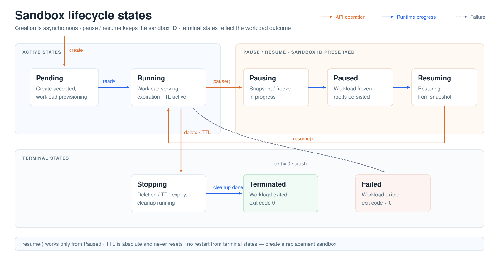
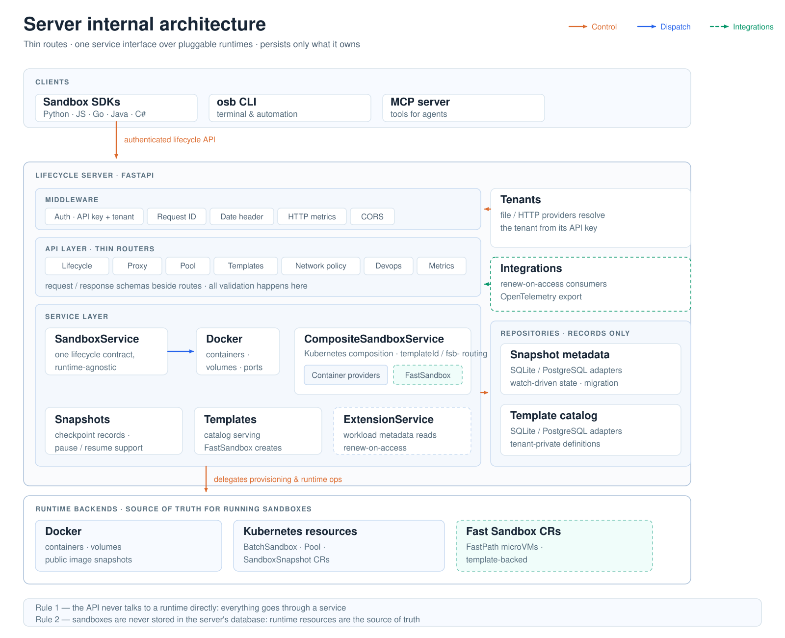

# Lifecycle Server

The server is the control plane of an OpenSandbox deployment: one authenticated HTTP API that every SDK, CLI, and MCP client talks to, regardless of what runs the sandboxes. It owns lifecycle orchestration — validating requests, enforcing access control, persisting server-managed records — and delegates the actual sandbox work to a configured runtime backend (Docker, Kubernetes, or the Fast Sandbox integration).

## Architecture

The server is a FastAPI application organized in layers, each replaceable behind an interface:

- **API layer** (`api/`) — thin HTTP routers (lifecycle, proxy, pool, templates, network policy, diagnostics, metrics) with their request/response schemas. All validation happens here.
- **Middleware** (`middleware/`) — cross-cutting concerns: authentication, request IDs, date headers, HTTP metrics, CORS.
- **Service layer** (`services/`) — the lifecycle state machines and runtime integrations, described below.
- **Repositories** (`repositories/`) — persistence for server-managed records only.
- **Tenants** (`tenants/`) — pluggable identity providers that resolve a request's tenant from its API key.
- **Integrations** (`integrations/`) — optional add-ons, such as renew-on-access consumers and OpenTelemetry metrics.

Two rules define the layering, and both exist to keep the control plane honest and replaceable:

1. **The API never talks to a runtime directly.** Everything goes through a service interface, so backend specifics never leak past the boundary — which is why the API layer can stay thin and the runtime can be swapped by configuration alone.
2. **Sandboxes are not rows in the server's database.** The Docker container, the Kubernetes resources, or the fast-sandbox CRs are the source of truth. The server persists only what it owns (snapshot metadata and the template catalog), which is what makes the storage backend swappable and failover tractable at all.

## Design decisions

### One contract over pluggable runtimes

All runtimes implement one `SandboxService` interface, selected by configuration (`runtime.type`): Docker for local and single-host deployments, Kubernetes for container workloads via the controller or agent-sandbox, and Fast Sandbox for template-backed microVMs. Under Kubernetes, `CompositeSandboxService` composes the container workload provider with `FastSandboxService` — a `templateId`-based create or an `fsb-`-prefixed ID routes to Fast Sandbox, everything else to the container provider. The API, response models, and SDKs are identical across all three; the Fast Sandbox composition is described in [Fast Sandbox](/architecture/fast-sandbox/).

### Asynchronous lifecycle with absolute expiration

Creation returns before the sandbox is running (`Pending`), and clients poll status or use SDK readiness helpers. This keeps the API non-blocking for slow runtimes — provisioning a pod or a microVM must never hold an HTTP request open. Expiration is an absolute TTL rather than an idle timeout: server or runtime restarts do not reset it, so a sandbox's lifetime is auditable from creation time alone.

A sandbox is observed as `Pending` or `Running`, moves through the `Pausing` / `Paused` / `Resuming` / `Stopping` transitions, and ends in `Terminated` (exit code 0) or `Failed` (non-zero). `resume()` is deliberately a pause-state operation, never a general restart: a workload that already exited is `Terminated` or `Failed`, and the honest answer to that is a replacement sandbox, not a silent revive. Pausing on Kubernetes keeps the sandbox ID and restores the root filesystem — with the opt-in QEMU mode, even guest memory. See [Pause & Resume](/guides/pause-resume).

For Kubernetes BatchSandbox workloads, API deletion and TTL expiration use foreground cascading deletion: queries report `Stopping` until owned pods, task cleanup, and pool release finish. Deletion takes priority over pause/resume. `DELETE /sandboxes/{id}` returns `204` and SDK `kill()` returns when deletion is accepted. Before reusing a persistent directory, wait for `GET /sandboxes/{id}` to return `404` after normal managed deletion of a non-pooled sandbox or one using the default pool `Delete` strategy, which waits for allocated pods to disappear even if the Pool is deleted. `Noop` preserves processes, so its `404` does not prove runtime termination. Timeouts and query failures leave completion unconfirmed; forced pod deletion, removed finalizers, or node failures require runtime or storage fencing to prevent old processes from writing.

### Endpoint resolution is part of the contract

Clients never guess how to reach a sandbox service. `GET /sandboxes/{id}/endpoints/{port}` returns a reachable address in one of three forms, chosen by runtime and deployment topology: a direct address (Docker host mapping or pod IP), an ingress gateway route, or a server-proxied URL for deployments where neither direct nor gateway paths exist. The proxy is the compatibility fallback, not the fast path.

### Fail-fast security posture

The server refuses to start in an unsafe configuration rather than degrading: no API key in a non-interactive environment is fatal unless insecurity is explicitly acknowledged, the configured runtime is validated against insecure exposure at startup, and with multi-tenancy enabled every enumerable tenant namespace must exist and be accessible before traffic is accepted. Failing at boot is preferred to failing at request time, because misconfigured isolation is invisible per-request.

### Multi-tenancy as namespace isolation

Multi-tenancy is opt-in and Kubernetes-only. API keys come from a tenant provider (a local file or a remote HTTP lookup) instead of a single server key, and each authenticated request is scoped to the tenant's namespace: creates land in it, and reads and mutations only resolve that tenant's sandboxes. Identity lives in a provider — not in server config — so tenant management stays with the platform that owns identities. Pool routes remain a shared resource today. Setup: [Multi-Tenancy](/guides/multi-tenancy).

### Scoped persistence, scoped HA

Server-managed records — snapshot metadata and the template catalog — persist to SQLite by default, or PostgreSQL when explicitly configured. The default deployment is **single-active**: one replica, brief API interruption during upgrades, SQLite.

PostgreSQL does not turn the server into a horizontally scaled API. It enables one narrowly scoped multi-replica capability: two replicas coordinating public snapshot creation on the Kubernetes runtime. General load-balanced lifecycle HA is not supported yet — and is not pretended.

The two-replica design avoids leases and leader election by riding on two existing invariants: the `SandboxSnapshot` CR name is deterministic, and the Kubernetes API is already a serialized, watchable store.

1. **Observe before create.** A replica checks for the deterministic-named CR before creating it; a peer's earlier create (even a finished one) is converged on, and a genuine create race is absorbed as `409 AlreadyExists` and treated as success.
2. **CAS on the terminal write.** The terminal database result is written conditionally on the expected prior state, so when two replicas race to finish the same snapshot, one wins and the other's write is a no-op.
3. **Recovery scans.** A crashed replica leaves its row non-terminal; the surviving replica re-scans unfinished rows on an interval and drives them to completion through the same CR observation.

No exactly-once guarantee is claimed across the database, Kubernetes, and the image registry — the recovery interval shapes peer-takeover latency, not atomicity. Helm wiring of the two-replica topology: [Kubernetes Deployment](/deployment/#use-postgresql-for-server-persistence).

## Where to go next

- [Kubernetes Controller](/architecture/control-plane/operator) — the operator the server programs on Kubernetes
- [Fast Sandbox](/architecture/fast-sandbox/) — the template-backed microVM composition
- [Multi-Tenancy](/guides/multi-tenancy), [Pause & Resume](/guides/pause-resume) — operational guides
- [Server configuration reference](https://github.com/opensandbox-group/OpenSandbox/blob/main/server/configuration.md) — all keys and defaults
