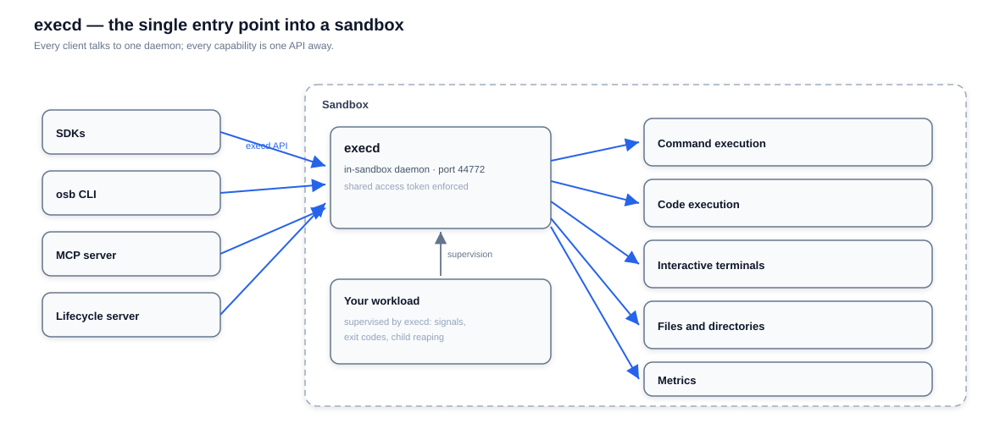
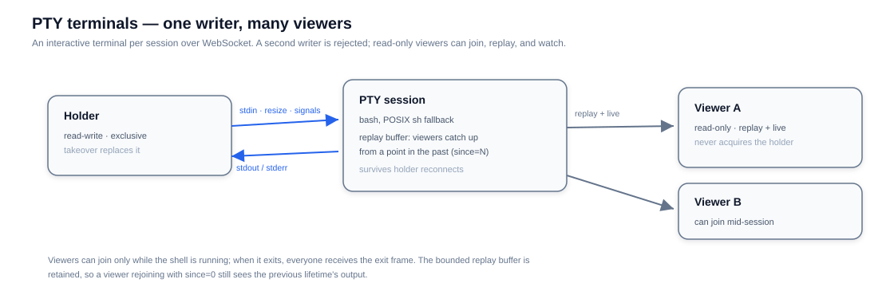
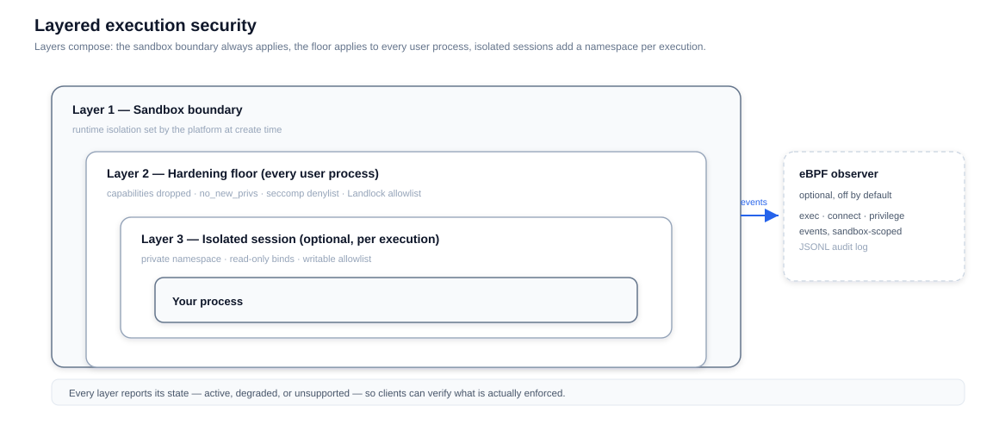

# Execd

Execd is the daemon that runs inside every OpenSandbox sandbox. It is the only process clients ever talk to: SDKs, the `osb` CLI, MCP agents, and the lifecycle server all reach your sandbox through its API. You rarely see it — but everything you do with a sandbox, you do through it.

When the platform creates a sandbox it injects execd next to your entrypoint — as a staged binary in Docker, an init container in Kubernetes, or a baked-in part of a Fast Sandbox template image. Execd serves one HTTP API (default port `44772`), authenticated with a shared access token the platform manages for you. The full contract is public: [execd API spec](/api/).

Execd also fronts a small reverse proxy (`/proxy/{port}`), so one exposed host port can reach every port inside the sandbox — see [Single-Host Network (Docker)](/architecture/network/single-host-network).

## Capabilities at a glance

| Capability | What you get |
|---|---|
| Command execution | Run any command with live streamed output; foreground or background with status polling and log retrieval |
| Code execution | Jupyter-backed code contexts and kernels — the foundation of the Code Interpreter SDKs |
| Interactive terminals | A real terminal (PTY) over WebSocket, shareable with read-only viewers |
| Files and directories | Upload, download, list, move, remove — the sandbox filesystem is fully scriptable |
| Isolated sessions | Run a shell inside a private namespace for untrusted or exploratory work |
| Metrics | Sandbox CPU and memory as point-in-time snapshots or a live stream |

## Command execution

Commands can be submitted in two forms:

- **Shell syntax** — pipelines, redirection, environment expansion; what you would type at a prompt.
- **Direct argv** — a program plus literal arguments, no shell parsing. Safer when parts of the command come from untrusted input, and it preserves empty strings and special characters exactly.

Execution modes:

- **Foreground** returns the output as a live Server-Sent-Events stream while the command runs.
- **Background** returns immediately; you poll status and retrieve incremental logs. Completed background output stays retrievable for 24 hours, and running commands are never cleaned up.

Sessions use Bash when the image provides it and fall back to POSIX `sh` on minimal images — commands sent to a fallback session must be `sh`-compatible. Windows sandboxes are supported (environment names are case-insensitive; batch files require shell syntax).

## Code execution

Code contexts are persistent Jupyter kernels managed by execd. You execute code in a context and receive streamed results — standard output, execution results, and errors — across multiple calls that share state, exactly like a notebook.

The official [code-interpreter image](https://github.com/opensandbox-group/sandbox-images) ships Python, Java, Node.js, and Go runtimes with matching Jupyter kernels — see the [Code Interpreter example](/examples/code-interpreter). Code execution is available through the plain sandbox SDKs and the raw API.

## Interactive terminals

Each terminal session is a real PTY served over WebSocket — not a wrapped command, so interactive programs (editors, REPLs, agent CLIs) behave normally.

The sharing model is deliberate: exactly one **holder** owns the keyboard, and any number of **viewers** can watch. Viewers first replay what has already been printed, then follow live output — useful for supervision, debugging assistants, or letting a second person watch an agent work without giving it input.

## Files and directories

One API covers the whole filesystem tree: stream files in and out, list and search directories, move and remove paths. The file APIs in every sandbox SDK are a thin wrapper over these endpoints.

## Isolated sessions

An isolated session runs a shell inside a per-execution [bubblewrap](https://github.com/containers/bubblewrap) namespace — a private view of mounts and identity, created fresh for each session:

- Explicit bind mounts bring host paths in, read-only or read-write.
- Writes are confined to an allowlist, enforced against fully resolved paths, so a symlink cannot redirect a bind outside it.
- Session creation reports what the current environment supports, so callers can adapt instead of guessing.

See the [Isolation Sessions guide](/guides/isolation-sessions) for the full workflow.

## Layered security

Execd applies defense in depth to everything a sandbox runs:

- **Sandbox boundary** — resource limits, identity, and the isolation runtime (runc container, gVisor, Kata, Firecracker microVM) are chosen at create time (see the [Secure Container guide](/guides/secure-container)).
- **Hardening floor** — when the operator enables it, every user process is launched through a native launcher that drops capabilities, sets `no_new_privs`, installs a syscall denylist, and confines filesystem writes with Landlock.
- **Isolated sessions** — the per-execution namespace above, for work that needs its own boundary.
- **Optional eBPF audit** — records process exec, network connect, and privilege changes, scoped to the sandbox's own cgroup.

Each layer reports its state — active, degraded, or unsupported — so clients can verify what is actually enforced rather than assume. One boundary to keep in mind: execd's lifecycle hooks (setup commands the platform configures) run as trusted code inside the sandbox; they are convenience, not a security control.

## Supervision and exit codes

Execd can act as the sandbox's init process. It reaps orphaned children, forwards signals to your entrypoint, and propagates its exit code to the runtime — so sandbox states like `Terminated` and `Failed` reflect what your process actually did, and long-running sessions do not accumulate zombie processes.

## A fresh identity per allocation

Sandboxes can be pre-warmed in pools and reused across allocations. Execd makes this safe: the platform delivers a per-allocation binding — sandbox ID, environment, access token, lifecycle hooks — at assignment time, and execd applies it atomically before the API opens. Environment variables, tokens, and telemetry attribution never leak between the sandbox that came before and yours.

## Observability

Execd exposes local CPU and memory metrics as a snapshot and as a live stream, and exports OpenTelemetry metrics when the platform configures an endpoint — attributed to your sandbox ID and allocation. See [component telemetry](/guides/component-telemetry) for how export is configured.
