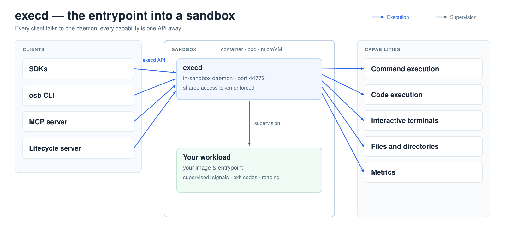
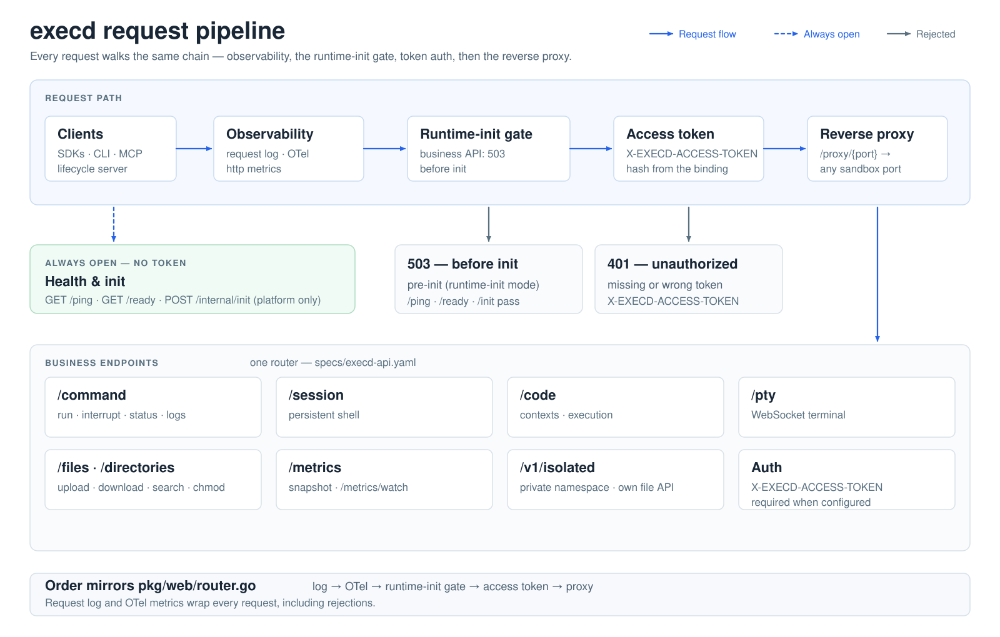
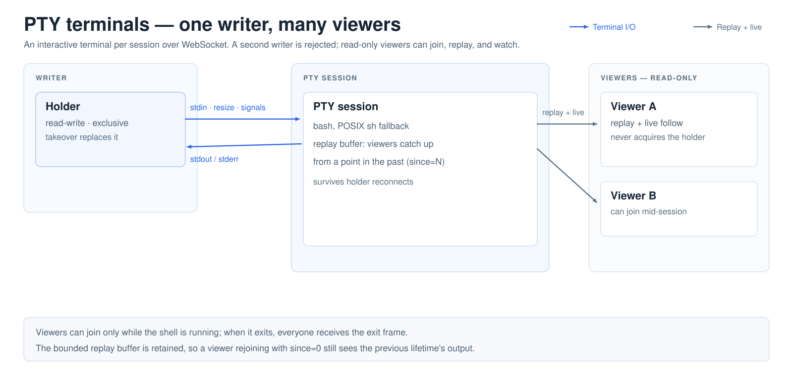
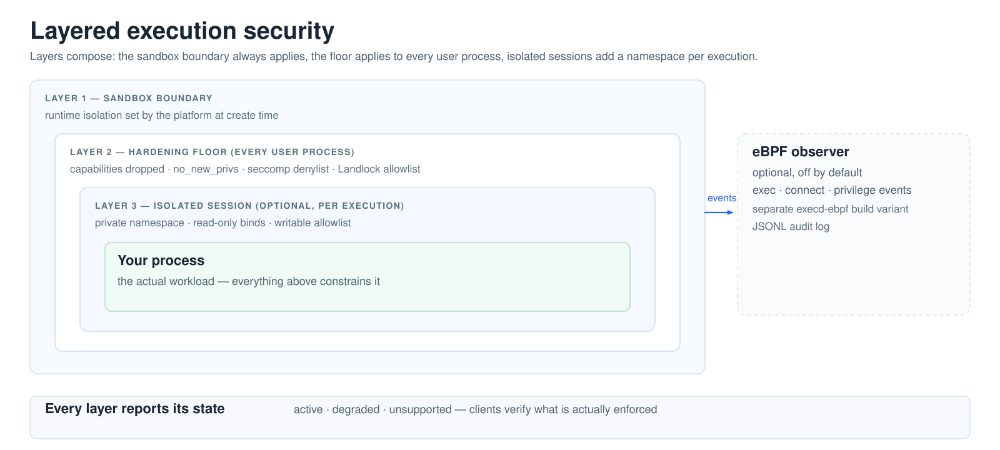
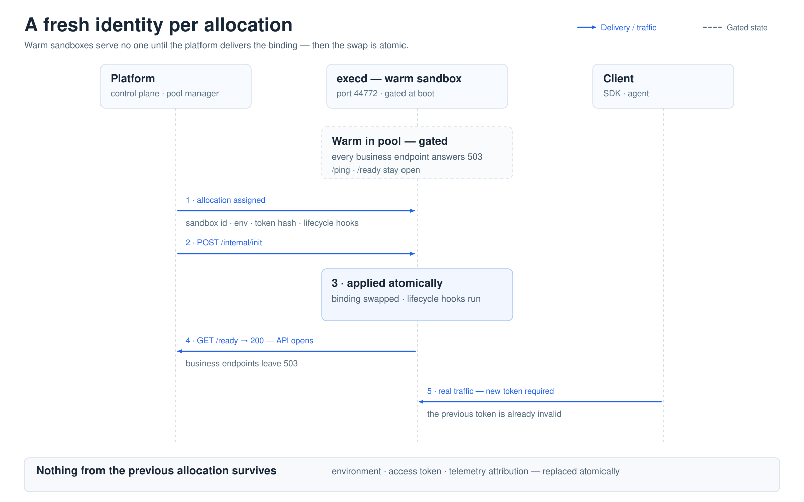

# Execd

Execd is the reference daemon for OpenSandbox's in-sandbox execution API. Sandbox SDK command and file operations use this API; sandbox creation and lifecycle management use the separate lifecycle server. Clients can also access workload-specific services through resolved sandbox endpoints, using those services' own protocols and clients.

For example, the [AIO Sandbox example](/examples/aio-sandbox) resolves port `8080` and uses `AioSandboxClient` for the image's shell, file, and browser API. Those requests are not execd command or file operations, even when an execd reverse proxy carries the traffic. See [Implementation compatibility](/api/implementation-compatibility) for the published contracts, current SDK endpoint assumptions, and backend-dependent features.

The reference platform provisions execd next to your entrypoint — as a staged binary in Docker, an init container in Kubernetes, or a baked-in part of a Fast Sandbox template image. Execd serves an HTTP API (default port `44772`); when access-token protection is enabled, clients forward the token supplied by endpoint resolution. The published [execd API spec](https://github.com/opensandbox-group/OpenSandbox/blob/main/specs/execd-api.yaml) describes the execution contract; some reference-implementation extensions, including PTY routes, are not yet covered by it.

Execd also fronts a small reverse proxy (`/proxy/{port}`), so one exposed host port can reach every port inside the sandbox — see [Single-Host Network (Docker)](/architecture/network/single-host-network).

## Capabilities at a glance

| Capability | What you get |
|---|---|
| Command execution | Run any command with live streamed output; foreground or background with status polling and log retrieval |
| Code execution | Jupyter-backed code contexts and kernels — the foundation of the Code Interpreter SDKs |
| Interactive terminals | A real terminal (PTY) over WebSocket, shareable with read-only viewers |
| Files and directories | Upload, download, list, search, move, chmod, remove, in-place content replace — the sandbox filesystem is fully scriptable |
| Isolated sessions | Run a shell inside a private namespace for untrusted or exploratory work |
| Metrics | Sandbox CPU and memory as point-in-time snapshots or a live stream |

## API surface

Everything execd exposes lives under one API. When the platform configures an access token, every endpoint below requires it in the `X-EXECD-ACCESS-TOKEN` header — only liveness and readiness are always open. The contract lives in [specs/execd-api.yaml](https://github.com/opensandbox-group/OpenSandbox/blob/main/specs/execd-api.yaml).

| Area | Endpoints | Notes |
|---|---|---|
| Health | `GET /ping`, `GET /ready` | Liveness and readiness; no token required |
| Commands | `/command` | Run foreground or background, interrupt, poll status, fetch logs |
| Shell sessions | `/session` | Persistent stateful shell across calls |
| Code | `/code`, `/code/contexts` | Contexts and Jupyter-backed execution |
| Terminals | `/pty` | PTY sessions with a WebSocket attach point |
| Files | `/files`, `/directories` | The whole filesystem surface |
| Isolated sessions | `/v1/isolated/*` | Private-namespace shells with their own file operations |
| Metrics | `/metrics`, `/metrics/watch` | Snapshot and live stream |
| Reverse proxy | `/proxy/{port}` | Reach any sandbox port through execd |

## Command execution

Commands can be submitted in two forms:

- **Shell syntax** — pipelines, redirection, environment expansion; what you would type at a prompt.
- **Direct argv** — a program plus literal arguments, no shell parsing. Safer when parts of the command come from untrusted input, and it preserves empty strings and special characters exactly.

Execution modes:

- **Foreground** returns the output as a live Server-Sent-Events stream while the command runs.
- **Background** returns immediately; you poll status and retrieve incremental logs. Completed background output stays retrievable for 24 hours, and running commands are never cleaned up.

Sessions use Bash when the image provides it and fall back to POSIX `sh` on minimal images — commands sent to a fallback session must be `sh`-compatible. Windows sandboxes are supported (environment names are case-insensitive; batch files require shell syntax).

### Experimental caller-bound creation

Commands and PTY sessions can opt into [execution creation recovery](/guides/execution-creation-recovery). Persist the operation identity and request before creation; if the response is lost, the same identity recovers the original handle within the controller's retention window. This does not guarantee exactly-once script side effects or recovery across controller restarts.

The retained-record limit defaults to `4096`. Set `--operation-capacity` or `EXECD_OPERATION_CAPACITY` to a positive integer at startup; the flag overrides the environment.

## Code execution

Code contexts are persistent Jupyter kernels managed by execd. You execute code in a context and receive streamed results — standard output, execution results, and errors — across multiple calls that share state, exactly like a notebook.

The official [code-interpreter image](https://github.com/opensandbox-group/sandbox-images) ships Python, Java, Node.js, and Go runtimes with matching Jupyter kernels — see the [Code Interpreter example](/examples/code-interpreter). Code execution is available through the plain sandbox SDKs and the raw API.

## Interactive terminals

Each terminal session is a real PTY served over WebSocket — not a wrapped command, so interactive programs (editors, REPLs, agent CLIs) behave normally.

The sharing model is deliberate: exactly one **holder** owns the keyboard, and any number of **viewers** can watch. Viewers first replay what has already been printed, then follow live output — useful for supervision, debugging assistants, or letting a second person watch an agent work without giving it input.

## Files and directories

One API covers the whole filesystem tree: stream files in and out, list and search directories, inspect and change permissions, replace file contents, move and remove paths. The file APIs in every sandbox SDK are a thin wrapper over these endpoints.

### Filesystem execution identity

On Linux, a trusted backend can select the identity performing ordinary file
operations by prefixing the file API path with `/v1/filesystem/{uid}/{gid}`.
Both IDs are required decimal integers between 0 and 4294967294. For example,
`GET /v1/filesystem/1001/1001/files/download?path=/workspace/session-b/result.txt`
reads the file as UID 1001 with primary GID 1001. The same prefix supports all
ordinary file and directory operations, including uploads, metadata, search,
replacement, rename, deletion, and permission changes.

Each request runs in a separate worker process with the selected credentials.
Supplementary groups come from the selected user's system account; an unknown
numeric UID has no supplementary groups. Account or group lookup failures other
than an unknown UID fail the request. The worker never inherits Execd's
supplementary groups as a fallback. Execd must have permission to establish the
requested credentials; failure does not retry the operation as Execd.
Relative paths resolve from `/`, and `~` uses the selected account's home
directory (or `/` for an unknown UID). Workers do not inherit Execd's environment.

Linux checks path traversal, parent directory access, file access, and metadata
changes under that identity. Upload `owner`, `group`, and `mode` remain target
metadata and cannot grant the worker additional privileges. Requests with
different identities can run concurrently without changing Execd's credentials.

To share a sandbox between conversations, provision a separate user and workspace
for each conversation, allow the desired read access, and reserve directory write
access for the owner. Deletion and rename permissions depend on the parent
directory, so read-only file modes alone are insufficient. Keep sandbox API
credentials in the trusted backend that selects these identities. This feature
does not provide a separate mount namespace or a tenant isolation boundary.

The existing `/files` and `/directories` routes retain their default identity.
The identity-prefixed routes require Linux and a supporting Execd version. Older
servers return an unsupported route instead of silently ignoring identity
options; clients must not fall back to the unprefixed routes.

## Isolated sessions

An isolated session runs a shell inside a per-execution [bubblewrap](https://github.com/containers/bubblewrap) namespace — a private view of mounts and identity, created fresh for each session:

- Explicit bind mounts bring host paths in, read-only or read-write.
- Writes are confined to an allowlist, enforced against fully resolved paths, so a symlink cannot redirect a bind outside it.
- Session creation reports what the current environment supports, so callers can adapt instead of guessing.

See the [Isolation Sessions guide](/guides/isolation-sessions) for the full workflow.

## Layered security

Execd applies defense in depth to everything a sandbox runs:

- **Sandbox boundary** — resource limits, identity, and the isolation runtime (runc container, gVisor, Kata, Firecracker microVM) are chosen at create time (see the [Secure Container guide](/guides/secure-container)).
- **Hardening floor** — when the operator enables it, every user process is launched through a native launcher that drops capabilities, sets `no_new_privs`, installs a syscall denylist, and confines filesystem writes with Landlock.
- **Isolated sessions** — the per-execution namespace above, for work that needs its own boundary.
- **Optional eBPF audit** — records process exec, network connect, and privilege changes, scoped to the sandbox's own cgroup. Ships as a separate `execd-ebpf` build variant, not in the default image.

Each layer reports its state — active, degraded, or unsupported — so clients can verify what is actually enforced rather than assume. One boundary to keep in mind: execd's lifecycle hooks (setup commands the platform configures) run as trusted code inside the sandbox; they are convenience, not a security control.

## Supervision and exit codes

Execd can act as the sandbox's init process. It reaps orphaned children, forwards signals to your entrypoint, and propagates its exit code to the runtime — so sandbox states like `Terminated` and `Failed` reflect what your process actually did, and long-running sessions do not accumulate zombie processes.

## A fresh identity per allocation

Sandboxes can be pre-warmed in pools and reused across allocations. Execd makes this safe: the platform delivers a per-allocation binding — sandbox ID, environment, access token, lifecycle hooks — at assignment time, and execd applies it atomically before the API opens. While a warm sandbox waits for its binding (and until startup completes), every business endpoint answers `503`; only `GET /ping` and `GET /ready` respond. Environment variables, tokens, and telemetry attribution never leak between the sandbox that came before and yours.

## Observability

Execd exposes local CPU and memory metrics as a snapshot and as a live stream, and exports OpenTelemetry metrics when the platform configures an endpoint — attributed to your sandbox ID and allocation. See [component telemetry](/guides/component-telemetry) for how export is configured.
