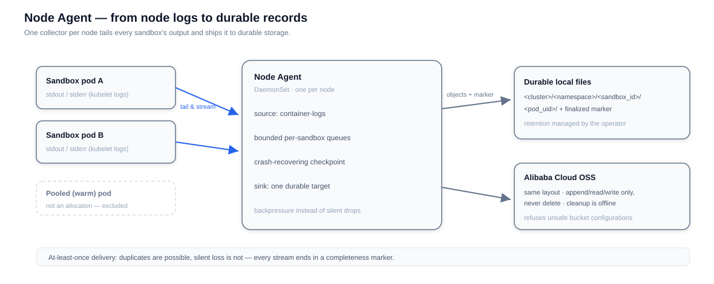

# Node Agent

Sandboxes are ephemeral by design: when a sandbox is deleted, everything it printed to stdout and stderr disappears with it. **Node Agent** is an optional DaemonSet that fixes this — one collector per node tails every sandbox's output and ships it to durable storage, so records outlive the sandbox that produced them.



::: warning Experimental capacity
Collection and delivery are implemented, but production resource defaults still await benchmark and soak results. Treat the chart's resource values as starting points.
:::

## Capabilities at a glance

| Capability | What you get |
|---|---|
| Log collection | stdout/stderr of every sandbox pod on the node (pooled warm pods are excluded — they are not allocations) |
| Syscall observation | An optional kernel-level source recording each syscall a sandbox makes, via an embedded eBPF program |
| Durable targets | Durable local files or Alibaba Cloud OSS — one target per Agent |
| Delivery | At-least-once, crash-recovering, with explicit completeness markers per stream |
| Organization | Records laid out per cluster / namespace / sandbox / pod, ready for downstream consumption |
| Safety | Backpressure instead of silent drops; refuses unsafe bucket configurations |
| Observability | Liveness vs readiness split; metrics free of sensitive labels |

## How collection works

The Agent is a pipeline: **sources** produce records, a bounded per-sandbox queue carries them, and one **sink** writes them out. Two design choices shape the whole system:

- **Sources and sinks are compile-time registries, not plugins.** A build embeds the sources it supports; configuration selects among them, and an unknown name leaves the Agent unready rather than starting a partial pipeline. No code is loaded at runtime.
- **Queues are bounded, and the drop policy is explicit.** The default `block` policy applies backpressure to the source when a sink slows down — collection slows, nothing is lost. The alternative `drop` policy bounds memory harder and accounts for whatever it discards in the stream's completeness marker.

Pod selection is identity-based, not label-guesswork: a pod is collected when it carries sandbox identity (sandbox ID, the sandbox container, its restart count) and is **not** allocated from a pool (pods labeled with their pool are warm capacity, not sandboxes).

## Sources

**`container-logs`** (default) tails the kubelet's log files for sandbox pods on the node and streams each container stream as `container-log` records. Collection is entirely node-side and invisible to the workload.

**`syscalls`** records what sandboxes actually do at the kernel level: an embedded eBPF program is attached to each sandbox pod's cgroup and emits one record per syscall — syscall number, host PID/TID, command name, timestamps — as `syscall` records in their own format. Lost-event counts from the kernel are tracked per stream and reflected in the markers, and container restarts rebind the tracer so attribution stays correct. This source is Linux-only and requires a BPF-capable kernel.

Each source owns its record kind and storage format; both feed the same marker and recovery machinery.

## Where records land

Each stream becomes an object family under a layout that mirrors cluster reality. Every record kind has its own family (`container-log`, `syscall`), each with its own encoding and marker set:

```text
<cluster>/<namespace>/<sandbox_id>/<pod_uid>/
  sandbox.log
  sandbox.<generation>.log
  sandbox.finalized.<revision>.json
```

The `finalized` marker is the stream's closing statement — a cumulative, immutable snapshot that consumers verify by size and checksum. It answers the only question that matters after an incident: **can I trust these logs?**

| Marker status | Meaning |
|---|---|
| `complete` | No intentional drop or known gap. At-least-once delivery may still contain duplicates. |
| `complete-with-drops` | At least one record was intentionally dropped, with the affected interval accounted for. |
| `incomplete` | At least one known interval could not be read, or its coverage cannot be proved. |

The honesty is deliberate. If the Agent restarts while a stream is open, the recovered data is still delivered — but the next marker is `incomplete`, because nothing can prove that a short-lived rotation didn't vanish during the outage. Consumers get truth, not optimism.

## Delivery guarantees

- **At-least-once, never silent loss**: duplicates are possible; unaccounted loss is not. Anything questionable shows up in the marker.
- **Crash recovery**: the Agent keeps recovery state on disk, bound to the node's target identity. A damaged or mismatched state makes the Agent unready — it never silently resets and re-collects from scratch.
- **Bounded footprint**: local files rotate under size, count, and total-volume caps; retention-driven cleanup is crash-resumable — it moves a finished family into a staging area and removes it only after the move is durable, and it never deletes one generation to make room for another.
- **Retention is the operator's job**: the Agent collects; it does not make retention policy. OSS deletion always happens through a separate offline cleanup tool that requires explicit delete credentials — collection credentials never have them.

## Safety model

- **Least-privilege credentials**: OSS collection credentials need append, read, and write permissions — never delete.
- **Refuses unsafe targets**: bucket versioning or WORM, or an overlapping lifecycle rule, is a permanent startup error — configurations that would break the Agent's integrity assumptions are rejected, not worked around.
- **Readiness means trustworthy**: `/readyz` aggregates a set of named, low-cardinality reasons (invalid config, target unreachable, retry loop active, …) and passes only when none apply. A not-ready Agent is visible and diagnosable, not silently dropping data.
- **Host reserves are validated at startup**: checks that Helm's resource schema cannot express — such as host-level disk headroom — fail startup instead of failing collection later.

## Observability

Liveness (`/healthz`) and readiness (`/readyz`) are deliberately separate: the process can be alive while collection is blocked, and readiness surfaces why using low-cardinality reason codes — never credentials, paths, or bucket names. When an OTLP endpoint is configured, the Agent reports record and byte counts, intentional drops, retries, and queue depth, with no sandbox or pod identifiers as labels.

## Enabling it

Node Agent ships in the `node-agent` Helm chart and is disabled by default in the umbrella chart. See the [node-agent chart](https://github.com/opensandbox-group/OpenSandbox/tree/main/manifests/charts/node-agent) for values — target type, OSS credentials, retention, and cluster ID.
