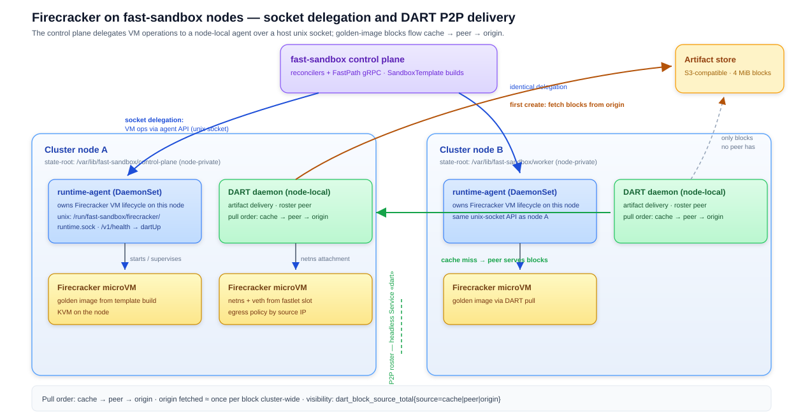

# Firecracker Support

Fast Sandbox templates can build golden images for Firecracker microVMs. Each sandbox then runs as a real KVM virtual machine inside the Fastlet pod network namespace, alongside the shared egress process. The per-VM networking, isolation, and checkpoint machinery has been verified end-to-end on real hardware.

## Topology

```text
host
└── Fastlet pod netns (docker bridge)
    └── fastlet container (privileged, /dev/kvm)
        ├── egress container (--network container:fastlet)   shared control plane
        ├── firecracker vm1 (10.30.0.5, gw 10.30.0.1)        policy + vault per VM
        └── firecracker vm2 (10.30.0.6, gw 10.30.0.2)        policy + vault per VM
              tap ── br0 ── veth ──► pod netns (per-subject policy enforcement)
```

The microVMs are first-class subjects of the [egress profile](/architecture/fast-sandbox/networking#outbound-one-egress-control-plane-n-subjects): each VM registers through `SET_BINDING` with its attachment block (IP, gateway, host veth, private CIDR), stays deny-first until `sandbox.data-plane-ready`, and owns an isolated slice of policy, credentials, and kernel rules. Template builds and on-demand artifact delivery are described in [Templates](/architecture/fast-sandbox/templates) and [Storage](/architecture/fast-sandbox/storage).

## Node architecture: agent delegation and P2P delivery

The fast-sandbox control plane does not drive Firecracker directly. Each node runs a **runtime-agent** (DaemonSet) that owns the VM lifecycle locally; the control plane delegates VM operations to it over a host unix socket (`/run/fast-sandbox/firecracker/runtime.sock`). Readiness is reported through the same API — the agent answers `dartUp` alongside Firecracker health.

Golden-image artifacts are delivered by **DART**, a node-local daemon with peer-to-peer fallback. Each node keeps a private state-root subdirectory, so one node's cache never satisfies another node's pull; block-level fetches (4 MiB) flow `cache → peer → origin`, and the S3-compatible origin is hit roughly once per block cluster-wide.



Peer discovery uses a headless `dart` Service: every daemon must see the full roster before pulls begin, so the second node's first create is served by the first node's blocks instead of the origin. Per-node block source counters (`cache` / `peer` / `origin`) make the delivery path observable.

## Host and node requirements

These are the checks the integration actually performs (chart + environment tooling) before a node hosts Firecracker sandboxes:

**Host** (bare metal, or a VM with nested virtualization exposing KVM):

- **Host kernel ≥ 5.10.**
- `/dev/kvm` present and passed through into the node containers, together with the KVM device node under `/sys`. Nested virtualization works as long as KVM is exposed; a host without it is never labeled and never receives microVM sandboxes.
- `/dev/net/tun` — TAP devices carry each sandbox network namespace's data plane. The Firecracker driver probes only `/dev/kvm` and `/dev/net/tun`; `vhost-vsock` is deliberately not mounted.
- `/dev/shm` sized beyond the container default — snapshot memory staging happens there.
- **cgroup v2** (unified hierarchy); cgroup v1 hosts are rejected up front.
- `fs.inotify.max_user_instances` raised on the host for the duration of the cluster.
- An **XFS filesystem with reflink support** backing the node state root: per-sandbox rootfs copies are copy-on-write reflinks, and the setup probes reflink explicitly — if the probe fails, setup refuses rather than degrading. Disabling XFS falls back to full copies. Reflink works only within one filesystem, which is why each node binds its own subtree of a single shared XFS volume.
- Headroom: the node readiness gate requires **10 GiB free disk** and **2 GiB free memory** by default.

**Node readiness is self-service.** The firecracker-runtime DaemonSet runs on every candidate node, performs the host checks, installs the Firecracker assets (default version `v1.16.1`; an optional custom kernel URL is supported — this section hot-reloads on every readiness pass), and only then labels the node (`sandbox.fast.io/kvm=true`, `fast-sandbox.io/firecracker-node=true`) and sets the `FirecrackerReady` condition. Pools place Fastlets only on labeled nodes; operators never label by hand.

**Not asserted by this repository:** an NVMe requirement — the checks above are the ones expressed in the chart and environment tooling; anything deeper (specific storage devices) would live in the fast-sandbox runtime source, which is outside this repository.

## Networking model

- **Per-VM gateway addresses.** Every VM gets its own veth pair and gateway IP in the pod netns. Sharing one gateway across VMs breaks under `arp_ignore=1`: the second VM's ARP goes unanswered and its traffic never leaves the guest. Per-VM gateways match the real per-VM veths, and the egress dispatches per attachment automatically.
- **Network namespace visibility.** `/var/run/netns` is mounted with `:rslave` propagation in both containers so VM netns created after container start are visible to management tooling; the default `rprivate` propagation hides them.
- **Guest traffic bypasses container netfilter.** Traffic crossing a VM netns is L2 bridge traffic from the pod's perspective. The authoritative enforcement layers are therefore the pod-netns forward chain — the pod-netns layers, not any container OUTPUT path.

Lifecycle ordering is fixed: VM netns created → `SET_BINDING` (deny-first) → `data-plane-ready` → sandbox traffic flows under its own policy.

## Measured characteristics

From the real-hardware verification:

| Phase | Measured |
|---|---|
| VM `InstanceStart` → first response | ~1.6 s (kernel boot ~1.0 s) |

The full set of measured figures — create, snapshot, pause/resume, request latency, artifact delivery — lives in [Performance](/architecture/fast-sandbox/performance).

## Isolation guarantees

- **Per-VM policy enforcement**: each VM's outbound traffic is filtered by its own subject policy at the DNS and network layers.
- **Cross-VM isolation**: a VM targeting another VM's host is refused at DNS resolution by its own policy.
- **Tamper resistance**: guests have no `NET_ADMIN` in the pod network namespace; enforcement rules are invisible and immutable from inside the guest.
