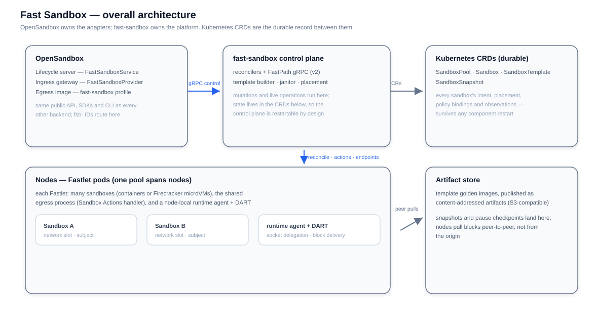

# Fast Sandbox Integration

Fast Sandbox is a runtime backend that connects OpenSandbox to the external [fast-sandbox](https://github.com/opensandbox-group/fast-sandbox) platform. It provisions template-backed sandboxes — containers, gVisor, Kata, or Firecracker microVMs — inside pre-warmed **Fastlet** pods, removing the per-sandbox Kubernetes scheduler, watch propagation, and kubelet path from the creation hot path.

The adapter and endpoint integration live in this repository. FastPath, the Fastlet runtime, and the `sandbox.fast.io` CRDs are owned by the fast-sandbox platform and consumed as-is.

## How it fits

- **Backend selection**: Fast Sandbox is not a separate `runtime.type`. Under `runtime.type = "kubernetes"`, `CompositeSandboxService` routes create requests carrying `templateId` to `FastSandboxService`, and dispatches operations on existing `fsb-` prefixed sandbox IDs to it. Image- and snapshot-based requests keep using the Kubernetes workload providers.
- **Control protocol**: the server and ingress talk to the fast-sandbox control plane (FastPath v2) over gRPC. FastPath owns mutations and live runtime operations; reads of persisted state use Kubernetes LIST/WATCH on `sandbox.fast.io` custom resources.
- **Tenancy**: a tenant provider maps each authenticated tenant to a fast-sandbox namespace; request-scoped operations resolve it from context, background work falls back to a lookup by sandbox ID.

## Core components

| Component | Responsibility | Design goal |
|---|---|---|
| FastPath (gRPC control plane) | Serves every mutation and live operation: create, update, expiry, endpoint resolution, snapshots | Constant-time create via in-memory placement; restartable because durable state lives in CRDs, not here |
| Reconcilers (controller) | Drive CRs to reality: build templates, run pools, place sandboxes, finish snapshots | Converge by observation — no leader election, replay from CRs after any restart |
| Sandbox CRDs (`sandbox.fast.io`) | Durable record of intent, placement, policy bindings, and observations per sandbox | Intent survives every component failure; the CR is the source of truth |
| Fastlet (pre-warmed pod) | Hosts many sandboxes in one network domain; provides runtime capacity and shared services | Density with isolation: pre-provisioned network slots, shared egress and DNS amortized across sandboxes |
| Runtime agent (per node) | Owns Firecracker VM lifecycle over a unix socket; node readiness checks and self-labeling; installs assets | Node autonomy: the control plane delegates, the node verifies itself before admitting workloads |
| DART (per node) | Peer-to-peer artifact delivery between node state roots | Amortize the origin: each block fetched from the store roughly once cluster-wide |
| Egress process (per Fastlet) | Multi-sandbox outbound policy: subjects, Sandbox Actions handler, DNS and network enforcement | Fail-closed per-sandbox policy without per-sandbox sidecars — policy may be late, never open |
| Template builder | Converts OCI images into golden-image artifacts (guest wiring, init, execd baked in) | Workload fixed before any request: creates express intent, not configuration |
| Janitor | Sweeps orphaned resources of failed operations | Reconciliation finishes interrupted work; the janitor removes what should no longer exist |

## Design principles

- **No new public API**: template-based creation and `fsb-` ID dispatch ride the existing lifecycle contract. SDKs work unchanged across backends, and no sandbox-to-backend registration store exists — the ID prefix is the dispatcher.
- **CRD-first control**: durable per-sandbox intent lives in `sandbox.fast.io` resources; FastPath gRPC carries the mutation hot path. The Kubernetes scheduler, watch propagation, and kubelet leave the create path — the durable write does not.
- **Fail-closed multi-tenant egress**: every subject denies traffic from registration until its data plane is ready — policy delivery can be late, never early-open.
- **Authenticated routing**: sandbox routes are signed `f1.` scopes verified at ingress; endpoint issuance is decoupled from readiness.
- **MicroVM-ready**: one integration serves container and Firecracker golden images, selected by template rather than by request.

## Documentation

| Page | Content |
|---|---|
| [Templates](/architecture/fast-sandbox/templates) | Template catalog, golden-image builds, artifact publication |
| [Scheduling](/architecture/fast-sandbox/scheduling) | Pools and Fastlets, the create hot path, lifecycle and pause/resume |
| [Networking](/architecture/fast-sandbox/networking) | Network slots, inbound route scopes and resolution, outbound egress enforcement |
| [High Availability](/architecture/fast-sandbox/ha) | What survives which failure: control plane, nodes, sandboxes |
| [Storage](/architecture/fast-sandbox/storage) | Artifact store, peer-to-peer block delivery, node state roots |
| [Firecracker](/architecture/fast-sandbox/firecracker) | Host requirements, per-VM networking model, agent delegation |
| [Performance](/architecture/fast-sandbox/performance) | Measured create, boot, and pause/resume characteristics |
