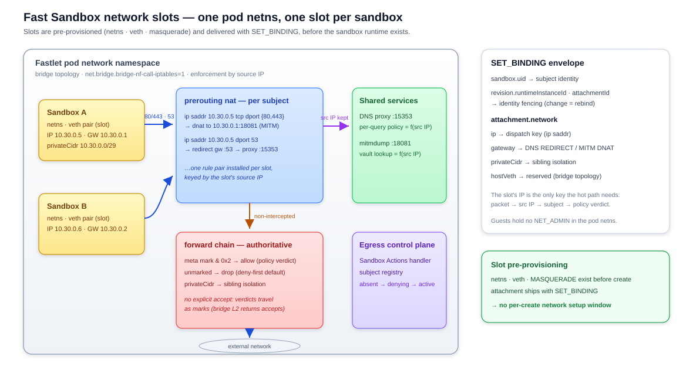

# Networking

Fast Sandbox traffic flows through two adapters in this repository:

- **Inbound** (client → sandbox): the ingress gateway's `FastSandboxProvider` verifies signed route scopes and forwards traffic to the Fastlet through FastPath endpoint resolution (`components/ingress/`).
- **Outbound** (sandbox → external): one shared egress process per Fastlet pod enforces per-subject policy for N sandboxes, driven by the Sandbox Actions protocol (`components/egress/`).

## Design highlights

- **Authenticated scopes instead of raw routing keys**: a route is a signed `f1.` scope binding tenant namespace, sandbox ID, and port. The ingress verifies before it routes; there is no unauthenticated path to a sandbox.
- **Lazy resolution**: the upstream address resolves only when traffic arrives, so routes stay valid across Fastlet rescheduling without an invalidation protocol.
- **Fail-closed egress**: every subject denies traffic from registration until its data plane is ready — policy delivery can be late, never early-open.
- **Policy as data**: egress policy rides the Sandbox CRD's revisioned `actionBindings`; only credentials travel out of band, memory-only.
- **One dispatch point**: DNS filtering and network enforcement are shared pod-netns services, dispatched per packet by source IP.

## Inbound: route scope to Fastlet

### Route scopes

A Fast Sandbox route is an authenticated scope, not a plain host or path. The server signs the tenant namespace, sandbox ID, and port with the `opensandbox-fsb-route-v1` scheme; the `f1.` prefix identifies the scope format version, and the ingress shares the server's signing key ring.

- Header mode expresses the scope as an `OpenSandbox-Ingress-To` header; URI mode encodes it in the path.
- Wildcard-host scopes are deliberately unsupported: namespace, sandbox ID, and MAC do not fit safely in one DNS label.
- Clients must preserve the returned route and headers verbatim — the scope is the credential.

The server issues these routes without calling FastPath or waiting for readiness: signing the tenant namespace, sandbox ID, and port is a local operation keyed by the shared ingress key ring. Issuance is therefore decoupled from sandbox state, and endpoint discovery never proves existence — the ingress resolves and verifies when traffic arrives.

### Endpoint resolution

The ingress resolves the upstream address through the FastPath `ResolveEndpoint` RPC when a request arrives. Resolution returns the target endpoint, the proxy address to forward through, and any required headers.

Failure semantics are part of the contract:

- A `FailedPrecondition` — including a not-yet-published route — surfaces as `503` with `Retry-After`. It is never reported as a missing sandbox: the ingress must not leak the difference between "not ready" and "does not exist".
- The policy port (`18080`) is resolvable for SDK compatibility but returns `501` for traffic; policy operations belong to the server's network policy route, not the data path.

### Access modes

| Mode | Path | Trade-off |
|---|---|---|
| `direct-fastlet-proxy` (default) | Ingress → Fastlet pod directly | Lower latency; requires ingress to reach Fastlet pod IPs |
| `central-proxy` | Ingress → fast-sandbox central proxy → Fastlet | No pod-IP reachability requirement; extra hop |

Direct mode bypasses the central proxy, so the pod network must restrict Fastlet data-plane ports to trusted ingress workloads, and FastPath must admit the ingress namespace when the two systems deploy separately. The mode is chosen per deployment, not per request.

### Transport and interoperability

The ingress speaks only the `ResolveEndpoint` subset of FastPath v2 at a pinned wire revision shared with the server's generated client, so the components stay interoperable as fast-sandbox evolves. gRPC transport is plaintext; isolation between ingress, Fastlets, and FastPath is a deployment concern (network policy), with TLS deferred until both sides support it.

## Outbound: one egress control plane, N subjects

Fastlet pods host many sandboxes in one network domain, so the per-sandbox egress sidecar does not apply. The egress component runs the opt-in **fast-sandbox profile** (`OPENSANDBOX_EGRESS_PROFILE=fast-sandbox`): one egress process per Fastlet pod serves N sandboxes as independent **subjects**, each with its own policy, credentials, and kernel rules. The default sidecar profile is unchanged; the two profiles are mutually exclusive deployment forms.

Policy reaches subjects as data: the server writes it to the Sandbox CRD's revisioned `actionBindings` through the shared lifecycle policy route, with sidecar-compatible semantics — replace is total, merge follows sidecar rules (same-target rules replace in place, first per target wins), removal is by target and idempotent. Writes are fenced by sandbox UID and generation (`409` on a lost race; other tenants are indistinguishable from missing, `404`), and a successful write commits intent only — enforcement converges on the Fastlet asynchronously, and a cleared binding resets the subject to deny-first.

### Network slots

Each sandbox is pre-provisioned with a **network slot** in the Fastlet pod netns before it exists: netns, veth, and masquerading are set up ahead of any create request, and the attachment identity ships in the `SET_BINDING` envelope. A sandbox never waits for network setup, and egress can enforce policy from its first packet.



The slot's IP is the dispatch key: the shared DNS proxy selects the subject for each packet by source IP, so one service per Fastlet serves every sandbox with per-subject policy.

| `attachment.network` field | Role |
|---|---|
| `ip` | Dispatch key — `ip saddr` matches select the subject's rules |
| `gateway` | Target of the DNS REDIRECT |
| `privateCidr` | Sibling-isolation rules between sandboxes |
| `hostVeth` | Reserved — on the bridge topology, policy hooks see the bridge device, not the veth |

### Subject lifecycle

A **subject** is the unit of policy, credential, and rule ownership — one per sandbox, identified by the sandbox UID. The egress process maintains a per-subject state machine:

```text
absent ──SET_BINDING──► denying ──data-plane-ready──► active
   ▲                        │                            │
   └──────REMOVE_BINDING────┴────────────────────────────┘
```

Subject lifecycle and policy are delivered by the Fastlet over the public **Sandbox Actions Handler** protocol (`sandbox.fast.io/actions/v1`). The egress process is the handler; two Pod-loopback HTTP endpoints serve it:

- `POST /_fastlet/v1/actions` — `SET_BINDING`, `LIFECYCLE_HOOK`, `REMOVE_BINDING`.
- `GET /_fastlet/v1/actions/status` — process incarnation probe. A changed `instanceId` makes the Fastlet replay the latest binding and all reached hooks.

Every operation carries fencing fields (`runtimeInstanceId`, `attachmentId`) so a control-plane reset can never look like a rebinding. Unknown protocol versions, operations, or hook names are validation errors and are never silently ignored.

### Credential delivery

Credential vault revisions are pushed by the server over fast-sandbox's proxy-route mechanism and routed per subject by the `X-Fast-Sandbox-Uid` header. Pushes stay memory-only in egress — no Secret volumes, no disk state.

- A push for a UID whose binding has not appeared yet is cached briefly and applied on registration.
- A push carrying a mismatched `X-Fast-Sandbox-Generation` is discarded.

### Enforcement

Enforcement is nftables in the Fastlet pod network namespace, dispatched by source IP — the attachment block of each action envelope supplies the subject's IP, gateway, host veth, and private CIDR.

- **DNS**: one shared proxy on loopback `127.0.0.1:15353`. Per-subject prerouting REDIRECTs forward sandbox DNS addressed to the attachment gateway, preserving the source IP so per-query policy dispatches to the right subject.
- **Forward path**: per-subject `hook prerouting` chains mark allowed destinations (`meta mark 0x2`); the master forward chain drops unmarked traffic. The path deliberately never emits an explicit `accept` — with `net.bridge.bridge-nf-call-iptables=1` (the fast-sandbox bridge topology) an accept verdict returns the frame to bridge L2 and is lost.
- **Dynamic sets**: DNS-learned IPs get bounded leases; a per-subject connection refresh loop renews leases of active TCP connections. UDP/QUIC relies on DNS TTLs.
- **Encrypted DNS**: DoT (853) is always dropped; optional DoH-over-443 blocking applies globally to every subject.
- **Chained upstream proxy**: when `OPENSANDBOX_EGRESS_UPSTREAM_PROXY` is set alongside transparent MITM, all shared-mitmproxy egress is chained through that proxy via `CONNECT`. The endpoint is infrastructure, not sandbox egress: it is dropped profile-wide in the master dispatch chain (forward and input paths, ahead of every per-subject rule) so no subject policy — default-allow included — can CONNECT the proxy directly. A hostname endpoint is registered as an infrastructure domain on the shared DNS proxy, so its answers never feed the dynamic allow sets; the shared mitmdump resolves the name through the Fastlet pod's own resolver, so it must be resolvable via cluster DNS. Since the DNS proxy's forward upstreams and the pod resolver can return different address sets (split-horizon or operator-configured DNS), the egress's self-resolution refresh queries both authorities and seeds the drop sets with the union — an address only the pod resolver returns is one a sandbox could otherwise CONNECT directly. Drop elements are permanent (no kernel timeout): containment persists through egress downtime like every other rule in the table, and expiry is owned by the egress — the refresh loop prunes addresses both authorities stop returning, while a failed resolve keeps every element (fail-closed retention). The first seed retries with bounded backoff at startup and fails egress startup if the hostname cannot be resolved, before any sandbox action is served.
- **Atomicity**: static sets are swapped atomically; on restart the egress wipes stale rules, publishes a new `instanceId`, and the Fastlet replays every live binding.
