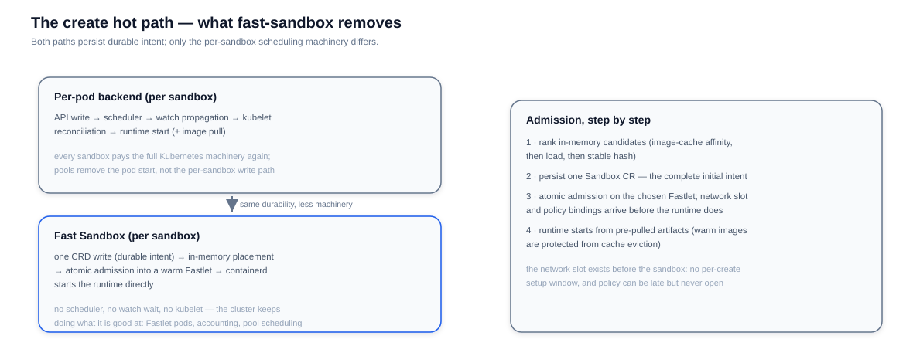

# Scheduling

Fast Sandbox schedules sandboxes into **pools** of pre-warmed **Fastlet** pods. A pool fixes the runtime profile and resource shape; a Fastlet hosts many sandboxes; a sandbox claims a slice of one Fastlet. The result: creating a sandbox is a constant-time admission into capacity that already exists, instead of a fresh scheduling round.

## Pools

A `SandboxPool` is the unit of capacity and policy:

- **`capacity`** sizes the Fastlet fleet — how many warm pods to hold, and the ceiling.
- **`runtime`** selects one immutable, platform-owned runtime profile (a container profile, or a Firecracker profile). All sandboxes in a pool share it.
- **`sandboxResources`** is the immutable resource shape of every sandbox the pool produces.
- **`fastletTemplate`** is an ordinary Kubernetes pod template for the Fastlet pods themselves — node selectors, affinity, and spreads stay Kubernetes-native.
- **`infraComponents`** declares the pod-local infrastructure (such as the egress action handler). It is compiled into an immutable revision: updating it rolls new Fastlets while existing sandboxes stay on the revision they were admitted with.
- **`maxSandboxesPerPod`** bounds density; **`warmImages`** lists artifacts to pre-pull, protected from ordinary cache eviction, so readiness never waits on a pull.

## Placement and admission

When the server submits a create, FastPath ranks in-memory candidates — image-cache affinity first, then normalized load, then a stable-hash tiebreak — and admits the sandbox atomically on the chosen Fastlet. Two properties make this safe rather than merely fast:

- The **network slot exists before the runtime**: netns, veth, and masquerading are pre-provisioned per sandbox, and the attachment identity plus policy bindings ship with the admission. A sandbox is never reachable before its policy is (see [Networking](/architecture/fast-sandbox/networking)).
- The **Sandbox CR is written first and completely**: intent, initial policy, and pool reference are durable before the runtime starts, so an admission interrupted by any failure is recoverable by reconciliation instead of leaking a half-created sandbox.

## Sandbox lifecycle

The Sandbox CR carries the lifecycle in three fields:

- **`state`** — `Running` keeps a live runtime; `Paused` checkpoints it to the artifact store and releases the Fastlet capacity. Resume restores the checkpoint **possibly on a different Fastlet**, which is why routes must be re-resolved after resume.
- **`expireTime`** — absolute deletion deadline, enforced by the platform.
- **`failurePolicy` + `recoveryTimeoutSeconds`** — what to do when a Fastlet is lost (default: manual recovery after 60 seconds of lost contact). `resetRevision` triggers a deliberate reset and rescheduling.

Task execution is part of admission: the request's entrypoint is delivered as a task to the sandbox rather than baked into the pod, which is what allows a pre-warmed Fastlet to serve arbitrary templates (see [Templates](/architecture/fast-sandbox/templates)).

Snapshots and pause/resume follow the same submit-and-converge pattern as every other mutation — see [High Availability](/architecture/fast-sandbox/ha).
