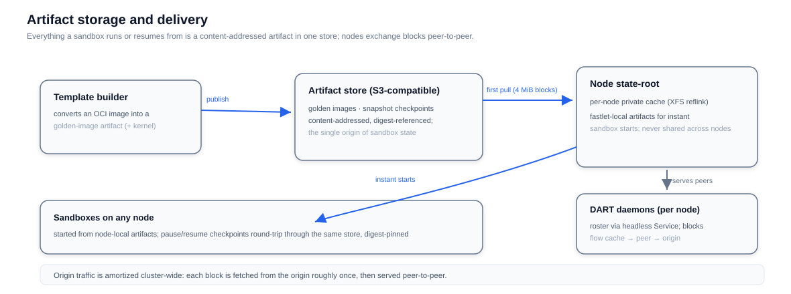

# Storage

Fast Sandbox reduces storage to one shape: **everything a sandbox runs or resumes from is a content-addressed artifact** in a single S3-compatible store. Golden images, pause checkpoints, and snapshots are all artifacts, referenced by manifest digest — never mutated, always verifiable.



## Where artifacts come from

- **Template builds** convert an OCI image (plus guest wiring and, for microVM runtimes, a kernel) into a golden-image artifact and publish it; the SandboxTemplate CR records the manifest reference and digest (see [Templates](/architecture/fast-sandbox/templates)).
- **Pause checkpoints and snapshots** are written by the same machinery: the runtime state is captured, pushed, and recorded digest-first in the SandboxSnapshot CR (see [Pause, Resume, and Snapshots](/architecture/fast-sandbox/checkpoints)). Resume never trusts a mutable tag.

## Where artifacts go

Nodes keep a **private state root** — an XFS-reflink-backed cache local to each node, never shared between nodes. This is deliberate: a fastlet's instant starts come from node-local artifacts, and cross-node state sharing would turn every node into part of every other node's failure domain.

The cost of private caches is duplicate downloads, and that is what **[DART](https://github.com/data-accelerator/dart)** eliminates: a node-local delivery daemon per node, peer-aware through a headless Service roster. Block-level fetches (4 MiB) follow `cache → peer → origin` — each block is fetched from the origin roughly once cluster-wide, then served peer-to-peer. Per-node block source counters make the delivery path observable.

## What is deliberately *not* stored

- **Egress credentials** stay memory-only in the egress process — pushed per subject over the proxy route, never written to a Secret volume or disk.
- **Sandbox runtime writes** (files a sandbox created) live in the sandbox's own slice; they are captured only when an explicit checkpoint or snapshot says so. Storage for sandboxes is an act of the lifecycle, not a background sync.
- **Routing and policy state** lives in the CRDs, not in the artifact store — the store carries bytes, the cluster carries meaning.

## Operating it

The artifact store is plain S3-compatible object storage; capacity planning reduces to artifact sizes and retention. Deleting a SandboxSnapshot record does not delete the pushed artifacts — retention and cleanup of the store are operator policy, kept outside the sandbox lifecycle on purpose.

### Prepare the node state disk

The `fast-sandbox` chart mounts `runtime.stateRoot` from the host
(default `/var/lib/fast-sandbox/firecracker`). `DirectoryOrCreate` creates a
directory on the existing filesystem; it does not provision a separate disk.
When using the `opensandbox` umbrella chart, set `fast-sandbox.runtime.stateRoot`.
Set the chart value to the same directory used as the helper's mountpoint.
Prepare this mount **before deploying the runtime DaemonSet** on each node.
Otherwise, drain the node's sandboxes and restart the runtime Pods after mounting:
an already-running container may continue seeing the old filesystem.

Prefer a dedicated XFS data disk with reflink enabled. For a **new, empty device**,
after verifying its identity and that it contains no required data:

```bash
sudo mkfs.xfs -m reflink=1 /dev/vdb
sudo mkdir -p /var/lib/fast-sandbox/firecracker
sudo mount -o noatime /dev/vdb /var/lib/fast-sandbox/firecracker
sudo blkid /dev/vdb
```

Persist the mount in `/etc/fstab` using the device's UUID. Formatting destroys
the device's contents; never run these commands on an existing state disk.
Keep the mountpoint empty before mounting so existing state is not hidden.

When no extra device is available, the repository provides
[`scripts/fast-sandbox-state-root-setup.sh`](https://github.com/opensandbox-group/OpenSandbox/blob/main/scripts/fast-sandbox-state-root-setup.sh):

```bash
bash scripts/fast-sandbox-state-root-setup.sh --dry-run 50G
sudo bash scripts/fast-sandbox-state-root-setup.sh 50G
# Optional: SIZE MOUNTPOINT BACKING_FILE
sudo bash scripts/fast-sandbox-state-root-setup.sh 100G /data/firecracker /data/firecracker.xfs
```

The helper allocates a new backing file, formats it with XFS `reflink=1`, mounts
it with `loop,noatime`, and verifies an actual reflink copy. It requires Linux,
`xfsprogs`, GNU coreutils, and util-linux. It refuses existing backing files,
symlinked paths, mounted targets, and nonempty mountpoints. It prints an fstab
entry for review; it does not edit fstab or restart workloads. On failure, it
retains any created backing file for inspection instead of risking deletion of
mounted data. Inspect `findmnt` and `losetup -j BACKING_FILE` before cleanup or retry.

Unlike a sparse file, the helper uses `fallocate` to reserve the requested space
and checks that at least another 10 GiB remains on the backing filesystem.
This is a point-in-time check, not a host-wide reservation: other workloads can
still fill that filesystem, and thin-provisioned storage needs its own capacity
monitoring. A dedicated disk avoids coupling the state cache to root-disk usage.

### Capacity and readiness

Budget for every distinct cached template's rootfs **plus guest-memory snapshot**,
active sandbox writable data, and cache overhead. Start with at least 50% workload
headroom and keep **more than 10 GiB free** on the state filesystem (the default
host-readiness floor). The helper's minimum volume size is 11 GiB; that is not a
production sizing recommendation. Reflink saves initial copying but subsequent
writes still allocate blocks.

Old template artifacts are not automatically reclaimed just because a template
version changes. Track disk usage, retire unused templates, drain sandboxes using
them, and stop the node runtime before manually reconciling its local caches.
Do not delete live `images`, `cache`, or `jails` directories. Preserve any state
needed for recovery, and expect artifacts to be downloaded again after cleanup.

After provisioning, verify the filesystem and the runtime's readiness report:

```bash
# Use your configured runtime.stateRoot (for example /data/firecracker):
STATE_ROOT=/var/lib/fast-sandbox/firecracker
findmnt -M "$STATE_ROOT"
df -h "$STATE_ROOT"
sudo xfs_info "$STATE_ROOT"   # expect reflink=1
kubectl -n opensandbox-system get daemonsets
# Use the deployed Firecracker runtime DaemonSet name:
kubectl -n opensandbox-system rollout restart daemonset/<runtime-daemonset>
kubectl -n opensandbox-system logs daemonset/<runtime-daemonset> --all-containers --tail=100
```

The `stateroot-filesystem` check should report `type xfs` and
`reflink CoW supported`. Insufficient free space fails readiness and can remove
the Firecracker scheduling labels; missing reflink support warns and falls back
to full rootfs copies. A healthy state disk alone does not guarantee readiness:
KVM, memory, and runtime assets must also pass their checks.
