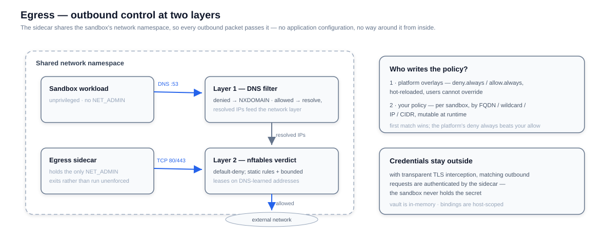

# Egress

Egress is how a sandbox gets a network policy instead of open internet access. It runs as a sidecar sharing the sandbox's network namespace, so every outbound packet passes it — no application configuration, and no way around it from inside the sandbox. Policy is declared at create time (`networkPolicy`) or by the platform, and enforced continuously.

## Capabilities at a glance

| Capability | What you get |
|---|---|
| FQDN rules | Allow or deny by domain, wildcard (`*.pypi.org`), IP, or CIDR |
| DNS filtering (default) | Denied domains fail resolution; allowed ones resolve normally |
| Network enforcement (`dns+nft`) | Strict default-deny at the packet layer, fed by DNS-resolved addresses with bounded leases |
| Platform overlays | Operator-set `deny.always` / `allow.always` floors that user policy cannot override |
| Credential Vault | Secrets stay in the sidecar; credentials are injected into matching outbound requests |
| Transparent TLS interception (L7) | See, control, and authenticate outbound HTTPS — production-usable mechanism, experimental configuration surface |
| Fail-closed startup | If enforcement cannot be installed, the sidecar exits — it never runs as a no-op |

## How interception works

**Layer 1 — DNS.** All port-53 traffic is redirected into the sidecar's DNS proxy. A denied domain answers `NXDOMAIN`; an allowed domain resolves through to the real upstream, and its resolved addresses are recorded.

**Layer 2 — Network (`dns+nft` mode).** nftables drops everything not explicitly allowed. Allowed traffic passes by static rule or by DNS-learned address sets: a resolved IP receives a bounded lease (with a grace window for active TCP connections), so "allowed" never silently becomes "allowed forever". UDP and QUIC flows rely on DNS lease timing alone.

**Precedence.** First matching rule wins, in this order: platform `deny.always`, platform `allow.always`, then your policy — so the platform's deny always beats your allow. The overlays live in files inside the sidecar image and hot-reload every minute; your policy is set per sandbox and can be mutated at runtime (add, replace, remove by target) through the API the SDKs expose.

## Design decisions

**Enforcement lives in the data path, not beside it.** The sidecar shares the sandbox's network namespace and installs redirect rules there, so every packet passes the policy engine without application cooperation — and without the option to bypass it, because the workload holds no `NET_ADMIN` in that namespace.

**Two layers, two costs.** DNS filtering alone is cheap and universal, but it only gates names: an application that obtains an address by other means is not covered. The `dns+nft` layer adds packet-level truth — default-deny with DNS-learned exceptions that carry bounded leases (renewed while a TCP connection is active), so "allowed" never quietly becomes "allowed forever".

**Encrypted DNS is treated as an escape hatch.** Filtering plaintext DNS is void if the workload can resolve over HTTPS: DoT (853) is therefore always dropped, and blocking DoH over 443 is a one-switch option.

**Fail-closed over best-effort.** If the redirect rules cannot be installed, the sidecar exits instead of running as a silent pass-through; a supervisor restarts it with backoff and a crash-loop breaker. "No enforcement" must never look like enforcement.

**Portable by fallback, honest about limits.** Redirects install through iptables where available and fall back to native nftables on kernels lacking the required extensions (Firecracker-style guest kernels). gVisor's netstack cannot support this mechanism — Kata is the supported secure runtime — and transparent service-mesh sidecars conflict by construction, since both rewrite the same namespace's outbound traffic. These boundaries are explicit, not best-effort.

## Transparent TLS interception (L7)

Layers 1 and 2 decide *whether* a connection may happen; the transparent MITM layer adds control and visibility over *what goes through it*. When enabled, outbound HTTP and HTTPS is redirected into a mitmproxy listener inside the sidecar, which recovers the true destination from connection state and terminates TLS on the sandbox's behalf.

Status: **experimental but production-usable**. The interception, credential-injection, and CA-delivery mechanism is complete and runs in production settings; what remains experimental is the configuration surface — extra ports and diagnostic switches may still change between releases.

**Trust is delivered, not disabled.** The sidecar exports its CA, and the sandbox bootstrap installs it into the system, NSS, and JDK trust stores on a best-effort basis — clients keep certificate verification on (`curl` without `-k`), and traffic stays encrypted end-to-end from the sandbox's point of view. Images that run Chromium-family browsers should ship the native `certutil` package so the per-user NSS store can be updated.

**What it enables:**

- **Credential Vault** — injection happens when request headers are read, so it applies regardless of body size, including fully streamed uploads.
- **TLS-level observability** — optional request-level outcome metrics (decrypt / passthrough) for targeted diagnostic windows.

**Extendable at L7: custom mitmproxy addons.** The interception layer is not closed. The sidecar always loads its bundled system addon first, then any additional mitmproxy addons listed — comma-separated — in `OPENSANDBOX_EGRESS_MITMPROXY_SCRIPT`, in the order given. Addons are standard mitmproxy scripts with access to the full L7 hook surface: hostname, HTTP method, URI path, headers, and bodies of every intercepted request and response. Operators can therefore build a custom egress image that adds arbitrary L7 policies on top of the built-in FQDN and credential machinery — fine-grained hostname, method, URI, or header filtering, custom header injection, request rewriting — as ordinary Python addons. The system addon keeps its position ahead of user addons, so the built-in behavior is fully in place before any custom logic runs.

**Scope notes:**

- Ports 80 and 443 are always intercepted; a bounded list of extra ports can be added. Vault binding matching currently fires on 80/443 only — extra ports are decrypted and logged but not credentialed.
- IPv6 destinations are intercepted alongside IPv4 (listeners and redirect rules cover both address families).
- A not-yet-initialized proxy is visible in health: the sidecar answers `503 mitmproxy not ready` rather than passing traffic unexamined.
- One known upstream behavior: an SSE body larger than ~1 MB can be truncated when the origin closes the connection with a TCP RST mid-body — standard TCP semantics, not an interception bug. See [Egress SSE Truncation](/guides/egress-sse-truncation).

## Credentials without secrets in the sandbox

With transparent TLS interception enabled, the sidecar can inject credentials into outbound requests that match a vault binding — bearer tokens, basic auth, API keys, or custom headers. The vault lives in the sidecar's memory only: the sandbox workload sees authenticated traffic but never holds the secret itself. See [Credential Vault](/guides/credential-vault).

## Where it runs

| Deployment | Shape |
|---|---|
| Docker | A separate sidecar container; the sandbox joins the sidecar's network namespace |
| Kubernetes | The sidecar is appended to the sandbox pod and holds the pod's only `NET_ADMIN` |
| Pooled sandboxes | Pre-warmed pods cannot gain a sidecar per request — put required controls in the Pool template (per-request `networkPolicy` + pool references are rejected) |
| Fast Sandbox | A shared egress process per Fastlet pod, one subject per sandbox — see [Fast Sandbox: Networking](/architecture/fast-sandbox/networking) |

## Service Mesh Compatibility

::: warning Not supported with transparent mesh sidecars
Egress is designed to be the only transparent outbound interception layer in the sandbox's network namespace. Deployments that inject a service-mesh sidecar (Istio/Envoy and similar) into the same pod are not currently supported for egress features.
:::

Both layers rewrite outbound traffic in the same namespace, so per-sandbox policy, transparent MITM, and Credential Vault cannot be relied on alongside mesh injection. Prefer excluding sandbox pods from mesh injection, or enforce outbound policy with a CNI-level mechanism instead. The same constraint applies to gVisor: its netstack does not implement the redirect mechanism egress requires — use a Kata runtime, which provides comparable isolation and full egress support (see the [compatibility matrix](/guides/secure-container#compatibility-matrix)).

## Shutdown

On shutdown, the sidecar keeps DNS and network rules working while in-flight deliveries finish (a bounded window), then removes its network rules and flushes telemetry. Delivery is best effort — forced termination can drop events. Under Docker, deletion gives the sidecar a 9-second stop budget before forced termination; see [Docker deletion](/architecture/control-plane/server#docker-deletion). A lightweight supervisor restarts the sidecar on crash with exponential backoff and a crash-loop breaker, and cleans stale redirect state before a fresh start.

## Observability (OpenTelemetry)

When the platform configures an OTLP endpoint, the sidecar exports per-sandbox metrics: denied request counts, DNS query outcomes (denied-by-policy and resolver-failure are deliberately separate counters — alerting on the wrong one inverts the diagnosis), nftables update failures, and process resource usage. Cardinality is bounded: no queried domain or destination ever becomes a label. See the [egress OpenTelemetry reference](https://github.com/opensandbox-group/OpenSandbox/blob/main/components/egress/docs/opentelemetry.md) and [component telemetry](/guides/component-telemetry).
