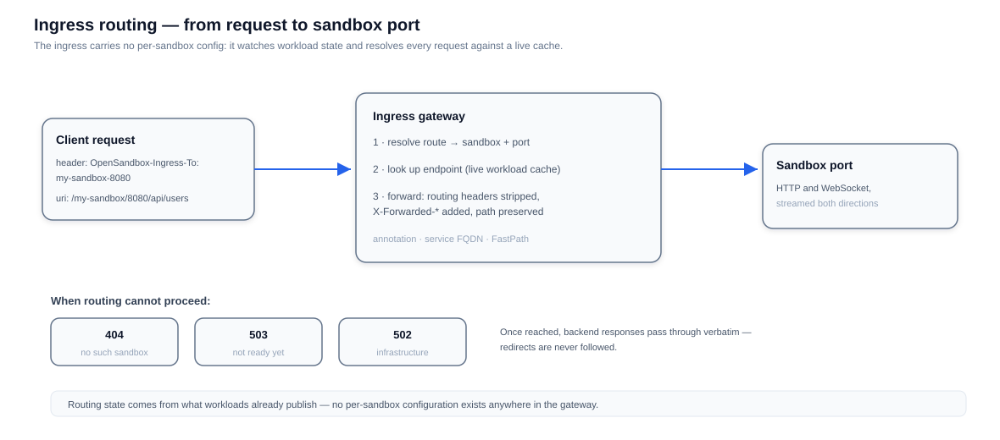
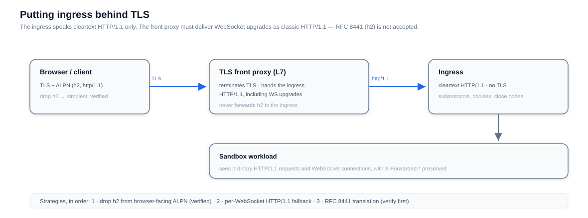

# Ingress

The ingress gateway is the front door for sandbox traffic on Kubernetes: one reverse proxy standing in front of every sandbox, with no per-sandbox configuration. It watches the state workloads already publish — endpoint annotations, service FQDNs, or the FastPath control plane — and resolves each incoming request against a live cache.



## How a request reaches a sandbox

The route to a sandbox is a pair of sandbox ID and port, discovered in one of two modes:

- **Header mode** (default): the `OpenSandbox-Ingress-To` header carries `<sandbox-id>-<port>`, or the host label encodes the same pair (`my-sandbox-8080.example.com`). The pre-rename legacy header is still accepted.
- **URI mode**: the first two path segments carry the pair — `/<sandbox-id>/<port>/<path>` — so clients that cannot set headers still work.

With [secure access](/guides/secure-access), the route can instead be a signed route token: sandbox ID, port, expiry, and MAC in one label, verifiable without a lookup.

Resolution reads the endpoint from the workload that owns the sandbox — BatchSandbox endpoint annotations, agent-sandbox service FQDNs, or FastPath for Fast Sandbox routes. Before forwarding, the ingress strips the routing headers, adds `X-Forwarded-*`, filters hop-by-hop headers, and preserves the request path and query exactly.

## Error semantics

When routing cannot proceed, the failure is precise — clients can branch on status codes:

| Status | Meaning |
|---|---|
| `404` | No such sandbox (or no longer exists) |
| `503` | Sandbox exists but is not ready — no reachable endpoint yet |
| `502` | Infrastructure-level failure (cluster API errors and the like) |

Once a sandbox is reached, its responses pass through **verbatim**, including redirects and errors. The ingress never follows a redirect itself, so a stale `Location` can never leak credentials to an unrelated endpoint.

## WebSocket support

WebSocket is a first-class path, not an upgrade hack bolted onto HTTP proxying:

- Upgrades follow RFC 6455 over HTTP/1.1, with a 45-second backend handshake budget.
- Client-selected subprotocols and backend `Set-Cookie` headers cross the handshake.
- Application close codes are propagated as-is — a policy violation (`1008`) or app code (`4001+`) is never rewritten to `1000`.
- Single messages up to 64 MiB work in either direction, sized for terminal and Jupyter traffic.
- `Connection` header tokens are matched case-insensitively, and both directions stream without buffering the peer.

## Fronting ingress with TLS

The ingress speaks cleartext HTTP/1.1 and never terminates TLS. Put an L7 proxy in front of it — but mind the WebSocket constraint:



WebSocket-over-HTTP/2 (RFC 8441) is **not** accepted, and RFC 7540 forbids the `Upgrade` headers on plain h2 requests. The front proxy must therefore deliver WebSocket upgrades as classic HTTP/1.1. In order of preference:

1. Remove `h2` from the browser-facing ALPN list — portable, verified fallback.
2. Per-WebSocket HTTP/1.1 fallback, if the proxy supports it while keeping h2 for other traffic.
3. RFC 8441 → RFC 6455 translation — proxy-specific; verify with a real browser before trusting it.

Never forward HTTP/2 to the ingress itself: the upgrade never reaches the WebSocket handler and the plain proxy path cannot complete the handshake either.

## Health and network readiness

- `/status.ok` — liveness: the process is up and serving.
- `/status.ok/network-readiness` — a **shadow** signal, for operators watching node-to-sandbox network health. It classifies the TCP connections the ingress opens (success, timeout, unreachable, refused, …) over a recent window and reports `DEGRADED` when timeouts and unreachables dominate across enough distinct targets.

The shadow endpoint always answers `200` with `OK` or `DEGRADED` and never gates traffic — it is a decision input for operators, not a load-balancer hook. Window length and thresholds are tunable; targets and sandbox IDs are deliberately absent from its metrics.

## Extending sandbox expiration on access

When enabled, the ingress publishes a **renew-intent** event for each proxied request (after the sandbox resolves), and the lifecycle server extends the expiration of sandboxes that opted in at creation. Publishing is throttled per sandbox and delivery is best-effort — an idle sandbox still expires; a busy one stays alive without client changes.

### Per-request opt-out

A single request can opt out of renew-intent publishing with a control header:

```text
OpenSandbox-Access-Renew: skip
```

- Honored by both proxy paths — the ingress gateway and the server's `/sandboxes/{id}/proxy/{port}/...` route — so behavior does not depend on which path serves the traffic.
- The exact sentinel value `skip` suppresses the intent for that one request (it bypasses the per-sandbox throttle entirely); unknown values are ignored for forward compatibility.
- The header is stripped before forwarding upstream, like `OpenSandbox-Ingress-To`, so backend applications never observe it.
- Typical use: health probes and other background traffic hitting an opted-in sandbox without extending its lifetime.

WebSocket upgrades carry the header on the handshake request; long-lived connections do not produce per-request intents anyway.

## Fast Sandbox routes

The `FastSandboxProvider` serves authenticated `f1.` route scopes by resolving endpoints through FastPath v2 and forwarding traffic to Fastlet pods. It can run standalone or share one ingress process with the legacy Kubernetes providers; route-scope verification uses the same signing key ring as the server. See [Fast Sandbox: Networking](/architecture/fast-sandbox/networking).
