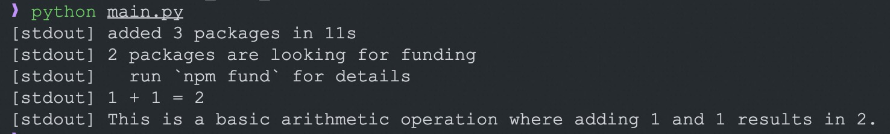

# Claude Code Example

Access Claude via the `claude-cli` npm package in OpenSandbox.

## Start OpenSandbox server [local]

Pre-pull the code-interpreter image (includes Node.js):

```shell
docker pull sandbox-registry.cn-zhangjiakou.cr.aliyuncs.com/opensandbox/code-interpreter:v1.1.0

# use docker hub
# docker pull opensandbox/code-interpreter:v1.1.0
```

Then start the local OpenSandbox server, stdout logs will be visible in the terminal:

```shell
uv pip install opensandbox-server
opensandbox-server init-config ~/.sandbox.toml --example docker
opensandbox-server
```

## Create and Access the Claude Sandbox

```shell
# Install OpenSandbox package
uv pip install opensandbox

# Run the example (requires SANDBOX_DOMAIN / SANDBOX_API_KEY / ANTHROPIC_AUTH_TOKEN)
uv run python examples/claude-code/main.py
```

The script installs the Claude CLI (`npm i -g @anthropic-ai/claude-code@latest`) at runtime (Node.js is already in the code-interpreter image), then sends a simple request `claude "Compute 1+1=?."`. Auth is passed via `ANTHROPIC_AUTH_TOKEN`, and you can override endpoint/model with `ANTHROPIC_BASE_URL` / `ANTHROPIC_MODEL`.



## Headless Mode and Session Resume

The example script also runs the two patterns used by coding-agent integrations: a headless run with structured output, and a follow-up turn that resumes the same conversation.

### Turn 1: headless run with structured output

```shell
claude -p "Remember this for later: my favorite sandbox number is 42." --output-format json
```

With `-p` (print mode) the CLI answers the prompt and exits. `--output-format json` prints the reply, `session_id`, usage, and cost metadata as a single JSON object, so the script extracts `session_id` for the next turn.

### Turn 2: resume the session

```shell
claude -p "What is my favorite sandbox number? Reply with just the number." \
  --resume <session_id> --output-format json
```

`--resume` continues a specific conversation with its context intact — the reply recalls "42" from turn 1. `--continue` resumes the most recent conversation instead; an explicit `--resume <session_id>` stays deterministic when several conversations live in the same sandbox.

::: tip Concurrent follow-ups
Add `--fork-session` to `--resume` / `--continue` to create a new session ID instead of reusing the original, so parallel follow-ups on the same conversation don't overwrite each other.
:::

### Permission prompts in unattended runs

There is no terminal to answer permission prompts in a `-p` run: requests that would prompt are denied, so a task that needs a tool (file edits, shell commands) can fail. Two common remedies for agent workloads:

- `--dangerously-skip-permissions` (equivalent to `--permission-mode bypassPermissions`) runs tools without prompts — a common choice inside an ephemeral OpenSandbox container, where the sandbox itself is the isolation boundary.
- `--permission-mode dontAsk` stays fail-closed: only tools pre-approved by your permission rules run — the standard pattern for locked-down CI. (`--permission-prompts none`, Claude Code v2.1.259+, is the print-mode equivalent.)

::: warning The interactive UI needs a TTY
The interactive REPL (`claude "..."`) renders its UI, including permission prompts, on a terminal. Through a plain command pipe there is no way to answer a prompt, so the run can wait indefinitely. Use `-p` for scripted runs, or drive the interactive UI over a [PTY session](/components/execd).
:::

To receive output as it is generated (token-level events) instead of a single final JSON object, use `--output-format stream-json --verbose --include-partial-messages`.

## Environment Variables

| Variable | Default | Description |
|----------|---------|-------------|
| `SANDBOX_DOMAIN` | `localhost:8080` | Sandbox service address |
| `SANDBOX_API_KEY` | _(optional for local)_ | API key if your server requires authentication |
| `SANDBOX_IMAGE` | `sandbox-registry.cn-zhangjiakou.cr.aliyuncs.com/opensandbox/code-interpreter:v1.1.0` | Sandbox image to use |
| `ANTHROPIC_AUTH_TOKEN` | _(required)_ | Your Anthropic auth token |
| `ANTHROPIC_BASE_URL` | _(optional)_ | Anthropic API endpoint (e.g., self-hosted proxy) |
| `ANTHROPIC_MODEL` | `claude_sonnet4` | Model name |

## References

- [claude-code](https://www.npmjs.com/package/claude-code) - NPM package for Claude Code CLI
- [Claude Code headless mode](https://code.claude.com/docs/en/headless) - Print mode, output formats, and session resume
- [Source code on GitHub](https://github.com/opensandbox-group/OpenSandbox/tree/main/examples/claude-code)
