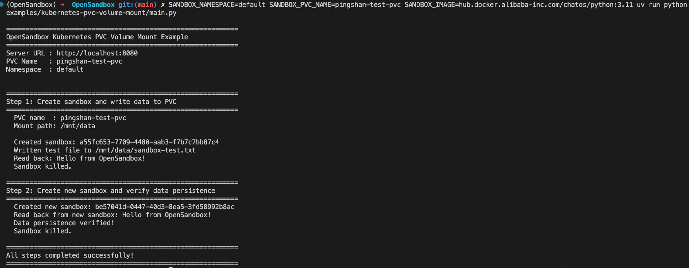

# Kubernetes PVC Volume Mount Example

This example demonstrates how to mount Kubernetes PersistentVolumeClaims (PVC) into OpenSandbox containers for persistent storage. Data written to a PVC persists across sandbox lifecycles -- when a sandbox is killed and a new one is created with the same PVC, previously written data is still available.

## Prerequisites

### 1. CSI Driver

Kubernetes PVC requires a [Container Storage Interface (CSI)](https://kubernetes-csi.github.io/docs/drivers.html) driver to provision and manage storage. Install the CSI driver that matches your storage backend. Refer to your storage vendor's documentation for installation instructions.

For example, [Alibaba Cloud CSI Driver](https://github.com/kubernetes-sigs/alibaba-cloud-csi-driver) supports the following storage types:

- **Cloud Disk (EBS)** -- block storage, suitable for high-performance single-node read-write scenarios
- **NAS** -- shared file storage, supports multi-node read-write (ReadWriteMany)
- **OSS** -- object storage, suitable for large-scale data read and shared access scenarios
- **CPFS** -- high-performance parallel file system
- **LVM** -- local volume management

### 2. Create a PersistentVolumeClaim

Create a PVC in the namespace where OpenSandbox runs:

```yaml
# pvc.yaml
apiVersion: v1
kind: PersistentVolumeClaim
metadata:
  name: my-pvc
  namespace: opensandbox
spec:
  accessModes:
    - ReadWriteOnce
  storageClassName: <your-storage-class>
  resources:
    requests:
      storage: 10Gi
```

```shell
kubectl apply -f pvc.yaml
```

Verify the PVC is bound:

```shell
kubectl get pvc my-pvc -n opensandbox
```

### 3. OpenSandbox Server

Ensure the OpenSandbox server is running with Kubernetes runtime and BatchSandbox workload provider.

### 4. Python SDK

```shell
uv pip install opensandbox
```

## Run the Example

```shell
export OPEN_SANDBOX_API_KEY=your-api-key
export OPEN_SANDBOX_BASE_URL=http://localhost:8080
export SANDBOX_PVC_NAME=my-pvc

python examples/kubernetes-pvc-volume-mount/main.py
```



## What the Example Does

1. Creates a sandbox with a PVC mounted at `/mnt/data`
2. Writes a test file to the PVC
3. Reads the file back to verify
4. Kills the sandbox
5. Creates a new sandbox with the same PVC
6. Reads the file again to verify data persistence across sandbox lifecycles

## Usage

```python
from opensandbox import Sandbox
from opensandbox.models.sandboxes import PVC, Volume

sandbox = await Sandbox.create(
    image="python:3.11",
    volumes=[
        Volume(
            name="data-volume",
            pvc=PVC(claimName="my-pvc"),
            mountPath="/mnt/data",
            readOnly=False,
        ),
    ],
)

# Run commands against the mounted volume
result = await sandbox.commands.run("ls -la /mnt/data")
output = "\n".join(msg.text for msg in result.logs.stdout)
print(output)
```

## Important Notes

::: warning
- **Pool mode does not support volumes.** Use template mode instead.
- Pre-existing PVCs (like the one in this example) are never deleted on sandbox termination.
- Set `createIfNotExists=true` on the volume to have the server provision the PVC on demand; see [PVC lifecycle](#pvc-lifecycle) below for cleanup semantics.
- Multiple sandboxes can mount the same PVC if the access mode allows (e.g. `ReadWriteMany`).
:::

## PVC lifecycle

The lifecycle of a PVC depends on whether the server provisioned it:

| Source | Cleanup |
|--------|---------|
| Pre-existing PVC (this example) | Never touched by the server. |
| Auto-created with `createIfNotExists=true`, `deleteOnSandboxTermination=false` (default) | Persists after sandbox deletion; caller owns cleanup. |
| Auto-created with `createIfNotExists=true`, `deleteOnSandboxTermination=true` | Server cleans up the PVC when the sandbox terminates. |

For opted-in auto-created PVCs, the server stamps them with `opensandbox.io/volume-managed-by=server` and `opensandbox.io/id=<sandbox-id>` labels, and runs cleanup through two layered paths:

1. **`ownerReferences`** — the PVC is patched to point at the workload custom resource right after creation. Kubernetes garbage collection then cascade-deletes the PVC whenever the CR is removed, including controller-driven TTL expiry that never reaches the `DELETE /sandboxes/{id}` API.
2. **Label-selector sweep** — on `DELETE /sandboxes/{id}`, the server lists PVCs by the labels above and deletes them best-effort. This handles cases where the `ownerReferences` patch failed (e.g. RBAC) and ensures PVCs are gone as soon as the API returns.

Both paths only match server-labeled PVCs, so pre-existing or opted-out PVCs are never reclaimed. The PV itself follows its `StorageClass.reclaimPolicy` once the PVC is deleted.

Cleanup requires `delete` and `list` verbs on `persistentvolumeclaims` in the server's Role; the stock Helm chart grants these by default.

## References

- [OSEP-0003: Volume and VolumeBinding Support](https://github.com/opensandbox-group/OpenSandbox/blob/main/oseps/0003-volume-and-volumebinding-support.md)
- [Kubernetes CSI Drivers](https://kubernetes-csi.github.io/docs/drivers.html)
- [Alibaba Cloud CSI Driver](https://github.com/kubernetes-sigs/alibaba-cloud-csi-driver)
- [Source code on GitHub](https://github.com/opensandbox-group/OpenSandbox/tree/main/examples/kubernetes-pvc-volume-mount)
