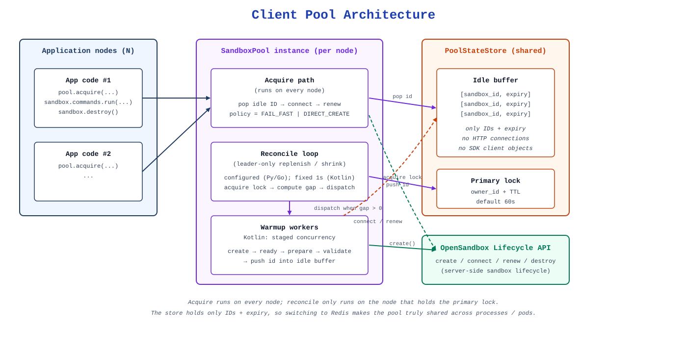
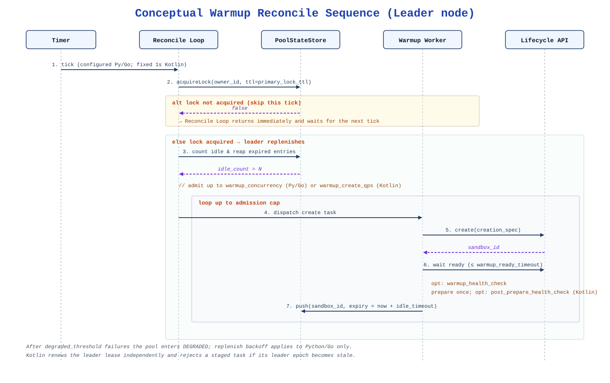
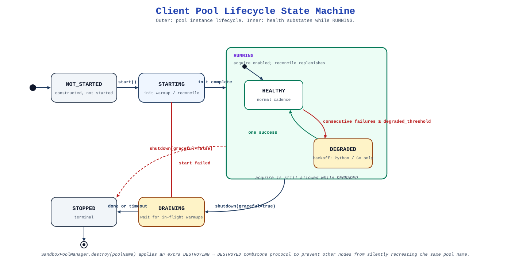
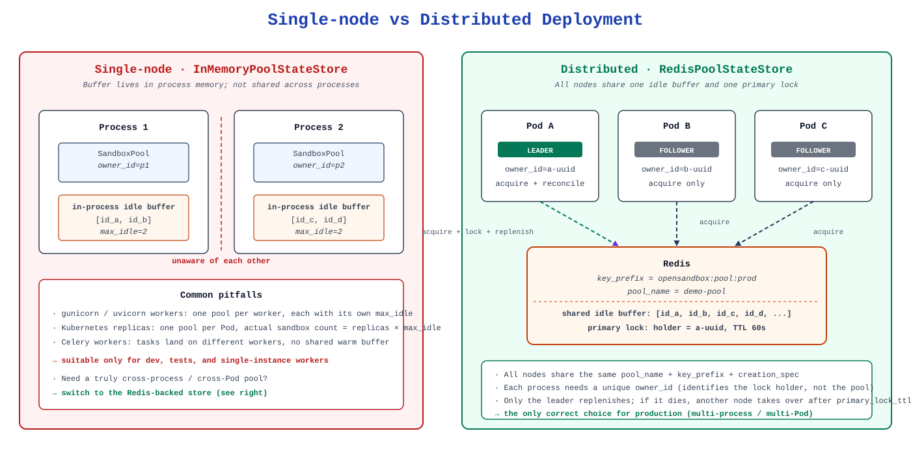

# Client Pool

The OpenSandbox SDKs ship an experimental **client-side sandbox pool** that keeps a small
buffer of ready sandboxes warm on the server so that `acquire()` returns quickly instead
of paying the full sandbox creation latency on the hot path.

Available in Python (async and sync), JavaScript/TypeScript, Kotlin/Java, and Go.
C# does not currently ship a client pool.

::: warning Experimental
The client pool API is marked experimental and may change between minor releases. Pin
your SDK version if you rely on it in production.
:::

## What it actually pools

The pool does **not** pool SDK `Sandbox` objects. It pools the **IDs of
pre-warmed, ready sandboxes** running on the OpenSandbox server.

Use a pool for latency-sensitive workers that repeatedly need a fresh sandbox.
The pool keeps remote sandboxes ready; it is separate from an HTTP connection pool.
Borrowed sandboxes still consume server resources and must be explicitly cleaned up.



Two flows happen concurrently:

- **Warmup (leader-only).** A background reconcile loop runs on every node. Whichever
  node holds the primary lock computes the idle deficit and replenishes it. Python,
  JavaScript, and Kotlin use a nominal one-second cadence and admit at most
  `warmup_create_qps` new creates per completed tick. Kotlin schedules at a fixed rate;
  JavaScript skips a tick if the previous reconcile is still running; Python waits one
  second after the previous tick completes. Go uses a configurable
  `reconcile_interval` and caps each tick with `warmup_concurrency`. A successful
  warmup is published independently to the idle buffer with a TTL of `idle_timeout`.
- **Acquire (any node).** `acquire()` pops an idle ID from the store, connects a
  `Sandbox` client to it, optionally runs a health check and a `renew()` to the
  caller-supplied timeout, and hands it to the caller. Non-leader nodes can acquire
  freely; only replenish and shrink are gated by the leader lock.

Idle membership carries sandbox IDs and their expiry, never HTTP connections or
client-side `Sandbox` objects. The state store also coordinates the leader lease,
shared idle target and TTL, and namespace-destroy fence. A Redis-backed store makes
that coordination and idle membership visible across processes and pods.

The warmup path — the leader-only replenish flow above — is worth zooming in on
because it is the only part of the pool that is gated by a distributed lock:



### Lifecycle model

During graceful operation, each pool instance moves through
`NOT_STARTED → STARTING → RUNNING → DRAINING → STOPPED`. A failed start or
non-graceful shutdown can transition directly to `STOPPED`.
Health is tracked separately as `HEALTHY | DEGRADED | DRAINING | STOPPED`; after
`degraded_threshold` consecutive warmup or reconcile failures the pool enters
`DEGRADED`. Go applies exponential replenish backoff while degraded. Python,
JavaScript, and Kotlin continue attempting reconciliation at their nominal one-second
cadence: `warmup_create_qps` is their pressure control, and
`snapshot().backoff_active` / `snapshot().backoffActive` is retained only for
compatibility and is always `false`.
Callers do not need to observe these states directly — `snapshot()` exposes them for
diagnostics.

Python, JavaScript, and Kotlin built-in warmup creates make a single lifecycle
request. Python and Kotlin disable the connection-level retry policy for HTTP 429,
other retryable statuses, and transport recovery; JavaScript's lifecycle transport
does not add automatic retries. There is no pool-level `Retry-After` throttle. A
custom `PooledSandboxCreator` receives the warmup connection configuration through
`PooledSandboxCreateContext.connection_config` or `createConnectionConfig` and must
honor it, together with `skipHealthCheck`, to preserve the staged behavior. A failed
create is recorded and a later tick may admit replacement work. Normal standalone
creation and `AcquirePolicy.DIRECT_CREATE` retain their usual transport behavior.



### There is no `release()`

Sandboxes are ephemeral. Once you have called `acquire()`, the sandbox is yours until you
`destroy()` / `kill()` it. `max_idle` bounds the **warm buffer**, not the number of
sandboxes borrowed by application code and not the number of sandboxes produced by
`DIRECT_CREATE` fallback.

## Empty-buffer behavior: `AcquirePolicy`

All four pool SDKs expose these policies. Acquire consumes a candidate; it does not
wait for future warmup work to fill an empty buffer.

| Policy | Idle candidates attempted | When candidates are exhausted |
| --- | --- | --- |
| `FAIL_FAST` | At most one | Return a pool-empty/acquire error |
| `DIRECT_CREATE` (default) | At most one | Create a fresh sandbox |
| `RETRY_NEXT_IDLE` | Up to `max_acquire_retries` | Return a pool-empty/acquire error |
| `RETRY_NEXT_IDLE_THEN_CREATE` | Up to `max_acquire_retries` | Create a fresh sandbox |

`max_acquire_retries` / `maxAcquireRetries` / `MaxAcquireRetries` defaults to `3`.
It bounds the **total candidate attempts**, not three additional retries after the
first. Each candidate can consume the acquire-readiness budget; direct creation
adds its own startup latency.

`start()` begins background replenishment and does not wait for a full buffer.
Use `DIRECT_CREATE` during startup, or observe the idle count before using
`FAIL_FAST`. A pool is not a concurrency limit: direct creation and already
borrowed sandboxes can exceed `max_idle`.

## Configuration

The SDKs share the pool concepts, but their scheduling surfaces differ. This table
is the canonical reference; refer to the per-language builder or constructor for exact
camelCase / snake_case naming.

| Parameter | Python / JavaScript / Kotlin default | Go default | Meaning |
| --- | --- | --- | --- |
| `pool_name` | required | required | Logical namespace shared by all nodes of one distributed pool |
| `owner_id` | auto (`pool-owner-<uuid>`) | auto (`pool-owner-<host/pid>`) | Identity of this process for primary-lock ownership; **must be unique per node** |
| `max_idle` | required (≥ 0) | required (≥ 0) | Target size and cap of the idle buffer |
| `state_store` | required in Python/Kotlin; JavaScript defaults to in-memory | builder defaults to in-memory | `InMemoryPoolStateStore` or Redis-backed store |
| `connection_config` | required | required | Used for lifecycle and execd calls |
| `creation_spec` | required in Python/Kotlin; required in JavaScript only without a creator | required only when `sandbox_creator` is unset | Template for warmed sandboxes; exact fields vary by language |
| `sandbox_creator` | `null` | `null` | Optional callback that overrides default creation. Python and Kotlin still require `creation_spec`; JavaScript and Go allow a creator-only pool. |
| `warmup_create_qps` | `10` | not available | Maximum warmup creates admitted on each completed reconcile tick |
| `warmup_concurrency` | `128` | `max(1, ceil(max_idle * 0.2))` | Python / JavaScript / Kotlin: concurrent post-create work; it does not control create admission. Go: create cap per tick and worker concurrency. |
| `primary_lock_ttl` | `60 s` | `60 s` | Leader lease TTL |
| `reconcile_interval` | nominal `1 s`, not exposed | `30 s`, configurable | Reconcile cadence; long Python/JavaScript ticks reduce the effective rate |
| `degraded_threshold` | `3` | `3` | Consecutive failures before `DEGRADED`; only Go pauses replenish with backoff |
| `acquire_ready_timeout` | `30 s` | `30 s` | Max wait for the returned sandbox to become ready |
| `acquire_health_check_polling_interval` | `200 ms` | `200 ms` | Ready-poll interval during acquire |
| `acquire_health_check` | `null` | `null` | Custom readiness predicate for acquire |
| `acquire_skip_health_check` | `false`; JavaScript also has a per-acquire override | per-acquire option | Skip the readiness check on acquire |
| `acquire_min_remaining_ttl` | `min(60 s, idle_timeout / 2)` | `min(60 s, idle_timeout / 2)` | Discard idles closer to expiry than this on acquire |
| `warmup_ready_timeout` | `30 s` | `30 s` | Max readiness-check window for a warmed sandbox |
| `warmup_health_check_initial_delay` | `0 s` | not available | Delay between successful create and the first readiness check |
| `warmup_health_check_polling_interval` | `500 ms` | `200 ms` | Ready-poll interval during warmup; Python / JavaScript / Kotlin also use it for post-prepare checks |
| `warmup_health_check` | `null` | `null` | Custom warmup readiness predicate |
| `warmup_sandbox_preparer` | `null` | `null` | Runs once after readiness and before publishing to the idle buffer |
| `warmup_post_prepare_health_check` | `null` | not available | Optional validation after the preparer; retries do not rerun the preparer |
| `warmup_post_prepare_health_check_timeout` | `30 s` | not available | Retry window for post-prepare validation |
| `warmup_skip_health_check` | `false` | `false` | Skip the pre-prepare readiness stage during warmup |
| `idle_timeout` | `24 h` | `24 h` | Server-side TTL for pool-created sandboxes |
| `drain_timeout` | `30 s` | `30 s` | Max wait for in-flight ops during graceful shutdown |

### JavaScript settings and creator coverage

JavaScript uses the Python/JVM scheduling defaults above: `warmupCreateQps: 10`,
`warmupConcurrency: 128`, a nominal one-second reconcile cadence, 500 ms warmup
polling, and 30-second readiness windows. Its store defaults to
`InMemoryPoolStateStore`;
`creationSpec` can be omitted when `sandboxCreator` is supplied. Time settings
include units in their names, such as `idleTimeoutSeconds` and
`warmupHealthCheckInitialDelayMillis`.

Default pool creators expose fewer options than standalone sandbox creation:

| Creation field | Python | JavaScript | Kotlin/Java | Go |
| --- | --- | --- | --- | --- |
| Snapshot restore | No | Yes | No | Yes |
| Resource configuration | Yes | Yes | Yes | Yes |
| Lifecycle hooks | No | Yes | No | No |
| Credential Proxy | No | Yes | Yes | Yes |

All four standalone sandbox creation APIs accept these fields. Use a custom
`sandbox_creator` / `sandboxCreator` when the default pool spec is insufficient,
and honor the supplied connection config, readiness controls, and timeout.

JavaScript and Go also accept minimum remaining TTL and skip-health-check overrides
on each acquire. Python and Kotlin expose these as pool-level configuration.

### Staged warmup

Staged warmup separates creation admission from post-create work:


1. On each reconcile tick, the leader admits at most
   `min(max_idle - idle - warming, warmup_create_qps)` creates. The lifecycle create
   request is attempted once and returns a client without running its normal inline
   readiness loop. The create execution limit is internal and resolves to
   `ceil(warmup_create_qps * 1.5)`, so slow creates cannot grow active create work
   without bound. A custom creator must honor the supplied warmup connection config
   and `skipHealthCheck` from its `PooledSandboxCreateContext`.
2. The created sandbox enters a delayed stage queue. The first readiness check runs
   after `warmup_health_check_initial_delay`; failures retry every
   `warmup_health_check_polling_interval` until `warmup_ready_timeout`, including one
   final check at the deadline.
3. `warmup_sandbox_preparer` runs once. If configured,
   `warmup_post_prepare_health_check` then retries at the same polling interval until
   `warmup_post_prepare_health_check_timeout`; retries never rerun the preparer.
4. A healthy sandbox is renewed and committed to the idle buffer.
   `warmup_concurrency` bounds active post-create work. Delays between unsuccessful
   readiness polls do not permanently occupy the entire capacity.

There is no Python, JavaScript, or Kotlin `reconcile_interval` setting and no
replenish backoff. For Python/Kotlin configurations that used the older setting,
remove `reconcile_interval=...` / `reconcileInterval(...)`, choose
`warmup_create_qps` / `warmupCreateQps(...)` for create admission, and use
`warmup_concurrency` / `warmupConcurrency(...)` only for post-create capacity.

`warmup_create_qps` is an admission ceiling, not a completion-rate guarantee. Create
latency, readiness, preparation, state-store latency, event-loop or executor capacity,
and a delayed/skipped reconcile tick can all reduce observed warmup throughput.

### Choosing a state store

- **`InMemoryPoolStateStore`** — single process only. Suitable for development, tests,
  and single-instance workers. Not process-wide for gunicorn/uvicorn workers, Celery, or
  Kubernetes replicas.
- **Redis-backed store** (`RedisPoolStateStore`, `AsyncRedisPoolStateStore`,
  `sandbox-pool-redis` on the JVM, `poolredis` in Go,
  `@alibaba-group/opensandbox/pool-redis` in JavaScript) — required for multi-process or
  multi-pod deployments. All nodes in one logical pool must share the same `pool_name`
  and Redis `key_prefix`, and each process must use a **unique** `owner_id`.



### Rules that apply to every deployment

- `max_idle` bounds the warm buffer only. It does not cap borrowed sandboxes or
  `DIRECT_CREATE` fallbacks.
- All nodes sharing one pool must use the same creation and warmup definition. If that
  definition changes, roll out under a **new** `pool_name` (or Redis `key_prefix`) and
  retire the old one (see "Retiring an old pool namespace" below). Do not attempt to
  refill a changed template into the same `pool_name`: `release_all_idle()` does not
  fence other nodes, does not lower `max_idle`, and does not stop any current leader
  (which may still be running the old code) from immediately re-publishing
  old-template sandbox IDs into the shared buffer during a rolling deploy.
- `resize(max_idle)` and `release_all_idle()` can be called from any node.
- Configure `primary_lock_ttl` above `warmup_ready_timeout` plus expected preparer time
  and operational headroom. The SDKs renew leadership independently and fence every
  commit, but a lost lease causes in-flight warmups to be discarded instead of
  published.

## Minimal usage

### Python (sync)

```python
from datetime import timedelta

from opensandbox import (
    AcquirePolicy,
    InMemoryPoolStateStore,
    PoolCreationSpec,
    SandboxPoolSync,
)
from opensandbox.config import ConnectionConfigSync

pool = SandboxPoolSync(
    pool_name="demo-pool",
    owner_id="worker-1",
    max_idle=2,
    state_store=InMemoryPoolStateStore(),
    connection_config=ConnectionConfigSync(domain="api.opensandbox.io"),
    creation_spec=PoolCreationSpec(image="ubuntu:22.04"),
    warmup_create_qps=10,
    warmup_concurrency=128,
)

pool.start()
try:
    sandbox = pool.acquire(
        sandbox_timeout=timedelta(minutes=30),
        policy=AcquirePolicy.DIRECT_CREATE,
    )
    try:
        result = sandbox.commands.run("echo pool-ok")
        print(result.logs.stdout[0].text)
    finally:
        sandbox.destroy()
finally:
    pool.shutdown(graceful=True)
```

### Python (asyncio)

`SandboxPoolAsync` has the same surface plus an `async with` context manager:

```python
from datetime import timedelta

from opensandbox import (
    AcquirePolicy,
    InMemoryAsyncPoolStateStore,
    PoolCreationSpec,
    SandboxPoolAsync,
)
from opensandbox.config import ConnectionConfig

async with SandboxPoolAsync(
    pool_name="demo-pool",
    owner_id="worker-1",
    max_idle=2,
    state_store=InMemoryAsyncPoolStateStore(),
    connection_config=ConnectionConfig(domain="api.opensandbox.io"),
    creation_spec=PoolCreationSpec(image="ubuntu:22.04"),
) as pool:
    sandbox = await pool.acquire(
        sandbox_timeout=timedelta(minutes=30),
        policy=AcquirePolicy.DIRECT_CREATE,
    )
    try:
        result = await sandbox.commands.run("echo pool-ok")
    finally:
        await sandbox.destroy()
```

### Kotlin / Java

```java
SandboxPool pool = SandboxPool.builder()
    .poolName("demo-pool")
    .ownerId("worker-1")
    .maxIdle(3)
    .stateStore(new InMemoryPoolStateStore())
    .connectionConfig(config)
    .creationSpec(PoolCreationSpec.builder()
        .image("ubuntu:22.04")
        .entrypoint(List.of("tail", "-f", "/dev/null"))
        .build())
    .warmupReadyTimeout(Duration.ofSeconds(45))
    .build();

pool.start();
try {
    Sandbox sb = pool.acquire(Duration.ofMinutes(10), AcquirePolicy.DIRECT_CREATE);
    try {
        sb.commands().run("echo pool-ok");
    } finally {
        try {
            sb.kill();
        } finally {
            sb.close();
        }
    }
} finally {
    pool.shutdown(true);
}
```

### Go

Inside a function returning `error`, with `ctx` and the usual `context`, `fmt`,
`time`, and `opensandbox` imports:

```go
pool, err := opensandbox.NewSandboxPoolBuilder().
    PoolName("demo-pool").
    OwnerID("worker-1").
    MaxIdle(3).
    ConnectionConfig(opensandbox.ConnectionConfig{Domain: "api.opensandbox.io"}).
    CreationSpec(opensandbox.PoolCreationSpec{Image: "ubuntu:22.04"}).
    StateStore(opensandbox.NewInMemoryPoolStateStore()).
    Build()
if err != nil {
    return err
}
if err := pool.Start(ctx); err != nil {
    return err
}
defer pool.Shutdown(context.Background(), true)

policy := opensandbox.AcquirePolicyDirectCreate
sb, err := pool.Acquire(ctx, opensandbox.AcquireOptions{
    SandboxTimeout: 10 * time.Minute,
    Policy:         &policy,
})
if err != nil {
    return err
}
defer sb.Close()
defer sb.Kill(context.Background())

result, err := sb.RunCommand(ctx, "echo pool-ok", nil)
if err != nil {
    return err
}
fmt.Println(result.Logs.Stdout)
return nil
```

### JavaScript / TypeScript

```ts
import { AcquirePolicy, SandboxPool } from "@alibaba-group/opensandbox";

const pool = SandboxPool.create({
  poolName: "demo-pool",
  maxIdle: 2,
  connectionConfig: { domain: "localhost:8080", useServerProxy: true },
  creationSpec: { image: "python:3.12" },
  warmupCreateQps: 10,
  warmupConcurrency: 128,
});

await pool.start();
try {
  const sandbox = await pool.acquire({
    sandboxTimeoutSeconds: 600,
    policy: AcquirePolicy.DIRECT_CREATE,
  });
  try {
    const result = await sandbox.commands.run("echo pool-ok");
    console.log(result.logs.stdout);
  } finally {
    try {
      await sandbox.kill();
    } finally {
      await sandbox.close();
    }
  }
} finally {
  await pool.shutdown(true);
}
```

To share state across processes, install `redis`, connect it in the application,
and pass this store as `stateStore`:

```ts
import { createClient } from "redis";
import { RedisPoolStateStore } from "@alibaba-group/opensandbox/pool-redis";

const redis = createClient({ url: process.env.REDIS_URL });
await redis.connect();
const stateStore = new RedisPoolStateStore({
  client: redis,
  keyPrefix: "opensandbox:pool:prod",
});
// Pass stateStore to SandboxPool.create(...).
// After all pools/managers using it are shut down:
// await redis.quit();
```

The caller owns the Redis connection. Custom JavaScript preparers and health
checks must bound their own work: cancellation can stop waiting for a callback
without stopping the callback itself.

## Diagnostics and operations

Each pool SDK exposes these operations (names follow language conventions):

- `snapshot()` — pool phase, health, counters (idle size, in-flight warmups,
  consecutive failures, last error).
- `snapshot_idle_entries()` — the current idle sandbox IDs with expiry timestamps.
- `resize(max_idle)` — change the target buffer size at runtime.
- `release_all_idle()` — drain the currently visible idle buffer and best-effort kill
  each entry, without stopping the pool. Useful to force a fresh set of warmups after a
  transient upstream problem. It does **not** change `max_idle`, does **not** fence
  other nodes, and does **not** stop an active leader from immediately replenishing —
  so it is not a safe way to swap creation templates on the same `pool_name`. For that
  case, retire the whole namespace under a new `pool_name` (see below).

The existing cleanup methods retain their original execution behavior. For opt-in
bounded parallel cleanup, use Python's
`release_all_idle_parallel(max_workers=50)`, Kotlin's
`releaseAllIdle(concurrency)`, JavaScript's `releaseAllIdle(concurrency)`, or Go's concrete
`(*DefaultSandboxPool).ReleaseAllIdleParallel(ctx, maxWorkers)`. These methods
validate a positive concurrency value and wait for every drained ID to receive a
best-effort kill attempt. The Go method is intentionally outside the
`SandboxPool` interface to preserve compatibility with third-party implementors.

### Tracing warmups

Python, JavaScript, and Kotlin/Java emit opt-in OpenTelemetry warmup spans. Set
`enable_tracing=True` in Python or `enableTracing: true` / `.enableTracing(true)`
in JavaScript/JVM connection configuration. The application supplies its
OpenTelemetry provider and exporter. See [SDK Tracing](/sdks/observability#pool-warmup-tracing)
for phase names and language-specific attributes.

Pool `shutdown` stops that local pool instance; it does not terminate sandboxes
already handed to callers. To retire a shared namespace, use the manager below.

### Retiring an old pool namespace

Each supported pool SDK exposes a `SandboxPoolManager` with a `destroy` operation that applies the
same `DESTROYING → DESTROYED` protocol:

1. Write a `DESTROYING` fence into the state store, so any still-running peer instance
   sees it and stops replenishing instead of racing the retirement.
2. Best-effort drain and kill every idle sandbox, bounded by the drain timeout.
3. Clear the persistent per-pool state.
4. Write a `DESTROYED` tombstone with the tombstone TTL (default 7 days) so future
   callers cannot silently rebind to the same `pool_name`.

Destroy is idempotent: calling it on an already-tombstoned namespace reports
`DESTROYED` without draining or killing anything. If the drain or the cleanup cannot
finish, the namespace stays `DESTROYING` and the call reports the destroy as
incomplete; retrying is safe and picks up where it left off.

**Python / Kotlin** — `SandboxPoolManager.destroy(poolName, options)`, configured
through `PoolDestroyOptions` (`strategy`, `drain_timeout`, `tombstone_ttl`).

**JavaScript** — `SandboxPoolManager.create({ stateStore, connectionConfig })`,
then `await manager.destroy(poolName, options)`.

**Go** — `(*SandboxPoolManager).Destroy(ctx, poolName, options)`:

```go
manager, err := opensandbox.NewSandboxPoolManagerBuilder().
    StateStore(store).
    ConnectionConfig(connCfg).
    Build()
if err != nil {
    return err
}

result, err := manager.Destroy(ctx, "orders-v2", opensandbox.PoolDestroyOptions{})
if err != nil {
    return err
}
log.Printf("retired %s: drained=%d killed=%d",
    result.PoolName, result.DrainedIdleCount, result.KilledIdleCount)
```

`PoolDestroyOptions` mirrors the other SDKs. `Strategy` selects the algorithm and only
`PoolDestroyForce` is implemented. `DrainTimeout` and `TombstoneTTL` are `*time.Duration`:
leave them nil for the defaults (30s and 7 days), or set an explicit zero to drain
without a deadline and to write a tombstone that never expires.

The fence is what makes retirement safe without stopping every writer first, and it
is enforced on two levels. The state store refuses `PutIdle`, `SetMaxIdle` and
`SetIdleEntryTTL` with a `*PoolDestroyedError` and hands out no primary lock, which
stops replenishment. The pool itself also checks the fence when it starts, before every
acquire, again once an acquire holds a live sandbox, and on each reconcile tick: a
surviving peer stops outright on its next tick, an in-flight acquire fails rather
than minting a fresh sandbox into the retired namespace through the direct-create
fallthrough, and a sandbox obtained just before the fence landed is killed instead
of handed out. The post-acquire check matters because the idle take is deliberately
left unfenced so `destroy` can drain: once an ID has been taken, `destroy` can no
longer reach it, so the acquire has to dispose of it itself.
Starting a fresh pool against a tombstoned `PoolName` fails for the same reason, so
rebinding the name requires either waiting out the tombstone TTL or rotating to a new
`PoolName`.

One deliberate exception: if the state store itself is unreachable, the destroy state
is unknowable, so policies that already fall through to direct create on a store
outage (`DIRECT_CREATE`, `RETRY_NEXT_IDLE_THEN_CREATE`) assume `ACTIVE` and proceed,
matching the existing `try_take_idle` outage behavior. `FAIL_FAST` and `RETRY_NEXT_IDLE` surface the outage instead. That relaxation
stops at a sandbox already taken from the idle buffer: there the check is fail-closed
and an unreachable store means the sandbox is killed, because nothing else is tracking
it any more.

## Further reading

- Python: [`/sdks/python`](/sdks/python) &mdash; `SandboxPoolSync`, `SandboxPoolAsync`, Redis store.
- JavaScript: [SDK entry point](/sdks/javascript) — `SandboxPool` and the `/pool-redis` export.
- Kotlin: [`/sdks/kotlin`](/sdks/kotlin) &mdash; `SandboxPool` builder, `sandbox-pool-redis` module.
- Go: [`/sdks/go`](/sdks/go) &mdash; `SandboxPool` interface, `RedisPoolStateStore`, distributed deployment notes.
