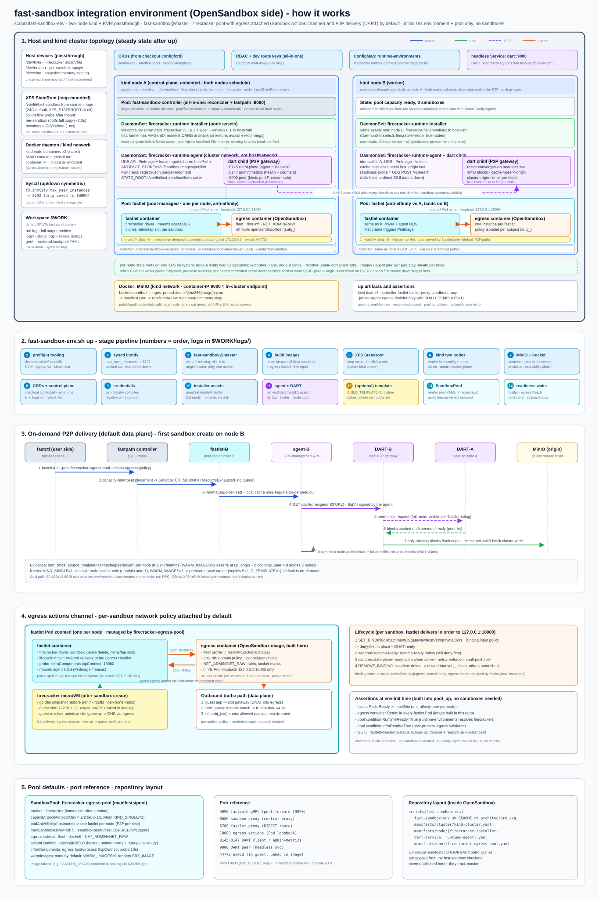

# fast-sandbox Integration Environment

`scripts/fast-sandbox-env/fast-sandbox-env.sh` in the OpenSandbox repository
builds a fast-sandbox integration environment on a bare-metal Linux KVM host
with one command: a two-node kind cluster (KVM passthrough) running the
fast-sandbox Firecracker chain from a `master` checkout, with the OpenSandbox
egress sidecar attached to the default pool.

The environment initializes capacity only — **no sandboxes are created**.
Create them afterwards with fast-sandbox's own tooling (`fastctl`,
`scripts/integration-env.sh verify-egress`) against the same cluster.



## Prerequisites

- Bare-metal Linux host with KVM (`/dev/kvm`), cgroup v2, and `sudo` (XFS
  StateRoot loop mount + sysctl bump).
- Docker, Go >= 1.25. `kind` / `kubectl` / `jq` are auto-installed when
  missing (`SKIP_TOOL_INSTALL=1` disables that).
- Direct Docker Hub access, or set
  `DOCKER_MIRROR="https://mirror.example.com[,https://fallback]"`.

## Usage

```bash
./scripts/fast-sandbox-env/fast-sandbox-env.sh up        # full environment + pool
./scripts/fast-sandbox-env/fast-sandbox-env.sh status    # component / pool / DART health
./scripts/fast-sandbox-env/fast-sandbox-env.sh pool      # re-apply the pool only
./scripts/fast-sandbox-env/fast-sandbox-env.sh down      # teardown, host left clean
```

Every stage logs to `$WORK/logs/`; failures dump component logs to
`logs/failure-<task>-<ts>.txt`.

## Defaults

- **Pool with egress**: `firecracker-egress-pool` (firecracker runtime,
  `poolMin=2`) carries the OpenSandbox egress container in every fastlet
  Pod netns — fleet profile, `dns+nft` mode — wired through the Sandbox
  Actions channel (`infraComponents` host-process entry +
  `actionHandlers` egress@18080 with the runtime-ready /
  data-plane-ready hooks). The egress image is built from
  `components/egress` in this repository and kind-loaded.
- **P2P by default**: two kind nodes, each running the runtime-agent with
  a node-local DART daemon (peer discovery through the headless `dart`
  Service); the pool spreads one fastlet per node via podAntiAffinity.
  Each node binds its **own** state-root subdirectory
  (`/var/lib/fast-sandbox/control-plane`, `/var/lib/fast-sandbox/worker`)
  at the same container path, so one node's committed image cache never
  satisfies another node's pull — artifact delivery flows
  `cache -> peer -> origin` with the origin fetched ~once per 4MiB block
  cluster-wide on every node's first create. `KIND_SINGLE=1` falls back
  to one node (cache-only).
- **On-demand loading**: the pool has no `warmImages`; the first sandbox
  create on each node pulls the golden snapshot set through DART.
  `WARM_IMAGES=1` preheats instead (implies `BUILD_TEMPLATE=1`).
- **fast-sandbox @ master**: cloned (or updated) from
  `opensandbox-group/fast-sandbox`; override with `FSB_DIR` / `FSB_REF`.

## Stage order (up)

preflight → sysctl → fast-sandbox checkout → build images (6 fast-sandbox
images + egress) → XFS StateRoot → kind cluster + node labels → MinIO →
CRDs + control plane → credentials → firecracker node assets →
runtime-agent + DART (roster asserted) → [SandboxTemplate, opt-in] →
SandboxPool (fastlet Ready, egress container Ready, pool conditions,
egress `/_fastlet/v1/actions/status` protocol check).

## Layout

```
scripts/fast-sandbox-env/
  fast-sandbox-env.sh              entrypoint: up / down / status / pool
  README.md                        short pointer + quick usage
  manifests/
    cluster/kind-cluster.yaml      two-node kind cluster, KVM/tun/shm mounts,
                                   per-node state-root subdirectories
    node/firecracker-installer.yaml  firecracker + jailer + arch-aware kernel
                                     onto node hostPath
    node/dart-service.yaml         headless Service backing DART peer discovery
    node/runtime-agent.yaml        per-node agent + DART child (P2P data plane);
                                   image rendered from IMG_AGENT
    pool/firecracker-egress-pool.yaml  SandboxPool: egress attached + P2P spread
```

Canonical fast-sandbox manifests (CRDs, RBAC, control plane, dev route
keys, runtime-environments) are applied directly from the checkout and
are intentionally not duplicated here. Small operational manifests that
define this environment's shape are split by concern above and rendered
(image tags, pool capacity, warmImages) into `$WORK/gen` at apply time.

## Environment variables (selection)

| Variable | Default | Meaning |
|---|---|---|
| `WORK` | `$PWD/.fast-sandbox-env` | workspace + logs |
| `FSB_DIR` | sibling `../fast-sandbox` | fast-sandbox checkout (cloned when missing) |
| `KIND_CLUSTER` | `fast-sandbox-integration` | kind cluster name |
| `KIND_SINGLE` | `0` | `1` = single node (cache-only, no peer traffic) |
| `DOCKER_MIRROR` | — | comma list injected as docker.io containerd mirrors |
| `EGRESS_IMAGE` | `docker.io/opensandbox/egress:latest` | egress image tag (built from `components/egress`) |
| `IMAGE_AGENT` | `fast-sandbox/firecracker-runtime-agent:dev` | agent image (rendered into the DaemonSet) |
| `POOL_MIN` / `POOL_MAX` | `2` / `2` | pool capacity (auto `1`/`1` when `KIND_SINGLE=1`) |
| `BUILD_TEMPLATE` | `0` | `1` = also build the SandboxTemplate golden image |
| `WARM_IMAGES` | `0` | `1` = preheat pool (implies `BUILD_TEMPLATE=1`) |
| `SBX_IMAGE` / `EXECD` | `alpine:3.19` / `opensandbox/execd:1.1.0` | template build inputs |
| `MINIO_PORT` | `9000` | host-side publish; in-cluster clients always use the container port |
| `XFS_STATEROOT` / `XFS_SIZE` | `1` / `24G` | reflink StateRoot on/off, virtual size |

Full operational notes for the same chain (topology, latency
characteristics, production caveats) live in the fast-sandbox repository:
`fast-sandbox/docs/guides/firecracker-integration-env.md`.
