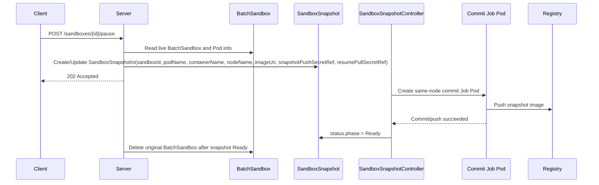
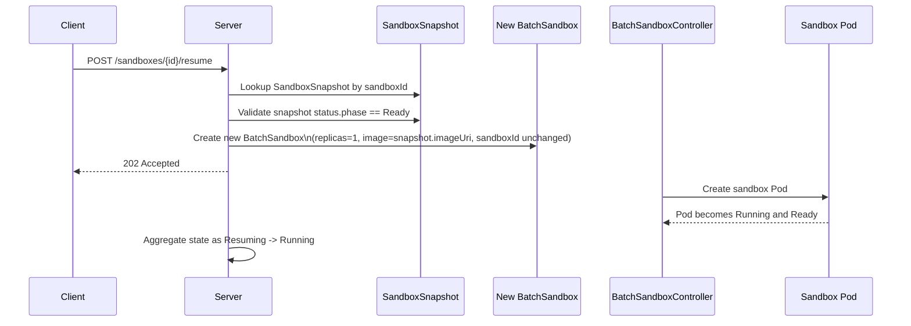

# OSEP-0008: Pause and Resume via Rootfs Snapshot

<!-- toc -->
- [Summary](#summary)
- [Motivation](#motivation)
  - [Goals](#goals)
  - [Non-Goals](#non-goals)
- [Requirements](#requirements)
- [Proposal](#proposal)
  - [API Overview](#api-overview)
  - [Kubernetes Resource Overview](#kubernetes-resource-overview)
  - [Component Interaction Overview](#component-interaction-overview)
  - [Notes/Constraints/Caveats](#notesconstraintscaveats)
  - [Risks and Mitigations](#risks-and-mitigations)
- [Design Details](#design-details)
- [Test Plan](#test-plan)
- [Drawbacks](#drawbacks)
- [Alternatives](#alternatives)
- [Infrastructure Needed](#infrastructure-needed)
- [Upgrade & Migration Strategy](#upgrade--migration-strategy)
<!-- /toc -->

## Summary

This proposal introduces pause and resume semantics for Kubernetes-backed
sandboxes by persisting the sandbox root filesystem as an OCI image. On pause,
the server creates a `SandboxSnapshot` CR for the running sandbox Pod, a
dedicated controller creates a commit Job on the same node, and the rootfs is
committed and pushed to a registry. After the snapshot becomes ready, the
original `BatchSandbox` is removed so compute resources are released.

Resume is intentionally simpler. The server resolves the single retained
snapshot for the stable `sandboxId`, then creates a new `BatchSandbox` with
`replicas = 1` from the snapshot image. The public `sandboxId` remains stable
across pause and resume.

```text
Time ------------------------------------------------------------------------>

Sandbox lifecycle:   [Running]--[Pausing]--[Paused]--[Resuming]--[Running]
                         |                     |
                  commit + push         create new BatchSandbox
                  delete old BatchSandbox from snapshot image
```

## Motivation

OpenSandbox users often need to temporarily stop a sandbox without losing the
filesystem state that has accumulated during a long-running task. Typical cases
include releasing cluster resources overnight, pausing an agent before a risky
step, or resuming a workspace later from the same working directory.

Today, Kubernetes runtime returns `HTTP 501 Not Implemented` for both `pause`
and `resume`. Docker supports cgroup freeze, but that does not survive restart
or migration. Rootfs snapshot is the practical middle ground in the persistence
roadmap:

- Phase 1: persistent volumes preserve explicit mounts.
- Phase 2: rootfs snapshot preserves the container filesystem.
- Phase 3: VM or process checkpoint preserves memory and execution state.

This OSEP deliberately chooses a simple architecture:

- keep `BatchSandbox` as the runtime workload resource used by the server today
- add a single `SandboxSnapshot` CR per `sandboxId`
- do not introduce a new per-instance lifecycle CR
- do not support multiple retained snapshots in v1

### Goals

- Implement `pause` for Kubernetes sandboxes by committing a running sandbox Pod
  rootfs into an OCI image and pushing it to a configurable registry.
- Keep the public `sandboxId` stable across pause and resume.
- Release compute resources after pause by deleting the original
  `BatchSandbox`.
- Implement `resume` by creating a new `BatchSandbox` with `replicas = 1` from
  the retained snapshot image.
- Expose `Pausing`, `Paused`, and `Resuming` through the existing Lifecycle API.
- Keep the design minimal by retaining only one snapshot per sandbox.

### Non-Goals

- Preserving in-memory process state, open sockets, or CPU registers.
- Supporting multiple historical snapshots per sandbox.
- Adding `GET /sandboxes/{sandboxId}/snapshots` in v1.
- Designing a general multi-instance pause model for `BatchSandbox` with
  `replicas > 1`.
- Extending Docker runtime to rootfs snapshot.
- Implementing automatic scheduled snapshots.

## Requirements

- Public `sandboxId` must remain unchanged after pause and resume.
- A sandbox has at most one retained snapshot in v1.
- Pause must work from the currently running sandbox Pod and record the concrete
  `podName`, `containerName`, and `nodeName` that are being snapshotted.
- The commit Job must run on the same node as the source Pod.
- Pause must complete `commit -> push` before the original `BatchSandbox` is
  deleted.
- At most one pause operation may be in progress for a given `sandboxId`.
- Resume must work when the original `BatchSandbox` no longer exists.
- `GET /sandboxes/{sandboxId}` must still return `200` and state `Paused` while
  the sandbox is represented only by a `SandboxSnapshot`.
- `DELETE /sandboxes/{sandboxId}` must delete both the live workload and any
  retained `SandboxSnapshot` for that sandbox.
- Registry credentials must be referenced via Kubernetes Secret, not inline API
  credentials.
- `SandboxSnapshot` must carry enough policy and workload reconstruction data to
  resume even after the original `BatchSandbox` has been deleted.
- The API shape must leave room for future snapshot backends, especially VM
  snapshot, even though this revision only implements rootfs snapshot.
- The design must remain compatible with the current server behavior where
  Kubernetes sandboxes are created as `BatchSandbox` with `replicas = 1`.

## Proposal

Pause and resume are modeled around two resources:

- `BatchSandbox`: runtime workload resource used for the live sandbox
- `SandboxSnapshot`: persisted snapshot state for one stable `sandboxId`

The public API stays sandbox-oriented, and the server remains the orchestrator.
The snapshot controller only handles snapshot execution.

### API Overview

```text
POST /sandboxes/{sandboxId}/pause   -> create or update SandboxSnapshot, return 202
POST /sandboxes/{sandboxId}/resume  -> create new BatchSandbox from snapshot, return 202
GET  /sandboxes/{sandboxId}         -> returns Running / Pausing / Paused / Resuming
```

There is no `GET /sandboxes/{sandboxId}/snapshots` endpoint in this version
because each sandbox retains only one snapshot.

### Kubernetes Resource Overview

```text
BatchSandbox (existing)
  |- used by Server as the live workload resource
  |- created with replicas = 1 for public sandbox lifecycle API
  `- deleted after pause succeeds

SandboxSnapshot (new, one per sandboxId)
  |- metadata.name = <sandboxId>
  |- spec.sandboxId
  |- spec.policy.type              # Rootfs today, reserved for VMSnapshot later
  |- spec.sourceBatchSandboxName
  |- spec.sourcePodName
  |- spec.sourceContainerName
  |- spec.sourceNodeName
  |- spec.imageUri
  |- spec.snapshotPushSecretName
  |- spec.resumeImagePullSecretName
  |- spec.resumeTemplate
  |- status.phase                 # Pending | Committing | Pushing | Ready | Failed
  |- status.readyAt
  `- status.message
```

The `SandboxSnapshot` name is deterministic and equal to `sandboxId`, which
enforces the “one sandbox, one snapshot” rule.

### Component Interaction Overview

Pause flow:



Resume flow:



### Notes/Constraints/Caveats

- `BatchSandbox` still supports broader semantics in the platform, but this
  proposal only targets the current public server path where a sandbox maps to a
  `BatchSandbox` with `replicas = 1`.
- The old `BatchSandbox` is deleted after a successful pause, so the paused
  state exists only in `SandboxSnapshot`.
- The server remains the orchestration owner for pause and resume. The
  snapshot controller is not responsible for creating or deleting
  `BatchSandbox`.
- `SandboxSnapshot.spec.policy.type` is reserved for future snapshot backends.
  This revision only supports `Rootfs`.
- Snapshot image URI should be stable for the single retained snapshot, for
  example `<snapshotRegistry>/<sandboxId>:snapshot`. This v1 design therefore
  assumes a registry/tag policy that allows replacing the retained snapshot
  image for a sandbox.
- Snapshot push authentication and resume-time image pull authentication are
  modeled separately. They may reference the same Kubernetes Secret in some
  deployments, but the design must not assume they are identical.
- Because the original `BatchSandbox` is deleted, resume cannot rely on
  `imageUri` alone. `SandboxSnapshot` must retain enough `resumeTemplate`
  information for the server to reconstruct a new `BatchSandbox`.
- Registries with immutable tags are not compatible with this simplified
  single-snapshot design unless the implementation changes the tag strategy in a
  future revision.
- Resume creates a new `BatchSandbox`; it does not resurrect the previous one.

### Risks and Mitigations

| Risk | Mitigation |
|------|------------|
| Pause succeeds in commit but old workload is deleted too early | Delete the original `BatchSandbox` only after `SandboxSnapshot.status.phase == Ready`. |
| Commit job lands on the wrong node | Store `sourceNodeName` in `SandboxSnapshot.spec` and pin the commit Job Pod to that node. |
| Server cannot represent a paused sandbox once `BatchSandbox` is gone | Use `SandboxSnapshot` as the source of truth for paused state in `GET /sandboxes/{sandboxId}`. |
| Repeated pause requests cause inconsistent state | Allow only one in-flight pause per `sandboxId`; return `409` if snapshot phase is already `Pending`, `Committing`, or `Pushing`. |
| Snapshot image is unavailable on resume | Require `status.phase == Ready` before resume and surface image-pull failures through normal sandbox startup state. |
| Single-snapshot design loses rollback ability | Accept as an intentional simplification for v1; multi-snapshot support is a future extension. |

## Design Details

### 1. Public Lifecycle API changes

This OSEP keeps the public API minimal:

- `CreateSandboxRequest.pausePolicy` is added as an optional field.
- `POST /sandboxes/{sandboxId}/pause`
- `POST /sandboxes/{sandboxId}/resume`
- `GET /sandboxes/{sandboxId}`

There is no snapshots listing API in this version.

Suggested request shape:

```yaml
pausePolicy:
  snapshotType: Rootfs
  snapshotRegistry: registry.example.com/sandbox-snapshots
  snapshotPushSecretName: registry-snapshot-push-secret
  resumeImagePullSecretName: snapshot-registry-pull-secret
```

`pausePolicy.snapshotType` is reserved for future expansion and currently only
supports `Rootfs`. A later revision can add `VMSnapshot` without breaking the
API shape.

### 2. PausePolicy on BatchSandbox

Pause policy remains part of the live sandbox workload definition:

```go
type PausePolicy struct {
    SnapshotType              string `json:"snapshotType,omitempty"` // Rootfs today, VMSnapshot reserved
    SnapshotRegistry          string `json:"snapshotRegistry"`
    SnapshotPushSecretName    string `json:"snapshotPushSecretName,omitempty"`
    ResumeImagePullSecretName string `json:"resumeImagePullSecretName,omitempty"`
}

type BatchSandboxSpec struct {
    // existing fields...
    PausePolicy *PausePolicy `json:"pausePolicy,omitempty"`
}
```

This policy is used by the server when constructing `SandboxSnapshot`.

### 3. SandboxSnapshot CRD

Introduce `SandboxSnapshot` under `sandbox.opensandbox.io/v1alpha1`.

```go
type SandboxSnapshotPhase string

const (
    SandboxSnapshotPhasePending    SandboxSnapshotPhase = "Pending"
    SandboxSnapshotPhaseCommitting SandboxSnapshotPhase = "Committing"
    SandboxSnapshotPhasePushing    SandboxSnapshotPhase = "Pushing"
    SandboxSnapshotPhaseReady      SandboxSnapshotPhase = "Ready"
    SandboxSnapshotPhaseFailed     SandboxSnapshotPhase = "Failed"
)

type SandboxSnapshotSpec struct {
    SandboxID                 string                `json:"sandboxId"`
    Policy                    SnapshotPolicy        `json:"policy"`
    SourceBatchSandboxName    string                `json:"sourceBatchSandboxName"`
    SourcePodName             string                `json:"sourcePodName"`
    SourceContainerName       string                `json:"sourceContainerName"`
    SourceNodeName            string                `json:"sourceNodeName"`
    ImageURI                  string                `json:"imageUri"`
    SnapshotPushSecretName    string                `json:"snapshotPushSecretName,omitempty"`
    ResumeImagePullSecretName string                `json:"resumeImagePullSecretName,omitempty"`
    ResumeTemplate            *runtime.RawExtension `json:"resumeTemplate,omitempty"`
    PausedAt                  metav1.Time           `json:"pausedAt"`
}

type SandboxSnapshotStatus struct {
    Phase     SandboxSnapshotPhase `json:"phase,omitempty"`
    Message   string               `json:"message,omitempty"`
    ReadyAt   *metav1.Time         `json:"readyAt,omitempty"`
    ImageDigest string             `json:"imageDigest,omitempty"`
}

type SnapshotPolicy struct {
    Type string `json:"type"` // Rootfs today, VMSnapshot reserved
}
```

Key rules:

- `metadata.name = sandboxId`
- one namespace contains at most one `SandboxSnapshot` for a given `sandboxId`
- creating a new pause request overwrites the retained snapshot
- `policy.type` must be set to `Rootfs` in this revision
- `SourcePodName`, `SourceContainerName`, and `SourceNodeName` are mandatory
  because the commit workflow is bound to a concrete live container
- `SourceContainerName` identifies the main sandbox workload container whose
  rootfs is being snapshotted; init containers and sidecars are not committed
- `SnapshotPushSecretName` is used only for the in-container registry push
  performed by the commit Job
- `ResumeImagePullSecretName` is used only when reconstructing the resumed
  workload so kubelet can pull the retained snapshot image
- `ResumeTemplate` must preserve enough information to reconstruct a new
  `BatchSandbox` after the original workload has been deleted

### 4. Pause state model

State is derived from resource presence with intermediate states exposed via `reason`:

#### Stable States

- `BatchSandbox` exists and is ready, and no matching pause cleanup is pending
  -> `Running`
- `BatchSandbox` is absent and snapshot phase is `Ready` -> `Paused`
- `SandboxSnapshot.status.phase == Failed` and no live replacement workload ->
  `Failed`

#### Intermediate States

**Pausing** (with substates exposed via `reason` field):

- `BatchSandbox` exists and snapshot phase is `Pending` -> `Pausing` with reason `SNAPSHOT_PENDING`
- `BatchSandbox` exists and snapshot phase is `Committing` -> `Pausing` with reason `SNAPSHOT_COMMITTING`
- `BatchSandbox` exists and snapshot phase is `Ready`, but not yet resumed -> `Pausing` with reason `SNAPSHOT_READY_CLEANUP`

**Resuming**:

- `BatchSandbox` exists and was created from snapshot (annotation `sandbox.opensandbox.io/resumed-from-snapshot=true`) but is in `Pending` or `Allocated` phase -> `Resuming` with reason `RESUMING`

This means `GET /sandboxes/{sandboxId}` must consult both `BatchSandbox` and
`SandboxSnapshot` and return `(state, reason, message)` tuple.

### 5. Pause flow

The pause flow is:

```text
1. Client  POST /sandboxes/{sandboxId}/pause
2. Server  Resolve current BatchSandbox and running Pod for sandboxId
3. Server  Validate:
           - workload exists
           - replicas == 1 for this server path
           - pausePolicy is configured
           - no existing snapshot for sandboxId is already in phase
             Pending|Committing|Pushing
4. Server  Create or replace SandboxSnapshot(name=sandboxId) with:
           - policy.type = Rootfs
           - sourceBatchSandboxName
           - sourcePodName
           - sourceContainerName
           - sourceNodeName
           - target imageUri
           - snapshotPushSecretName
           - resumeImagePullSecretName
           - resumeTemplate
           - pausedAt
           - status.phase = Pending
5. Snapshot controller creates a same-node commit Job Pod
6. Job Pod commits container rootfs and pushes image
7. Snapshot controller updates phase:
           Pending -> Committing -> Pushing -> Ready
8. Server-side pause orchestration deletes the original BatchSandbox
9. GET /sandboxes/{sandboxId} now returns Paused from SandboxSnapshot
```

Failure behavior:

- If commit or push fails, `SandboxSnapshot.status.phase = Failed`
- The original `BatchSandbox` is not deleted
- The sandbox remains `Running` or transitions to `Failed` based on the final
  server policy; this OSEP recommends keeping the workload running and exposing
  the snapshot failure in the message
- If another pause is already in progress for the same `sandboxId`, the server
  returns `409 Conflict`

### 6. Commit Job Pod

The snapshot controller creates one short-lived Job Pod:

```yaml
apiVersion: batch/v1
kind: Job
metadata:
  name: sbxsnap-commit-<sandboxId>
spec:
  ttlSecondsAfterFinished: 300
  template:
    spec:
      restartPolicy: Never
      nodeName: <sourceNodeName>
      containers:
        - name: committer
          image: <committerImage>
          command: ["/bin/sh", "-c"]
          args:
            - |
              snapshot-committer \
                --containerd-namespace k8s.io \
                --container-id <containerID> \
                --target-image <imageUri> \
                --registry-auth-file /var/run/opensandbox/registry/.dockerconfigjson
          volumeMounts:
            - name: containerd-sock
              mountPath: /run/containerd/containerd.sock
            - name: snapshot-push-auth
              mountPath: /var/run/opensandbox/registry
              readOnly: true
      volumes:
        - name: containerd-sock
          hostPath:
            path: /run/containerd/containerd.sock
            type: Socket
        - name: snapshot-push-auth
          secret:
            secretName: <snapshotPushSecretName>
```

The controller resolves the source container ID from `SourcePodName` and
`SourceContainerName`.

`snapshot-committer` in this example is a logical role, not a required product
name. The implementation may be a small in-house binary, a thin wrapper around
existing container tooling, or another committer client, as long as it
performs the following responsibilities explicitly:

- commit the source container rootfs into a snapshot image
- read the mounted registry auth config from the Secret volume
- push the snapshot image to `spec.imageUri`
- return a clear success/failure signal so the controller can update
  `SandboxSnapshot.status.phase`

Important auth semantics:

- `imagePullSecrets` on the Job Pod, if needed for the `committerImage`, only
  affects kubelet pulling the Job image. It does not authenticate registry
  operations performed by the process inside the container.
- `snapshotPushSecretName` is mounted into the committer container and must be
  consumed explicitly by the snapshot push client as registry auth config.
- `resumeImagePullSecretName` is not used by the commit Job. It is propagated
  to the resumed workload template so kubelet can pull `snapshot.spec.imageUri`
  during resume.

### 7. Resume flow

The resume flow is:

```text
1. Client  POST /sandboxes/{sandboxId}/resume
2. Server  Resolve SandboxSnapshot(name=sandboxId)
3. Server  Validate:
           - snapshot exists
           - snapshot status.phase == Ready
4. Server  Create a new BatchSandbox:
           - metadata.name reuses the same public sandbox identity mapping
           - replicas = 1
           - template reconstructed from snapshot.spec.resumeTemplate
           - template image = snapshot.spec.imageUri
           - template imagePullSecrets = snapshot.spec.resumeImagePullSecretName
           - labels preserve sandboxId
5. Server  Aggregate sandbox state as Resuming while the new BatchSandbox is
           starting
6. BatchSandbox controller creates the new Pod
7. Once the new Pod is running and ready, GET /sandboxes/{sandboxId} returns Running
```

The snapshot is retained after resume so the sandbox can be paused and resumed
again later, but only the latest snapshot is kept.

### 8. Stable sandbox ID

The public `sandboxId` is stable across three states:

- live workload exists: identify by `BatchSandbox` label `opensandbox.io/id`
- paused workload: identify by `SandboxSnapshot.metadata.name == sandboxId`
- resumed workload: identify by the new `BatchSandbox` label

The workload object identity may change, but the public sandbox identity does
not.

### 9. List and get semantics

`GET /sandboxes/{sandboxId}` must:

- first resolve the live `BatchSandbox`
- then resolve `SandboxSnapshot`
- merge both views into one lifecycle status

`GET /sandboxes` should include:

- running sandboxes from live `BatchSandbox` objects
- paused sandboxes from `SandboxSnapshot` objects that have no live
  `BatchSandbox`

This keeps paused sandboxes visible even though their workloads have been
deleted.

### 10. Delete semantics

`DELETE /sandboxes/{sandboxId}` must remove all Kubernetes state associated with
the public sandbox identity:

- delete the live `BatchSandbox` if it exists
- delete `SandboxSnapshot(name=sandboxId)` if it exists

Registry cleanup is best-effort in this revision:

- if the implementation can safely delete the retained snapshot image from the
  registry, it may do so
- registry image deletion failure must not block sandbox deletion success
- operators may rely on registry retention or garbage collection if image
  deletion is unavailable or undesirable

### 11. Configuration

Add a new server config section:

```toml
[pause]
snapshot_registry = ""
snapshot_push_secret = ""
resume_pull_secret = ""
snapshot_type = "Rootfs"
```

Semantics:

- `snapshot_registry` is the registry for storing snapshot images (e.g., `registry.example.com/snapshots`).
- `snapshot_push_secret` is the Kubernetes Secret name used for pushing snapshots to the registry.
- `resume_pull_secret` is the Kubernetes Secret name used for pulling snapshot images during resume.
- `snapshot_type` is the snapshot type, currently only `Rootfs` is supported (reserved for future expansion).

### 12. Security considerations

The commit Job mounts the node's container runtime socket to resolve the source
container and commit its root filesystem. This is a privileged operation with
node-level runtime access.

Operational constraints for this design:

- the commit Job image is determined by the snapshot controller, not by the
  public sandbox API
- the commit Job spec is not user-extensible in this revision
- operators should treat the snapshot controller and commit Job as trusted
  infrastructure components, with tighter RBAC and supply-chain controls than
  ordinary sandbox workloads

## Test Plan

### Unit tests

- Pause request creates or replaces `SandboxSnapshot(name=sandboxId)`.
- `SandboxSnapshot` contains `sourcePodName`, `sourceContainerName`, and
  `sourceNodeName` from the live workload.
- Snapshot controller creates a Job pinned to the correct node.
- Server returns `Paused` when `BatchSandbox` is absent and snapshot is `Ready`.
- Server returns `Pausing` with reason `SNAPSHOT_PENDING` when snapshot phase is `Pending`.
- Server returns `Pausing` with reason `SNAPSHOT_COMMITTING` when snapshot phase is `Committing`.
- Server returns `Pausing` with reason `SNAPSHOT_READY_CLEANUP` when snapshot is `Ready` but the source
  `BatchSandbox` still exists.
- Server returns `Resuming` with reason `RESUMING` after new `BatchSandbox` is created from snapshot but
  before readiness (in `Pending` or `Allocated` phase).
- Pause returns `409` when another pause is already in progress for the same
  `sandboxId`.
- Resume fails with `409` when snapshot is absent or not `Ready`.
- Delete removes `SandboxSnapshot` for paused sandboxes.

### Integration tests

- End-to-end pause:
  - running `BatchSandbox`
  - snapshot becomes `Ready`
  - original `BatchSandbox` is deleted
  - `GET /sandboxes/{id}` returns `Paused`
- End-to-end resume:
  - server finds snapshot by `sandboxId`
  - creates new `BatchSandbox`
  - new Pod comes up from snapshot image
  - `GET /sandboxes/{id}` returns `Running`
- Repeat pause after resume:
  - the same `SandboxSnapshot` resource is reused or replaced
  - only one snapshot remains
- Delete after pause:
  - paused sandbox is removed even when no live `BatchSandbox` exists
  - retained `SandboxSnapshot` is removed

### Manual and operator validation

- Confirm the committed image is present in the registry after pause.
- Confirm working directory contents survive pause and resume.
- Confirm CPU and memory are released after the old `BatchSandbox` is deleted.
- Confirm the commit Job Pod actually runs on the source node.
- Confirm the committed rootfs comes from the intended sandbox container rather
  than a sidecar.

## Drawbacks

- Only one snapshot is retained, so rollback to older states is impossible.
- The design assumes the server-side Kubernetes path uses `replicas = 1`.
- The paused state is split from the live workload and must be reconstructed by
  the server from multiple resources.
- Registries that enforce immutable tags are a poor fit for the simplified
  single-snapshot design.
- Commit still requires node-local runtime access.

## Alternatives

### Introduce a dedicated SandboxInstance CR

A more general design is possible, but rejected here because the user goal is a
simpler architecture aligned with the current server path. For v1, the single
snapshot CR plus existing `BatchSandbox` is sufficient.

### Store pause state directly on BatchSandbox

Rejected because the paused state must survive after the workload is deleted.
Once pause succeeds, the original `BatchSandbox` no longer exists.

### Support multiple snapshots and `/snapshots` API in v1

Rejected to keep the architecture minimal. Multi-snapshot history can be added
later by changing `SandboxSnapshot` naming and list semantics.

### Restore the old BatchSandbox instead of creating a new one

Rejected because pause deletes the original workload to release resources. Resume
is cleaner if it always creates a fresh `BatchSandbox` from the retained image.

## Infrastructure Needed

- An OCI registry reachable from cluster nodes.
- A registry credential Secret of type `kubernetes.io/dockerconfigjson`.
- A committer image that can access `containerd.sock` on the source node.
- RBAC for `SandboxSnapshot`, Jobs, and reads on Pods and `BatchSandbox`.

## Upgrade & Migration Strategy

This change is additive for the public API and simple for operators.

- Existing clients keep using the same sandbox lifecycle endpoints.
- Existing Kubernetes deployments without the new `SandboxSnapshot` CRD continue
  to return `501` for pause and resume.
- Rollout sequence:
  - install the `SandboxSnapshot` CRD
  - deploy the `SandboxSnapshotController`
  - deploy the updated server with pause/resume orchestration
- Existing running sandboxes do not require migration. Only new pause/resume
  operations use the new flow.
