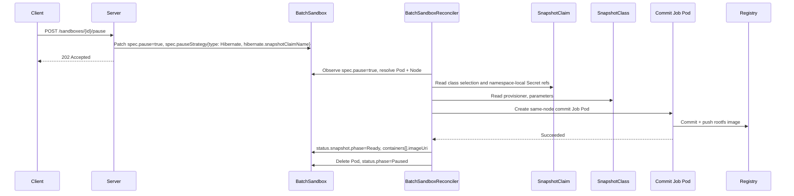
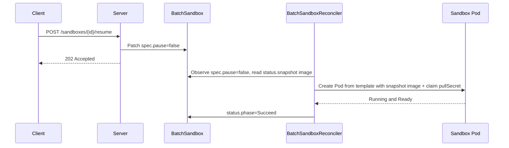

# OSEP-0015: Spec-Driven Pod Snapshot for Pause and Resume

<!-- toc -->
- [Summary](#summary)
- [Motivation](#motivation)
  - [Goals](#goals)
  - [Non-Goals](#non-goals)
- [Requirements](#requirements)
- [Proposal](#proposal)
  - [Relationship to OSEP-0008](#relationship-to-osep-0008)
  - [Public API Overview](#public-api-overview)
  - [Kubernetes Resource Overview](#kubernetes-resource-overview)
  - [Snapshot Strategies](#snapshot-strategies)
  - [Component Interaction Overview](#component-interaction-overview)
  - [Notes/Constraints/Caveats](#notesconstraintscaveats)
  - [Risks and Mitigations](#risks-and-mitigations)
- [Design Details](#design-details)
  - [1. BatchSandbox spec field](#1-batchsandbox-spec-field)
  - [2. SnapshotClass and SnapshotClaim CRDs](#2-snapshotclass-and-snapshotclaim-crds)
  - [3. Inline snapshot status on BatchSandbox](#3-inline-snapshot-status-on-batchsandbox)
  - [4. Pause state model](#4-pause-state-model)
  - [5. Pause flow](#5-pause-flow)
  - [6. Commit Job](#6-commit-job)
  - [7. Resume flow](#7-resume-flow)
  - [8. Server mapping (public API unchanged)](#8-server-mapping-public-api-unchanged)
  - [9. Stable sandbox ID, list, get, delete](#9-stable-sandbox-id-list-get-delete)
  - [10. Configuration](#10-configuration)
  - [11. Security considerations](#11-security-considerations)
  - [12. Potential Go type changes](#12-potential-go-type-changes)
- [Test Plan](#test-plan)
- [Drawbacks](#drawbacks)
- [Alternatives](#alternatives)
- [Infrastructure Needed](#infrastructure-needed)
- [Upgrade & Migration Strategy](#upgrade--migration-strategy)
<!-- /toc -->

## Summary

This proposal reworks how Kubernetes-backed pause and resume are expressed inside
the cluster. Instead of orchestrating a separate `SandboxSnapshot` custom
resource per pause (OSEP-0008), the snapshot *intent*, *policy*, and *status*
live directly on the existing `BatchSandbox` object. The existing
`BatchSandbox.spec.pause` boolean remains the trigger, and a new
`BatchSandbox.spec.pauseStrategy` field selects the snapshot strategy and a
namespaced `SnapshotClaim`. The claim resolves to a cluster-scoped
`SnapshotClass`, following the `PersistentVolumeClaim` -> `StorageClass`
pattern. The controller performs the rootfs commit inline and reports progress
through `BatchSandbox.status.snapshot`.

This design follows the upstream
[kubernetes-sigs/agent-sandbox KEP-0694](https://github.com/kubernetes-sigs/agent-sandbox/pull/762)
("Suspend and Resume + Snapshot Provider API"), which uses a declarative
`spec.suspend` boolean plus a `spec.suspensionStrategy`, and a
`StorageClass`-style `SnapshotClass` for pluggable snapshot backends.
OpenSandbox adds a namespaced `SnapshotClaim` layer so namespace-local registry
Secrets are unambiguous.

The OpenSandbox public server API does **not** change. `POST
/sandboxes/{sandboxId}/pause`, `POST /sandboxes/{sandboxId}/resume`, and `GET
/sandboxes/{sandboxId}` keep their current shape. Only the server-to-Kubernetes
translation changes: pause writes spec fields on `BatchSandbox` rather than
creating a `SandboxSnapshot` CR.

```text
Time ------------------------------------------------------------------------>

Sandbox lifecycle:   [Running]--[Pausing]--[Paused]--[Resuming]--[Running]
                          |                     |
                spec.pause = true        spec.pause = false
                + pauseStrategy          (controller recreates Pod
                (controller commits       from status.snapshot image)
                 rootfs inline)
```

## Motivation

OSEP-0008 delivered pause/resume by committing a sandbox Pod's root filesystem to
an OCI image. It models the operation as a dedicated `SandboxSnapshot` CR that
the server creates, a `SandboxSnapshotReconciler` consumes, and that drives a
same-node commit Job. The snapshot backend (registry, push secret, committer
image) is configured globally through controller manager startup flags
(`--snapshot-registry`, `--snapshot-push-secret`, `--image-committer-image`).

That shape works, but it has structural costs:

- **Two sources of truth for one sandbox.** A paused sandbox's lifecycle state is
  split between `BatchSandbox.spec.pause` and a sibling `SandboxSnapshot` object.
  The server must read and merge both to answer `GET /sandboxes/{id}`, and must
  keep them consistent on pause, resume, and delete.
- **An extra reconcile loop and cross-object ownership.** The snapshot controller
  is a separate atomic capability that resolves Pod/Node from the referenced
  `BatchSandbox`, races with scale and eviction, and needs its own finalizer and
  garbage collection.
- **Global, non-pluggable snapshot configuration.** The registry and push
  credentials are cluster-wide controller flags. Operators cannot offer multiple
  snapshot backends (e.g., a fast local registry vs. a remote durable bucket), and
  the choice cannot vary per sandbox.
- **Divergence from the upstream agent-sandbox direction.** OpenSandbox tracks the
  Kubernetes SIG `agent-sandbox` project (OSEP-0002). Upstream is standardizing on
  a `spec.suspend` + `spec.suspensionStrategy` + `SnapshotClass` model. Aligning
  now reduces future migration cost and lets OpenSandbox adopt additional
  strategies (Freeze, VM/memory checkpoint) under one API.

Embedding the snapshot policy and status on the sandbox object itself is the
idiomatic Kubernetes pattern (it mirrors how the Job API uses `spec.suspend`).
It collapses the two-object model into one, makes the backend pluggable through a
`SnapshotClass`, and keeps the public server API stable.

### Goals

- Express pause/resume entirely on the `BatchSandbox` object: `spec.pause` as the
  trigger, `spec.pauseStrategy` as the strategy/backend selector, and
  `status.snapshot` as the inline result.
- Introduce a cluster-scoped `SnapshotClass` CRD and a namespaced
  `SnapshotClaim` CRD, mirroring Kubernetes `StorageClass`/PVC layering:
  classes carry backend configuration, claims carry namespace-local Secret
  references and class selection.
- Keep the OpenSandbox public server pause/resume API (`/pause`, `/resume`, `GET`)
  byte-for-byte compatible with today.
- Keep the public `sandboxId` stable across pause and resume.
- Preserve the rootfs commit mechanism and the `image-committer` Job from
  OSEP-0008; only its *driver* changes from a `SandboxSnapshot` CR to the
  `BatchSandbox` reconciler reading the spec field.
- Leave the API extensible for future strategies (Freeze, Hibernate with
  VM/memory checkpoint) without breaking changes.

### Non-Goals

- Changing the OpenSandbox public HTTP API shape for pause/resume.
- Preserving in-memory process state, open sockets, or CPU registers in this
  revision (rootfs only; memory checkpoint is reserved under the `Hibernate`
  strategy for a later revision).
- Supporting multiple retained historical snapshots per sandbox.
- Implementing automatic, idle-timeout-driven suspension (policy-based triggers
  are future work, consistent with the upstream Phase 2).
- Redesigning the explicit "create snapshot" public API (the `osb-snap-*` flow).
  This OSEP only replaces the *pause/resume* usage of `SandboxSnapshot`.
- Extending the Docker runtime; this proposal targets the Kubernetes runtime.

## Requirements

- The OpenSandbox public server pause/resume endpoints and their request/response
  bodies must remain unchanged.
- The public `sandboxId` must remain stable across pause and resume.
- For `Hibernate`, pause must commit the running sandbox Pod's main container
  rootfs and push it to a registry resolved from `SnapshotClaim -> SnapshotClass`.
- Snapshot intent and result must be readable from the `BatchSandbox` object alone;
  no sibling CR lookup may be required to answer `GET /sandboxes/{id}`.
- For `Hibernate`, the commit Job must run on the same node as the source Pod.
- For `Hibernate`, pause must complete `commit -> push` and record the snapshot
  image before the sandbox is reported `Paused` and the Pod is removed. For
  `Stop`, no image is recorded and resume uses `spec.template`.
- At most one pause/resume transition may be in progress for a given sandbox.
- Resume must reconstruct the Pod from the current pause result: the recorded
  snapshot image for `Hibernate`, or `spec.template` for `Stop`.
- Registry credentials must be referenced via namespace-local Kubernetes Secrets,
  not inline API credentials, and push (pause-time) and pull (resume-time) auth
  must be modeled independently.
- The snapshot backend must be selectable per sandbox via a named `SnapshotClaim`.
  That claim selects a `SnapshotClass`, and a cluster default class must be
  supported when the claim does not specify one.
- The design must remain compatible with the current server path where a
  Kubernetes sandbox maps to a `BatchSandbox` with `replicas = 1`.
- The change must be additive to CRD schemas and must not break clusters that have
  not yet installed the `SnapshotClass`/`SnapshotClaim` CRDs.

## Proposal

Pause and resume are modeled on one runtime object plus PV/PVC-style
configuration objects:

- `BatchSandbox`: carries the pause trigger (`spec.pause`), the pause strategy
  (`spec.pauseStrategy`), and the inline snapshot result (`status.snapshot`).
- `SnapshotClass` (new, cluster-scoped): describes a pluggable snapshot backend
  (provisioner + parameters).
- `SnapshotClaim` (new, namespaced): selects a `SnapshotClass` and names the
  namespace-local push/pull Secrets used by commit Jobs and resumed Pods.

The server remains the orchestrator of the public lifecycle. The `BatchSandbox`
reconciler owns the in-cluster execution: when it observes `spec.pause = true` and
a `Hibernate` policy, it resolves the live Pod/Node, dispatches the same-node
commit Job, records the resulting image in `status.snapshot`, and then removes the
Pod. Resume is the reverse, driven by `spec.pause = false`.

### Relationship to OSEP-0008

OSEP-0008 is the predecessor. This OSEP keeps its goals (stable `sandboxId`,
rootfs persistence, resource release after pause, `image-committer` Job) and
changes only the in-cluster representation.

| Concern | OSEP-0008 (current) | OSEP-0015 (this proposal) |
|---|---|---|
| Pause trigger | `BatchSandbox.spec.pause` | `BatchSandbox.spec.pause` (unchanged) |
| Snapshot intent/policy | `SandboxSnapshot` CR (`spec.sandboxName`) | `BatchSandbox.spec.pauseStrategy` |
| Snapshot result | `SandboxSnapshot.status` | `BatchSandbox.status.snapshot` |
| Backend config | controller startup flags (global) | `SnapshotClaim` (namespaced) -> `SnapshotClass` (cluster-scoped, pluggable) |
| Reconciler | dedicated `SandboxSnapshotReconciler` | `BatchSandboxReconciler` (inline) |
| Sources of truth for `GET` | `BatchSandbox` + `SandboxSnapshot` | `BatchSandbox` only |
| Commit Job + image-committer | yes | yes (reused unchanged) |
| Public server API | `/pause`, `/resume`, `GET` | identical |

This is the OpenSandbox counterpart of agent-sandbox KEP-0694. The pause trigger
and strategy shape stay aligned, while the backend selector adds a namespaced
claim layer for OpenSandbox's multi-namespace credential model:

| agent-sandbox `Sandbox` | OpenSandbox `BatchSandbox` |
|---|---|
| `spec.suspend` (bool) | `spec.pause` (`*bool`, already exists) |
| `spec.suspensionStrategy.type` | `spec.pauseStrategy.type` |
| `spec.suspensionStrategy.hibernate.snapshotClass` | `spec.pauseStrategy.hibernate.snapshotClaimName` |
| `SnapshotClass` (cluster-scoped) | `SnapshotClaim` (namespaced) -> `SnapshotClass` (cluster-scoped) |

OpenSandbox keeps its existing `pause`/`resume` vocabulary instead of upstream's
`suspend`/`resume`, because `BatchSandbox.spec.pause` already ships today. Every
other element of the upstream pattern — the boolean trigger on the CR and the
nested strategy block on the CR — is adopted directly. The backend selector is
adapted to OpenSandbox's multi-namespace credential needs by inserting a
`SnapshotClaim` layer between `BatchSandbox` and `SnapshotClass`, analogous to
PVCs sitting between Pods and `StorageClass`.

### Public API Overview

```text
POST /sandboxes/{sandboxId}/pause   -> patch BatchSandbox (spec.pause=true, spec.pauseStrategy), return 202
POST /sandboxes/{sandboxId}/resume  -> patch BatchSandbox (spec.pause=false), return 202
GET  /sandboxes/{sandboxId}         -> Running / Pausing / Paused / Resuming (from BatchSandbox)
```

There is no new public endpoint, request field, or response field introduced for
pause/resume. OSEP-0008 proposed `CreateSandboxRequest.pausePolicy`, but the
current server API does not expose it; this proposal intentionally does not add it.
The server chooses or creates the in-cluster `SnapshotClaim` from server-side
configuration, then patches only `BatchSandbox.spec`.

### Kubernetes Resource Overview

```text
BatchSandbox (existing, extended)
  |- spec.replicas                 # 1 on the public server path
  |- spec.template                 # Pod template
  |- spec.pause                    # nil | true (pause) | false (resume)   [existing]
  |- spec.pauseStrategy            # NEW (mirrors agent-sandbox spec.suspensionStrategy)
  |    |- type                     # Stop | Freeze | Hibernate (rootfs today)
  |    `- hibernate                # config block used when type == Hibernate
  |         `- snapshotClaimName   # name of a SnapshotClaim in the same namespace
  `- status.snapshot               # NEW, inline snapshot result
       |- phase                    # Pending | Committing | Ready | Failed
       |- strategyType             # Stop | Hibernate for the current pause result
       |- snapshotClaimName
       |- snapshotClassName
       |- containers[]             # {containerName, imageUri, imageDigest}
       |- sourcePodName
       |- sourceNodeName
       |- readyAt
       `- message

SnapshotClass (NEW, cluster-scoped)
  |- provisioner                   # e.g. snapshot.opensandbox.io/rootfs
  `- parameters                    # free-form backend config (registry, insecure, ...)

SnapshotClaim (NEW, namespaced; PVC-like)
  |- spec.snapshotClassName        # name of a SnapshotClass; empty => cluster default
  |- spec.pushSecretRef.name       # Secret in the claim/sandbox namespace
  |- spec.pullSecretRef.name       # Secret in the claim/sandbox namespace
  `- status.snapshotClassName      # resolved class
```

The paused runtime state is fully described by `BatchSandbox`
(`status.phase = Paused` plus `status.snapshot`). No per-pause sibling snapshot
action object is required to answer `GET /sandboxes/{id}`; `SnapshotClaim` is
configuration, not the snapshot result.

Side-by-side, the developer-facing shape matches agent-sandbox KEP-0694:

```yaml
# agent-sandbox (KEP-0694)                # OpenSandbox (OSEP-0015)
apiVersion: agents.x-k8s.io/v1beta1       apiVersion: sandbox.opensandbox.io/v1alpha1
kind: Sandbox                             kind: BatchSandbox
spec:                                     spec:
  suspend: true                             pause: true
  suspensionStrategy:                       pauseStrategy:
    type: "Hibernate"                         type: Hibernate
    hibernate:                                hibernate:
      snapshotClass: "fast-memory"              snapshotClaimName: default-rootfs
```

### Snapshot Strategies

Following agent-sandbox KEP-0694, `spec.pauseStrategy.type` dictates *how* a
`spec.pause = true` is physically executed:

| Strategy | What pause does | Filesystem | Memory | Status this revision |
|---|---|---|---|---|
| `Stop` | Delete the Pod and release compute. | Lost unless on a retained PVC (OSEP-0003). | Lost | Supported (no commit, no `SnapshotClass` required) |
| `Freeze` | Keep the Pod, freeze container cgroups. | Kept | Kept (in node RAM) | Reserved (Kubernetes freeze is future work) |
| `Hibernate` | Commit rootfs to an OCI image via the commit Job, then delete the Pod. | Persisted as image | Lost (rootfs only today; memory checkpoint reserved) | **Implemented** (replaces the OSEP-0008 path) |

`Hibernate` is the default and the only strategy that requires a
`hibernate.snapshotClaimName` (or a server-configured default claim). It is the
direct successor to the OSEP-0008 rootfs snapshot. `Stop` is a lightweight option
for clean-slate or PVC-backed sandboxes.
`Freeze` and memory-aware `Hibernate` are reserved so the API does not need to
break when they land.

### Component Interaction Overview

Pause flow (`Hibernate`):



Resume flow:



### Notes/Constraints/Caveats

- This proposal targets the public server path where a sandbox maps to a
  `BatchSandbox` with `replicas = 1`. The single-replica assumption is unchanged
  from OSEP-0008.
- `status.snapshot` retains exactly one snapshot result (the latest). Re-pausing
  replaces it. Multi-snapshot history remains out of scope.
- For `Hibernate`, the snapshot image reference recorded in `status.snapshot`
  must be stable and durable enough to survive Pod deletion, because resume relies
  on it after the Pod is gone.
- Push authentication (`pushSecretRef`) and pull authentication (`pullSecretRef`)
  are modeled separately on the namespaced `SnapshotClaim`. They may reference
  the same Secret but must not be assumed identical.
- The `image-committer` Job and its trust model (mounts the node container runtime
  socket) are reused unchanged from OSEP-0008.
- Because the snapshot result lives on `BatchSandbox.status`, deleting the
  `BatchSandbox` removes the paused state automatically; no per-pause result CR
  cleanup is needed. `SnapshotClaim` is reusable namespace configuration.
- `spec.pause` semantics are unchanged: `nil` = no-op, `true` = request pause,
  `false` = request resume. The controller never clears it; the server owns it.

### Risks and Mitigations

| Risk | Mitigation |
|------|------------|
| Pod is deleted before the rootfs image is durable | Only delete the Pod after `status.snapshot.phase == Ready`; resume validates the recorded image. |
| Commit Job lands on the wrong node | Record `status.snapshot.sourceNodeName` and pin the Job Pod to that node, as in OSEP-0008. |
| Missing/invalid `SnapshotClaim` or `SnapshotClass` on pause | Validate the referenced claim and resolved class before deleting the Pod; on failure set `status.snapshot.phase = Failed` and keep the Pod running. |
| Concurrent pause/resume requests cause flapping | Gate transitions on `status.snapshot.phase` and the existing pause ACK generation; reject overlapping transitions with `409`. |
| Status object grows unbounded | `status.snapshot` is a single fixed-shape struct with one container list; no history is appended. |
| Backend config drift between sandboxes | Centralize backend config in `SnapshotClass`; sandboxes reference a namespace-local `SnapshotClaim` by name only. |
| Clusters without the new CRDs | The CRDs are additive; absent them, `Hibernate` pauses fail closed and the server reports `501`/error exactly as a misconfigured OSEP-0008 cluster does today. |

## Design Details

### 1. BatchSandbox spec field

Extend `BatchSandboxSpec` (in `apis/sandbox/v1alpha1/batchsandbox_types.go`) with a
pause strategy. The existing `Pause *bool` field is retained as-is. The shape
mirrors agent-sandbox KEP-0694's `spec.suspensionStrategy`: a `type` discriminator
plus a per-strategy config block (`hibernate`).

```go
// PauseStrategyType selects how a paused sandbox is physically handled.
// Mirrors agent-sandbox spec.suspensionStrategy.type.
// +kubebuilder:validation:Enum=Stop;Freeze;Hibernate
type PauseStrategyType string

const (
    // PauseStrategyStop deletes the Pod and releases compute. The filesystem
    // is not persisted unless backed by a retained PVC.
    PauseStrategyStop PauseStrategyType = "Stop"
    // PauseStrategyFreeze keeps the Pod and freezes container cgroups.
    // Reserved; not implemented for Kubernetes in this revision.
    PauseStrategyFreeze PauseStrategyType = "Freeze"
    // PauseStrategyHibernate commits the rootfs to an image and deletes the Pod.
    PauseStrategyHibernate PauseStrategyType = "Hibernate"
)

// HibernateStrategy holds configuration used when Type == Hibernate.
// Mirrors agent-sandbox spec.suspensionStrategy.hibernate.
type HibernateStrategy struct {
    // SnapshotClaimName references a namespaced SnapshotClaim that provides
    // registry Secret refs and selects a SnapshotClass. Required for Hibernate
    // unless the server injects a default claim name.
    // +optional
    SnapshotClaimName string `json:"snapshotClaimName,omitempty"`
}

// PauseStrategy describes how pause is executed and which backend to use.
// Mirrors agent-sandbox spec.suspensionStrategy.
type PauseStrategy struct {
    // Type dictates how spec.pause=true is physically executed.
    // +kubebuilder:default=Hibernate
    // +optional
    Type PauseStrategyType `json:"type,omitempty"`

    // Hibernate carries Hibernate-specific configuration. Consulted only when
    // Type == Hibernate. Other strategy types reserve their own sibling blocks.
    // +optional
    Hibernate *HibernateStrategy `json:"hibernate,omitempty"`
}

type BatchSandboxSpec struct {
    // ... existing fields ...

    // Pause is the pause/resume intent written by Server and executed by Controller.
    // nil = no operation; true = request Pause; false = request Resume.
    // +optional
    Pause *bool `json:"pause,omitempty"`

    // PauseStrategy describes how a paused sandbox is snapshotted and restored.
    // Only consulted when Pause transitions to true. Additive and backward-compatible:
    // when nil, the controller falls back to the cluster default strategy (Hibernate)
    // and the server-configured or cluster default SnapshotClaim.
    // +optional
    PauseStrategy *PauseStrategy `json:"pauseStrategy,omitempty"`
}
```

Rules:

- `PauseStrategy` is read when the controller acts on `spec.pause = true`.
- `Hibernate` requires a resolvable `SnapshotClaim` (explicit
  `hibernate.snapshotClaimName` or server-configured default); the claim must
  resolve to a `SnapshotClass`. Otherwise the pause fails with a clear condition.
- `Stop` ignores `hibernate`.

### 2. SnapshotClass and SnapshotClaim CRDs

Introduce a cluster-scoped `SnapshotClass` and a namespaced `SnapshotClaim` under
`sandbox.opensandbox.io/v1alpha1`. The split mirrors Kubernetes
`StorageClass`/PVC:

- `SnapshotClass` is cluster-scoped, admin-owned backend configuration
  (`provisioner` plus free-form `parameters`).
- `SnapshotClaim` is namespaced, selected by `BatchSandbox`, and carries
  namespace-local Secret references. This avoids ambiguous Secret references from
  cluster-scoped objects.

```go
// +genclient
// +genclient:nonNamespaced
// +k8s:deepcopy-gen:interfaces=k8s.io/apimachinery/pkg/runtime.Object
// +kubebuilder:object:root=true
// +kubebuilder:resource:scope=Cluster,shortName=snapclass
// +kubebuilder:printcolumn:name="PROVISIONER",type="string",JSONPath=".provisioner"
// +kubebuilder:printcolumn:name="AGE",type="date",JSONPath=".metadata.creationTimestamp"
// SnapshotClass describes a pluggable snapshot backend. It is cluster-scoped and
// selected by namespaced SnapshotClaim objects.
type SnapshotClass struct {
    metav1.TypeMeta   `json:",inline"`
    metav1.ObjectMeta `json:"metadata,omitempty"`

    // Provisioner identifies the snapshot driver, e.g. "snapshot.opensandbox.io/rootfs".
    // +kubebuilder:validation:Required
    Provisioner string `json:"provisioner"`

    // Parameters holds free-form, provisioner-specific configuration, e.g.
    // {"registry": "registry.example.com/snapshots", "insecure": "false"}.
    // +optional
    Parameters map[string]string `json:"parameters,omitempty"`
}

// +kubebuilder:object:root=true
type SnapshotClassList struct {
    metav1.TypeMeta `json:",inline"`
    metav1.ListMeta `json:"metadata,omitempty"`
    Items           []SnapshotClass `json:"items"`
}

// SnapshotClaimPhase indicates whether a claim resolved its class.
// +kubebuilder:validation:Enum=Pending;Bound;Failed
type SnapshotClaimPhase string

const (
    SnapshotClaimPhasePending SnapshotClaimPhase = "Pending"
    SnapshotClaimPhaseBound   SnapshotClaimPhase = "Bound"
    SnapshotClaimPhaseFailed  SnapshotClaimPhase = "Failed"
)

// SnapshotClaimSpec is namespaced configuration for one or more sandboxes.
type SnapshotClaimSpec struct {
    // SnapshotClassName selects the cluster-scoped SnapshotClass. When empty,
    // the controller uses the annotated cluster default SnapshotClass.
    // +optional
    SnapshotClassName string `json:"snapshotClassName,omitempty"`

    // PushSecretRef is the Secret (type kubernetes.io/dockerconfigjson) used by
    // the commit Job to push snapshot images during pause. It is resolved in the
    // SnapshotClaim namespace.
    // +optional
    PushSecretRef *corev1.LocalObjectReference `json:"pushSecretRef,omitempty"`

    // PullSecretRef is the Secret used by kubelet to pull the snapshot image
    // during resume. It is resolved in the SnapshotClaim namespace.
    // +optional
    PullSecretRef *corev1.LocalObjectReference `json:"pullSecretRef,omitempty"`
}

// SnapshotClaimStatus records class resolution. Snapshot execution status stays
// on BatchSandbox.status.snapshot, not on the claim.
type SnapshotClaimStatus struct {
    // Phase indicates whether the claim resolved its SnapshotClass.
    // +optional
    Phase SnapshotClaimPhase `json:"phase,omitempty"`

    // SnapshotClassName is the resolved SnapshotClass, including defaulting.
    // +optional
    SnapshotClassName string `json:"snapshotClassName,omitempty"`

    // Message carries human-readable resolution errors.
    // +optional
    Message string `json:"message,omitempty"`
}

// +genclient
// +k8s:deepcopy-gen:interfaces=k8s.io/apimachinery/pkg/runtime.Object
// +kubebuilder:object:root=true
// +kubebuilder:subresource:status
// +kubebuilder:resource:shortName=snapclaim
// +kubebuilder:printcolumn:name="CLASS",type="string",JSONPath=".status.snapshotClassName"
// +kubebuilder:printcolumn:name="PHASE",type="string",JSONPath=".status.phase"
// +kubebuilder:printcolumn:name="AGE",type="date",JSONPath=".metadata.creationTimestamp"
// SnapshotClaim is a namespaced PVC-like claim for snapshot backend access.
type SnapshotClaim struct {
    metav1.TypeMeta   `json:",inline"`
    metav1.ObjectMeta `json:"metadata,omitempty"`

    Spec   SnapshotClaimSpec   `json:"spec,omitempty"`
    Status SnapshotClaimStatus `json:"status,omitempty"`
}

// +kubebuilder:object:root=true
type SnapshotClaimList struct {
    metav1.TypeMeta `json:",inline"`
    metav1.ListMeta `json:"metadata,omitempty"`
    Items           []SnapshotClaim `json:"items"`
}
```

A cluster default is selected with an annotation, mirroring `StorageClass`:

```yaml
apiVersion: sandbox.opensandbox.io/v1alpha1
kind: SnapshotClass
metadata:
  name: rootfs-default
  annotations:
    snapshot.opensandbox.io/is-default-class: "true"
provisioner: snapshot.opensandbox.io/rootfs
parameters:
  registry: registry.example.com/snapshots
  insecure: "false"
---
apiVersion: sandbox.opensandbox.io/v1alpha1
kind: SnapshotClaim
metadata:
  name: default-rootfs
  namespace: sandbox-tenant-a
spec:
  snapshotClassName: rootfs-default
  pushSecretRef:
    name: registry-snapshot-push-secret
  pullSecretRef:
    name: snapshot-registry-pull-secret
```

The provisioner `snapshot.opensandbox.io/rootfs` maps to the existing
`image-committer` flow. The provisioner string is the extension point for future
backends (e.g., `snapshot.opensandbox.io/gvisor` for memory checkpoint) without
changing the `BatchSandbox` API. The claim can be created by the server, a tenant
operator, or cluster automation; it is not a per-pause action object and does not
replace `BatchSandbox.status.snapshot`.

### 3. Inline snapshot status on BatchSandbox

Extend `BatchSandboxStatus` with a single, fixed-shape snapshot result. The
existing `ContainerSnapshot` struct is reused.

```go
// +kubebuilder:validation:Enum=Pending;Committing;Ready;Failed
type SnapshotPhase string

const (
    SnapshotPhasePending    SnapshotPhase = "Pending"
    SnapshotPhaseCommitting SnapshotPhase = "Committing"
    SnapshotPhaseReady      SnapshotPhase = "Ready"
    SnapshotPhaseFailed     SnapshotPhase = "Failed"
)

// SnapshotStatus is the inline snapshot result recorded on BatchSandbox.status.
type SnapshotStatus struct {
    // Phase is the current snapshot phase for the latest pause.
    Phase SnapshotPhase `json:"phase,omitempty"`
    // StrategyType is the pause strategy that produced this result. It prevents
    // a Stop pause from accidentally resuming an older Hibernate image.
    // +optional
    StrategyType PauseStrategyType `json:"strategyType,omitempty"`
    // SnapshotClaimName is the SnapshotClaim used for this snapshot.
    // +optional
    SnapshotClaimName string `json:"snapshotClaimName,omitempty"`
    // SnapshotClassName is the resolved SnapshotClass used for this snapshot.
    // +optional
    SnapshotClassName string `json:"snapshotClassName,omitempty"`
    // Containers holds per-container snapshot images, populated when Ready.
    // +optional
    Containers []ContainerSnapshot `json:"containers,omitempty"`
    // SourcePodName is the Pod that was snapshotted.
    // +optional
    SourcePodName string `json:"sourcePodName,omitempty"`
    // SourceNodeName is the node the commit Job was pinned to.
    // +optional
    SourceNodeName string `json:"sourceNodeName,omitempty"`
    // ReadyAt is when the snapshot became Ready.
    // +optional
    ReadyAt *metav1.Time `json:"readyAt,omitempty"`
    // Message carries human-readable detail, especially on Failed.
    // +optional
    Message string `json:"message,omitempty"`
}

type BatchSandboxStatus struct {
    // ... existing fields ...

    // Snapshot is the inline snapshot result for the latest pause. Replaces the
    // need to read a separate SandboxSnapshot object.
    // +optional
    Snapshot *SnapshotStatus `json:"snapshot,omitempty"`
}
```

The existing `BatchSandboxStatus.Phase` (`Pausing`/`Paused`/`Resuming`) is the
aggregate the server reads; `status.snapshot` carries the detail.

### 4. Pause state model

State is derived from the `BatchSandbox` object alone. The Kubernetes CRD keeps
the existing internal steady-state enum value `Succeed`; the public server maps
that to the user-facing `Running` state.

#### Stable states

- `spec.pause` is `nil`/`false`, the Pod is Running and Ready ->
  `status.phase = Succeed` (public API: `Running`).
- `spec.pause` is `true`, the Pod is gone, `status.snapshot.phase == Ready`
  (`Hibernate`) or the Pod is simply gone (`Stop`) -> `Paused`.
- `status.snapshot.phase == Failed` and the Pod still exists ->
  the sandbox stays `Succeed` (public API: `Running`) with a `PauseFailed`
  condition.

#### Intermediate states

- `spec.pause == true`, Pod exists, `status.snapshot.phase` in
  `Pending`/`Committing` -> `Pausing` (reason mirrors the snapshot phase).
- `spec.pause == true`, `status.snapshot.phase == Ready`, Pod not yet deleted ->
  `Pausing` with reason `SNAPSHOT_READY_CLEANUP`.
- `spec.pause == false`, Pod re-created from snapshot but not yet Ready ->
  `Resuming`.

This reuses the existing `BatchSandboxCondition` types
(`Paused`, `PauseFailed`, `ResumeFailed`, ...) and the existing
`status.phase` enum; only `status.snapshot` is added.

### 5. Pause flow

```text
1. Client  POST /sandboxes/{sandboxId}/pause
2. Server  Patch BatchSandbox:
           - spec.pause = true
           - spec.pauseStrategy = { type, hibernate.snapshotClaimName }   (server-resolved)
3. Ctrl    Observe spec.pause=true; validate:
           - workload exists, replicas == 1
           - for Hibernate: resolve SnapshotClaim (explicit or server default)
           - resolve SnapshotClass from the claim (explicit or cluster default)
4. Ctrl    Resolve live Pod and Node; record sourcePodName/sourceNodeName
5. Ctrl    status.snapshot.strategyType = Hibernate, phase = Pending
6. Ctrl    (Hibernate) Create same-node commit Job from SnapshotClaim + SnapshotClass config
7. Job     Commit container rootfs, push image to registry
8. Ctrl    status.snapshot.phase: Pending -> Committing -> Ready,
           containers[].imageUri/imageDigest populated
9. Ctrl    Delete the Pod; status.phase = Paused
10. GET    /sandboxes/{sandboxId} returns Paused from BatchSandbox
```

For `Stop`, steps 6-8 are skipped: the controller replaces any older Hibernate
snapshot details with a current `status.snapshot.strategyType = Stop` marker
(with image fields cleared), deletes the Pod, and reports `Paused` directly
(filesystem persistence is delegated to a retained PVC). This prevents a later
resume from accidentally using a stale Hibernate image.

Failure behavior:

- If commit/push fails, `status.snapshot.phase = Failed`, the Pod is **not**
  deleted, and a `PauseFailed` condition is set. The sandbox remains `Succeed`
  internally (public API: `Running`).
- Overlapping pause requests for the same sandbox return `409` while a transition
  is in flight.

### 6. Commit Job

The commit Job is unchanged from OSEP-0008 except for where its inputs come from.
Backend inputs (registry, insecure flag) are read from the resolved
`SnapshotClass`, while registry credentials are read from the namespaced
`SnapshotClaim`. The Job is pinned to `status.snapshot.sourceNodeName`, mounts
the node container runtime socket, mounts `spec.pushSecretRef.name` from the
claim namespace as registry auth, and runs the `image-committer`
(`nerdctl`-based) binary to commit and push the rootfs image. The controller
resolves the source container ID from the Pod and its main container.

Controller startup flags from OSEP-0008 (`--snapshot-registry`,
`--snapshot-push-secret`, `--snapshot-registry-insecure`) become *fallback
defaults* used to synthesize an implicit default `SnapshotClass` and
namespace-local default `SnapshotClaim` during migration (see
[Upgrade & Migration Strategy](#upgrade--migration-strategy)). The
`--image-committer-image` flag remains a controller-level setting, since the
committer image is trusted infrastructure, not user-selectable.

### 7. Resume flow

```text
1. Client  POST /sandboxes/{sandboxId}/resume
2. Server  Patch BatchSandbox: spec.pause = false
3. Ctrl    Observe spec.pause=false; if Pod absent and the current pause result is Hibernate:
           - build Pod from spec.template
           - override main container image = status.snapshot.containers[].imageUri
           - attach imagePullSecrets from SnapshotClaim.spec.pullSecretRef
          If the current pause result is Stop:
           - build Pod from spec.template without overriding the image
4. Ctrl    status.phase = Resuming while the Pod starts
5. Ctrl    Pod Running and Ready -> status.phase = Succeed (public API: Running)
```

For `Stop`-paused sandboxes there is no snapshot image; resume re-creates the Pod
from `spec.template` (re-attaching any retained PVC). `status.snapshot` stores the
latest pause result, including its `strategyType`; a Stop pause replaces an older
Hibernate image result with a Stop marker so stale images are not consumed.

### 8. Server mapping (public API unchanged)

The server's Kubernetes snapshot runtime
(`server/opensandbox_server/services/k8s/snapshot_runtime.py`) changes its
implementation, not its public contract:

| Public call | OSEP-0008 server action | OSEP-0015 server action |
|---|---|---|
| `POST /pause` | Create `SandboxSnapshot` CR + set `spec.pause` | Patch `spec.pause=true` + `spec.pauseStrategy` |
| `POST /resume` | Validate `SandboxSnapshot` Ready, set `spec.pause` | Patch `spec.pause=false` |
| `GET /sandboxes/{id}` | Merge `BatchSandbox` + `SandboxSnapshot` | Read `BatchSandbox.status` (incl. `status.snapshot`) |
| `DELETE` | Delete `BatchSandbox` + `SandboxSnapshot` | Delete `BatchSandbox` |

The server resolves which namespaced `SnapshotClaim` to request from its pause
configuration (a new `pause.snapshot_claim` setting) or creates/selects a
namespace-local default claim backed by the configured/default `SnapshotClass`.
No public request/response field is added or removed.

### 9. Stable sandbox ID, list, get, delete

- The public `sandboxId` continues to map to a single `BatchSandbox` identity.
  Pause no longer deletes the `BatchSandbox`; it deletes only the Pod and records
  the snapshot inline, so the object identity is stable across pause and resume.
- `GET /sandboxes/{id}` reads one object. Paused sandboxes are ordinary
  `BatchSandbox` objects with `status.phase = Paused`.
- `GET /sandboxes` lists `BatchSandbox` objects directly; paused sandboxes appear
  without a separate snapshot listing.
- `DELETE /sandboxes/{id}` deletes the `BatchSandbox`, which removes the inline
  snapshot state. Registry image cleanup remains best-effort and must not block
  deletion success, as in OSEP-0008.

> Note: keeping the `BatchSandbox` alive across pause (rather than deleting it as
> OSEP-0008 does) is a deliberate simplification enabled by inline status. It
> removes the need for the server to reconstruct a workload from a snapshot
> template, since the `spec.template` is still present.

### 10. Configuration

Server-side pause configuration gains a claim selector. The class selector and
registry/secret keys are optional migration/defaulting inputs used when the
server or controller creates a namespace-local default claim:

```toml
[pause]
# Preferred: name of the SnapshotClaim in the sandbox namespace.
snapshot_claim = "default-rootfs"

# Optional: class used when creating/defaulting SnapshotClaims.
snapshot_class = "rootfs-default"

# Migration hints (optional). When snapshot_claim is empty and these are set,
# the controller synthesizes an implicit default SnapshotClass plus a
# namespace-local SnapshotClaim from them.
snapshot_registry = ""
snapshot_push_secret = ""
resume_pull_secret = ""
snapshot_type = "Rootfs"
```

Controller-side, the snapshot backend flags from OSEP-0008 are retained only to
seed the implicit default `SnapshotClass` and namespace-local `SnapshotClaim`.
New deployments should define `SnapshotClass` and `SnapshotClaim` objects instead.

### 11. Security considerations

The trust model is identical to OSEP-0008: the commit Job mounts the node
container runtime socket and commits a container root filesystem, a privileged,
node-level operation. Operational constraints:

- The commit Job image is controller-configured, not user-selectable.
- The commit Job spec is not user-extensible.
- `SnapshotClass` objects are cluster-scoped and managed by cluster
  administrators; they contain no Secret references.
- `SnapshotClaim` objects are namespaced and can be managed by the server,
  namespace operator, or tenant automation. They name Secrets in the same
  namespace as the sandbox/claim, keeping registry credentials out of the public
  API while avoiding cross-namespace Secret ambiguity.

### 12. Potential Go type changes

The implementation should express this proposal in Go API types first and then
regenerate CRDs, deepcopy code, clients, and Helm CRD templates from those types
(`make manifests generate`). The following sketch is intentionally human-readable
and omits generated OpenAPI YAML.

#### `batchsandbox_types.go`

`BatchSandboxSpec` keeps the existing `Pause *bool` field and adds the strategy
selector. `BatchSandboxStatus` gains a fixed-size inline snapshot result.

```go
// +kubebuilder:validation:Enum=Stop;Freeze;Hibernate
type PauseStrategyType string

const (
    PauseStrategyStop      PauseStrategyType = "Stop"
    PauseStrategyFreeze    PauseStrategyType = "Freeze"
    PauseStrategyHibernate PauseStrategyType = "Hibernate"
)

type HibernateStrategy struct {
    // SnapshotClaimName references a SnapshotClaim in the BatchSandbox namespace.
    // The server may inject a default when this is empty.
    // +optional
    SnapshotClaimName string `json:"snapshotClaimName,omitempty"`
}

type PauseStrategy struct {
    // +kubebuilder:default=Hibernate
    // +optional
    Type PauseStrategyType `json:"type,omitempty"`

    // +optional
    Hibernate *HibernateStrategy `json:"hibernate,omitempty"`
}

// +kubebuilder:validation:Enum=Pending;Committing;Ready;Failed
type SnapshotPhase string

const (
    SnapshotPhasePending    SnapshotPhase = "Pending"
    SnapshotPhaseCommitting SnapshotPhase = "Committing"
    SnapshotPhaseReady      SnapshotPhase = "Ready"
    SnapshotPhaseFailed     SnapshotPhase = "Failed"
)

type SnapshotStatus struct {
    // +optional
    Phase SnapshotPhase `json:"phase,omitempty"`
    // +optional
    StrategyType PauseStrategyType `json:"strategyType,omitempty"`
    // +optional
    SnapshotClaimName string `json:"snapshotClaimName,omitempty"`
    // +optional
    SnapshotClassName string `json:"snapshotClassName,omitempty"`
    // +optional
    Containers []ContainerSnapshot `json:"containers,omitempty"`
    // +optional
    SourcePodName string `json:"sourcePodName,omitempty"`
    // +optional
    SourceNodeName string `json:"sourceNodeName,omitempty"`
    // +optional
    ReadyAt *metav1.Time `json:"readyAt,omitempty"`
    // +optional
    Message string `json:"message,omitempty"`
}

type BatchSandboxSpec struct {
    // ... existing fields ...
    Pause *bool `json:"pause,omitempty"`
    // +optional
    PauseStrategy *PauseStrategy `json:"pauseStrategy,omitempty"`
}

type BatchSandboxStatus struct {
    // ... existing fields ...
    // +optional
    Snapshot *SnapshotStatus `json:"snapshot,omitempty"`
}
```

#### `snapshotclass_types.go`

`SnapshotClass` is cluster-scoped and contains only backend configuration. It
does not reference Secrets.

```go
// +genclient
// +genclient:nonNamespaced
// +k8s:deepcopy-gen:interfaces=k8s.io/apimachinery/pkg/runtime.Object
// +kubebuilder:object:root=true
// +kubebuilder:resource:scope=Cluster,shortName=snapclass
// +kubebuilder:printcolumn:name="PROVISIONER",type="string",JSONPath=".provisioner"
// +kubebuilder:printcolumn:name="AGE",type="date",JSONPath=".metadata.creationTimestamp"
type SnapshotClass struct {
    metav1.TypeMeta   `json:",inline"`
    metav1.ObjectMeta `json:"metadata,omitempty"`

    // +kubebuilder:validation:Required
    Provisioner string `json:"provisioner"`

    // +optional
    Parameters map[string]string `json:"parameters,omitempty"`
}

// +kubebuilder:object:root=true
type SnapshotClassList struct {
    metav1.TypeMeta `json:",inline"`
    metav1.ListMeta `json:"metadata,omitempty"`
    Items           []SnapshotClass `json:"items"`
}
```

#### `snapshotclaim_types.go`

`SnapshotClaim` is namespaced. It selects a `SnapshotClass` and carries
namespace-local Secret references for pause-time push and resume-time pull.

```go
// +kubebuilder:validation:Enum=Pending;Bound;Failed
type SnapshotClaimPhase string

const (
    SnapshotClaimPhasePending SnapshotClaimPhase = "Pending"
    SnapshotClaimPhaseBound   SnapshotClaimPhase = "Bound"
    SnapshotClaimPhaseFailed  SnapshotClaimPhase = "Failed"
)

type SnapshotClaimSpec struct {
    // Empty means use the annotated cluster default SnapshotClass.
    // +optional
    SnapshotClassName string `json:"snapshotClassName,omitempty"`

    // Resolved in the SnapshotClaim namespace.
    // +optional
    PushSecretRef *corev1.LocalObjectReference `json:"pushSecretRef,omitempty"`

    // Resolved in the SnapshotClaim namespace.
    // +optional
    PullSecretRef *corev1.LocalObjectReference `json:"pullSecretRef,omitempty"`
}

type SnapshotClaimStatus struct {
    // +optional
    Phase SnapshotClaimPhase `json:"phase,omitempty"`
    // +optional
    SnapshotClassName string `json:"snapshotClassName,omitempty"`
    // +optional
    Message string `json:"message,omitempty"`
}

// +genclient
// +k8s:deepcopy-gen:interfaces=k8s.io/apimachinery/pkg/runtime.Object
// +kubebuilder:object:root=true
// +kubebuilder:subresource:status
// +kubebuilder:resource:shortName=snapclaim
// +kubebuilder:printcolumn:name="CLASS",type="string",JSONPath=".status.snapshotClassName"
// +kubebuilder:printcolumn:name="PHASE",type="string",JSONPath=".status.phase"
// +kubebuilder:printcolumn:name="AGE",type="date",JSONPath=".metadata.creationTimestamp"
type SnapshotClaim struct {
    metav1.TypeMeta   `json:",inline"`
    metav1.ObjectMeta `json:"metadata,omitempty"`

    Spec   SnapshotClaimSpec   `json:"spec,omitempty"`
    Status SnapshotClaimStatus `json:"status,omitempty"`
}

// +kubebuilder:object:root=true
type SnapshotClaimList struct {
    metav1.TypeMeta `json:",inline"`
    metav1.ListMeta `json:"metadata,omitempty"`
    Items           []SnapshotClaim `json:"items"`
}
```

The new root objects must be registered with `SchemeBuilder`, and controller RBAC
markers should be added for reading `SnapshotClass`, reading/updating
`SnapshotClaim` status, and using the referenced namespace-local Secrets.

## Test Plan

### Unit tests

- Patching `spec.pause=true` with `Hibernate` policy drives
  `status.snapshot.phase` `Pending -> Committing -> Ready` and populates
  `containers[].imageUri`.
- The controller resolves an explicit `snapshotClaimName`, then resolves the
  claim's explicit or default `SnapshotClass`.
- `Hibernate` pause fails closed (`status.snapshot.phase=Failed`, `PauseFailed`
  condition, Pod retained) when no `SnapshotClaim` or `SnapshotClass` resolves.
- The commit Job is pinned to `status.snapshot.sourceNodeName`.
- `Stop` pause deletes the Pod and reports `Paused` without a commit Job.
- A `Stop` pause after a previous `Hibernate` pause records `strategyType=Stop`
  and resume uses `spec.template`, not the stale Hibernate image.
- The aggregate `status.phase` returns `Pausing`/`Paused`/`Resuming` consistent
  with `spec.pause` and `status.snapshot.phase`.
- Resume with `spec.pause=false` re-creates the Pod from
  `status.snapshot.containers[].imageUri` with the claim's `pullSecretRef`.
- Overlapping pause/resume transitions are rejected with `409`.
- `GET`/`LIST` answer from `BatchSandbox` alone (no `SandboxSnapshot` read).

### Integration / e2e tests (Kind)

- End-to-end `Hibernate` pause: Running -> commit -> image in registry -> Pod
  deleted -> `GET` returns `Paused`, all from one `BatchSandbox`.
- End-to-end resume: Pod re-created from the recorded image -> `GET` returns
  `Running`; working directory contents survive.
- Repeat pause/resume: `status.snapshot` is replaced; only the latest is kept.
- Delete a paused sandbox: the `BatchSandbox` and its inline snapshot state are
  removed.
- `SnapshotClaim`/`SnapshotClass` selection: two claims pointing at classes with
  different registries route the commit to the correct backend.

### Manual / operator validation

- Confirm the committed image lands in the registry named by the resolved
  `SnapshotClass`.
- Confirm CPU/memory are released after pause (Pod deleted).
- Confirm the commit Job runs on the source node and commits the sandbox main
  container, not a sidecar.

## Drawbacks

- `BatchSandbox` is no longer deleted on pause, so a paused sandbox still occupies
  an API object (but no compute). This is an intentional trade for a single source
  of truth and simpler resume.
- Inline status couples snapshot progress to the `BatchSandbox` object; very large
  status objects are avoided by keeping a single fixed-shape struct with no
  history.
- Introducing `SnapshotClass`/`SnapshotClaim` adds new CRDs and RBAC surfaces.
- Only one snapshot is retained; rollback to older states is still impossible.
- The single-replica assumption from OSEP-0008 carries over.

## Alternatives

### Keep the separate `SandboxSnapshot` CR (OSEP-0008)

Rejected for this proposal's goals. It splits one sandbox's state across two
objects, requires a dedicated reconciler and cross-object ownership, and ties the
snapshot backend to global controller flags. This OSEP intentionally collapses it
into the `BatchSandbox` object. `SandboxSnapshot` may still exist for the
*explicit* snapshot API (`osb-snap-*`), which is out of scope here.

### Overload `spec.replicas` (the `/scale` pivot)

Rejected for the same reasons agent-sandbox KEP-0694 rejected it: native tools
(HPA/KEDA) expect `replicas: 0` to mean clean deletion, so overloading it to mean
"hibernate" risks accidental latency, surprise storage cost, and data-loss
ambiguity. `spec.pause` stays the explicit, semantic trigger.

### Strongly-typed `SnapshotProvider` instead of `SnapshotClass`

Rejected in favor of the `StorageClass` paradigm (free-form `parameters` +
`provisioner`), consistent with agent-sandbox KEP-0694. It is more portable across
backends and clusters at the cost of weaker compile-time validation, which is an
acceptable trade for a pluggable provider model.

### Embed full backend config inline on `BatchSandbox.spec`

Rejected because it would push registry endpoints and credential references into
every sandbox spec, duplicate configuration, and leak admin-owned settings into
user-owned objects. `SnapshotClass` plus `SnapshotClaim` keeps a clean
admin/namespace boundary while preserving namespace-local Secret references.

## Infrastructure Needed

- `SnapshotClass` and `SnapshotClaim` CRDs, plus controller RBAC to read classes
  and read/update claims.
- An OCI registry reachable from cluster nodes and a
  `kubernetes.io/dockerconfigjson` Secret for push/pull.
- The existing `image-committer` image with access to the node container runtime
  socket (reused from OSEP-0008).
- Controller RBAC to manage Jobs and read Pods (the `SandboxSnapshot` reconciler
  RBAC for the pause path is no longer required).

## Upgrade & Migration Strategy

This change is additive for the public API and migrates the in-cluster mechanism.

- **Public API:** unchanged. Existing clients keep calling `/pause`, `/resume`,
  and `GET` with the same payloads.
- **CRD rollout:** install the `SnapshotClass` and `SnapshotClaim` CRDs and extend
  the `BatchSandbox` CRD with `spec.pauseStrategy` and `status.snapshot`
  (`make manifests generate`). These additions are backward-compatible; older
  `BatchSandbox` objects validate unchanged.
- **Backend config migration:** when no `SnapshotClaim` is referenced, the server
  uses `pause.snapshot_claim` or creates/selects a namespace-local default claim.
  When no `SnapshotClass` is referenced by that claim and none is annotated
  default, the controller synthesizes an implicit default class from the legacy
  startup flags (`--snapshot-registry`, `--snapshot-push-secret`,
  `--snapshot-registry-insecure`) so existing clusters keep working with zero
  config changes. Operators are encouraged to define explicit `SnapshotClass` and
  `SnapshotClaim` objects and set `pause.snapshot_claim` in the server.
- **`SandboxSnapshot` deprecation (pause/resume path):** the
  `SandboxSnapshotReconciler` is no longer required for pause/resume. The CRD and
  reconciler may be retained for the explicit snapshot API or removed in a later
  release once that path is migrated; this OSEP does not delete it.
- **Rollout sequence:**
  1. Install/extend CRDs.
  2. Deploy the controller that reconciles `spec.pauseStrategy` inline and reads
     `SnapshotClaim`/`SnapshotClass`.
  3. Create one or more `SnapshotClass` objects (mark one default).
  4. Create namespace-local `SnapshotClaim` objects that reference those classes
     and local registry Secrets.
  5. Set `pause.snapshot_claim` in the server (optional; default claim otherwise).
  6. Decommission `SandboxSnapshot`-based pause once e2e parity is confirmed.
- **Rollback:** `spec.pauseStrategy`/`status.snapshot` are additive and the public
  API is unchanged, but rollback to the OSEP-0008 controller is safe only when no
  sandboxes are currently paused under OSEP-0015. If paused OSEP-0015 sandboxes
  exist, operators must either resume them before rollback or run a downgrade
  bridge that materializes compatible `SandboxSnapshot` objects from
  `BatchSandbox.status.snapshot` before deploying the old controller.
