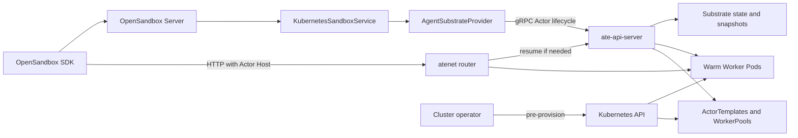
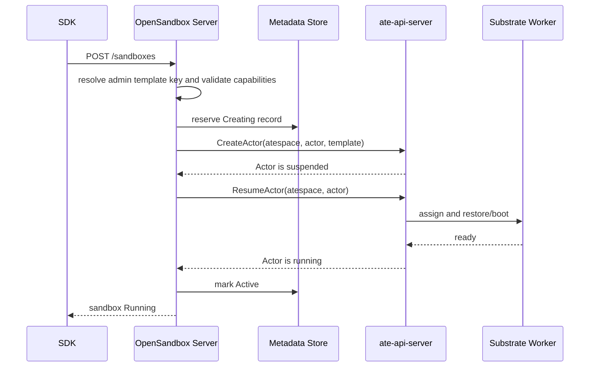

# OSEP-0017: Agent Substrate Workload Provider

<!-- toc -->
- [Summary](#summary)
- [Motivation](#motivation)
  - [Agent Substrate Findings](#agent-substrate-findings)
  - [Goals](#goals)
  - [Non-Goals](#non-goals)
- [Requirements](#requirements)
- [Proposal](#proposal)
  - [Architecture](#architecture)
  - [Lifecycle Mapping](#lifecycle-mapping)
  - [Request Compatibility](#request-compatibility)
  - [Notes/Constraints/Caveats](#notesconstraintscaveats)
  - [Risks and Mitigations](#risks-and-mitigations)
- [Design Details](#design-details)
  - [Provider and Client Structure](#provider-and-client-structure)
  - [Configuration](#configuration)
  - [Actor Identity and Atespace Mapping](#actor-identity-and-atespace-mapping)
  - [Multi-Tenancy](#multi-tenancy)
  - [Template Catalog](#template-catalog)
  - [Normalized Workload Records](#normalized-workload-records)
  - [Create Flow](#create-flow)
  - [Get and List Flows](#get-and-list-flows)
  - [Delete Flow](#delete-flow)
  - [Pause and Resume](#pause-and-resume)
  - [Status Mapping](#status-mapping)
  - [Endpoint Routing](#endpoint-routing)
  - [Expiration and Metadata](#expiration-and-metadata)
  - [Capabilities and Validation](#capabilities-and-validation)
  - [Errors, Retries, and Reconciliation](#errors-retries-and-reconciliation)
  - [Security](#security)
  - [Observability](#observability)
  - [Delivery Phases](#delivery-phases)
- [Test Plan](#test-plan)
- [Drawbacks](#drawbacks)
- [Alternatives](#alternatives)
- [Infrastructure Needed](#infrastructure-needed)
- [Upgrade & Migration Strategy](#upgrade--migration-strategy)
- [POC Decision Record](#poc-decision-record)
<!-- /toc -->

## Summary

Add `agent-substrate` as the third Kubernetes workload provider, alongside
`batchsandbox` and `agent-sandbox`. For per-sandbox lifecycle operations, the
provider calls the Agent Substrate `ateapi.Control` gRPC API and maps an
OpenSandbox sandbox to a Substrate Actor. It does not create a Kubernetes
workload resource for each sandbox.

Agent Substrate still runs on Kubernetes. Administrators provision
`WorkerPool`, `SandboxConfig`, and immutable `ActorTemplate` resources through
the Kubernetes API, then register the allowed ActorTemplates in OpenSandbox
under stable template keys. A user selects one of those keys when creating a
sandbox. The OpenSandbox hot path resolves the key and creates, reads, resumes,
suspends, lists, and deletes Actors through `ateapi`; it never accepts an inline
ActorTemplate or creates one per sandbox.

This proposal is intentionally a draft. The reviewed Agent Substrate project
is in early development and explicitly does not promise API compatibility. It
also has several semantic differences from the current `WorkloadProvider`
contract that must be resolved before a proof of concept becomes a production
implementation.

## Motivation

The current OpenSandbox Kubernetes providers create a custom resource through
the Kubernetes API and wait for a controller to reconcile it. Agent Substrate
keeps Kubernetes for capacity management, but removes the Kubernetes control
plane from the per-Actor activation path. It multiplexes many logical Actors
onto a smaller set of warm Worker Pods and restores Actors directly onto an
available Worker.

This model is relevant to OpenSandbox workloads that are numerous, stateful,
and frequently idle. A provider integration could offer:

- lower activation latency by avoiding a per-sandbox Kubernetes API write
- greater density through Actor-to-Worker multiplexing
- process memory and filesystem preservation through Substrate snapshots
- stable Actor addressing while physical Worker assignment changes
- OpenSandbox SDK and lifecycle API compatibility for the supported subset

The design is similar in intent to OSEP-0007's remote fast-path provider, but
uses Agent Substrate's Actor, Worker, snapshot, and routing model.

### Agent Substrate Findings

This proposal is based on Agent Substrate `main` commit
`c1ab0958f85202faf9f87ea66cd98903a9de763b`, pinned when POC implementation
began on 2026-07-14. The relevant upstream behavior is:

- Agent Substrate is a Kubernetes-hosted system that maps logical Actors onto
  warm Worker Pods. Kubernetes provisions the system and Worker capacity, but
  `ateapi` controls Actor lifecycle.
- `ActorTemplate` is an immutable Kubernetes CRD containing the OCI images,
  commands, environment, readiness probe, volume definitions, sandbox class,
  Worker selector, and snapshot policy. Creating an Actor does not accept an
  arbitrary Pod or container specification; it references an existing
  `ActorTemplate` by namespace and name.
- An Atespace must exist before an Actor can be created. Actors are addressed
  by `(atespace, actor name)`.
- A newly created Actor starts suspended. `ResumeActor` assigns a Worker and
  restores or boots the workload. `SuspendActor` writes a durable snapshot,
  while `PauseActor` keeps a faster node-local snapshot.
- `DeleteActor` only accepts a suspended Actor. A running Actor must first be
  suspended. A paused Actor may need to be resumed and then suspended before
  deletion.
- `GetActor`, paginated `ListActors`, `CreateActor`, `UpdateActor`,
  `SuspendActor`, `PauseActor`, `ResumeActor`, and `DeleteActor` are exposed by
  the gRPC `ateapi.Control` service.
- The atenet router addresses an Actor as
  `<actor>.<atespace>.actors.resources.substrate.ate.dev` and resumes it on
  inbound traffic. At the time of review, the router forwards to Actor port 80
  and contains an explicit TODO for additional ports.
- `ateapi` supports TLS plus either its mTLS mode or Kubernetes ServiceAccount
  JWT authentication. The current mTLS authenticator does not yet attach a
  transport identity to an authorization layer.
- The upstream README labels the project as very early, not production-ready,
  and likely to make breaking API changes.

Primary upstream references:

- [Agent Substrate README](https://github.com/agent-substrate/substrate)
- [API guide](https://github.com/agent-substrate/substrate/blob/main/docs/api-guide.md)
- [Architecture](https://github.com/agent-substrate/substrate/blob/main/docs/architecture.md)
- [ActorTemplate types](https://github.com/agent-substrate/substrate/blob/main/pkg/api/v1alpha1/actortemplate_types.go)
- [CreateActor implementation](https://github.com/agent-substrate/substrate/blob/main/cmd/ateapi/internal/controlapi/create_actor.go)
- [atenet routing implementation](https://github.com/agent-substrate/substrate/blob/main/cmd/atenet/internal/router/extproc.go)
- [ateapi authentication](https://github.com/agent-substrate/substrate/tree/main/internal/ateapiauth)

### Goals

- Register `agent-substrate` as a selectable `WorkloadProvider` under the
  Kubernetes runtime.
- Use Agent Substrate gRPC APIs instead of a per-sandbox Kubernetes API write
  for Actor lifecycle operations.
- Keep the public OpenSandbox lifecycle API and SDK unchanged for behavior the
  provider declares as supported.
- Map a stable OpenSandbox sandbox ID to a stable Substrate Actor identity.
- Allow users to select an administrator-registered ActorTemplate without
  allowing arbitrary template namespace/name references or inline templates.
- Route all OpenSandbox data-plane access through atenet so endpoints remain
  stable when Actors are resumed on different Workers.
- Define how the provider composes with OSEP-0014 multi-tenancy by mapping each
  authenticated OpenSandbox tenant to an explicit Atespace and allowed template
  keys, while keeping multi-tenancy out of the initial POC.
- Support create, get, list, delete, pause, resume, status, and endpoint lookup
  for administrator-registered ActorTemplates.
- Fail before side effects when an OpenSandbox request asks for behavior that
  the selected ActorTemplate or current Substrate release cannot provide.
- Define explicit compatibility, authentication, timeout, retry, and
  observability requirements for the external gRPC dependency.
- Preserve `batchsandbox` as the default provider and keep both existing
  providers unchanged.

### Non-Goals

- Installing or operating Agent Substrate from the OpenSandbox server.
- Creating `WorkerPool`, `SandboxConfig`, or `ActorTemplate` resources for
  every sandbox request.
- Accepting inline ActorTemplate manifests or unrestricted Kubernetes
  namespace/name references from users.
- Replacing the Agent Substrate scheduler, snapshot store, router, or Worker
  lifecycle.
- Claiming support for arbitrary images, environment variables, resource
  limits, volumes, platforms, or ports when they are fixed by an
  `ActorTemplate`.
- Silently ignoring unsupported OpenSandbox request fields.
- Migrating an existing BatchSandbox or kubernetes-sigs `Sandbox` into an
  Actor.
- Making Agent Substrate production-ready or stabilizing its upstream APIs.
- Demonstrating multi-tenant isolation in the initial POC. The POC is
  single-tenant; the production design and prerequisites are included here.
- Implementing production-only capabilities such as durable metadata,
  multi-replica coordination, or multi-tenancy in the initial POC.

## Requirements

- `kubernetes.workload_provider = "agent-substrate"` selects the provider.
- The provider must not create a Kubernetes workload object for an individual
  sandbox. Actor lifecycle must use `ateapi`.
- Atespaces, ActorTemplates, WorkerPools, SandboxConfigs, snapshot storage, and
  router infrastructure must be provisioned by an administrator before the
  server starts.
- The administrator must register every user-selectable ActorTemplate in the
  OpenSandbox server configuration under a stable, unique template key.
- An Agent Substrate create request must set
  `extensions["agent-substrate.template"]` to one registered template key.
  The key is mutually exclusive with the image, snapshot, and pool creation
  sources.
- OpenSandbox must resolve the user-supplied key to the administrator-configured
  ActorTemplate namespace/name. It must never treat the extension value as a
  direct Kubernetes object reference.
- The server must validate configured Atespaces and template references during
  readiness checks, or fail the first dependent request with a precise error if
  the upstream API cannot validate them directly.
- A successful OpenSandbox create must include both `CreateActor` and
  `ResumeActor`; returning a newly created but suspended Actor is not success.
- Unsupported request fields must produce `HTTP 400` before PVC creation,
  metadata persistence, Actor creation, or any other side effect.
- The provider must not fall back to another workload provider after an
  `ateapi` failure. Such fallback would create ambiguous ownership and duplicate
  sandboxes.
- Actor names must be deterministic, DNS-1123 compatible, collision-resistant,
  and reversible through provider metadata.
- List operations must return only Actors owned by this OpenSandbox deployment,
  even when an Atespace also contains Actors created by other clients.
- The POC must run in single-tenant mode with one administrator-created
  Atespace configured by `agent_substrate.default_atespace`.
- A production multi-tenant deployment must map every authenticated OSEP-0014
  `TenantEntry.name` to exactly one pre-created Atespace. Tenant names or
  Kubernetes namespaces must not be converted implicitly into Atespace names.
- A production multi-tenant deployment must define the registered template
  keys each tenant may select. Missing tenant mappings, duplicate Atespace
  assignments, and empty template allowlists must fail startup.
- Every lifecycle and lookup operation must resolve the authenticated tenant
  first and remain scoped to that tenant's Atespace and provider records. A
  sandbox owned by another tenant must appear not found.
- Delete must satisfy Substrate's suspended-only precondition and be safe to
  retry after partial completion.
- OpenSandbox pause must release the Actor's Worker and preserve durable state;
  therefore this provider maps it to `SuspendActor`, never the node-local
  `PauseActor`.
- All gRPC calls must have deadlines. Retries must be limited to idempotent
  reads or documented retryable lifecycle outcomes.
- Production TLS must verify the `ateapi` server certificate. Bearer tokens,
  private keys, and certificate material must be supplied by file references or
  workload identity, never inline in server TOML.
- Generated gRPC code must be reproducible from a pinned, documented upstream
  proto revision. Upstream compatibility must be covered by CI.
- The POC targets Agent Substrate `main` commit
  `c1ab0958f85202faf9f87ea66cd98903a9de763b`. Generated protobufs, deployment
  assets, Kind installation, and CI must all use that SHA rather than following
  the moving branch.
- Production support requires durable, shared OpenSandbox metadata and
  expiration state. The POC deliberately uses a single-replica, process-local
  in-memory record store and does not provide HA, restart recovery, or durable
  TTL cleanup.
- `agent_substrate.router_endpoint` is required. Every endpoint returned by the
  provider must use atenet and include the Actor's required Host header.
- The provider must never return a current Worker or `AteomPodIp` address to an
  OpenSandbox client, including in the POC, because that address becomes stale
  when the Actor moves.
- For the reviewed Substrate revision, every registered ActorTemplate that
  supports standard OpenSandbox command and file APIs must expose `execd`
  through Actor port 80, the port currently supported by atenet.
- Existing `batchsandbox` and `agent-sandbox` behavior, configuration, and
  defaults must remain unchanged.

## Proposal

Introduce `AgentSubstrateProvider`, an adapter between the existing
`KubernetesSandboxService` and Agent Substrate's control and routing APIs. The
adapter returns a normalized workload-shaped object to existing OpenSandbox
mapping code, but its source of runtime truth is an Actor rather than a
Kubernetes custom resource.

The provider uses two planes:

1. Administrative plane, outside the per-sandbox request path
   - Kubernetes operators install Agent Substrate.
   - Operators create WorkerPools, SandboxConfigs, ActorTemplates, Atespaces,
     snapshot storage, DNS, and router resources.
   - OpenSandbox administrators register the ActorTemplates users may select
     and assign each one an opaque template key.
2. Actor plane, used by OpenSandbox
   - A user selects an administrator-defined template key in `CreateSandbox`.
   - OpenSandbox resolves that key to an ActorTemplate namespace/name.
   - OpenSandbox calls the `ateapi.Control` gRPC service.
   - OpenSandbox returns a stable atenet route for data-plane access.

### Architecture



No arrow from `AgentSubstrateProvider` to the Kubernetes API is required to
create an Actor. `KubernetesSandboxService` may still use its Kubernetes client
for cluster-scoped OpenSandbox features, but the provider must reject features
that would require a per-Actor Kubernetes object unless a later OSEP defines
their semantics.

### Lifecycle Mapping

| OpenSandbox operation | Agent Substrate operation | Notes |
|---|---|---|
| Create | `CreateActor`, then `ResumeActor` | Actor creation alone leaves it suspended. |
| Get | `GetActor` | Join with the OpenSandbox workload record. |
| List | `ListActors` | Follow page tokens and filter by ownership records. |
| Pause | `SuspendActor` | Durable snapshot and Worker release. |
| Resume | `ResumeActor` | Restore latest durable snapshot. |
| Delete | Ensure suspended, then `DeleteActor` | A paused Actor may require resume then suspend. |
| Renew expiration | Update OpenSandbox workload record | No reviewed Actor TTL field provides equivalent behavior. |
| Patch metadata | Update OpenSandbox workload record | Do not call inherited Kubernetes label patching. |
| Get endpoint | Return atenet router plus Actor Host | Baseline supports only configured logical-to-port-80 mappings. |

Substrate `PauseActor` is not used to implement OpenSandbox pause. It keeps
node-local state and has different durability and placement semantics. Exposing
it later would require an explicitly named extension and a separate proposal
that defines node loss, eviction, migration, and deletion behavior.

### Request Compatibility

An Actor is created from an immutable ActorTemplate. The administrator owns the
set of templates: they create the Substrate resources and map each approved
ActorTemplate to an opaque key in the OpenSandbox configuration. The user
selects a key through the provider-specific extension:

```json
{
  "timeout": 3600,
  "metadata": {"team": "research"},
  "extensions": {
    "agent-substrate.template": "python"
  }
}
```

The value `python` is not a Kubernetes resource name. OpenSandbox might map it
to `opensandbox-templates/python-execd`, but that concrete namespace/name is
visible and mutable only in administrator configuration.

The public request validator must recognize the extension as an additional
creation mode, mutually exclusive with the existing image, snapshot, and pool
modes. In Agent Substrate template mode, `image`, `snapshotId`, `entrypoint`,
`resourceLimits`, and `resourceRequests` are not required; if supplied, they
are rejected rather than silently ignored.

Initial compatibility target:

| OpenSandbox field or feature | Baseline | Required behavior |
|---|---|---|
| `extensions["agent-substrate.template"]` | Required | Resolve the administrator-defined key to exactly one configured ActorTemplate; reject unknown keys. |
| `image.uri` | Template-owned | Omit from the request; reject a per-request image because the ActorTemplate defines it. |
| `image.auth` | Unsupported | Reject; template/Worker infrastructure owns image pull credentials. |
| `entrypoint` | Template-owned | Omit from the request; reject a per-Actor override. |
| `env` | Template-owned | Omit from the request; reject custom values. |
| CPU/memory limits and requests | Template-owned | Omit from the request; the ActorTemplate and WorkerPool define the profile. |
| `platform` | Template-owned | Omit from the request; the ActorTemplate selects its sandbox class and eligible Workers. |
| `volumes` | Unsupported initially | Reject before OpenSandbox creates PVCs. |
| `networkPolicy` and egress sidecar | Unsupported initially | Reject; requires a Substrate-native egress design. |
| Credential Vault proxy | Unsupported initially | Reject because it depends on the egress sidecar path. |
| user metadata | Provider record | Persist outside the Actor until upstream metadata supports it. |
| expiration/renew | Process-local record and reaper in the POC | Best-effort only; durable and HA-safe behavior is deferred to production work. |
| pause/resume | Supported | Map to suspend/resume. |
| arbitrary endpoint port | Unsupported initially | Only explicit logical port mappings to Actor port 80 are accepted. |
| secure access routes | Unsupported initially | Requires integration between OpenSandbox signing and atenet. |

The provider must never replace an unsupported value with a template default
without telling the caller.

### Notes/Constraints/Caveats

- The integration bypasses Kubernetes only for per-Actor lifecycle. Agent
  Substrate itself remains Kubernetes-dependent.
- An OpenSandbox-compatible ActorTemplate must include or bake in `execd` and
  arrange for it to listen on the port reachable through atenet. The existing
  Kubernetes init-container injection path cannot be applied dynamically to an
  already immutable ActorTemplate.
- ActorTemplate images are expected to be digest-pinned because a changing
  image invalidates golden and Actor snapshots.
- Template creation can take time because Substrate prepares a golden snapshot.
  OpenSandbox readiness must not report healthy until all configured templates
  are ready.
- Worker capacity, per-Actor scheduling, snapshot location, and sandbox class
  are Substrate concerns. The provider may narrow Worker selection only through
  fields supported by the Actor API and allowlisted configuration.
- The reviewed Actor API does not provide OpenSandbox's labels, annotations,
  arbitrary image details, or expiration contract. A normalized provider record
  is therefore needed for full API parity.
- Substrate Actors may share an Atespace with non-OpenSandbox Actors. Prefix
  filtering alone is not sufficient production ownership proof; it must be
  combined with durable workload records.
- `ListActors` is paginated. The provider must consume all pages needed by the
  OpenSandbox list request and enforce an upper bound to prevent unbounded work.
- Upstream APIs may change before this OSEP is implemented. The compatibility
  pin is part of the provider release, not an incidental dependency update.

### Risks and Mitigations

| Risk | Mitigation |
|---|---|
| Immutable templates cannot represent arbitrary OpenSandbox requests | Administrators register multiple approved templates; users select one by key; reject per-request workload overrides. |
| Upstream gRPC API changes | Pin a tested revision, generate clients reproducibly, and run integration CI against that revision. |
| OpenSandbox returns success for a suspended Actor | Treat create as `CreateActor + ResumeActor` and wait for running status. |
| Create succeeds but resume fails | Keep a `Creating` workload record, attempt compensating suspend/delete, and reconcile any remaining Actor. |
| Delete fails because Actor is running or paused | Normalize to suspended with a bounded state machine before `DeleteActor`; make retries idempotent. |
| Metadata or expiration store is unavailable | Fail creation before Actor side effects, or compensate immediately if persistence is lost after Actor creation. |
| Multiple server replicas race lifecycle calls | Use Substrate's conflict response and bounded retry for supported operations; use compare-and-set records for OpenSandbox metadata transitions. |
| atenet only forwards Actor port 80 | Require an explicit logical port mapping and compatible template for the first version; reject all other ports. |
| Worker IP changes after resume | Use atenet for every endpoint, including the POC; never expose a Worker IP to clients. |
| Authentication is present but authorization is incomplete upstream | Restrict network access and credentials, pin Atespaces/templates in config, and do not claim tenant isolation until it is enforced end to end. |
| Snapshot or Worker capacity is exhausted | Map gRPC status precisely, expose reason/latency metrics, and return retryable service errors rather than creating a fallback workload. |
| Atespace contains foreign Actors | List and mutate only identities backed by this deployment's durable workload records. |
| Provider switch strands existing sandboxes | Document that provider selection is not a migration mechanism and block unsafe live switching operationally. |

## Design Details

### Provider and Client Structure

Add the following server modules in an implementation PR:

```text
opensandbox_server/services/k8s/
  agent_substrate_provider.py
  agent_substrate_client.py
  agent_substrate_mapper.py
  agent_substrate_metadata.py
```

`provider_factory.py` gains:

```python
PROVIDER_TYPE_AGENT_SUBSTRATE = "agent-substrate"
```

and registers `AgentSubstrateProvider` without changing the default registry
order.

`AgentSubstrateClient` owns channel construction, authentication, deadlines,
request metadata, and conversion of gRPC failures into typed provider errors.
The provider owns OpenSandbox semantics and must not expose generated protobuf
objects to `KubernetesSandboxService`.

The Python client should use generated protobuf stubs. Preferred dependency
order:

1. an official, versioned Agent Substrate Python client, when available
2. reproducibly generated stubs from a pinned upstream proto revision

Generated output must not be edited manually. The pinned upstream revision and
generation command must be recorded next to the generated package.

The current `WorkloadProvider.patch_labels` implementation assumes Kubernetes
custom-resource fields (`group`, `version`, and `plural`).
`AgentSubstrateProvider` must override it. A later cleanup may move Kubernetes
helpers out of the abstract base class, but that refactor is not required to
prove Actor lifecycle integration.

### Configuration

Proposed configuration shape:

```toml
[kubernetes]
workload_provider = "agent-substrate"

[agent_substrate]
api_endpoint = "dns:///api.ate-system.svc:443"
router_endpoint = "http://atenet-router.ate-system.svc:80"
ca_file = "/var/run/secrets/kubernetes.io/serviceaccount/ca.crt"
server_name = "api.ate-system.svc"
default_atespace = "opensandbox"
rpc_timeout_seconds = 20

# Optional when ateapi requires Kubernetes ServiceAccount JWT authentication.
# token_file = "/var/run/secrets/kubernetes.io/serviceaccount/token"

[[agent_substrate.templates]]
key = "python"
namespace = "opensandbox-templates"
name = "python-execd"
logical_port = 44772
actor_port = 80

# Production multi-tenant example; omitted by the single-tenant POC.
[[agent_substrate.tenants]]
tenant = "team-a"
atespace = "team-a-actors"
templates = ["python"]
```

Rules:

- `api_endpoint`, at least one template registration, and atespace mappings are
  required.
- `router_endpoint` is required; there is no direct-Worker endpoint mode.
- `actor_port` must be 80 for the reviewed atenet implementation.
- TLS verification is mandatory in production. Any development-only setting
  that skips verification must default to `false` and produce a startup warning
  when enabled.
- Token contents and private keys are never valid TOML values.
- Each template key must be unique and resolve to exactly one ActorTemplate
  namespace/name configured by the administrator.
- The request value is looked up only as a key. Values that resemble
  `namespace/name` do not bypass the lookup and are rejected unless an
  administrator deliberately registered that exact opaque key.
- OpenSandbox does not automatically expose every ActorTemplate in the cluster.
  Only templates present in this configuration are user-selectable.

In single-tenant mode, `default_atespace` is required and
`agent_substrate.tenants` is omitted. In multi-tenant mode, the provider uses
the authenticated `TenantEntry.name` from OSEP-0014 for an exact lookup in
`agent_substrate.tenants`; `default_atespace` is not a fallback for an
unmapped tenant.

### Actor Identity and Atespace Mapping

Use a deterministic Actor name with an OpenSandbox-owned prefix:

```text
osb-<dns-safe-sandbox-id-or-hash>
```

The algorithm must:

- preserve the sandbox ID directly when the prefixed value fits the Substrate
  resource-name rules
- append a stable hash when normalization or truncation is required
- remain within the upstream name length limit
- store the original sandbox ID and resulting Actor name in the normalized
  workload record

The `(atespace, actor name)` pair is the upstream primary key. The provider
must never search all Atespaces by name and take the first match.

Atespace policy:

- single-tenant mode uses `agent_substrate.default_atespace`
- multi-tenant mode maps `TenantEntry.name` to an explicit Atespace
- Atespaces are pre-created; sandbox creation does not create or delete them
- an OpenSandbox deployment must use a dedicated Actor prefix and should use a
  dedicated Atespace where practical

### Multi-Tenancy

The initial POC is single-tenant and uses one pre-created Atespace. Production
multi-tenancy composes with the authentication and tenant context introduced by
OSEP-0014 rather than defining a second tenant system.

For each lifecycle request, the provider reads `get_current_tenant()`:

- no tenant context means single-tenant mode and resolves to
  `agent_substrate.default_atespace`
- a tenant context resolves `TenantEntry.name` through the explicit
  `agent_substrate.tenants` map
- the mapping yields one Atespace and the subset of administrator-registered
  template keys that tenant may use
- an unmapped tenant or disallowed template is rejected before any `ateapi`
  call, without revealing another tenant's template or Actor inventory

Tenant-scoped provider records use `(tenant_name, sandbox_id)` as their
ownership key and retain the resolved Atespace and Actor name. `get`, `list`,
`delete`, `pause`, `resume`, metadata patch, expiration, and background cleanup
must use that stored scope. They must never search all Atespaces for a matching
sandbox ID. A cross-tenant lookup returns `404`, matching OSEP-0014's lifecycle
API isolation behavior.

Each production tenant must have a distinct Atespace. Actor names are only
unique inside an Atespace, and atenet routes with both values:

```text
<actor>.<tenant-atespace>.actors.resources.substrate.ate.dev
```

Templates may be shared across tenants only when the administrator includes the
same template key in each tenant's allowlist. Template secrets and golden
snapshots require particular care because resolved environment secrets can be
captured in template state; tenant-specific secrets should use tenant-specific
ActorTemplates.

Atespace separation is necessary for identity, lookup, and routing, but it is
not by itself a proven authorization boundary. OpenSandbox currently connects
to `ateapi` using the server's identity, and the reviewed upstream mTLS path
does not demonstrate per-Atespace authorization. Production multi-tenancy must
therefore retain OpenSandbox's tenant checks on every control-plane operation,
restrict access to `ateapi`, and document or add an upstream authorization
boundary before claiming defense in depth against a compromised server.

### Template Catalog

The template catalog is the administrator-owned allowlist of immutable
ActorTemplates that OpenSandbox users may select. Each entry records at least:

- catalog key
- ActorTemplate namespace/name
- logical OpenSandbox port and physical Actor port
- supported platform/sandbox class
- whether pause/resume and readiness have been validated

Selection is explicit and deterministic. The user supplies one catalog key in
`extensions["agent-substrate.template"]`; the provider performs an exact key
lookup. A missing or unknown key is a request error. There is no automatic
matching by image, entrypoint, resources, or platform, and there is no fallback
template.

The provider does not discover or expose ActorTemplates through the Kubernetes
API on each create. Startup/readiness validation may use an administrative
client or a future Substrate template-discovery API. The administrator's
catalog entry remains the request-time authorization boundary and contract.

### Normalized Workload Records

Existing OpenSandbox mapping expects workload metadata, labels, annotations,
creation time, image, entrypoint, expiration, and status. Build a normalized
dictionary from an Actor plus a provider-owned record:

```text
AgentSubstrateWorkloadRecord
  tenant_name
  sandbox_id
  actor_name
  atespace
  actor_template_namespace
  actor_template_name
  template_catalog_key
  image_uri
  entrypoint
  labels
  annotations
  created_at
  expires_at
  lifecycle_generation
  phase
  last_error
```

The dictionary returned to shared mapping code should retain the established
workload shape where practical:

```python
{
    "metadata": {
        "name": actor_name,
        "labels": labels,
        "annotations": annotations,
        "creationTimestamp": created_at,
    },
    "spec": {
        "template": {
            "spec": {
                "containers": [{"image": image_uri, "command": entrypoint}]
            }
        }
    },
    "agentSubstrate": actor_view,
}
```

This keeps `_build_sandbox_from_workload` usable while `get_status`,
`get_expiration`, and `get_endpoint_info` remain provider methods.

The POC stores these records in the OpenSandbox server process and runs only one
server replica. Records and expiration schedules are lost when that process
restarts; any remaining Actors require manual inspection and cleanup. The POC
does not claim HA, restart recovery, or durable TTL semantics.

The production store technology is intentionally deferred. Before production,
it must be shared by all server replicas, support compare-and-set or equivalent
conflict protection, and avoid a Kubernetes API write in the Actor creation hot
path. Direct writes into Substrate's private Valkey schema are forbidden.

### Create Flow



Detailed behavior:

1. Require the user-selected template key and resolve it to the ActorTemplate
   namespace/name configured by the administrator.
2. Validate that no conflicting image, snapshot, pool, entrypoint, environment,
   resource, platform, volume, or networking fields were supplied before
   OpenSandbox creates PVCs or the provider writes metadata.
3. Reserve a `Creating` provider record using the sandbox ID as an idempotency
  key. This record is process-local in the POC and durable in production.
4. Call `CreateActor` with the mapped identity and template reference.
5. If the Actor already exists, fetch it and continue only when the provider
  record proves it belongs to the same sandbox and template request.
6. Call `ResumeActor` with a bounded deadline.
7. Poll `GetActor` only when the resume response does not establish the final
   state required by OpenSandbox.
8. Mark the workload record `Active` and return the normalized workload.

If Actor creation succeeds but later steps fail, the provider records the
failure and attempts a compensating suspend/delete. Reconciliation handles an
Actor that cannot be deleted during the request deadline.

### Get and List Flows

Get:

1. Resolve tenant context and read the workload record by tenant name, sandbox
  ID, and Atespace.
2. Call `GetActor` with the exact Actor reference.
3. Return `404` when both are absent.
4. Return a recoverable inconsistency error, and schedule reconciliation, when
   only one side exists.
5. Join the Actor state with the normalized workload record.

List:

1. List OpenSandbox-owned records for the authenticated tenant and resolved
  Atespace.
2. Call `ListActors`, following page tokens within configured bounds.
3. Join by exact `(atespace, actor name)`.
4. Exclude foreign Actors and handle missing-side inconsistencies explicitly.
5. Apply the existing OpenSandbox filters and pagination to normalized
   sandboxes.

Using records as the ownership source prevents one OpenSandbox deployment from
listing or deleting Actors created by another client.

### Delete Flow

Substrate only deletes suspended Actors. The provider uses a bounded,
idempotent state machine:

```text
NotFound                         -> success for retry/cleanup
Suspended                        -> DeleteActor
Running                          -> SuspendActor -> DeleteActor
Paused                           -> ResumeActor -> SuspendActor -> DeleteActor
Resuming/Pausing/Suspending      -> wait or return conflict/retryable error
Crashed                          -> use upstream-supported cleanup path or surface error
```

The record is marked `Deleting` before the first lifecycle mutation and is
removed only after `DeleteActor` returns success or `NotFound`. If a deadline
expires, reconciliation continues cleanup and the API returns a retryable
error. The provider must not delete a record first and leave an unowned Actor.

### Pause and Resume

OpenSandbox pause maps to `SuspendActor` because it needs durable state and
Worker release. When the RPC completes, `get_status` maps the Actor to
`Paused` in the OpenSandbox API even though the upstream state is named
`SUSPENDED`.

OpenSandbox resume calls `ResumeActor`. It must preserve the public sandbox ID,
Atespace, Actor name, template identity, metadata, and expiration. Resume does
not create a new Actor.

`PauseActor` is not an alias for the public pause operation. Any future
provider-specific low-latency local pause requires a separate proposal defining
node loss, Worker pressure, migration, and subsequent delete behavior.

### Status Mapping

The exact enum names must be generated from the pinned upstream proto. The
semantic mapping is:

| Substrate semantic state | OpenSandbox state |
|---|---|
| running and ready | `Running` |
| newly created, restore queued, or resuming | `Pending` or `Resuming` according to the public lifecycle context |
| pausing or suspending | `Pausing` |
| suspended | `Paused` |
| node-local paused | `Paused`, with a provider-specific reason, if encountered |
| crashed or terminal workflow failure | `Failed` |
| unknown future enum value | `Pending` with reason `AGENT_SUBSTRATE_UNKNOWN_STATUS` and a warning metric |

The provider must include the upstream gRPC code or workflow reason in a stable
OpenSandbox reason without returning sensitive internal details to clients.
Unknown values must not be treated as Running.

### Endpoint Routing

All endpoints, including POC endpoints, use atenet so the route survives Actor
movement and can resume a suspended Actor on demand.

For a configured Actor:

```text
Host: <actor>.<atespace>.actors.resources.substrate.ate.dev
Target: <configured atenet router endpoint>
```

`get_endpoint_info` returns the router address plus the required Host header in
the OpenSandbox `Endpoint` object. It accepts only a catalog-declared logical
port. The first version maps that logical port to Actor port 80, because the
reviewed atenet router hard-codes port 80.

An OpenSandbox-compatible POC template runs `execd` on Actor port 80 while
advertising OpenSandbox's logical execd port through the provider. Arbitrary
application ports, raw TCP, and multiple ports require an upstream atenet
capability or an additional OpenSandbox routing design.

The provider never returns `AteomPodIp:<port>` or another direct Worker address.
Such an endpoint is unstable because an Actor can move whenever it resumes.

### Expiration and Metadata

The reviewed Actor API does not implement OpenSandbox's expiration and
arbitrary label contract. The provider therefore stores them in the normalized
workload record.

Expiration behavior:

- create writes `expires_at` to the process-local record before creating the
  Actor
- renew updates the process-local record
- get/list read expiration from the record
- a single-process best-effort reaper invokes the normal delete state machine
- a record is retained with error state when Actor cleanup cannot complete
- server restart loses records and scheduled expiration; operators must clean
  up any resulting Actors manually during the POC

Metadata patch behavior:

- patch the provider record using the same merge semantics as the public API
- rebuild and return the normalized workload
- do not call Kubernetes `patch_custom_object`

Expiration and metadata durability, multi-replica coordination, and restart
recovery remain explicit POC limitations. The provider must not be advertised
for production until a durable shared store and HA-safe reaper exist.

### Capabilities and Validation

The current service performs some Kubernetes-specific side effects before
calling `create_workload`, notably PVC provisioning. Add a provider capability
or preflight contract that is checked before those side effects.

Conceptual capabilities:

```python
WorkloadProviderCapabilities(
    administrator_template_reference=True,
    arbitrary_image=False,
    image_auth=False,
    entrypoint_override=False,
    environment_override=False,
    resource_override=False,
    volumes=False,
    network_policy=False,
    credential_proxy=False,
    arbitrary_ports=False,
    secure_access=False,
    pause=True,
    resume=True,
    metadata_patch=True,
    expiration=True,
)
```

Template selection makes an administrator-defined workload available without
making any of its fields overrideable. `arbitrary_image=False`, for example,
means the request cannot select or replace the image independently of the
chosen template.

This preflight contract should also replace provider-name checks where
possible. It prevents a new provider from accidentally reaching BatchSandbox-
specific PVC, ingress, image-secret, or egress paths.

### Errors, Retries, and Reconciliation

Map gRPC codes consistently:

| gRPC outcome | OpenSandbox behavior |
|---|---|
| `InvalidArgument` | `400` invalid parameter |
| `Unauthenticated` | `503` provider authentication failure; do not expose credentials |
| `PermissionDenied` | `503` provider authorization failure, or `403` only when safely attributable to the caller |
| `NotFound` | `404` for get; idempotent success in cleanup contexts |
| `AlreadyExists` | idempotency check, otherwise `409` |
| `FailedPrecondition` | `409` lifecycle conflict or `503` missing infrastructure, based on typed context |
| `Aborted` | bounded retry for documented concurrent Actor updates |
| `ResourceExhausted` | `429` or `503` with retry guidance |
| `DeadlineExceeded` | `504` |
| `Unavailable` | `503` |

Retries:

- retry `GetActor` and `ListActors` on transient transport failures with
  bounded exponential backoff
- retry `Aborted` lifecycle operations only where upstream documents the
  operation as idempotent
- do not blindly retry `CreateActor` without an ownership/idempotency lookup
- never retry beyond the OpenSandbox request deadline

Reconciliation scans non-terminal provider records and repairs:

- record exists, Actor absent
- Actor exists, record is `Creating`
- Actor exists, record is `Deleting`
- metadata expiration passed, Actor still exists
- Actor is terminal/crashed

### Security

- Use TLS with server verification in production.
- Prefer short-lived Kubernetes ServiceAccount JWTs or fully verified mTLS.
- Mount credentials read-only and rotate them without server restart where the
  client library permits.
- Restrict network access so only the OpenSandbox server and Substrate system
  components can reach `ateapi`.
- Restrict the provider to configured Atespaces and administrator-registered
  templates.
- In multi-tenant mode, resolve `TenantEntry.name` through an explicit mapping,
  enforce that tenant's template allowlist, and scope every provider record and
  Actor operation to the resulting Atespace.
- Return `404` for cross-tenant sandbox lookups and avoid errors that disclose
  another tenant's Actor or template inventory.
- Accept only a registered template key from the caller; do not accept an
  inline ActorTemplate or a direct ActorTemplate namespace/name.
- Do not log bearer tokens, environment values, secret references, or full
  protobuf payloads containing sensitive data.
- Treat template environment secrets carefully: upstream documentation notes
  that resolved values can be captured in a golden snapshot.
- Do not claim OpenSandbox multi-tenant isolation solely because Atespaces are
  distinct. The reviewed upstream mTLS path has authentication work in progress
  and no demonstrated per-Atespace authorization boundary.
- Keep OpenSandbox secure-access routes disabled until signed-route semantics
  are integrated with atenet or enforced by an authenticated front proxy.

### Observability

Emit provider-neutral OpenTelemetry spans and metrics with low-cardinality
attributes:

- provider (`agent-substrate`)
- operation (`create`, `resume`, `suspend`, `delete`, `get`, `list`)
- template catalog key
- result gRPC code
- Actor semantic state
- retry count

Required metrics include:

- gRPC request duration and failures
- create-to-running duration
- suspend and resume duration
- Actor cleanup/reconciliation backlog
- expired Actors pending deletion
- metadata/Actor inconsistency count
- unknown upstream status count

Actor names, sandbox IDs, and Atespaces should be log fields and trace context
where needed for diagnosis, not metric labels.

### Delivery Phases

Phase 0: design decisions (complete)

- use the choices recorded in the POC Decision Record
- use Agent Substrate commit `c1ab0958f85202faf9f87ea66cd98903a9de763b` as the
  POC compatibility revision
- agree on the POC compatibility subset and success criteria

Phase 1: local POC, only after Phase 0

- single-tenant mode with one administrator-created Atespace
- at least one administrator-created and registered ActorTemplate, plus a
  compatible WorkerPool
- user request selects the registered template key
- generated Python gRPC client
- create + resume, get, list, suspend + resume, and delete
- `execd` reachable through atenet on Actor port 80, including after a
  suspend/resume that changes Worker assignment
- one OpenSandbox server replica with process-local in-memory records and a
  best-effort expiration reaper
- no HA, restart recovery, or durable TTL guarantee; restart cleanup is manual
- no claim of durable metadata or TTL semantics, volume, egress,
  secure-access, or multi-tenant support

Phase 2: provider contract integration

- capability preflight before service side effects
- normalized workload mapping
- administrator-owned template catalog and strict key/conflict validation
- stable atenet endpoint mapping
- focused unit and integration tests

Phase 3: production prerequisites

- durable shared records and expiration reaper
- verified TLS/authentication and documented authorization boundary
- explicit OSEP-0014 tenant-to-Atespace mappings and per-tenant template
  allowlists
- tenant-scoped lifecycle, list, endpoint, expiration, and reconciliation tests
- reconciliation and operational metrics
- upstream compatibility CI and version matrix
- documentation and deployment examples

The POC is successful only if it demonstrates that OpenSandbox can create an
Actor without a per-sandbox Kubernetes API write, wait for it to run, reach
`execd`, suspend and resume state, and delete it cleanly. The create request
must select an administrator-registered template key, and OpenSandbox must pass
the mapped ActorTemplate reference to `CreateActor`.

## Test Plan

The runnable [Agent Substrate POC test guide](../docs/examples/agent-substrate.md)
walks through deployment health checks, local API and atenet port-forwards, the
public REST lifecycle, cleanup verification, and confirmation that no
per-sandbox Kubernetes workload is created. Its smoke test lives under
[`examples/agent-substrate`](../examples/agent-substrate/README.md), alongside
the pinned AKS [`setup_poc.sh`](../examples/agent-substrate/setup_poc.sh)
installer.

### Unit tests

- provider factory registers `agent-substrate` without changing the default
- config rejects missing endpoints, credentials, Atespace, duplicate template
  keys, and invalid template references
- multi-tenant config rejects an unmapped tenant, duplicate Atespace assignment,
  unknown template key, and empty per-tenant template allowlist
- Actor name normalization is deterministic and collision-resistant
- template-key selection accepts registered keys and rejects missing or unknown
  keys, direct namespace/name references, and inline template data
- template mode is mutually exclusive with image, snapshot, and pool modes
- every unsupported feature is rejected before provider side effects
- Actor status values map to OpenSandbox states, including unknown values
- gRPC error codes map to stable HTTP/provider errors
- create performs `CreateActor` before `ResumeActor`
- duplicate create verifies ownership rather than adopting a foreign Actor
- delete state machine covers suspended, running, paused, transitional, absent,
  and crashed Actors
- pause uses `SuspendActor`, not `PauseActor`
- list follows page tokens and excludes foreign Actors
- endpoint generation includes the exact Actor Host and rejects undeclared
  ports
- endpoint generation always targets atenet and never returns `AteomPodIp` or a
  direct Worker address
- metadata patch and expiration renewal update records without Kubernetes label
  patches

### Contract tests with a fake gRPC service

- deadlines and authentication metadata are attached
- transient read failures use bounded retries
- `Aborted` resume conflicts use bounded retries
- create/resume partial failure triggers compensation and reconciliation state
- concurrent create/delete calls preserve a valid record transition
- unavailable metadata store prevents unowned Actor creation

### Integration tests

- install the pinned Agent Substrate revision in Kind
- assert generated protobuf stubs and deployed Substrate components identify
  the same recorded `main` commit SHA
- provision one Atespace, WorkerPool, SandboxConfig, and at least two
  digest-pinned ActorTemplates registered under different keys
- assert each user-selected key creates an Actor from the mapped ActorTemplate
  and an unknown key is rejected before `CreateActor`
- assert create/get/list/pause/resume/delete through OpenSandbox APIs
- assert an inbound atenet request resumes a suspended Actor
- assert the endpoint remains valid when suspend/resume changes the assigned
  Worker
- assert `execd` command execution and file operations work through the returned
  endpoint
- assert process/filesystem state expected by the selected Substrate snapshot
  mode survives suspend/resume
- assert no per-sandbox Kubernetes custom resource is created by OpenSandbox
- assert a foreign Actor in the same Atespace is not listed or deleted
- assert Worker exhaustion and snapshot failure surface useful OpenSandbox
  status and metrics

### Production-readiness tests

- multiple OpenSandbox replicas share records safely
- tenant A and tenant B create Actors in distinct Atespaces
- tenant A cannot get, list, delete, pause, resume, or request an endpoint for
  tenant B's sandbox
- each tenant can select only its configured template keys
- atenet Host values include the correct tenant Atespace
- expiration deletes Actors exactly once from the API consumer's perspective
- server restart during create, suspend, resume, and delete is reconciled
- certificate and ServiceAccount token rotation does not require downtime
- network policy prevents unapproved clients from reaching `ateapi`
- compatibility test runs whenever the pinned Substrate revision changes

## Drawbacks

- Per-request workload fields are limited to administrator-approved
  ActorTemplates, which is less flexible than the current image-based
  OpenSandbox create API.
- Full API parity requires a durable metadata/expiration subsystem because the
  reviewed Actor API does not carry all OpenSandbox workload fields.
- Agent Substrate adds a separate control plane, state store, snapshot store,
  router, DNS path, CRDs, and node components to operate.
- The upstream project is early and likely to break the integration.
- Port-80-only routing does not naturally match OpenSandbox's arbitrary-port
  endpoint API or the default execd port.
- Delete can be expensive for a node-local paused Actor because it may require
  resume, durable suspend, and then delete.
- Agent Substrate's multiplexing and snapshot isolation model differs from a
  one-Pod-per-sandbox model and needs separate security review.
- Multi-tenancy requires a second explicit mapping from OSEP-0014 tenant names
  to Substrate Atespaces and template allowlists, and Atespaces alone do not
  provide a demonstrated upstream authorization boundary.

## Alternatives

### Continue using BatchSandbox pools

BatchSandbox pools already reduce creation latency and preserve the existing
request model. They are operationally simpler and have stronger current
OpenSandbox feature coverage. They do not provide Substrate's Actor snapshot
and multiplexing model or remove the Kubernetes control plane from the
allocation path.

### Use kubernetes-sigs/agent-sandbox

The existing `agent-sandbox` provider offers a Kubernetes-native Sandbox CRD
and keeps OpenSandbox's Pod-spec mapping. It is a better match for arbitrary
per-request images and sidecars, but still reconciles one Kubernetes resource
per sandbox and does not provide the same Actor multiplexing semantics.

### Build a separate OpenSandbox-to-Substrate gateway

A standalone gateway could translate the OpenSandbox API to Substrate and keep
the main server unchanged. It adds another deployed service, duplicates API
validation and authentication, and splits observability. An in-process provider
is preferred while the integration remains one runtime selection.

### Dynamically create an ActorTemplate per sandbox

This preserves more request flexibility, but requires a Kubernetes API write,
golden snapshot preparation, template garbage collection, and potentially one
immutable template per unique request. It defeats the intended hot path and is
not the baseline proposal.

### Add per-Actor workload overrides upstream

Extending `CreateActor` to accept safe image, command, environment, resource,
and port overrides could align the systems more closely. It requires upstream
design and can undermine golden snapshot reuse. This may be pursued separately
if fixed templates are too restrictive.

### Store OpenSandbox metadata in a Kubernetes CR or ConfigMap

This reuses Kubernetes persistence, but adds a per-sandbox Kubernetes API write
to the hot path and couples Actor availability to a second resource. It is not
selected because it conflicts with the primary motivation.

### Write metadata directly into Substrate's Valkey database

Rejected. The store schema is an upstream private implementation detail and
the provider must use supported APIs rather than corrupting ownership
boundaries.

## Infrastructure Needed

- A Kind or managed Kubernetes cluster supported by the pinned Agent Substrate
  revision.
- Agent Substrate control plane, Worker components, atenet router/DNS, Valkey,
  and supported snapshot object storage.
- A pre-created Atespace.
- One or more administrator-created, digest-pinned ActorTemplates registered in
  OpenSandbox, with `execd` reachable on the approved Actor port when standard
  OpenSandbox command and file APIs are required.
- A compatible WorkerPool and SandboxConfig.
- TLS CA and either mTLS credentials or a projected ServiceAccount JWT for the
  OpenSandbox server.
- CI automation that installs the pinned upstream revision and regenerates or
  verifies Python protobuf stubs.
- Before production, a durable shared metadata backend and an HA-safe
  expiration/reconciliation worker.

## Upgrade & Migration Strategy

This is an additive provider. Existing installations remain on the first
registered provider, currently `batchsandbox`, unless operators explicitly set:

```toml
[kubernetes]
workload_provider = "agent-substrate"
```

There is no in-place migration of live sandboxes. Operators must drain or
delete sandboxes owned by the old provider before switching an existing server
deployment. Rollback follows the same rule: stop creating Actors, clean up or
retain them intentionally, then restore the previous provider configuration.

Provider records must include a schema version. Compatible record migrations
run before the provider reports ready. An incompatible upstream Substrate
upgrade must be blocked by the documented version matrix until integration
tests pass.

Removing the provider configuration does not delete Actors, Atespaces,
templates, WorkerPools, or snapshots automatically. Cleanup remains an
explicit operator action.

## POC Decision Record

All pre-POC design questions are resolved:

| Decision | POC choice |
|---|---|
| ActorTemplate ownership | Administrators create and register allowed ActorTemplates; users select one by opaque key. Inline and unrestricted template references are rejected. |
| Data-plane endpoint | Route `execd` exclusively through atenet on Actor port 80; never expose direct Worker addresses. |
| Metadata and expiration durability | Use one server replica with process-local records and best-effort expiration. HA, restart recovery, and durable TTL cleanup are production work. |
| Tenancy | Run the POC single-tenant with one pre-created Atespace. Retain explicit OSEP-0014 tenant-to-Atespace mappings and per-tenant template allowlists in the production design. |
| Agent Substrate revision | Use `main` commit `c1ab0958f85202faf9f87ea66cd98903a9de763b`. |
| OpenSandbox pause | Call durable `SuspendActor` to release the Worker and preserve relocatable state. Do not call node-local `PauseActor`. |
