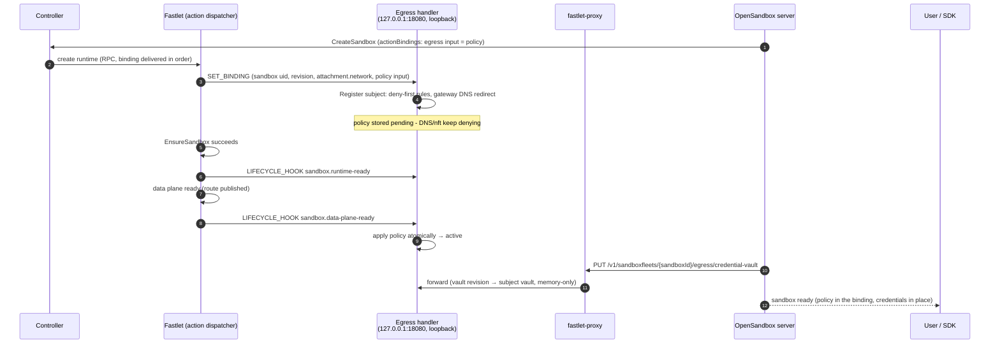
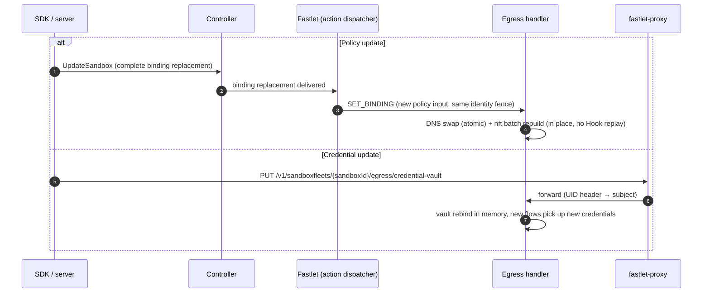

# OSEP-0022: Multi-Sandbox Egress Control Plane

<!-- toc -->
- [Summary](#summary)
- [Motivation](#motivation)
- [Goals and Non-Goals](#goals-and-non-goals)
- [Core Design](#core-design)
  - [Subject Abstraction](#subject-abstraction)
  - [Two Control Channels](#two-control-channels)
  - [Lifecycle and Fail-Closed Guarantee](#lifecycle-and-fail-closed-guarantee)
  - [Per-Subject Policy Consumption](#per-subject-policy-consumption)
  - [Sequences](#sequences)
- [System Boundaries](#system-boundaries)
  - [Profile Separation](#profile-separation)
  - [Security Boundaries](#security-boundaries)
  - [Platform Adapters](#platform-adapters)
  - [Scaling Constraints](#scaling-constraints)
- [Impact on fast-sandbox](#impact-on-fast-sandbox)
  - [Requirements on the Existing Implementation](#requirements-on-the-existing-implementation)
  - [Internal Additions (credential channel only)](#internal-additions-credential-channel-only)
  - [Explicitly Untouched](#explicitly-untouched)
  - [OpenSandbox Server](#opensandbox-server)
- [Test Plan](#test-plan)
- [Drawbacks and Alternatives](#drawbacks-and-alternatives)
- [Infrastructure and Migration](#infrastructure-and-migration)
<!-- /toc -->

## Summary

A single egress control plane serves N sandboxes sharing one host/network domain (fast-sandbox Fastlet Pod, or bwrap isolated sessions). The existing single-sandbox sidecar profile is unchanged; the opt-in `fleet` profile adds a **Subject** abstraction — one opaque identifier per sandbox owning an isolated slice of policy, credentials, and kernel rules — dispatched by platform-provided identity keys. For fast-sandbox, the integration is **API-based, not file-based**: subject lifecycle and policy are delivered by the Fastlet over its public **Sandbox Actions Handler protocol** (`SET_BINDING` / `LIFECYCLE_HOOK` / `REMOVE_BINDING`, `sandbox.fast.io/actions/v1`) — the earlier slot-store file observation is explicitly not used. Policy rides the Sandbox CRD `actionBindings` (declarative, revisioned, fast-sandbox-owned); only credentials are pushed by the server over fast-sandbox's proxy-route mechanism, staying memory-only in egress (consistent with OSEP-0012). A subject is fail-closed (deny-everything) from `SET_BINDING` registration until its `sandbox.data-plane-ready` Hook lands, so policy delivery can be late, never early-open.

## Motivation

Egress today is a single sidecar sharing one netns with exactly one sandbox, relying on `CAP_NET_ADMIN` isolation (RFC [opensandbox-group/OpenSandbox#1582](https://github.com/opensandbox-group/OpenSandbox/issues/1582)). Two platform shapes break that model: fast-sandbox Fastlet Pods host N sandboxes with privileged guest roots (control plane must stay in the host domain), and bwrap sessions share the host netns with **no IP of their own** (source-IP dispatch impossible; host uid is the only key). Both need the same thing — *one control plane, many independent policy domains* — and the egress engines are already reusable (`pkg/nftables` has an injectable runner, `pkg/dnsproxy` a configurable listen address, `pkg/credentialvault` is in-memory); the missing piece is the policy-routing layer.

## Goals and Non-Goals

Goals:

1. **Subject abstraction**: platform-neutral identity as the unit of policy, credential, and rule ownership; dispatch key pluggable (source IP / host uid / cgroup path).
2. **Multi-sandbox dispatch**: one egress process hosts N independent subjects.
3. **Zero impact on single-sandbox mode**: sidecar profile, env, API, behavior unchanged when the `fleet` profile is off.
4. **Consume, don't modify**: fast-sandbox CRD, RPC protocol, and fastlet process are used as-is; the integration rides the public Sandbox Actions Handler protocol. The slot-store file observation is explicitly NOT used.
5. **No new public contract of our own**: `specs/egress-api.yaml` unchanged; policy is carried by the platform's own `actionBindings` (not a new egress-specific carrier); no egress-local persistence.
6. **Engine reuse**: no behavioral changes inside `pkg/dnsproxy`, `pkg/nftables`, `pkg/credentialvault`, `pkg/mitmproxy`.

Non-Goals: no per-process policies; no eBPF; no in-guest control plane; no rate limiting; no DNS-protocol changes; no policy storage on the cluster; no credentials in the action binding (the binding input is persisted in the Sandbox CRD and is not a secret transport).

## Core Design

### Subject Abstraction

A **Subject** is one opaque identifier per sandbox (e.g. `s-<sandboxUID>`), owning an isolated slice of policy, credentials, and kernel rules. **Dispatch keys** are platform-provided identity material: fast-sandbox uses the sandbox source IP (from the action attachment); bwrap uses the host uid (cgroup path reserved for the future). The dispatch hot path is a pure map lookup (identity key → Subject); the registry owns the in-process state machine (absent → denying → active); the rule builder is the cold path producing per-subject kernel-rule content.

Single-sandbox mode is the process being one implicit subject (no-op layer); the `fleet` profile is N subjects. The authority over "who is who" never belongs to egress — each adapter must prove its key unforgeable (IPAM + per-sandbox netns without `NET_ADMIN`; execd-assigned uid).

### Two Control Channels

The `fleet` profile has **no sandbox-reachable policy surface** (a fast-sandbox guest root is untrusted and must not rewrite its own policy). All policy/credential state flows over two disjoint channels, neither of which involves the earlier slot-store file observation (`/run/fast-sandbox/network/*.json` is not consumed):

| Channel | Direction | Auth | Carries |
|---------|-----------|------|---------|
| **1. Sandbox Actions Handler protocol** `/_fastlet/v1/actions` + `/_fastlet/v1/actions/status` | Fastlet → egress handler (Pod-loopback HTTP on the action `targetHTTPPort` 18080) | Pod-netns loopback; the envelope carries sandbox UID + revision fencing; the Fastlet is the only caller | Subject lifecycle (`SET_BINDING` / `LIFECYCLE_HOOK` / `REMOVE_BINDING`) and **policy** (the binding input, declarative via the Sandbox CRD `actionBindings`) |
| **2. Proxy route** `/v1/sandboxfleets/{sandboxId}/egress/*` | server/SDK → fastlet-proxy → egress listener (`127.0.0.1:18080`, Pod netns) | Ed25519 route credential (proxy-verified) + `X-Fast-Sandbox-Uid` header added by proxy | **Credential pushes** (`/credential-vault`, memory-only in egress) and runtime policy/vault operations (existing `egress-api.yaml` semantics) |

The listener binds `127.0.0.1:18080` (Pod netns loopback) — sandbox netns cannot reach it, so the Fastlet's action dispatcher and fastlet-proxy are the only peers; egress rejects unknown UIDs (404). Credentials are delivered by the server as complete vault revisions over the proxy route, consistent with OSEP-0012 (no Kubernetes Secret, no kubelet sync dependency). There is no unix socket, no Secret volume, and no egress-managed state file.

#### Action envelope fields consumed

Egress reads exactly these fields from the action envelope (everything else is ignored). They replace the slot-record fields of the earlier file-based design:

| Envelope field | Used for |
|-------|----------|
| `sandbox.uid` | Subject identity (`s-<uid>`) |
| `revision.runtimeInstanceId`, `revision.attachmentId` | identity fencing (a change = rebind, discard all prior state) |
| `revision.specGeneration` | pending-push fencing (`X-Fast-Sandbox-Generation` comparison) |
| `attachment.network.ip` | dispatch key (`ip saddr`) |
| `attachment.network.hostVeth` | reserved (no longer used: on the bridge topology the IP hooks see skb->dev = the bridge, so an iifname match on the pod-side veth would never fire) |
| `attachment.network.gateway` | gateway DNS REDIRECT target / MITM DNAT target |
| `attachment.network.privateCidr` | sibling-isolation rules |
| `binding.input` | the policy (opaque; parsed by egress as its policy format) |
| `hook.name` / `hook.sequence` | lifecycle checkpoint delivery order (`sandbox.runtime-ready`, `sandbox.data-plane-ready`) |

**Contract status — resolved**: the earlier open question (the slot store's path/JSON shape/phase semantics being fastlet-internal implementation details) is resolved by adopting the Sandbox Actions Handler protocol: binding delivery, Hook delivery, identity fencing, and replay semantics are a **supported public contract** owned by fast-sandbox, delivered over Pod-loopback HTTP instead of a shared file store. No fastlet-side stabilization work is needed.

### Lifecycle and Fail-Closed Guarantee

```
  SET_BINDING arrives      data-plane-ready lands     steady
absent ────────────────► denying ────────────────► active ────► …
    ▲                       │ deny-first                │
    └──── REMOVE_BINDING ◄──────────────────────────────┘
```

The Fastlet is the only lifecycle dispatcher; egress is the Handler.

- **Register** on `SET_BINDING` (identity + fencing from the envelope's `sandbox.uid` and `revision`); the subject installs deny-first rules immediately (nft sets empty, gateway DNS REDIRECT + forward rules) — fully blocked until policy lands. The binding input (the policy) is parsed and held **pending**, but DNS and nft keep denying.
- **Activate** on the `sandbox.data-plane-ready` Hook: DNS policy swap + one atomic nft batch (delete+add in a single `nft -f` transaction). `sandbox.runtime-ready` only confirms the deny-first install. An input update on an already-ready subject applies in place without replaying Hooks. A `SET_BINDING` with a JSON-null input (binding removed from a still-live sandbox) reverts to deny-first.
- **Unload** on `REMOVE_BINDING` (terminal cleanup): detach → deny → free. A stale removal (fence mismatch for a previous instance of the same UID) is ignored; missing Handler state is success.
- **Race handling**: a credential push for an unknown UID is cached as pending (with TTL) until `SET_BINDING` registers the subject; both sides idempotent. Fencing mismatch (same UID, new runtime/attachment identity) discards old state — a reset can never carry old policy into a new sandbox.
- **Recovery**: on egress restart the Handler wipes stale kernel rules and serves a new `instanceId` on the status endpoint; the Fastlet detects the change and replays the latest `SET_BINDING` followed by the already-reached Hooks for every live sandbox — every subject re-enters `denying` through the same registration path. Server reconciliation re-pushes credential revisions.

### Per-Subject Policy Consumption

```
 SubjectRegistry:  s-A→policy/vault/sets   s-B→policy/vault/sets   s-C→…
        │                │                       │
   SubjectResolver (hot path: source IP → Subject)
        │                │                       │
   DNS proxy         nft builder             mitmdump (SHARED)
   per-query policy  per-subject sets        vault by client source IP
   (w.RemoteAddr)    (deny-first)            (REDIRECT preserves source IP)
        └── resolved IPs ──► dynamic allow sets (per subject)
```

Each subject owns an isolated slice (policy, vault, kernel sets); the resolver is the only shared component (pure map lookup). The mitmdump instance is shared in the fast-sandbox adapter; per-subject listeners are only needed where identity is not recoverable from the socket (bwrap uid mode).

### Sequences

#### Sandbox creation: binding + Hook delivery, then credential initialization



Invariant: deny-first is installed at `SET_BINDING`, which precedes the `sandbox.runtime-ready` Hook — the sandbox is enforced from before its runtime exists; the Hooks can be late, never early-open.

#### Runtime updates



Unload is declarative: sandbox deletion → Fastlet sends `REMOVE_BINDING` → egress tears the subject down. No lifecycle verb exists on the proxy route.

## System Boundaries

### Profile Separation

The two profiles are mutually exclusive deployment forms. `sidecar`: a service inside the sandbox network domain owning the public contract (18080, `/policy`, `/credential-vault`) — unchanged. `fleet` (`OPENSANDBOX_EGRESS_PROFILE=fleet`): a host-domain control-plane component — subject lifecycle and policy from the Fastlet's action protocol, credentials pushed by the server over the proxy route.

### Security Boundaries

| Boundary | Guarantee |
|----------|-----------|
| No sandbox-reachable policy surface | Listener on Pod-netns loopback only; sandbox guests cannot reach it; the Fastlet action dispatcher and fastlet-proxy are the only peers — the UID header trust relies on that peer exclusivity |
| Control plane outside the sandbox | Egress daemon never runs in the guest (RFC #1582 trust-boundary analysis); sandbox users run privileged and cannot touch it |
| Credentials memory-only | Complete vault revisions are pushed over the proxy route (OSEP-0012 model) and held in egress memory; never written to egress disk; no per-subject secret reuse (breach scoping). The action binding input never carries credentials (persisted in the Sandbox CRD). Transport note: the proxy route is Pod-network HTTP — the same trust domain the existing route-credential mechanism already assumes |
| Fail-closed at every transition | `denying` state, atomic policy swaps, deny-first registration, data-plane-ready as the only activation signal |
| Management plane independent of subject state | While a subject is `denying` (or `active`), credential pushes and runtime policy/vault operations remain fully usable: the proxy route terminates in the host domain (Pod-netns loopback) and never traverses sandbox traffic paths — only application traffic is blocked (DNS NXDOMAIN + forward drop) |
| No creation window when egress is unavailable | The OpenSandbox runtime driver probes egress healthz (`127.0.0.1:18080/healthz`, same Pod netns) inside `EnsureSandbox` before creating the sandbox container; unready egress rejects creation. The normal path has no window anyway: deny-first is installed at `SET_BINDING`, which precedes the `sandbox.runtime-ready` Hook, and deny-first installation is far faster than container startup; a fully deterministic guarantee (independent of timing) would additionally require the driver to confirm the subject is registered before container creation — recorded as a known trade-off |
| Dispatch key unforgeability | IPAM + per-sandbox netns without `NET_ADMIN` (existing); the new OpenSandbox driver additionally drops `NET_RAW`; Pod netns rp_filter strict mode rejects forged source IPs (iifname binding is not usable on the bridge topology — the IP hooks see skb->dev = the bridge) |
| Enforcement placement | Pod netns `hook forward` (ACCEPT policy + unmarked-drop tail; allowed traffic is marked in per-subject `hook prerouting` chains with `meta mark set 0x2`, because an explicit forward `accept` cannot pass on the `bridge-nf-call-iptables=1` Firecracker bridge topology — the frame returns to the bridge L2 path and is dropped before postrouting) plus the Pod-netns INPUT chain for intercepted MITM traffic; Kata covered via TAP (same forward surface). The earlier per-sandbox netns OUTPUT defense-in-depth layer is dropped (the action envelope does not carry the netns path; the Pod-netns layers are authoritative for both forwarded and intercepted traffic) |

### Platform Adapters

| Concern | fast-sandbox | bwrap (setpriv) |
|---------|-------------|-----------------|
| SubjectKey | source IP (from the action attachment) | host uid |
| Enforcement hook | Pod netns `hook forward` + Pod-netns INPUT chain (MITM traffic) | host netns `hook output` |
| DNS | gateway REDIRECT → shared proxy on :15353 | per-subject port REDIRECT `-m owner --uid-owner` (port = subject) |
| MITM | shared mitmdump, vault by client IP | per-subject ports |
| Lifecycle authority | Fastlet action dispatcher (`SET_BINDING` / `LIFECYCLE_HOOK` / `REMOVE_BINDING`, `sandbox.fast.io/actions/v1`) | execd session registry, same protocol pattern (TBD, detailed separately) |
| Credentials | proxy-route vault endpoints (OSEP-0012 model) | proxy-route vault endpoints |
| Endpoint | `/_fastlet/v1/actions` (Fastlet, Pod loopback) + `/v1/sandboxfleets/{sandboxId}/egress/*` via `ResolveEndpoint` (proxy route, host delivery mode) | TBD (execd adapter to be detailed separately) |

### Scaling Constraints

Two scales matter independently. **Cluster-wide** there is no centralized bottleneck: bindings are delivered point-to-point by each Fastlet, and credentials are pushed point-to-point per Fastlet Pod — no watch storm, no etcd write amplification, no API-server dependency in the control path (the Fastlet reads its own bindings; the server never watches). **Per-Pod density** (target 64 subjects/Pod, ≤100 policy updates/s/Pod): nft dispatch is O(1) with incremental per-subject set updates; the connection-refresh loop is bucketed per subject; one shared mitmdump; DNS proxy is a stateless map lookup. Server orchestration must be idempotent — a failed credential push leaves the subject `denying` (safe) and the server retries before marking the sandbox usable.

## Impact on fast-sandbox

### Requirements on the Existing Implementation

Verified against current source (`internal/runtime/containerd/driver.go` and the Sandbox Actions protocol docs):

| Requirement | Status | Notes |
|------------|--------|-------|
| Sandbox Actions Handler protocol: `GET /_fastlet/v1/actions/status` + `POST /_fastlet/v1/actions` (`SET_BINDING` / `LIFECYCLE_HOOK` / `REMOVE_BINDING`), ordered delivery, `instanceId` replay | ✅ already present | consumed as-is by egress; the handler binds the Pool-declared `targetHTTPPort` (18080) |
| `actionHandlers` / `actionBindings` in Pool/Sandbox specs | ✅ already present | egress is declared as a Handler; the input carries the policy |
| Slot pre-provisioning: netns/veth/MASQUERADE ready before sandbox creation; network attachment (IP, gateway, veth) delivered with `SET_BINDING` before runtime creation | ✅ already present | basis of the no-creation-window guarantee |
| Sandbox without `NET_ADMIN` (dispatch key unforgeable) | ✅ already present | spec sets no capabilities; runc defaults exclude `NET_ADMIN` |
| Route-credential issuance/verification + fastlet-proxy in Pod netns | ✅ already present | reused as-is for the credential channel |
| Egress container mountable via `FastletTemplate` | ✅ deployment-level | no code change |

### Internal Additions (credential channel only)

The lifecycle/policy channel needs **zero** fast-sandbox work (the Actions protocol is public). Only the credential channel over the proxy route requires these additions; all are internal, no API/CRD/protocol changes:

1. **Host delivery mode** in the infra catalog (`InfraDeliveryMode`, e.g. `host-process`, alongside bind-mount/image-layer/guest-copy, `internal/catalog/runtime/catalog.go`): compiled into the Pool revision but excluded from the in-sandbox `sandbox-init` supervisor config; the daemon is provisioned by `FastletTemplate`; readiness probing targets the Pod-netns listener instead of the sandbox IP.
2. **Host upstream in fastlet-proxy**: the proxy currently forwards to the sandbox `Access` address only (DirectIP/LocalForward). The egress route must forward to the Pod-netns listener (`127.0.0.1:18080`) instead.
3. **UID propagation**: the proxy rewrites outbound paths to the suffix only, so it must inject `X-Fast-Sandbox-Uid` (outside `stripRouteHeaders`) — this is what answers "which subject" for credential pushes.
4. **Route parsing**: `parseTarget` currently recognizes only `/v1/sandboxes/` (ports) and `/v2/sandboxes/` (components) prefixes; it gains a `/v1/sandboxfleets/{sandboxId}/egress/*` branch that resolves the sandbox route, verifies the credential, and targets egress — independent of the component `Components` map. The credential's target semantics in this branch must match what `ResolveEndpoint` issues for the egress target (component-target `egress`, or a dedicated sandboxfleets target — both sides must agree).

Deployment config: egress container in Pool `FastletTemplate` (Pod-netns privileges; no slot-store or netns-mount volumes are needed anymore).

**OpenSandbox runtime driver**: the OpenSandbox integration lands as a **new `internal/runtime/contract.Driver` implementation** (registered in the runtime factory alongside containerd/boxlite). Its container spec drops `NET_RAW` (runc defaults grant it → UDP source spoofing would weaken the source-IP dispatch key; Pod netns rp_filter strict mode is the remaining defense against forged source IPs). The egress healthz probe lives inside its `EnsureSandbox` (before container creation): unready egress → reject with a runtime-unavailable error. Existing drivers are untouched; existing Fastlet Pods without the egress component behave exactly as today.

### Explicitly Untouched

fast-sandbox CRDs, RPC protocol, `SandboxSpec`, fastlet phases/admission/deletion paths, the data-plane reconcile loop, route-credential issuance/verification, `sandbox-init` supervisor, and the existing containerd/boxlite runtime drivers. The Sandbox Actions protocol is consumed as-is (no fast-sandbox code changes; the earlier slot-store file format remains a fastlet-internal detail that egress no longer reads). `specs/egress-api.yaml` and SDKs unchanged. The server's K8s-mode egress sidecar helper (`egress_helper.py`) is untouched.

### OpenSandbox Server

- Fleets mapping removes the phase-1a rejection of `networkPolicy`/`credentialProxy` (`services/fleets/create_mapping.py`): `networkPolicy` is mapped into the Create request's `action_bindings` (egress handler input); the returned sandbox carries the policy declaratively. Credential revisions are still pushed over the proxy route with idempotent retries.
- Policy updates ride `UpdateSandbox` (complete ordered binding replacement) — no separate push; the Fastlet delivers the new `SET_BINDING`.
- Endpoint reuse for the credential channel: `fastpath_client.resolve_endpoint(...)` for the egress target; the returned proxy route uses the `/v1/sandboxfleets/{sandboxId}/egress/*` prefix. Route-credential issuance and proxy verification unchanged.
- Egress readiness surfaced via the platform's `InfraComponentStatus` channel (optional, non-blocking).

## Test Plan

- Unit: subject registry transitions and fail-closed invariants; action-envelope parsing/validation (unknown apiVersion/operation/Hook rejected, null-input vs ordinary string inputs); rule-builder determinism; dispatch (DNS per-subject, nft sets, mitm vault selection).
- fast-sandbox e2e (Kind): N sandboxes with distinct policies on one Fastlet Pod; per-subject allow/deny at DNS/nft; sibling isolation; fail-closed create-then-configure window (deny-first from `SET_BINDING`, policy only after `data-plane-ready`); credential-vault push binds the right subject and rebinds on update; egress-restart recovery (new `instanceId` → Fastlet replays `SET_BINDING` + reached Hooks → `denying` → active, no stale rules); `SET_BINDING(null)` removes the policy; stale `REMOVE_BINDING` (fence mismatch) ignored; sandbox cannot reach any policy-mutation surface; UID-header forgery rejected.
- bwrap: per-uid dispatch with host-uid allowlist intact. Kata: policy enforced via the Pod netns forward hook.
- Compatibility: full egress suite in `sidecar` profile; `test_egress_helper.py` unchanged.
- Manual: kill mid-transition; restart storm; failed push leaves subject `denying`, retry succeeds.

## Drawbacks and Alternatives

Drawbacks: a Pod-domain daemon is a larger trust domain than per-sandbox processes (mitigated by per-subject isolation + deny-first); usable sandboxes require the binding + Hook flow to complete (a stuck Handler keeps the sandbox non-Ready, fail-closed and observable); the credential channel still depends on the proxy route, so credentials cannot ride the action binding (the binding input is persisted in the Sandbox CRD and is not a secret transport).

Alternatives considered: slot-store file observation (rejected — the store is a fastlet-internal implementation detail with no stability contract; superseded by the public Sandbox Actions protocol); per-subject host-side processes (kept as deployment variant); per-sandbox sidecar in the guest netns (rejected — control plane inside the trust boundary it controls is not a security control); eBPF/cgroup dispatch (deferred); an egress-specific policy carrier CRD/ConfigMap (rejected — semantic mismatch, etcd write amplification, watch storms, credential exposure, and it couples a generic component to the cluster API; the platform's own `actionBindings` carry policy declaratively without any of these costs); credentials via a host-domain unix socket or Kubernetes Secret volume (replaced by direct vault-API pushes over the proxy route, consistent with OSEP-0012).

## Infrastructure and Migration

- fast-sandbox: no new repos, no API changes — the four internal additions above (credential channel only) plus deployment config. Cross-repo dependency: import `egress/pkg/...` as a Go module (replace directive) or extract `pkg/subject` plus engines into a shared module.
- `sidecar` is the default profile; existing deployments upgrade with zero config change. `fleet` profile is opt-in (`OPENSANDBOX_EGRESS_PROFILE=fleet`); Fastlet Pods without the egress component behave exactly as today until an operator enables it. Rollout order: egress `fleet` profile behind a feature gate (the actions protocol needs no fast-sandbox code) → fast-sandbox proxy-route additions for the credential channel (inert) → server fleets mapping + orchestration.
