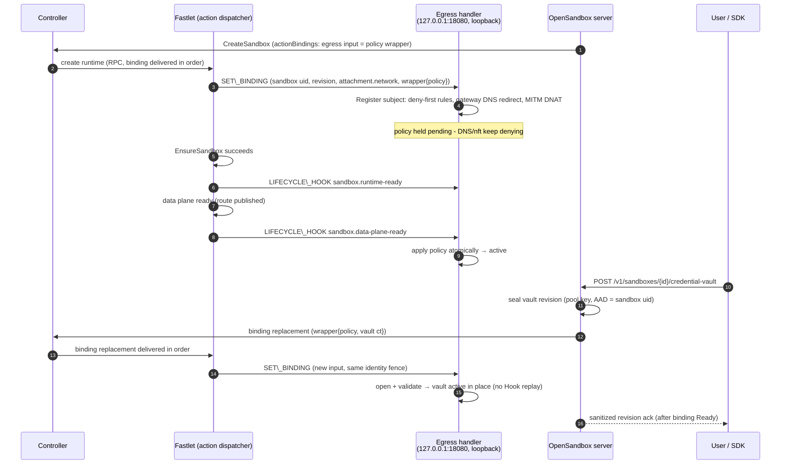
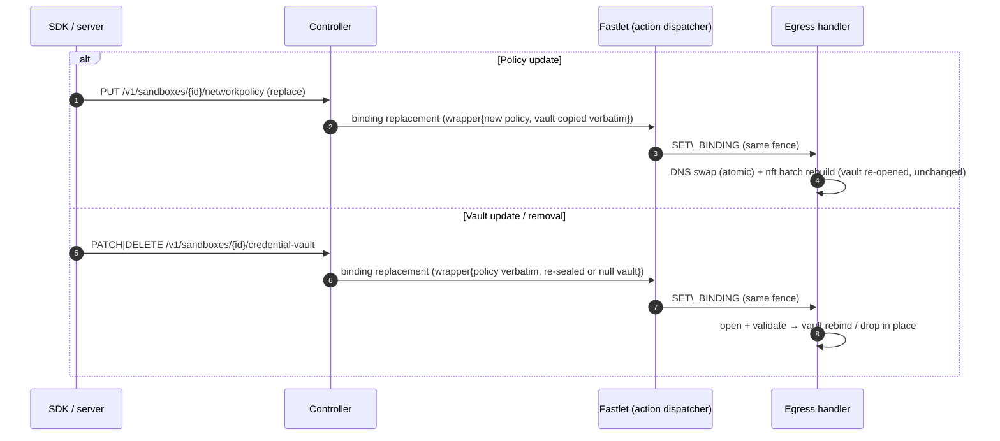

# OSEP-0022: Multi-Sandbox Egress Control Plane

<!-- toc -->
- [Summary](#summary)
- [Motivation](#motivation)
- [Goals and Non-Goals](#goals-and-non-goals)
- [Core Design](#core-design)
  - [Subject Abstraction](#subject-abstraction)
  - [One Control Channel](#one-control-channel)
  - [Credential Vault](#credential-vault)
    - [Vault Envelope](#vault-envelope)
    - [Key Management](#key-management)
    - [Vault Lifecycle](#vault-lifecycle)
  - [MITM Trust Anchor](#mitm-trust-anchor)
  - [Lifecycle and Fail-Closed Guarantee](#lifecycle-and-fail-closed-guarantee)
  - [Per-Subject Policy Consumption](#per-subject-policy-consumption)
  - [Sequences](#sequences)
- [System Boundaries](#system-boundaries)
  - [Profile Separation](#profile-separation)
  - [Security Boundaries](#security-boundaries)
  - [Platform Adapters](#platform-adapters)
  - [Scaling Constraints](#scaling-constraints)
- [Impact on fast-sandbox](#impact-on-fast-sandbox)
  - [Requirements on the Existing Implementation](#requirements-on-the-existing-implementation)
  - [Explicitly Untouched](#explicitly-untouched)
  - [OpenSandbox Server](#opensandbox-server)
- [Test Plan](#test-plan)
- [Drawbacks and Alternatives](#drawbacks-and-alternatives)
- [Infrastructure and Migration](#infrastructure-and-migration)
<!-- /toc -->

## Summary

A single egress control plane serves N sandboxes sharing one host/network domain (fast-sandbox Fastlet Pods, or bwrap isolated sessions). The existing single-sandbox sidecar profile is unchanged; the opt-in `fast-sandbox` profile adds a **Subject** abstraction — one opaque identifier per sandbox owning an isolated slice of policy, credentials, and kernel rules — dispatched by platform-provided identity keys. The integration is **API-based, not file-based**: subject lifecycle, policy, and credential vaults all arrive over the Fastlet's public **Sandbox Actions Handler protocol** (`SET_BINDING` / `LIFECYCLE_HOOK` / `REMOVE_BINDING`, `sandbox.fast.io/actions/v1`). Policy rides the Sandbox CRD `actionBindings` (declarative, revisioned); the credential vault rides the **same binding as an AEAD-sealed revision** (pool-scoped key, sandbox-UID AAD) — ciphertext is the only persisted form; plaintext is memory-only in egress and transient in the server. This supersedes the earlier proxy-route credential channel (fastlet-proxy additions, UID header, and server push/reconcile loop are dropped) and revises OSEP-0012's framing for this profile. A subject is fail-closed from `SET_BINDING` until `sandbox.data-plane-ready`, where policy and vault activate at the same barrier; an undecryptable vault is a permanent, observable binding failure.

## Motivation

Egress today is a single sidecar sharing one netns with exactly one sandbox, relying on `CAP_NET_ADMIN` isolation (RFC [opensandbox-group/OpenSandbox#1582](https://github.com/opensandbox-group/OpenSandbox/issues/1582)). Two platform shapes break that model: fast-sandbox Fastlet Pods host N sandboxes with privileged guest roots (control plane must stay in the host domain), and bwrap sessions share the host netns with **no IP of their own** (source-IP dispatch impossible; host uid is the only key). Both need the same thing — *one control plane, many independent policy domains* — and the egress engines are already reusable (`pkg/nftables` has an injectable runner, `pkg/dnsproxy` a configurable listen address, `pkg/credentialvault` is in-memory); the missing piece is the policy-routing layer.

## Goals and Non-Goals

Goals:

1. **Subject abstraction**: platform-neutral identity as the unit of policy, credential, and rule ownership; dispatch key pluggable (source IP / host uid / cgroup path).
2. **Multi-sandbox dispatch**: one egress process hosts N independent subjects.
3. **Zero impact on single-sandbox mode**: sidecar profile, env, API, behavior unchanged when the `fast-sandbox` profile is off.
4. **Consume, don't modify**: fast-sandbox CRD, RPC protocol, and fastlet process are used as-is; the integration rides the public Sandbox Actions Handler protocol. The slot-store file observation is explicitly NOT used.
5. **No new platform contract**: fast-sandbox CRD, RPC protocol, and Actions protocol unchanged; `specs/egress-api.yaml` unchanged (sidecar profile). The only new contract is the OpenSandbox-owned binding-input wrapper (policy + encrypted vault, server↔egress); no egress-local persistence beyond memory.
6. **Engine reuse**: no behavioral changes inside `pkg/dnsproxy`, `pkg/nftables`, `pkg/credentialvault`, `pkg/mitmproxy`.

Non-Goals: no per-process policies; no eBPF; no in-guest control plane; no rate limiting; no DNS-protocol changes; no policy storage on the cluster; no **plaintext** credentials in the action binding — vault material rides the binding only as AEAD ciphertext under pool-scoped keys (this supersedes the earlier blanket no-credentials-in-binding rule; see [Vault Envelope](#vault-envelope)).

## Core Design

### Subject Abstraction

A **Subject** is one opaque identifier per sandbox (e.g. `s-<sandboxUID>`), owning an isolated slice of policy, credentials, and kernel rules. **Dispatch keys** are platform-provided identity material: fast-sandbox uses the sandbox source IP (from the action attachment); bwrap uses the host uid (cgroup path reserved for the future). The dispatch hot path is a pure map lookup (identity key → Subject); the registry owns the in-process state machine (absent → denying → active); the rule builder is the cold path producing per-subject kernel-rule content.

Single-sandbox mode is the process being one implicit subject (no-op layer); the `fast-sandbox` profile is N subjects. The authority over "who is who" never belongs to egress — each adapter must prove its key unforgeable (IPAM + per-sandbox netns without `NET_ADMIN`; execd-assigned uid).

### One Control Channel

The `fast-sandbox` profile has **no sandbox-reachable policy surface and no second channel** (a fast-sandbox guest root is untrusted and must not rewrite its own policy or vault). Everything flows over one channel:

| Channel | Direction | Auth | Carries |
|---------|-----------|------|---------|
| **Sandbox Actions Handler protocol** `/_fastlet/v1/actions` + `/_fastlet/v1/actions/status` | Fastlet → egress handler (Pod-loopback HTTP on the Pool-declared action `targetHTTPPort`, 18080 in examples) | Pod-netns loopback; the envelope carries sandbox UID + revision fencing; the Fastlet is the only caller | Subject lifecycle (`SET_BINDING` / `LIFECYCLE_HOOK` / `REMOVE_BINDING`), **policy**, and the **encrypted vault revision** (inside the binding input, see [Vault Envelope](#vault-envelope)) |

The listener binds Pod-netns loopback on the Pool-declared `targetHTTPPort` (18080 in examples) and serves exactly the actions endpoints plus `/healthz` (the runtime driver's pre-create probe). `/policy` and `/credential-vault` **do not exist** in this profile — runtime policy and vault updates ride declarative binding replacement (see [OpenSandbox Server](#opensandbox-server)); the MITM addon keeps exchanging active per-subject vault snapshots over the egress-local unix socket (internal, unchanged). Vault ownership needs no UID header: identity is the envelope's `sandbox.uid`.

Two earlier carriers are dropped: the slot-store file observation (`/run/fast-sandbox/network/*.json`) — fastlet-internal, no stability contract — and the proxy-route channel (`/v1/sandboxes/{sandboxId}/egress/*`, `X-Fast-Sandbox-Uid`, fastlet-proxy host upstream, egress route parsing; see [Credential Vault](#credential-vault) for why). The Actions protocol is fast-sandbox's supported public contract — binding/Hook delivery, identity fencing, and `instanceId` replay — so no fastlet-side stabilization work is required.

#### Action envelope fields consumed

Egress reads exactly these fields from the action envelope (everything else is ignored):

| Envelope field | Used for |
|-------|----------|
| `sandbox.uid` | Subject identity (`s-<uid>`); also the vault ciphertext's AAD |
| `revision.runtimeInstanceId`, `revision.attachmentId` | identity fencing (a change = rebind, discard all prior state) |
| `revision.specGeneration` | binding-update fencing |
| `attachment.network.ip` | dispatch key (`ip saddr`) |
| `attachment.network.hostVeth` | unused (on the bridge topology the IP hooks see skb->dev = the bridge, so an iifname match on the pod-side veth would never fire) |
| `attachment.network.gateway` | gateway DNS REDIRECT target / MITM DNAT target |
| `attachment.network.privateCidr` | sibling-isolation rules |
| `binding.input` | the composite input — wrapper `osbEgressInput: 1` carrying `policy` and an optional encrypted `vault`; a bare policy JSON string remains valid (vault-less pools) |
| `hook.name` / `hook.sequence` | lifecycle checkpoint delivery order (`sandbox.runtime-ready`, `sandbox.data-plane-ready`) |

### Credential Vault

The vault joins the policy on the same declarative path. In one sentence: **the vault rides `actionBindings` as an AEAD-sealed revision — ciphertext is the only form persisted anywhere, plaintext lives memory-only in egress and transiently in the server at composition, and it activates together with the policy at `data-plane-ready`.**

- **Why this replaced the proxy-route channel**: the earlier revision pushed vault revisions over a dedicated fastlet-proxy route to keep credentials out of the persisted binding. Sealing each revision with a pool-scoped key resolves that persistence objection while keeping the declarative properties — ordered delivery, revision fencing, Fastlet replay, and snapshot restore give vault recovery for free, with no server push loop, and no credential material ever traverses fastlet-proxy.
- **Surfaces**: no vault HTTP surface in this profile — runtime vault writes go through the server vault API (see [OpenSandbox Server](#opensandbox-server)); the MITM addon's active-vault unix socket stays an internal egress surface. There are **no read APIs**.
- **Failure posture**: any decryption or validation failure is a permanent, observable binding failure — the subject is never half-open.

The subsections below define the wire format ([Vault Envelope](#vault-envelope)), the key system ([Key Management](#key-management)), and how vault state moves through the subject state machine ([Vault Lifecycle](#vault-lifecycle)).

#### Vault Envelope

The binding input is a self-describing wrapper. A bare policy JSON string (today's shape) remains valid and means policy-only:

```json
{
  "osbEgressInput": 1,
  "policy": { "defaultAction": "deny", "egress": [ { "action": "allow", "target": "api.github.com" } ] },
  "vault": {
    "v": 1,
    "kid": "k3",
    "alg": "A256GCM",
    "ct": "<base64(nonce || ciphertext || tag)>"
  }
}
```

Rules:

- `vault.ct` is an **AES-256-GCM** seal of the OSEP-0012 vault JSON (credentials + bindings, a complete revision) under the pool key selected by `kid`, with a random 96-bit nonce and **AAD = `sandbox.uid`** — a ciphertext transplanted into another sandbox's binding fails to open.
- **The input is the complete desired state**: a bare policy input (no wrapper), or a wrapper without `vault`, removes any existing vault from the subject. The server therefore always re-states the full input — policy updates carry the `vault` object verbatim; bare policy input is only sent to vault-less pools.
- Egress validation order (all inside `SET_BINDING`, before any state mutation): parse wrapper → parse policy (invalid = 400) → AEAD open (unknown `kid`, AAD mismatch, or tag failure = **permanent 400**, not a retryable 500) → vault-vs-policy consistency (every binding target covered by the effective policy; ambiguity rules per OSEP-0012). Any failure leaves the subject unregistered: the Fastlet marks the binding `ActionFailed` and the sandbox never becomes usable — fail-closed and observable.
- `"vault": null` removes the vault from a live subject and keeps the policy. An envelope-level JSON-null input removes the whole binding — policy and vault together.
- Unencrypted vault material never appears in the wrapper. The wrapper version (`osbEgressInput`) gates all future format evolution.
- Size: the CRD caps a binding input at 65536 bytes; the server pre-flights the composed size (base64 + nonce + tag overhead ≈ 1.4× the vault JSON).

#### Key Management

- One 256-bit key per SandboxPool, operator-generated, with a stable `kid`.
- **Custody**: one per-pool Secret carries all egress key material — `{kid, key}` entries for the vault seal key and the MITM CA pair — mounted into the egress container as read-only seed volumes (e.g. `/etc/opensandbox/egress-seed/`). The server holds the vault keys via pool-level configuration. No one else ever holds keys: the Fastlet, CRD readers, etcd, and backups see ciphertext only. The server needs no Kubernetes Secret API access.
- **Rotation**: new writes always seal with the newest `kid`; egress keeps the last N (default 3) keys decrypt-only; existing ciphertext re-encrypts lazily on the subject's next binding replacement. Policy-only updates never decrypt: the server copies the `vault` object verbatim from the current binding.
- Compromise scoping: a leaked server pool configuration decrypts that pool's vault history — key material is production-secret tier and must be stored accordingly.

#### Vault Lifecycle

How vault state moves through the subject state machine (absent → denying → active):

- **Register**: the wrapper's vault revision is opened and validated during `SET_BINDING` (before any state mutation, alongside the policy) and held pending; the subject stays fully denying.
- **Activate**: at `sandbox.data-plane-ready` the vault snapshot becomes resolvable at the **same barrier** as the policy swap — a subject's credential-bearing traffic can only ever flow through a loaded vault. A vault delivered after activation applies in place without replaying Hooks.
- **Update**: a revision replace (`PATCH`) re-seals and applies in place on an active subject; the server acknowledges only after the binding status reports Ready (revisioned ack per OSEP-0012 semantics, fenced by the binding generation).
- **Remove**: `DELETE` seals `vault: null` — the vault is dropped from the live subject and the policy is kept. An envelope-level JSON-null input removes the whole binding: policy and vault together. `REMOVE_BINDING` frees enforcement and vault as terminal cleanup.
- **Recovery**: egress restart → Fastlet replays `SET_BINDING` → egress re-opens the ciphertext from the replayed binding → re-denies → re-activates on the replayed Hook. **No server re-push exists or is needed.** Pause/resume: the binding (with ciphertext) is preserved in the snapshot manifest and re-applied on restore, so the vault survives restore.
- **Failure**: any decryption or validation failure is a permanent 400 — the binding reports `ActionFailed` and the sandbox never becomes usable. Fail-closed, never half-open.

### MITM Trust Anchor

The fast-sandbox profile **pins the MITM CA**: a per-pool, operator-generated keypair provisioned once — mitmdump loads it from its confdir and never generates a new one. Combined with baking the public certificate into sandbox templates at build time, there is **no per-sandbox certificate delivery, guest trust seeding, or bootstrap step** in this profile, for Firecracker or containerd alike.

- **Provisioning**: the CA pair (`mitm-ca-cert.pem` + `mitm-ca-key.pem`) rides the same per-pool Secret as the vault seal key (see [Key Management](#key-management)), mounted read-only as a seed volume. At startup egress copies the pair idempotently into a writable confdir — mitmproxy loads a confdir CA when present and only generates when missing. The read-only seed mount keeps the Secret immutable and sidesteps Secret-defaultMode/uid concerns (mitmdump runs as a non-root user).
- **Fail-closed startup**: in the fast-sandbox profile a missing or unloadable pinned CA aborts egress startup — a silently generated CA would break TLS for every template-trusted guest and is hard to diagnose. The sidecar profile keeps today's generate-on-start behavior unchanged.
- **Template baking**: the public certificate is baked into the sandbox template at build time — installed into the guest trust store (`update-ca-certificates` or distro equivalent) together with the env vars non-system-store clients need (`NODE_EXTRA_CA_CERTS`, `REQUESTS_CA_BUNDLE`, `SSL_CERT_FILE`, `PIP_CERT`). This rides the same template-build rootfs pass that already bakes `/etc/resolv.conf` for egress-managed pools. Guests trust the interception CA from the first boot; nothing is delivered at sandbox create time.
- **Superseded mechanisms**: the `mitm-ca` export directory, the fastlet read-only mount of it into sandboxes, guest trust-store seeding at bootstrap, and the stale-CA purge on restart are all dropped for this profile. `SyncRootCAFastSandbox` degrades to a startup consistency check (confdir cert == pinned cert) and the export path remains sidecar-only.
- **Restart and snapshot safety**: egress restart no longer rotates the CA, so live sandboxes keep passing TLS verification across restarts, Hook replays, pause/resume, and snapshot restore (the certificate is part of the rootfs the snapshot carries). This removes a whole failure class of the ephemeral-confdir behavior, where an egress restart silently invalidated every live guest's trust anchor.
- **Observability**: the pinned CA's fingerprint is exposed on `/healthz` and mirrored in the actions status payload, so a template↔pool Secret mispairing is visible at a glance instead of surfacing as opaque guest TLS failures.
- **Rotation**: deliberate only — new keypair → Secret update → template rebuild → pool rollover; live sandboxes continue on the old trust anchor until recreated. There is no automatic rotation; long horizons (10–20 years, or longer) are acceptable for a private CA (public CA validity rules do not apply). A leaked CA key is MITM capability for the pool until rotation completes — the same production-secret handling as the vault seal key applies.

### Lifecycle and Fail-Closed Guarantee

```
  SET_BINDING arrives      data-plane-ready lands     steady
absent ────────────────► denying ────────────────► active ────► …
    ▲                       │ deny-first                │
    └──── REMOVE_BINDING ◄──────────────────────────────┘
```

The Fastlet is the only lifecycle dispatcher; egress is the Handler.

- **Register** on `SET_BINDING` (identity + fencing from the envelope's `sandbox.uid` and `revision`); egress parses the wrapper (policy + vault) fully before any state mutation; deny-first installs immediately (nft sets empty, gateway DNS REDIRECT + forward rules) — fully blocked until activation. The policy (and vault, if present — see [Vault Lifecycle](#vault-lifecycle)) is held pending; DNS and nft keep denying. Any wrapper validation failure is a permanent 400 — the subject is never half-registered.
- **Activate** on the `sandbox.data-plane-ready` Hook: DNS policy swap + one atomic nft batch (delete+add in a single `nft -f` transaction), with the vault activating at the same barrier (see [Vault Lifecycle](#vault-lifecycle)). `sandbox.runtime-ready` only confirms the deny-first install. An input update on an already-ready subject applies in place without replaying Hooks.
- **Unload** on `REMOVE_BINDING` (terminal cleanup): detach → deny → free (enforcement + vault). A stale removal (fence mismatch for a previous instance of the same UID) is ignored; missing Handler state is success.
- **Race handling**: identity fencing unchanged (a fence mismatch for the same UID discards all prior state — a reset can never carry old policy or old credentials into a new sandbox). The unknown-UID pending-push cache, its TTL, and the 202 semantics of the earlier design are **removed** — policy and vault arrive in the same ordered delivery as the binding, so there is no push race to absorb.
- **Recovery**: on egress restart the Handler wipes stale kernel rules and serves a new `instanceId` on the status endpoint; the Fastlet replays the latest `SET_BINDING` followed by the already-reached Hooks for every live sandbox — egress re-opens the binding's ciphertext and every subject re-enters `denying`, then activates (vault recovery: see [Vault Lifecycle](#vault-lifecycle); no server reconciliation is needed).

### Per-Subject Policy Consumption

```
 SubjectRegistry:  s-A→policy/vault/sets   s-B→policy/vault/sets   s-C→…
        │                │                       │
   SubjectResolver (hot path: source IP → Subject)
        │                │                       │
   DNS proxy         nft builder             mitmdump (SHARED)
   per-query policy  per-subject sets        vault by client source IP
   (w.RemoteAddr)    (deny-first)            (REDIRECT preserves source IP)
        └── resolved IPs ──► dynamic allow sets (per subject)
```

Each subject owns an isolated slice (policy, vault, kernel sets); the resolver is the only shared component (pure map lookup). The vault slice is sourced from the binding (opened once per `SET_BINDING`) instead of a push API. The mitmdump instance is shared in the fast-sandbox adapter; per-subject listeners are only needed where identity is not recoverable from the socket (bwrap uid mode).

### Sequences

#### Sandbox creation: binding + Hook delivery, then vault initialization


```mermaid
sequenceDiagram
    autonumber
    participant C as Controller
    participant F as Fastlet (action dispatcher)
    participant E as Egress handler<br/>(127.0.0.1:18080, loopback)
    participant SRV as OpenSandbox server
    participant SDK as User / SDK

    SRV->>C: CreateSandbox (actionBindings: egress input = policy wrapper)
    C->>F: create runtime (RPC, binding delivered in order)
    F->>E: SET\_BINDING (sandbox uid, revision, attachment.network, wrapper{policy})
    E->>E: Register subject: deny-first rules, gateway DNS redirect, MITM DNAT
    Note over E: policy held pending - DNS/nft keep denying
    F->>F: EnsureSandbox succeeds
    F->>E: LIFECYCLE\_HOOK sandbox.runtime-ready
    F->>F: data plane ready (route published)
    F->>E: LIFECYCLE\_HOOK sandbox.data-plane-ready
    E->>E: apply policy atomically → active
    SDK->>SRV: POST /v1/sandboxes/{id}/credential-vault
    SRV->>SRV: seal vault revision (pool key, AAD = sandbox uid)
    SRV->>C: binding replacement (wrapper{policy, vault ct})
    C->>F: binding replacement delivered in order
    F->>E: SET\_BINDING (new input, same identity fence)
    E->>E: open + validate → vault active in place (no Hook replay)
    SRV-->>SDK: sanitized revision ack (after binding Ready)
```

Invariant: deny-first is installed at `SET_BINDING`, which precedes the `sandbox.runtime-ready` Hook — the sandbox is enforced from before its runtime exists; the Hooks can be late, never early-open. A vault replacement that races `data-plane-ready` waits at the same barrier as the policy; delivered after, it applies in place. The server acknowledges a vault revision only after the binding status reports Ready — there is never a state where the server believes credentials are in place and the subject has not loaded them.

#### Runtime updates


```mermaid
sequenceDiagram
    autonumber
    participant U as SDK / server
    participant C as Controller
    participant F as Fastlet (action dispatcher)
    participant E as Egress handler

    alt Policy update
        U->>C: PUT /v1/sandboxes/{id}/networkpolicy (replace)
        C->>F: binding replacement (wrapper{new policy, vault copied verbatim})
        F->>E: SET\_BINDING (same fence)
        E->>E: DNS swap (atomic) + nft batch rebuild (vault re-opened, unchanged)
    else Vault update / removal
        U->>C: PATCH|DELETE /v1/sandboxes/{id}/credential-vault
        C->>F: binding replacement (wrapper{policy verbatim, re-sealed or null vault})
        F->>E: SET\_BINDING (same fence)
        E->>E: open + validate → vault rebind / drop in place
    end
```

Unload is declarative: sandbox deletion → Fastlet sends `REMOVE_BINDING` → egress tears the subject down. No lifecycle verb exists anywhere else.

## System Boundaries

### Profile Separation

The two profiles are mutually exclusive deployment forms. `sidecar`: a service inside the sandbox network domain owning the public contract (18080, `/policy`, `/credential-vault`) — unchanged. `fast-sandbox` (`OPENSANDBOX_EGRESS_PROFILE=fast-sandbox`): a host-domain control-plane component that is **Actions-only** — the listener serves `/_fastlet/v1/actions*` and `/healthz` on Pod-netns loopback; no HTTP policy or vault surface exists in this profile (the routes are absent, not merely protected); credentials are sealed into the binding by the server.

### Security Boundaries

| Boundary | Guarantee |
|----------|-----------|
| No sandbox-reachable policy surface | Listener on Pod-netns loopback only; sandbox guests cannot reach it; the Fastlet action dispatcher is the only peer. No UID-header trust is needed — policy and vault identity come from the Fastlet-delivered envelope |
| Control plane outside the sandbox | Egress daemon never runs in the guest (RFC #1582 trust-boundary analysis); sandbox users run privileged and cannot touch it |
| Credentials ciphertext-at-rest, plaintext memory-only | Vault revisions ride the binding as AEAD ciphertext (pool key, AAD = sandbox UID): the Sandbox CRD, etcd, and backups hold ciphertext only; egress opens revisions into memory; plaintext is never persisted and exists in the server only transiently at composition. No credential traffic traverses fastlet-proxy or any other proxy. This revises OSEP-0012's sidecar framing for this profile |
| Key custody | Pool-scoped cryptographic material — the vault seal key and the MITM CA keypair — exists only in the egress container (FastletTemplate Secret volume) and in server/template tooling; the MITM CA private key never leaves the egress container (templates carry only the public certificate); rotation via `kid` with decrypt-only grace keys (vault) and deliberate keypair rollover (CA); a leaked server pool configuration decrypts that pool's vault history |
| Fail-closed at every transition | `denying` state, atomic policy swaps, deny-first registration, data-plane-ready as the only activation signal, and undecryptable/invalid vault as a permanent binding failure (never a half-open subject) |
| Management plane independent of subject state | Policy and vault updates ride declarative binding replacement — accepted while `denying` (held pending) or `active` (in place); no HTTP push surface exists to protect |
| No creation window when egress is unavailable | The OpenSandbox runtime driver probes egress healthz (`127.0.0.1:18080/healthz`, same Pod netns) inside `EnsureSandbox` before creating the sandbox container; unready egress rejects creation. Deny-first is installed at `SET_BINDING`, which precedes the `sandbox.runtime-ready` Hook, and deny-first installation is far faster than container startup; a fully deterministic guarantee (independent of timing) would additionally require the driver to confirm the subject is registered before container creation — recorded as a known trade-off |
| Dispatch key unforgeability | IPAM + per-sandbox netns without `NET_ADMIN` (existing); the new OpenSandbox driver additionally drops `NET_RAW`; Pod netns rp_filter strict mode rejects forged source IPs (iifname binding is not usable on the bridge topology — the IP hooks see skb->dev = the bridge) |
| Enforcement placement | Pod netns `hook forward` (ACCEPT policy + unmarked-drop tail; allowed traffic is marked in per-subject `hook prerouting` chains with `meta mark set 0x2`, because an explicit forward `accept` cannot pass on the `bridge-nf-call-iptables=1` Firecracker bridge topology — the frame returns to the bridge L2 path and is dropped before postrouting) plus the Pod-netns INPUT chain for intercepted MITM traffic; Kata covered via TAP (same forward surface). The earlier per-sandbox netns OUTPUT defense-in-depth layer is dropped (the action envelope does not carry the netns path; the Pod-netns layers are authoritative for both forwarded and intercepted traffic) |

### Platform Adapters

| Concern | fast-sandbox | bwrap (setpriv) |
|---------|-------------|-----------------|
| SubjectKey | source IP (from the action attachment) | host uid |
| Enforcement hook | Pod netns `hook forward` + Pod-netns INPUT chain (MITM traffic) | host netns `hook output` |
| DNS | gateway REDIRECT → shared proxy on :15353 | per-subject port REDIRECT `-m owner --uid-owner` (port = subject) |
| MITM | shared mitmdump, vault by client IP | per-subject ports |
| Lifecycle authority | Fastlet action dispatcher (`SET_BINDING` / `LIFECYCLE_HOOK` / `REMOVE_BINDING`, `sandbox.fast.io/actions/v1`) | execd session registry, same protocol pattern (TBD, detailed separately) |
| Credentials | encrypted vault in `binding.input` (pool-key AEAD, this revision) | same envelope over its adapter (TBD, detailed separately) |
| Endpoint | `/_fastlet/v1/actions` (Fastlet, Pod loopback) — no other egress endpoint in this profile | TBD (execd adapter to be detailed separately) |

### Scaling Constraints

Two scales matter independently. **Cluster-wide** there is no centralized bottleneck: bindings are delivered point-to-point by each Fastlet — no watch storm, no etcd write amplification, no API-server dependency in the control path, and no server push fan-out (the per-Pod credential push loop of the earlier design is gone). **Per-Pod density** (target 64 subjects/Pod, ≤100 policy updates/s/Pod): nft dispatch is O(1) with incremental per-subject set updates; the connection-refresh loop is bucketed per subject; one shared mitmdump; DNS proxy is a stateless map lookup; a vault-bearing `SET_BINDING` adds one AEAD open (microseconds) per delivery and replay. Server orchestration is a pure mapping and needs no idempotent-retry machinery: a failed binding is retried by the Fastlet's dispatcher, and the sandbox simply does not become usable until the binding reports Ready.

## Impact on fast-sandbox

### Requirements on the Existing Implementation

Verified against current source (`internal/runtime/containerd/driver.go` and the Sandbox Actions protocol docs):

| Requirement | Status | Notes |
|------------|--------|-------|
| Sandbox Actions Handler protocol: `GET /_fastlet/v1/actions/status` + `POST /_fastlet/v1/actions` (`SET_BINDING` / `LIFECYCLE_HOOK` / `REMOVE_BINDING`), ordered delivery, `instanceId` replay | ✅ already present | consumed as-is by egress; the handler binds the Pool-declared `targetHTTPPort` (18080) |
| `actionHandlers` / `actionBindings` in Pool/Sandbox specs | ✅ already present | egress is declared as a Handler; the input carries the wrapper. Note the CRD cap: input MaxLength 65536 bytes constrains wrapper size |
| Slot pre-provisioning: netns/veth/MASQUERADE ready before sandbox creation; network attachment (IP, gateway, veth) delivered with `SET_BINDING` before runtime creation | ✅ already present | basis of the no-creation-window guarantee. Timing note: the first `SET_BINDING` is emitted at admission, before slot acquisition, so its `attachment.network` is empty; egress rejects it and the dispatcher's at-least-once retry converges once the slot is filled. Recommended hardening: include network fields in the attachment ID (or acquire the slot before registering bindings) to make delivery deterministic |
| Sandbox without `NET_ADMIN` (dispatch key unforgeable) | ✅ already present | spec sets no capabilities; runc defaults exclude `NET_ADMIN` |
| Sandbox without `NET_RAW` | ❌ new driver work | runc defaults grant `NET_RAW` (UDP source spoofing would weaken the source-IP dispatch key); the OpenSandbox runtime driver must drop it (see below) |
| Per-pool egress Secret in `FastletTemplate` | ✅ deployment-level | one Secret carries the vault seal key (`{kid, key}` entries) and the MITM CA keypair; read-only seed mounts, idempotent copy at egress startup (see [Key Management](#key-management), [MITM Trust Anchor](#mitm-trust-anchor)); no code change |
| MITM CA certificate baked into sandbox templates | ✅ build-level | template builder installs the pinned pool CA into the guest trust store plus client env vars, on the same build-time rootfs pass that bakes `/etc/resolv.conf` for egress-managed pools; the template↔pool Secret pairing is an operator contract, surfaced via the CA fingerprint on `/healthz` |

The route-credential and fastlet-proxy requirements of the earlier revision are removed: egress no longer consumes any proxy route.

### Explicitly Untouched

fast-sandbox CRDs, RPC protocol, `SandboxSpec`, fastlet phases/admission/deletion paths, the data-plane reconcile loop, route-credential issuance/verification (unused by egress), `sandbox-init` supervisor, the existing containerd/firecracker runtime drivers, `specs/egress-api.yaml`, sidecar SDK vault semantics, and the server's K8s-mode egress helper (`egress_helper.py`) are untouched. The earlier revision's "Internal Additions" are deleted: host-process delivery already exists in the infra catalog; the fastlet-proxy host upstream, `X-Fast-Sandbox-Uid` propagation, and the `/v1/sandboxes/{sandboxId}/egress/*` route-parsing branch served only the dropped proxy-route channel.

**OpenSandbox runtime driver** — the first of two contained fast-sandbox code additions (the second is template-builder CA baking): a **new `internal/runtime/contract.Driver` implementation** registered in the runtime factory alongside containerd/firecracker. Its container spec drops `NET_RAW` (runc defaults grant it → UDP source spoofing would weaken the source-IP dispatch key; Pod netns rp_filter strict mode — set by egress at startup — is the remaining defense against forged source IPs). The egress healthz probe lives inside its `EnsureSandbox` (before container creation): unready egress → reject with a runtime-unavailable error. Existing drivers are untouched; existing Fastlet Pods without the egress component behave exactly as today.

### OpenSandbox Server

- Fast Sandbox mapping removes the phase-1a rejection of `credentialProxy`: `networkPolicy` maps into the Create request's egress binding input (as today); the vault is **not** carried at create time — it is created and patched after creation through the server vault API, which performs a binding replacement.
- New server API (additive; lifecycle spec update): `POST|PATCH|DELETE /v1/sandboxes/{sandboxId}/credential-vault` — the server composes the wrapper (policy verbatim from the current binding; vault re-sealed with the pool key, AAD = sandbox UID; DELETE seals `vault: null`), replaces the action bindings, and acknowledges sanitized revision metadata only after the binding status reports Ready. There are **no read APIs** in this profile by decision — the SDK facade's `get`/`list` methods report unsupported for fast-sandbox sandboxes.
- The server never decrypts vault material: policy updates copy the `vault` object verbatim from the current binding; only vault writes re-seal. Plaintext exists in the server process only within the vault write request.
- Pool-level key configuration (`kid` + key) ships with the pool's server-side configuration and must match the FastletTemplate Secret volume; the same Secret carries the MITM CA keypair (see [MITM Trust Anchor](#mitm-trust-anchor)), whose public certificate must in turn match the sandbox template the pool references.
- Binding input size pre-flight against the 65536-byte CRD cap.
- Policy updates ride `PUT /v1/sandboxes/{sandboxId}/networkpolicy` (complete replacement) — unchanged. Egress readiness surfaced via the platform's `InfraComponentStatus` channel (optional, non-blocking) — unchanged.

## Test Plan

- Unit: wrapper parsing/versioning and bare-policy compatibility; AEAD open failures (unknown `kid`, tampered ciphertext, AAD transplant across sandboxes); `vault: null` vs envelope-null semantics; vault-vs-policy consistency checks; pinned-CA confdir seeding (idempotent seed copy; fast-sandbox startup fails closed on a missing CA; sidecar generate-on-start unchanged); subject registry transitions and fail-closed invariants; action-envelope parsing/validation (unknown apiVersion/operation/Hook rejected); rule-builder determinism; dispatch (DNS per-subject, nft sets, mitm vault selection).
- fast-sandbox e2e (Kind): N sandboxes with distinct policies and vaults on one Fastlet Pod; per-subject allow/deny at DNS/nft and per-subject credential injection; sibling isolation; fail-closed create-then-configure window (deny-first from `SET_BINDING`, policy and vault only after `data-plane-ready`); in-place vault revision swap on a live subject; tampered or kid-mismatched binding → binding `ActionFailed`, sandbox never usable, no stale rules; egress-restart recovery (new `instanceId` → replay → ciphertext re-opened → `denying` → active, **no server re-push**); pause/resume → vault survives restore; guest HTTPS verified against the template-baked CA across egress restart and pause/resume; pinned-CA fingerprint on `/healthz` flags a template↔pool Secret mispairing; key rotation (dual-kid decrypt window, lazy re-encrypt on next update); wrapper `vault: null` removes credentials; legacy bare-policy pools keep working; sandbox cannot reach any policy or vault mutation surface (routes absent → 404); stale `REMOVE_BINDING` (fence mismatch) ignored.
- bwrap: per-uid dispatch with host-uid allowlist intact. Kata: policy enforced via the Pod netns forward hook.
- Compatibility: full egress suite in `sidecar` profile; `test_egress_helper.py` unchanged.
- Manual: kill mid-transition; restart storm; key rotation under load; corrupt key volume (subjects stuck denying, observable).

## Drawbacks and Alternatives

Drawbacks: a Pod-domain daemon is a larger trust domain than per-sandbox processes (mitigated by per-subject isolation + deny-first); usable sandboxes require the binding + Hook flow to complete (a stuck Handler or an undecryptable binding keeps the sandbox non-Ready, fail-closed and observable); **credentials now exist as ciphertext at rest** in the Sandbox CRD, etcd, and backups until sandbox deletion — the absolute nothing-at-rest property of the dropped proxy-route channel is traded for a pool-scoped key-management obligation (custody, rotation, compromise runbook), and a leaked server pool configuration decrypts that pool's vault history; the baked MITM certificate couples a sandbox template to its pool's CA — rotation requires a template rebuild and pool rollover, and a leaked CA key is MITM capability for the pool until rotated; the binding-input wrapper is a new OpenSandbox-owned contract between server and egress that must be versioned and pinned by shared conformance test vectors.

Alternatives considered: slot-store file observation (rejected — the store is a fastlet-internal implementation detail with no stability contract; superseded by the public Sandbox Actions protocol); per-subject host-side processes (kept as deployment variant); per-sandbox sidecar in the guest netns (rejected — control plane inside the trust boundary it controls is not a security control); eBPF/cgroup dispatch (deferred); an egress-specific policy carrier CRD/ConfigMap (rejected — semantic mismatch, etcd write amplification, watch storms, credential exposure, and it couples a generic component to the cluster API; the platform's own `actionBindings` carry policy declaratively without any of these costs); **credential delivery over the fastlet-proxy route (this OSEP's earlier revision — rejected: it required three fastlet-proxy additions, a UID-header trust argument, and a server push/reconcile loop to survive egress restarts and snapshot restores, all to preserve a nothing-at-rest property that the sealed binding achieves more simply — with ciphertext instead of absence)**; vault credentials via a host-domain unix socket or Kubernetes Secret volume (rejected — a new host-local transport to secure and a kubelet sync dependency; the sealed binding needs neither — Secret volumes remain the transport for egress key material, which is a different thing from vault plaintext).

## Infrastructure and Migration

- fast-sandbox: **no platform-contract changes** — Actions protocol, CRDs, RPC, and fastlet/fastlet-proxy paths are untouched. Two contained code additions: the **OpenSandbox runtime driver** (new `contract.Driver`: drops `NET_RAW`, probes egress healthz pre-create) and **template-builder CA baking** for egress-managed pools. Deployment config: egress container in Pool `FastletTemplate` (Pod-netns privileges) plus the per-pool egress Secret (vault seal key + MITM CA keypair); egress-managed templates bake the pinned CA's public certificate at build time. Cross-repo dependency: the wrapper format is shared between the server (Python) and egress (Go) — keep it versioned (`osbEgressInput`) with shared conformance test vectors in the OpenSandbox repo.
- OSEP-0012 gains a fast-sandbox-profile delta note: vault state for this profile is ciphertext-at-rest in the Sandbox CRD and plaintext-in-egress-memory only; sidecar semantics are unchanged.
- `sidecar` is the default profile; existing deployments upgrade with zero config change. `fast-sandbox` profile is opt-in (`OPENSANDBOX_EGRESS_PROFILE=fast-sandbox`); Fastlet Pods without the egress component behave exactly as today until an operator enables it. Rollout order: egress wrapper support behind the profile feature gate (no fast-sandbox code needed) → server key ops + `credentialProxy` mapping + vault API → docs. The previously planned proxy-route rollout stages are cancelled. Pools that never use `credentialProxy` are unaffected end to end (bare-policy inputs remain valid).
