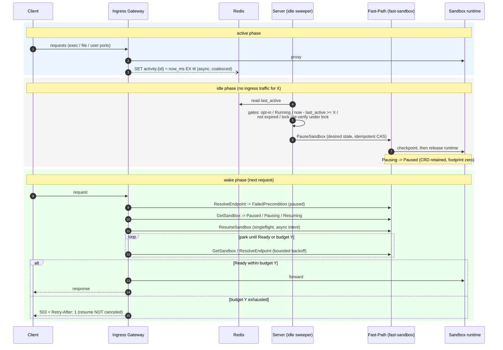
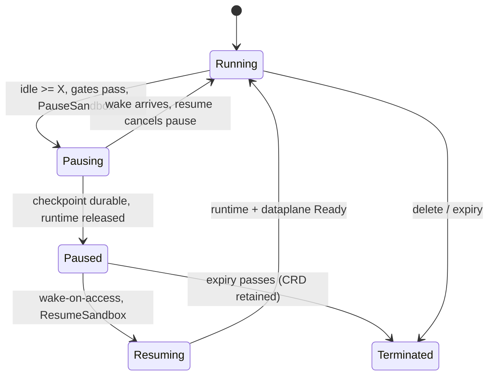
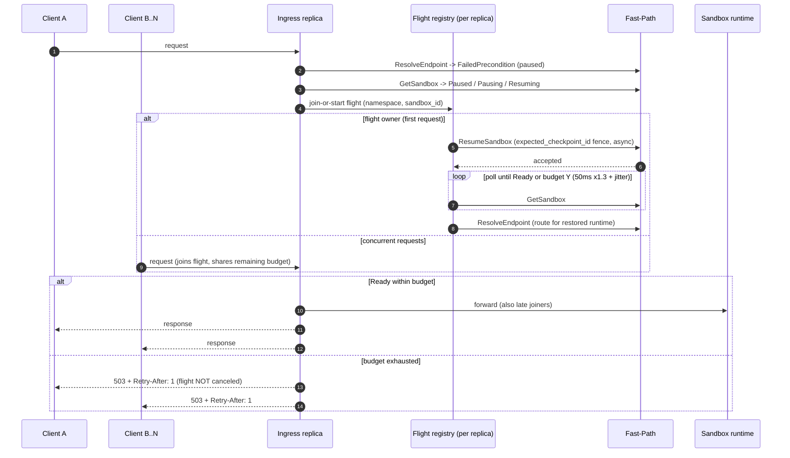

# OSEP-0024: Auto-Pause and Wake-on-Access for Fast Sandbox

<!-- toc -->
- [Summary](#summary)
- [Motivation](#motivation)
  - [Goals](#goals)
  - [Non-Goals](#non-goals)
- [Requirements](#requirements)
- [Proposal](#proposal)
  - [Notes/Constraints/Caveats](#notesconstraintscaveats)
  - [Risks and Mitigations](#risks-and-mitigations)
- [Design Details](#design-details)
  - [Scope and Existing Building Blocks](#scope-and-existing-building-blocks)
  - [Activation Model and Extensions Contract](#activation-model-and-extensions-contract)
  - [Activity Tracking (Ingress to Redis)](#activity-tracking-ingress-to-redis)
  - [Idle Sweeper and Pause Gates (Server)](#idle-sweeper-and-pause-gates-server)
  - [Pause Flow and State Mapping](#pause-flow-and-state-mapping)
  - [Wake-on-Access: Resume Trigger and Request Parking](#wake-on-access-resume-trigger-and-request-parking)
  - [Server Proxy Path (Mode A)](#server-proxy-path-mode-a)
  - [Interaction with Renewal, Expiry, and Manual Pause](#interaction-with-renewal-expiry-and-manual-pause)
  - [Configuration](#configuration)
  - [Observability](#observability)
  - [Security Considerations](#security-considerations)
- [Construction Phases](#construction-phases)
- [Test Plan](#test-plan)
- [Drawbacks](#drawbacks)
- [Alternatives](#alternatives)
- [Infrastructure Needed](#infrastructure-needed)
- [Upgrade & Migration Strategy](#upgrade--migration-strategy)
<!-- /toc -->

## Summary

Introduce an ingress-driven lifecycle automation loop for Fast Sandbox (`fsb-`) sandboxes: **auto-pause** and **wake-on-access**. When a sandbox that explicitly opts in receives no ingress traffic for a continuous idle threshold **X**, the server pauses it through fast-sandbox's FastPath `PauseSandbox` (checkpoint to the artifact store, release the runtime, memory and CPU drop to zero). When a request later arrives for a paused sandbox, the ingress gateway (or the server proxy path) triggers `ResumeSandbox` and **parks** the request — holding it for up to a wait budget **Y** while the sandbox restores — then resolves the route and forwards normally instead of failing with 503.

The design reuses what already exists: fast-sandbox's desired-state pause/resume RPCs, the OpenSandbox lifecycle `Pausing/Paused/Resuming` states, and the OSEP-0009 three-party activation and Redis signaling pattern. Both features are off by default; no existing API, SDK, or default behavior changes.

Scope is the **fast-sandbox backend only**. Pod-backed sandboxes (Docker / Kubernetes) are not touched in this revision; extending the same idle-pause/wake model to them is a candidate for a future revision (see Non-Goals and Alternatives).

## Motivation

Fast Sandbox sandboxes are created in milliseconds but then occupy their full CPU and memory allocation for as long as they live, including the idle tail. Agent workloads are idle most of the time: an interactive coding session has seconds of activity followed by minutes of silence; a spawned subagent may receive one request every few minutes. At pool scale, idle sandboxes dominate the memory footprint and cap the density a Fastlet pool can host.

fast-sandbox already has the hard part — a full checkpoint (`vmstate` + rootfs) published to the artifact store, with local-node restore measured in tens of milliseconds. What is missing is the orchestration loop that turns those primitives into an automatic cycle:

- **No idle trigger.** A sandbox stays `Running` until its absolute expiry, no matter how long it has been quiet. FastPath `PauseSandbox` exists (`fast-sandbox/internal/controlplane/fastpath/sandbox_state.go`) but nothing calls it automatically.
- **Paused sandboxes are dead ends on the data path.** `ResolveEndpoint` returns `FailedPrecondition` ("Sandbox is paused; call ResumeSandbox to resume it") for a paused sandbox, which the ingress provider maps to `ErrSandboxNotReady` and serves as a permanent 503 (`components/ingress/pkg/sandbox/fastsandbox_provider.go`, `components/ingress/pkg/proxy/errors.go`). The only recovery is a manual `POST /sandboxes/{id}/resume`.

Idle-suspend with wake-on-request is the natural operating model for agent sandboxes: suspend when idle, resume **on incoming traffic** at the routing layer, and park the request for a bounded budget instead of failing it. With fast-sandbox's local restore latency, this model should yield sub-second wakeups on OpenSandbox.

### Goals

- Pause an opted-in `fsb-` sandbox automatically after **X** seconds of continuously observed ingress inactivity.
- Serve a request to a paused `fsb-` sandbox by triggering resume and parking the request for up to **Y** seconds, then forwarding once the sandbox is `Running` and the route resolves.
- Keep the wake path free of new synchronous dependencies: the ingress resumes directly over its existing FastPath gRPC connection; Redis is used only for activity tracking on the pause side.
- Collapse concurrent wakeups for the same sandbox into a single resume flight (singleflight); never cancel an in-flight resume when the park budget expires.
- Compose with OSEP-0009 renew-on-access and with manual pause/resume; preserve all existing lifecycle semantics and SDK contracts.
- Ship disabled by default with a three-party activation model (server config, ingress flags, sandbox extensions), mirroring OSEP-0009.

### Non-Goals

- Supporting auto-pause/wake for the Docker or Kubernetes pod backends in this revision (the pod backend's manual pause/resume is OSEP-0008). A pod-backend idle-pause/wake equivalent is a plausible future revision, but pod pause economics (minutes-scale rootfs commit vs tens-of-ms VM restore) differ enough to warrant a separate design.
- Detecting idle from **egress** traffic or from in-guest signals (background jobs, timers). Ingress observation is the only activity source in this revision.
- Tracking open WebSocket/SSE connections as activity. Only new requests count (see [Caveats](#notesconstraintscaveats)).
- Changing pause/resume semantics of fast-sandbox itself (checkpoint format, CRDs, restore pipeline).
- Changing the expiry model: pausing does not stop or extend the absolute `expires_at` clock (see [Interaction](#interaction-with-renewal-expiry-and-manual-pause)).
- A generic lifecycle event bus or a new message queue.
- Per-sandbox override of the park budget **Y** (deferred; Y is an operator-level setting in this revision).

## Requirements

- Only sandboxes that explicitly opt in at create time via `extensions` may be auto-paused. Absence of the key is a hard no-op.
- The idle threshold **X** is per sandbox and carries its own opt-in; the park budget **Y** is deployment configuration.
- Activity recording must never add synchronous latency or failure modes to the proxy path: writes are fire-and-forget and dropped on error.
- The wake path must not depend on Redis. It uses the FastPath connection the ingress already holds.
- Multi-replica safety: activity state is shared through Redis; pause decisions are fenced by a per-sandbox distributed lock; resume decisions converge through FastPath's compare-and-set semantics without a coordinator.
- If Redis is unavailable, the system must fail toward **not pausing** (liveness of workloads is never at risk); wake continues to work because it does not touch Redis.
- A paused sandbox that has passed its expiry must never be resumed; wake fails fast with 404.
- Budget exhaustion must not cancel an already-started resume: the restore is desired state and converges regardless; the request gets 503 with `Retry-After`, and later requests find a `Running` sandbox.
- Concurrent requests to the same paused sandbox must produce at most one concurrent `ResumeSandbox` call per ingress replica (one flight), with all requests sharing its outcome.
- The number of concurrently parked requests per ingress replica is bounded; overflow is shed with 503 rather than queued without bound.
- No changes to public API routes, response models, or SDKs. `GET /sandboxes/{id}` already exposes `Pausing`/`Paused`/`Resuming`; this OSEP only makes those states reachable automatically.

## Proposal

Two mechanisms, one observation point:



- **Auto-pause (X).** The ingress records per-sandbox last-activity timestamps in Redis as a side effect of proxying (async, coalesced). A server-side idle sweeper periodically scans opted-in `fsb-` sandboxes, verifies inactivity against the threshold, and issues FastPath `PauseSandbox`. fast-sandbox checkpoints the sandbox and releases its runtime; the CRD is retained and the lifecycle state becomes `Pausing → Paused`.
- **Wake-on-access (Y).** When route resolution hits a paused sandbox, the gateway triggers `ResumeSandbox` (an asynchronous desired-state patch in fast-sandbox) and parks the request: it retries resolution with bounded backoff until the sandbox is `Running` and the route resolves, or the park budget **Y** elapses. Concurrent requests for the same sandbox join one resume flight. On success the request is forwarded exactly like any other; on budget exhaustion the client receives a retryable 503 while the restore continues in the background.

### Notes/Constraints/Caveats

- **Ingress observation is near-complete for fast-sandbox.** Sandboxes have private IPs and are reachable only through the gateway proxy chain, so exec, file transfer, and every user port transit the ingress — one observation point covers all client-driven activity. What it cannot see is activity that originates inside the sandbox with no inbound traffic (a background process polling an external API). Such a sandbox **will be paused**. Opt-in is the control: workloads with meaningful background work should not enable the feature, or should emit application-level traffic. A future revision may add execd/egress-handler activity signals as complementary sources.
- **Silent long-lived connections.** An open WebSocket or SSE stream generates no new requests; after **X** seconds of frame silence the sandbox is paused and the connection breaks. This is the sharpest edge of ingress-only observation. Workloads using long-lived connections should send application-level pings more frequently than X, or not opt in. Connection-aware activity (counting live upstream connections as activity) is a possible future extension, not part of this revision.
- **Wake applies to any paused `fsb-` sandbox**, whether it was paused by the idle sweeper or manually via `POST /sandboxes/{id}/resume`. Paused is treated uniformly as *hibernation reachable by traffic*. A deployment that wants manual pauses to stay down until explicitly resumed would need a policy distinction (e.g. a "who paused me" annotation); that is deliberately deferred to keep the semantics simple.
- **Pausing is not free.** Checkpoint dump and artifact upload take time proportional to guest memory and consume artifact-store capacity for every paused sandbox. The idle threshold floor (30 s) and the flap metrics exist to keep the cycle worth its cost. fast-sandbox's `Pausing` phase is cancelable: a wake arriving during the checkpoint cancels the pause intent instead of waiting for it to finish, which bounds the damage of a wrongly-timed pause.
- **Local-node restore is the fast path.** A resume that lands on a different node pays artifact fetch and full rootfs/materialization cost (currently seconds for multi-GiB guests). This OSEP does not change scheduling; checkpoint-affinity scheduling is fast-sandbox future work. The wake budget Y must be sized with the cluster's actual resume distribution in mind.

### Risks and Mitigations

| Risk | Mitigation |
| --- | --- |
| Sandbox paused while doing invisible background work | Opt-in only; documented limitation; wake-on-next-request recovers state; future execd/egress activity signals |
| Pause/resume flapping under periodic "heartbeat" traffic with period ≈ X | Idle floor 30 s; flap metrics (pause followed by wake within a short window); operators tune X above workload period |
| Wake storm: burst of requests to many paused sandboxes | Per-sandbox singleflight collapses fan-out; bounded parking lot sheds overflow with 503; resume RPC is a cheap CAS patch, the restore cost is per sandbox not per request |
| Redis outage | Activity writes drop (no pause decisions get fresher data); sweeper skips runs when Redis is unreachable (fail toward *not pausing*); wake unaffected |
| Two server replicas race to pause the same sandbox | Distributed lock `SET NX EX` per sandbox; FastPath `PauseSandbox` is idempotent on replay, so a lost race is harmless |
| Resume racing a re-pause | `expected_checkpoint_id` fence returns `Aborted` on checkpoint change; wake retries within its budget |
| Requests parked too long on a slow restore (cross-node) | Budget Y bounds client wait; 503 + `Retry-After` on exhaustion; the in-flight restore is never canceled, so the retry succeeds quickly |
| Ingress gains write authority over sandbox state | Scoped to `PauseSandbox`/`ResumeSandbox` on the tenant namespace it already routes for; no delete/create authority; FastPath network is cluster-internal as today |
| Artifact-store growth from many checkpoints | Capacity planning noted in Infrastructure; delete of a sandbox removes its checkpoint (existing fast-sandbox behavior) |

## Design Details

### Scope and Existing Building Blocks

Everything in the table below exists today; this OSEP composes them and specifies the missing glue.

| Building block | Where | Role here |
| --- | --- | --- |
| FastPath v2 `PauseSandbox` / `ResumeSandbox` | `fast-sandbox/api/proto/v2`, `internal/controlplane/fastpath/sandbox_state.go` | Desired-state CAS patches (`spec.state` Paused/Running); idempotent replays; `expected_checkpoint_id` fence (`Aborted` on change); resume before checkpoint release cancels the pause |
| Paused route resolution failure | `ResolveEndpoint` → `FailedPrecondition` ("Sandbox ... is paused; call ResumeSandbox") | The wake trigger signal |
| Ingress FastPath provider | `components/ingress/pkg/sandbox/fastsandbox_provider.go` | Already holds the gRPC connection and route cache; gains pause-awareness and the wake flight |
| Lifecycle states | OSEP-0007 status mapping; `Pausing/Paused/Resuming` in `RuntimeState` | `GET /sandboxes/{id}` already renders the new states; no API change |
| Server pause/resume for fsb | `FastSandboxService.pause_sandbox/resume_sandbox`, `FastPathClient` | Manual API already works; automation reuses the same client |
| Renew-on-access signaling | OSEP-0009; `components/ingress/pkg/renewintent`; server `[renew_intent]` | The activation and Redis patterns are copied; independent gates |

This OSEP also implicitly amends OSEP-0007's non-goal "no pause/resume on fast-sandbox": the FastPath RPCs, server client methods, and status mapping have since landed, and OSEP-0007's text is stale on this point (tracked separately). This proposal does not otherwise revise OSEP-0007.

### Activation Model and Extensions Contract

Three-party activation, mirroring OSEP-0009. Auto-pause and wake are independently switchable but designed to be enabled together.

1. **Server**: `[idle_pause] enabled = true` (sweeper + activity registry).
2. **Ingress**: `--activity-enabled=true` (record activity) and `--wake-enabled=true` (park + resume).
3. **Sandbox**: opt in at create time via `extensions`:

```yaml
extensions:
  "access.pause.after.idle.seconds": "300"   # X; decimal integer string, 30–86400
```

**Meaning:** the sandbox may be auto-paused after `X` consecutive seconds without ingress-observed traffic. Presence of a valid value opts the sandbox in. The key is validated in the HTTP API layer (`validate_extensions`, like `access.renew.extend.seconds`) and persisted under a fast-sandbox-reserved metadata key, hidden from public metadata/list — the same convention as the renew extension.

- Missing key → never auto-paused; wake-on-access still applies (wake is not gated on the pause opt-in, because a manually paused sandbox accessed by traffic should wake regardless — see Caveats).
- Value out of range or non-integer → create fails with 400.
- Constraint `X ≤ activity_ttl_seconds` (server config, default 1800). Larger values are rejected with 400 so that "activity key missing" can always imply "idle for at least X" (see below).

The park budget **Y** is not a sandbox field: it is `--wake-park-budget` on the ingress and `resume_budget_seconds` in the server config for the proxy path. It bounds client-perceived wait and is owned by the operator.

### Activity Tracking (Ingress to Redis)

The ingress updates one key per sandbox as a side effect of proxying:

- **Key**: `{activity_prefix}:{sandbox_id}` (default prefix `opensandbox:activity`), value = Unix milliseconds of the observation.
- **Write**: `SET key <now_ms> EX <activity_ttl_seconds>`, issued asynchronously (buffered channel + background pipeline) after a request is routed — never inline on the hot path. Failures are logged and dropped.
- **Coalescing**: at most one write per sandbox per `--activity-min-interval` (default 1 s). Second-granularity timestamps are sufficient; this bounds Redis write rate to ≤ 1 QPS per active sandbox regardless of request rate.
- **Coverage**: every proxied request counts — exec and file calls on raw port 44772, user ports, health pings. Any port wakes the idle clock. The `access renew skip` sentinel header (OSEP-0009) does **not** suppress activity tracking: skipping a renewal is not skipping activity.
- **TTL semantics**: the key expires `activity_ttl_seconds` after the last write. Because `X ≤ activity_ttl_seconds` is enforced at create time, a **missing key always implies inactivity for at least X** — the sweeper never needs to distinguish "expired key" from "never written".
- **Producers**: the ingress gateway (all sandbox traffic) and the server proxy path (`/sandboxes/{id}/proxy/{port}`, which bypasses the ingress) write the same keys, so both access paths keep sandboxes awake.

On create and on every successful resume, the actor performing the operation (server for create/resume API, ingress for wake flights) writes an immediate activity observation, so the idle clock starts from the latest lifecycle transition rather than from nothing.

### Idle Sweeper and Pause Gates (Server)

A server background task runs every `sweep_interval_seconds` (default 15 s):

1. Enumerate candidates per tenant namespace with FastPath `ListSandboxes` (paginated with continue tokens, same handling as OSEP-0007; filtered to `Running` client-side). Then batch-read the candidates' activity keys from Redis (`MGET`) — the cheap shared read always happens before any per-sandbox FastPath `GetSandbox`. A missing key is itself the idle signal, which is why the sandbox list, not a Redis key scan, must be the enumeration source.
2. For each candidate, evaluate the gates **in order**; first failure drops the candidate silently for this sweep:
   - **Opt-in**: reserved metadata carries a valid `access.pause.after.idle.seconds` (read via FastPath `GetSandbox` — only fetched for candidates that already look idle, so the per-sweep RPC count stays low).
   - **State**: sandbox is `Running` (Runtime + DataPlane Ready). Anything else is skipped — `Pausing`/`Paused` need no action, `Resuming` is protected, terminal states are left to their own paths.
   - **Idle**: `now − last_active ≥ X`. Missing activity key ⇒ idle (guaranteed by the TTL constraint, and by the immediate activity write on create and on every successful resume).
   - **Expiry**: `expires_at > now`. An expired sandbox is not paused; the expiry path owns it.
   - **Lock**: `SET opensandbox:idlep:lock:{sandbox_id} <replica> NX EX <lock_ttl>` (default 30 s). Failure means another replica is handling it — drop.
   - **Re-verify under lock**: re-read the activity key; if a newer observation appeared between the idle check and the lock (a request landed meanwhile), release interest and drop for this sweep.
3. Issue `PauseSandbox` with an idempotent `request_id` (`idlepause-{sandbox_id}`) and the observed generation. Outcomes: accepted → record `paused_at`, increment metrics; `FailedPrecondition` (state changed under us) → drop, next sweep re-evaluates; lock released by TTL.

**Idle-window semantics across replicas.** The window is defined over shared state, not per-replica local state. The **start point** is the shared `activity:{sandbox_id}` key: every ingress replica (and the server proxy path) overwrites the same key with its own observation time, last-write-wins, so the start is effectively the latest observation across all replicas modulo inter-replica clock skew. The **end point** is the evaluating replica's local `now` — the replica whose clock crosses the threshold first wins the lock and pauses, so the effective threshold is X ± max(writer skew, evaluator skew). Both skews are bounded by cluster NTP synchronization (typically tens of milliseconds) against an X floor of 30 s, and are therefore noise. The race that matters is not clock skew but the **async activity write**: a request can land on one ingress replica just after another replica's sweeper has judged the sandbox idle and before the activity write flushes. The lock-scoped re-verify above narrows this to sub-flush-latency races; the residual case is benign by construction — the in-flight request hits a `Pausing`/`Paused` sandbox and is served through the wake path (`Pausing` cancels the pause; `Paused` triggers resume + park), so the cost of a missed observation is one unnecessary pause/wake cycle (hundreds of milliseconds), never a lost request.

If Redis is unreachable the sweep is skipped entirely (no pauses). Pause failures of any kind leave the sandbox `Running` — the worst case of this subsystem is a missed pause, never a lost sandbox.

Sweep cost per namespace per interval is one paginated list plus a small number of `GetSandbox` calls (only for idle candidates) and rare `PauseSandbox` calls. For pools with thousands of opted-in sandboxes the Redis-first ordering keeps FastPath load negligible.

**Multi-replica sweep (no leader election).** Every server replica runs its own sweeper on its own timer; there is no leader lease. Deduplication happens at the point of effect: the per-sandbox `SET NX EX` lock admits exactly one replica to issue `PauseSandbox` per idle episode — losers drop the candidate for that sweep. Correctness never depends on the lock: FastPath `PauseSandbox` is a compare-and-set desired-state patch whose replay on an already-paused sandbox is an idempotent success, so a lost race (lock expiry mid-call, replica crash) converges to a single pause anyway, and a pause racing a user-initiated resume is rejected through the `FailedPrecondition`/generation fence and re-evaluated on the next sweep. A replica crashing mid-sweep leaves no stuck state: the lock expires by TTL and any replica's next sweep re-evaluates the candidate. The accepted cost is N× duplicated candidate scanning (namespace lists + Redis reads across replicas); at current scale Redis-first filtering keeps this cheap, and if sweep load ever shows in metrics it can be replaced by namespace sharding or a leader lease without changing pause semantics.

### Pause Flow and State Mapping



Timeline of one episode: `t0` last ingress request observed (activity key written); `t0+X` sweeper gates pass, `PauseSandbox(spec.state=Paused)`; the fast-sandbox controller checkpoints and publishes artifacts (`Pausing`); `t0+X+Δ` checkpoint durable, runtime released (`Paused`, CRD retained) — memory/CPU footprint zero, artifact set (`vmstate` + rootfs manifest) in the store.

The mapping to public states is exactly OSEP-0007's existing table (`Pausing → Pausing`, `Paused → Paused`, retained expired CR → `Terminated`). `GET /sandboxes/{id}` on a paused sandbox returns 200 `Paused` with the retained CRD as source of truth; list includes paused sandboxes.

### Wake-on-Access: Resume Trigger and Request Parking

The wake path lives in the ingress FastPath provider, next to route resolution.



**Detection.** On a route miss or a resolution error, before answering 503 the provider calls `GetSandbox` — the FastPath v2 RPC on the fast-sandbox Fast-Path Server, over the same gRPC connection and endpoint the provider already uses for `ResolveEndpoint` (not the Kubernetes API; Fast-Path resolves the Sandbox CR through its informer-backed cache). The `FastPathResolver` interface gains one method; the hot path (route-cache hit) issues no new RPC.

| Runtime state | Behavior |
| --- | --- |
| `Paused` | Start/join a **resume flight**, park |
| `Pausing` | Start/join a resume flight (fast-sandbox cancels the pause intent before the checkpoint releases — no wait for the checkpoint) |
| `Resuming` | Join the in-flight state (poll), park |
| `Ready` (transient race) | Re-resolve and forward |
| Terminal / expired (`expires_at ≤ now`, retained CR → `Terminated`) | Fail fast 404 — never resume |
| Deletion in progress | Fail fast per current mapping |
| `NotFound` | Fail fast 404 (unchanged) |

**Resume flight (singleflight).** Keyed by `(namespace, sandbox_id)` in a per-replica in-flight registry:

- The first request for a paused sandbox starts the flight: call `ResumeSandbox` (asynchronous desired-state patch; `request_id = wake-{sandbox_id}-{flight_epoch}` for tracing), then poll `GetSandbox` until Runtime and DataPlane are Ready, then re-`ResolveEndpoint` (the route credential for the restored runtime did not exist before).
- Concurrent requests for the same sandbox join the flight and share its remaining budget and outcome — N parked requests, one resume RPC, one poll loop.
- A `FailedPrecondition` ("not paused") from `ResumeSandbox` means someone else already resumed — treat as joined. An `Aborted` (checkpoint changed, i.e. a re-pause raced in) restarts the flight within the remaining budget.

**Parking.** A parked request waits in a bounded **parking lot**:

- **Budget Y** (`--wake-park-budget`, default 5 s) starts when the flight starts; late joiners share the remaining budget (per-flight, not per-request). The budget bounds retries, not a committed resume.
- Retry loop: exponential backoff starting at `--wake-retry-interval` (50 ms), factor 1.3, jitter 0.1, no attempt cap — the budget alone bounds the wait.
- **Budget exhaustion** → respond `503` with `Retry-After: 1`. The flight itself is **never canceled**: `ResumeSandbox` is desired state that fast-sandbox converges regardless, and discarding an in-progress restore would only waste the work. The next request after exhaustion typically finds `Ready` and is served on the fast path.
- **Parking lot capacity** (`--wake-park-max`, default 1024): a request occupies a slot only once it actually parks (not on first-attempt hits, which are the overwhelming majority). When the lot is full the request is shed with `503` immediately — bounding memory, file descriptors, and Envoy/upstream stream occupancy.
- **Mechanics of holding a request.** The ingress is a Go `net/http` server with `httputil.ReverseProxy`; parking means the handler goroutine simply does not invoke the reverse proxy yet. After admission it blocks on a `select` over three signals — the flight's completion channel, the request context's `Done()` (client disconnected), and the remaining-budget timer — then either proceeds through the normal `serve` path (re-resolve, forward) or writes `503 + Retry-After`. Because parking happens before any upstream dial, a parked request holds no upstream connection: its cost is one goroutine plus the held client connection, which is why the lot can be large. The flight itself runs on a background context, never the request's — budget exhaustion or client disconnect must not cancel the resume. Clients experience the park as added latency: no status or body bytes are written during the wait, so Y must stay below typical client response-header timeouts.
- **Protocol coverage**: parking applies to ordinary HTTP requests and to requests that arrive as WebSocket upgrades — the upgrade completes after wake, against the restored upstream. A connection that is *already established* is never parked mid-stream; only its next request would wake (see the long-connection caveat).

**Latency expectation.** Same-node restore on fast-sandbox is tens of milliseconds, so the common wake should land well under the 500 ms P95 acceptance target (see Test Plan). Cross-node restores can exceed Y; the 503 + `Retry-After` path keeps those honest instead of hanging clients.

**Multi-replica wake (no cross-replica coordination).** The singleflight registry is per replica by design — the asymmetry with the pause side is deliberate. Pause needs a distributed lock because the checkpoint has real cost and must happen once per idle episode; resume needs nothing because duplicates are harmless by construction: `ResumeSandbox` is a compare-and-set desired-state patch, idempotent on replay ("already Running" is a success), so R ingress replicas produce at most R RPCs of which exactly **one** performs the state patch — and the expensive step, the checkpoint restore, is executed **once** by the fast-sandbox controller because it is driven by `spec.state`, not by the number of callers. Dedup comes from convergence, not coordination; there is no lock and no leader on this path. Two details follow: (1) wake flights fence on `expected_checkpoint_id` (the only race that matters — a re-pause slipping in) and omit the generation fence, which changes on every transition and would only add a conflict-retry into the idempotent path; (2) every flight that observes `Ready` writes the shared activity key, so the post-resume idle window starts cleanly regardless of which replica won. The park budget is per flight per replica, starting at that replica's flight start: budgets across replicas are not synchronized, so a client's wait bound depends on which replica received it — bounded by Y either way, and poll amplification stays at one `GetSandbox` loop per replica flight (R loops), never per request.

### Server Proxy Path (Mode A)

Requests served by the server proxy (`/sandboxes/{id}/proxy/{port}`) bypass the ingress gateway. The server applies the same semantics inside its proxy handler:

- Activity: writes the same Redis activity key (async, coalesced) — this is what keeps proxy-path traffic from looking idle.
- Wake: on endpoint resolution signaling a paused sandbox, run the same flight (asyncio task registry, one `resume_sandbox` call + readiness poll) and hold the request up to `resume_budget_seconds` before answering 503 + `Retry-After`. The server already holds `FastPathClient`; no new connection surface.

This keeps OSEP-0009's dual-path parity: both supported reverse proxy paths observe activity and wake.

### Interaction with Renewal, Expiry, and Manual Pause

- **OSEP-0009 renew-on-access** is independent: its gates (opt-in, cooldown, in-flight dedupe) are unchanged. One observed request feeds both consumers — a renew intent (if opted in) and an activity write (if enabled). A sandbox may opt into either, both, or neither.
- **Expiry** is untouched. `expires_at` is absolute; pausing neither stops nor extends it. Composition guidance: enable renew-on-access alongside idle-pause so active sandboxes keep extending while idle ones get reclaimed. A paused sandbox whose expiry passes becomes `Terminated` (retained CR, reason Expired); wake checks expiry before resuming and fails fast with 404.
- **Manual pause/resume** (`POST /sandboxes/{id}/pause|resume`) continues to work for `fsb-` sandboxes. Auto-pause uses the same FastPath calls; wake treats manually and automatically paused sandboxes identically (see Caveats). There is no auto-pause for the Kubernetes pod backend in this revision, so OSEP-0008 semantics are unaffected.
- **OSEP-0021 pool warmup** composes naturally: warm pools provide fresh capacity; idle-pause returns capacity back. Neither depends on the other.

### Configuration

Server (`config.toml`, top-level section, mirroring `[renew_intent]`):

```toml
[idle_pause]
enabled = false                    # master switch: sweeper + server-side activity writes
sweep_interval_seconds = 15
activity_ttl_seconds = 1800        # must be ≥ max accepted X (30–86400 enforced at create)
resume_budget_seconds = 5          # park budget Y for the server proxy path
redis.enabled = false
redis.dsn = "redis://127.0.0.1:6379/0"
redis.activity_prefix = "opensandbox:activity"
redis.lock_ttl_seconds = 30
```

Ingress (flags, mirroring the `--renew-intent-*` family):

```text
--activity-enabled                    (default false)
--activity-redis-dsn                  (default redis://127.0.0.1:6379/0)
--activity-key-prefix                 (default opensandbox:activity)
--activity-min-interval               (default 1s; per-sandbox write coalescing)
--wake-enabled                        (default false)
--wake-park-budget                    (default 5s; park budget Y)
--wake-park-max                       (default 1024; parking lot capacity)
--wake-retry-interval                 (default 50ms)
--wake-retry-factor                   (default 1.3)
--wake-retry-jitter                   (default 0.1)
```

Rules:

- `idle_pause.enabled=false` and `--wake-enabled=false` reproduce today's behavior exactly (paused sandbox accessed through the gateway → 503).
- Ingress-path pause automation requires Redis reachable from both ingress and server. Wake requires only FastPath reachability the ingress already has.
- Timeout budget: `--wake-park-budget` (Y) must exceed `--fastpath-wait-timeout-millis` plus one `GetSandbox` RPC so at least one full probe completes inside the budget; the per-probe RPC timeout stays the existing `--fastpath-wait-timeout-millis` (default 2 s, provider max 5 min). Pause timing = X + at most one `sweep_interval_seconds` of detection lag; `activity_ttl_seconds` must remain ≥ the largest accepted X. Operators must also align everything in front of the ingress — LB/Envoy idle timeouts and client response-header timeouts — to exceed Y, otherwise middle layers will cut parked connections before this OSEP can answer `503 + Retry-After`.
- Docker direct access remains unsupported as an observation point (no reverse proxy hop), same as OSEP-0009.

Create request example (pause + renew composed):

```json
{
  "templateId": "tpl_2f0c...",
  "timeout": 86400,
  "extensions": {
    "access.pause.after.idle.seconds": "300",
    "access.renew.extend.seconds": "1800"
  }
}
```

### Observability

Aligned with OSEP-0010 (OTLP). Proposed instruments:

Ingress (meter `ingress`):

| Instrument | Type | Labels | Notes |
| --- | --- | --- | --- |
| `opensandbox.ingress.wake.flights` | counter | `outcome` = `triggered`/`joined`/`none` | `none` = sandbox already running on first check; the triggered:joined ratio shows fan-out |
| `opensandbox.ingress.park.active` | up-down counter | — | currently parked requests |
| `opensandbox.ingress.park.wait.duration` | histogram (s) | `outcome` = `served`/`budget_exhausted`/`canceled`/`error` | recorded once per parked request at wait end; sub-budget `budget_exhausted` samples are expected for late joiners |
| `opensandbox.ingress.park.shed` | counter | — | lot full; sustained growth ⇒ capacity or restore-latency problem |
| `opensandbox.ingress.activity.writes_dropped` | counter | — | Redis pressure indicator |

Server (meter `server`):

| Instrument | Type | Labels |
| --- | --- | --- |
| `opensandbox.server.idlep.pause.requests` | counter | `outcome` = `accepted`/`gated`/`failed` |
| `opensandbox.server.idlep.pause.latency` | histogram (s) | `PauseSandbox` accepted → observed `Paused` |
| `opensandbox.server.idlep.flap.ratio` | gauge | fraction of pauses followed by a wake within a configurable window; the single most useful tuning signal for X |

Dashboards/alerts: wake P95 (target < 500 ms same-node), shed rate ≈ 0, flap ratio, paused-sandbox count and artifact-store usage per pool.

### Security Considerations

- **Ingress privilege scope.** The ingress can already resolve routes for every tenant namespace it serves; this OSEP adds exactly two FastPath calls — `PauseSandbox`/`ResumeSandbox` — on that same channel. No create/delete/exec authority is granted. FastPath remains cluster-internal (plaintext gRPC inside a NetworkPolicy-isolated cluster, unchanged from Phase 1a of the existing provider).
- **Wake is not an auth bypass.** Parking happens after the existing host/route-scope/signature verification; a request that would be rejected today is rejected before any resume is triggered. Malicious clients cannot resume arbitrary sandboxes — only sandboxes they can already address — and cannot pause anything (pause is server-side only).
- **Resource exhaustion.** The parking lot and per-sandbox singleflight bound the wake path's memory and fan-out; activity writes are rate-limited per sandbox; the sweeper's per-sweep RPC count is bounded by candidate count after Redis-first filtering.
- **Fail-safe direction.** Every dependency failure (Redis down, FastPath errors, lock contention) resolves toward *leave the sandbox running* or *answer 503* — never toward data loss or an unintended pause.

## Construction Phases

- **Phase 1 — Activity + idle pause.** Extensions key validation; server `[idle_pause]` config, Redis activity keys, idle sweeper with gates and lock; `PauseSandbox` wiring through the existing `FastPathClient`; metrics. Exit: an opted-in sandbox goes `Running → Pausing → Paused` X seconds after its last request in a Kind/MinIO environment; non-opted-in sandboxes are untouched; Redis outage blocks pauses without side effects.
- **Phase 2 — Wake-on-access.** Pause-aware provider; singleflight registry; parking lot with budget/backoff/shedding; `Retry-After` semantics; wake metrics. Exit: request to paused sandbox → parked → forwarded; concurrent burst produces one resume; budget exhaustion → 503 while the restore completes and the next request is served fast-path; expired paused sandbox → 404.
- **Phase 3 — Server proxy parity + polish.** Mode A activity writes and server-side parking; docs (feature guide + limitations); flap-ratio dashboard; OSEP-0007 README/status-table correction where it contradicts shipped behavior.

## Test Plan

- **Unit Tests**
  - Extensions validation: range 30–86400, `X ≤ activity_ttl_seconds`, conflict behavior with other reserved keys.
   - Idle decision function: boundary at exactly X; missing activity key ⇒ idle; activity key rewritten on wake; expiry and state gates.
  - Singleflight registry: N concurrent arrivals → one flight, shared budget, late-joiner outcome; `Aborted` fence restart; "not paused" treated as joined.
  - Parking lot: slot taken only at park transition; shedding at capacity; budget exhaustion returns 503 + `Retry-After` without canceling the flight.
  - Backoff sequence with factor/jitter bounds.
- **Integration Tests (Kind + fast-sandbox + MinIO + Redis)**
  - Opted-in sandbox: traffic stop → `Paused` within X + sweep interval; memory released on the Fastlet (runtime gone, CRD retained).
  - Request to paused sandbox → wake → forwarded; response correctness identical to a never-paused sandbox; exec and file calls through raw port 44772 wake identically.
  - Request arriving during `Pausing` cancels the pause (no completed checkpoint) and serves from the running sandbox.
  - Manual pause → access → wake (uniform semantics).
  - Paused + expired → access → 404, no resume.
  - Redis down: no pauses occur; wake still works; proxy path unaffected.
  - Two server replicas: exactly one pause per idle episode (lock + idempotency).
  - Multi-replica ingress: activity from any replica keeps the sandbox awake.
  - OSEP-0009 composition: opted into both — renew intents and activity writes both flow; renew gate cooldown unchanged.
- **Stress Tests**
  - Burst of 200 concurrent requests to one paused sandbox: exactly one `ResumeSandbox` per replica; all requests served after wake or shed deterministically at lot capacity.
  - Many paused sandboxes hit simultaneously: lot bound respected, no unbounded queueing, FastPath RPC rate bounded by sandbox count not request count.
- **Performance Tests**
  - Wake P95 (same-node, warm artifact cache): target < 500 ms; record pause duration distribution per guest memory size.
  - Flap ratio under synthetic periodic traffic (period ≈ X, ≈ 2X) to validate the floor and tuning guidance.
- **Manual Validation**
  - `GET /sandboxes/{id}` renders `Pausing`/`Paused`/`Resuming` through the cycle; delete of a paused sandbox removes CRD + checkpoint artifacts.

## Drawbacks

- **New privileged behavior in the data plane.** The ingress can change sandbox desired state; the blast radius is small but real, and reviewed deployments must treat the ingress as trusted infrastructure.
- **Redis becomes load-bearing for pause automation.** Its failure mode is benign (no pauses) but it is one more moving part; wake avoids it by design.
- **Blind spots are permanent in this model.** Ingress-only observation mis-pauses background-active workloads and silent long-lived connections; the only full fix is additional activity sources (future work).
- **Flapping cost.** A workload with traffic period near X pays repeated checkpoint/restore cycles; the floor and flap metrics mitigate but cannot eliminate misuse.
- **Artifact-store usage scales with pause count.** Every paused sandbox holds a full checkpoint until resumed or deleted.
- **Extra configuration surface** on both server and ingress, and a two-feature flag matrix to document and support.

## Alternatives

1. **execd/egress-handler activity reporting** — more accurate idle detection, but a new reporting path from every sandbox and a new trust surface; deferred as a future complementary signal. Ingress observation alone is sufficient and immediate for fast-sandbox because all client traffic already transits it.
2. **Ingress pauses directly (no server sweeper)** — fewer hops, but pause policy (opt-in validation, expiry, hysteresis, future multi-source activity) belongs to the control plane, and the ingress should stay a stateless forwarder plus this narrowly-scoped wake authority. Also, only the server can coordinate future execd signals with ingress signals.
3. **Wake via Redis queue + server worker (OSEP-0009 Mode B style)** — uniform with renew, but inserts a queue round trip and worker latency into the wake path, which is the latency-critical direction; the ingress already holds a FastPath connection, so direct resume is strictly better here.
4. **Expiry-driven pause only (`on_timeout=pause`)** — reuses the expiry sweep with no activity tracking, but captures "old" sandboxes, not "idle" ones; orthogonal and worth a follow-up revision that shares this OSEP's pause pipeline.
5. **Extend to the Kubernetes pod backend** — a pod equivalent would build on OSEP-0008's snapshot machinery plus the same sweeper, but pod pause is minutes-scale (registry commit), which changes the wake economics entirely; out of scope.
6. **Per-sandbox park budget override via extensions** — plausible (interactive vs batch tuning) but adds a second sandbox-level knob whose value is operator-owned latency policy; deferred.

## Infrastructure Needed

- Redis (already required for ingress-mode renew intents; the same deployment serves activity tracking).
- Artifact-store capacity sized for peak concurrent paused sandboxes × average checkpoint size (documented in the feature guide).
- Metrics dashboards for the wake/park/pause instruments above.

## Upgrade & Migration Strategy

- Fully backward compatible and disabled by default: `idle_pause.enabled=false`, `--activity-enabled=false`, `--wake-enabled=false` reproduce current behavior byte-for-byte.
- Rollout order:
  1. Deploy server + ingress with flags off (no behavior change).
  2. Enable activity tracking and the sweeper in a canary tenant; verify pauses and flap ratio.
  3. Enable wake on the canary ingress; verify parked-request latency distribution and shed rate.
  4. Enable per-sandbox via templates/`extensions` for real workloads.
- Rollback: disable the flags. Sandboxes left `Paused` remain resumable through the manual API; operators should resume or delete stranded paused sandboxes after disabling wake, since traffic will no longer wake them.
- No API, SDK, schema, or CRD migrations. The extensions key is additive and validated only when present.
